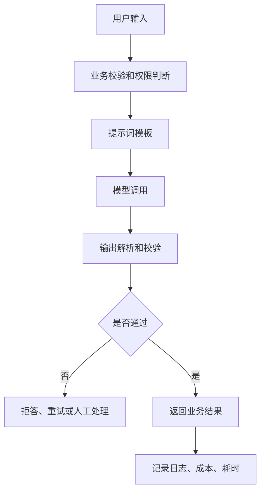
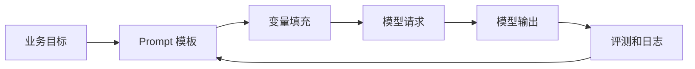
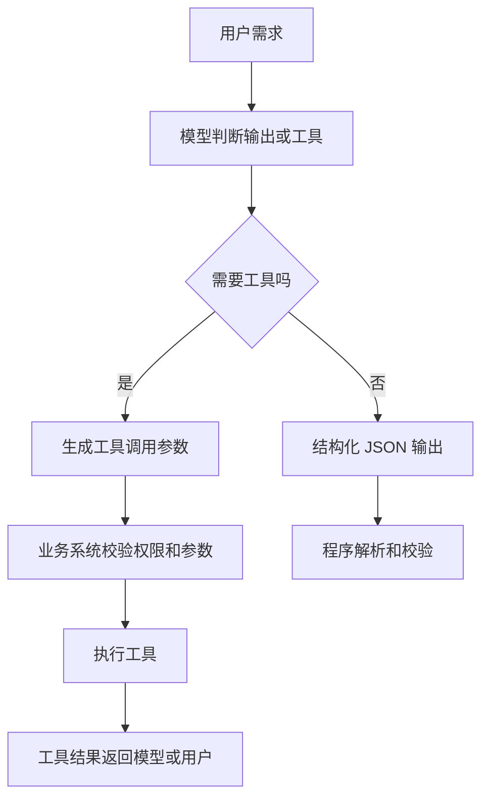
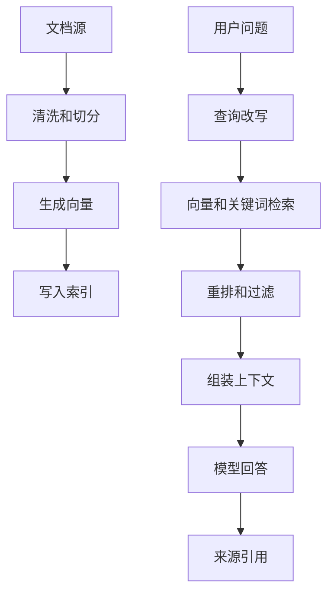
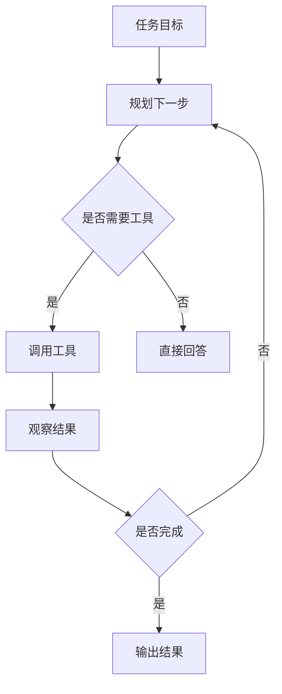
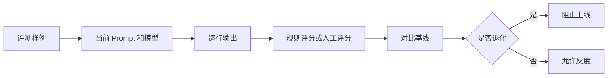
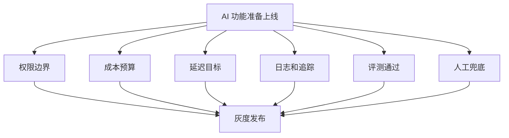
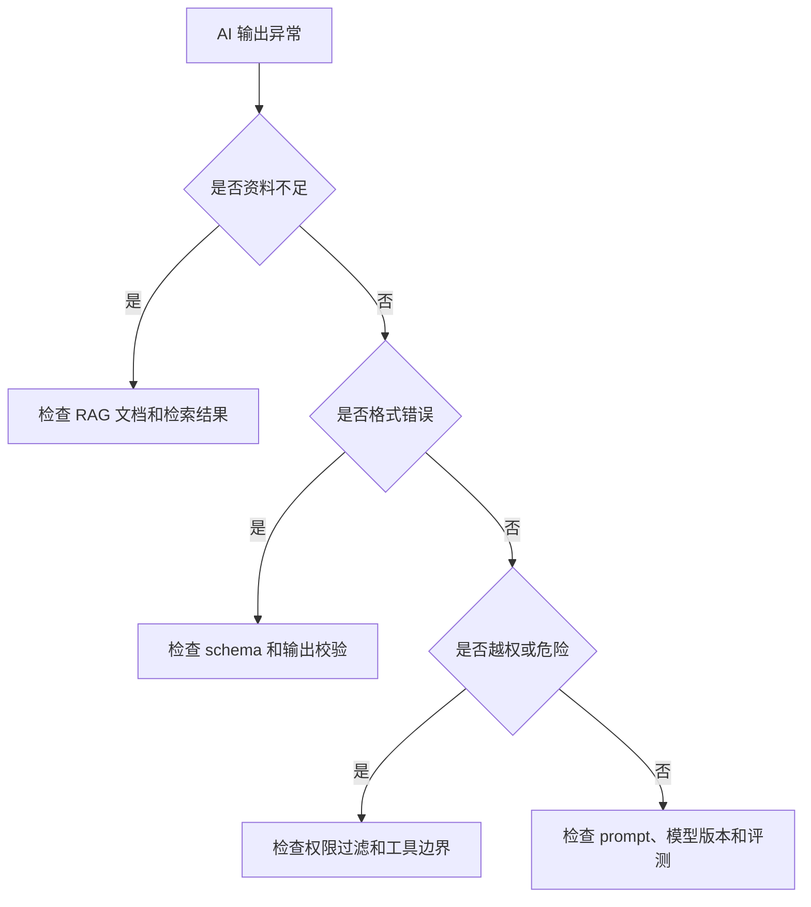

# 图解 AI 工程核心概念

## 适合谁看

适合已经会做 Web、Node.js 或后台系统，但想把大语言模型、RAG、工具调用、Agent、评测和上线治理接入真实项目的人。

AI 工程不是“调一次模型接口”。真正上线时，你需要处理输入、权限、提示词版本、检索质量、工具边界、评测、成本、延迟和安全。

## 你会学到什么

- AI 功能从用户输入到模型输出的基本链路。
- Prompt、结构化输出、工具调用、RAG 和 Agent 的关系。
- RAG 为什么不只是向量数据库。
- 工具调用为什么必须有权限和确认。
- 评测如何防止提示词或模型升级带来退化。
- AI 功能上线前要看哪些风险。

## AI 功能调用链路

模型输出不能直接等于业务事实。关键结果要经过结构校验、权限校验、来源校验或人工确认。

## Prompt 在系统中的位置

Prompt 应该像代码一样管理：

- 有版本。
- 有评审。
- 有变更记录。
- 有评测集。
- 能回滚。

不要把 prompt 散落在页面组件里。

## 结构化输出和工具调用

工具调用的关键原则：

- 模型可以建议调用工具。
- 业务系统决定是否允许调用。
- 高风险操作需要人工确认。
- 工具参数必须校验。
- 工具结果要记录日志。

## RAG 检索链路

RAG 质量不只取决于模型。文档质量、切分方式、检索策略、权限过滤、上下文组装都会影响最终答案。

## Agent 工作流

Agent 适合多步骤、不确定路径、需要工具反馈的任务。不要把简单分类、摘要、格式转换都做成 Agent。能用普通 API 调用解决，就不要引入多步自主循环。

## 评测和回归

评测集至少要覆盖：

- 正常问题。
- 边界问题。
- 资料不足问题。
- 权限限制问题。
- 恶意或诱导输入。
- 格式要求严格的问题。

## 上线治理

AI 功能上线清单：

- 输入和输出是否脱敏。
- 是否越权读取资料。
- 是否有成本上限。
- 是否有超时和重试策略。
- 是否能解释答案来源。
- 是否能拒答。
- 是否有人工兜底。

## AI 工程排错路径

## 实际项目常见问题

### 问题 1：模型回答看起来合理但事实错误

要求答案引用来源；资料不足时拒答；关键结论用业务系统或人工确认。

### 问题 2：RAG 答非所问

不要只改 prompt。先检查文档切分、检索 query、topK、重排、权限过滤和上下文是否包含正确资料。

### 问题 3：工具调用做了危险操作

高风险工具必须由业务系统二次确认。模型不能直接决定删除、付款、审批、授权等动作。

## 下一步学习

继续学习 [LLM API 调用](/ai-engineering/llm-api)、[提示词工程](/ai-engineering/prompt-engineering)、[RAG 检索增强生成](/ai-engineering/rag) 和 [评测与质量保障](/ai-engineering/evaluation)。
