# 浏览器与网络从零到项目落地

## 这个页面解决什么

学完 HTTP、CORS、缓存、Cookie、Storage、Service Worker 和 DevTools 后，很多人仍然会在真实项目里卡住：

- 接口在 Postman 能通，浏览器里报跨域。
- 登录接口成功了，刷新页面又变成未登录。
- 本地环境没问题，部署后页面一直加载旧文件。
- 用户说“数据没更新”，但不知道是接口、HTTP 缓存、CDN 还是 Service Worker。
- Network 里有很多请求，但不知道应该先看哪一个字段。
- Console、Network、Application、Performance 面板互相割裂，没有形成排障路径。

这一页用一个“请求诊断工作台”项目，把浏览器与网络知识串起来。它不是让你背更多概念，而是训练你用浏览器证据定位问题。

## 适合谁看

适合已经能做前端项目，但对浏览器边界还不够稳的人：

- 会用 `fetch` 或 axios 请求接口。
- 知道 HTTP 状态码和请求头，但排错时容易猜。
- 遇到过 CORS、Cookie、缓存、刷新 404、白屏、旧版本资源等问题。
- 想把浏览器 DevTools 用成项目排障工具，而不是只看 Console。
- 正在做 Vue Admin、React 管理台、文档站、PWA 或需要登录态的前端项目。

如果你还没有基础，先看 [浏览器学习导览](/browser/introduction)、[HTTP 与请求流程](/browser/http-request)、[跨域与登录态](/browser/cors-auth) 和 [缓存策略](/browser/cache)。

## 项目目标

我们要做一个最小“请求诊断工作台”。它不追求复杂 UI，而是覆盖真实前端项目最常见的浏览器链路：

| 能力 | 最小功能 | 要学会判断 |
| --- | --- | --- |
| 请求 | 发起 GET、POST、带 token、带 Cookie 的请求 | 请求是否真的发出，URL、方法、头、body 是否正确 |
| CORS | 模拟同源、跨源、预检请求 | 浏览器是拦截请求，还是拦截前端读取响应 |
| 登录态 | Cookie Session 和 Token 两种方案 | Cookie 是否保存、是否带出、token 是否过期 |
| 缓存 | 静态资源缓存、接口缓存、Service Worker 缓存 | 用户看到旧内容是哪一层导致 |
| 存储 | Cookie、LocalStorage、SessionStorage、IndexedDB、Cache API | 什么数据应该放哪里 |
| 调试 | Console、Network、Application、Performance 联合排查 | 能写出可复现证据，而不是只写“请求失败” |
| 验收 | 路由刷新、移动端、离线、弱网、发布后更新 | 项目上线前应该检查什么 |

## 总体架构

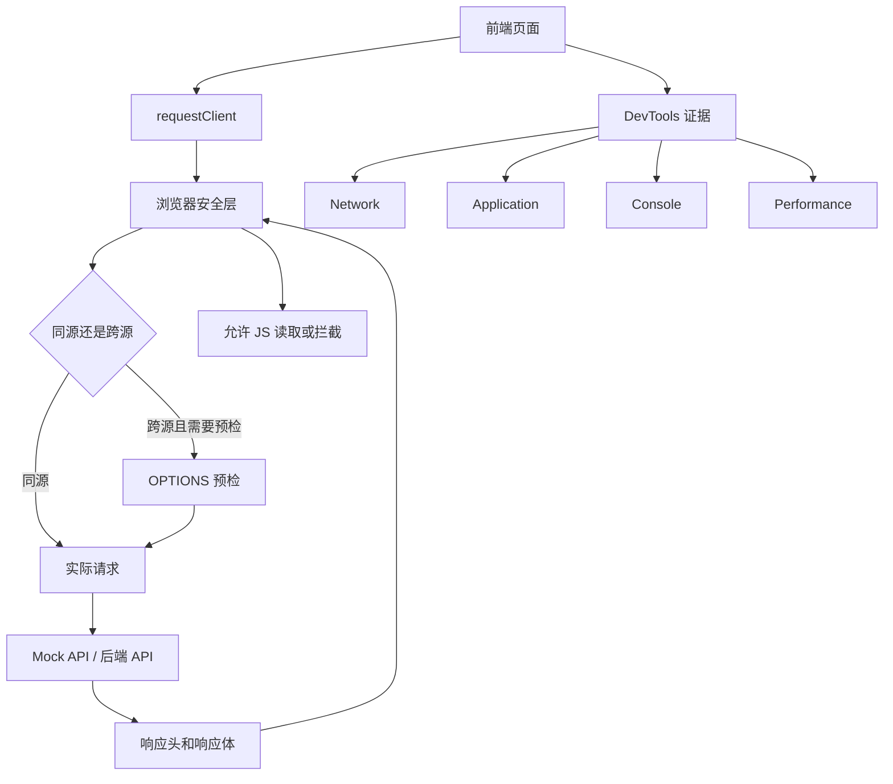

这张图要记住一个关键点：浏览器请求不是“前端代码直接访问后端”。中间还有安全策略、缓存策略、凭证策略和 DevTools 可观测证据。

## 第一阶段：搭建最小诊断页面

### 页面结构

先做一个页面，不要一开始就接复杂业务：

```text
browser-lab/
  index.html
  src/
    main.ts
    request/
      requestClient.ts
      requestTypes.ts
    modules/
      request-panel.ts
      auth-panel.ts
      cache-panel.ts
      storage-panel.ts
      debug-panel.ts
    styles/
      index.css
  server/
    mock-api.ts
```

页面分成 5 个区域：

| 区域 | 作用 |
| --- | --- |
| 请求面板 | 输入 URL、方法、headers、body，发起请求 |
| 登录态面板 | 查看 Cookie、token、当前用户、过期时间 |
| 缓存面板 | 显示响应缓存头、资源版本、Service Worker 状态 |
| 存储面板 | 查看 Cookie、LocalStorage、SessionStorage、IndexedDB、Cache API |
| 调试面板 | 记录请求证据、错误分类、复现步骤和修复建议 |

### 页面布局图

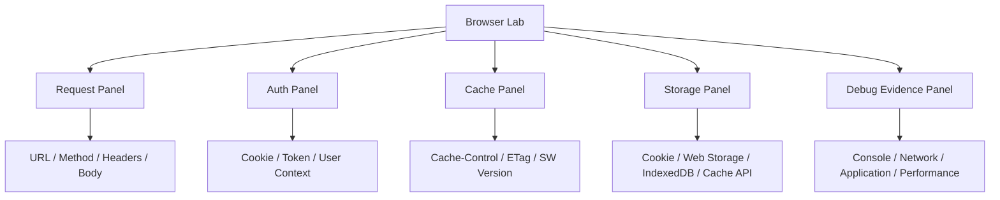

这个项目的重点不是 UI 复杂度，而是让每一次浏览器问题都有证据位置。

## 第二阶段：封装 requestClient

### 为什么要封装

MDN 对 Fetch API 的说明强调，Fetch 使用 `Request`、`Response` 等对象来处理网络请求，并且和 CORS、Origin 等浏览器概念相关。真实项目里如果每个页面直接写 `fetch`，后续会出现这些问题：

- token 注入不统一。
- 401、403、422、500 处理不一致。
- 请求耗时、traceId、响应头没有记录。
- CORS、Cookie 和缓存问题没有统一证据。
- 页面只知道失败了，不知道失败在哪一层。

### 请求数据流

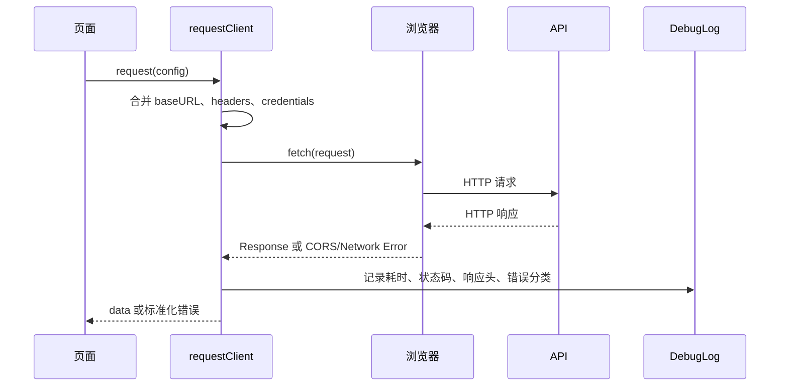

### 类型设计

```ts
export type RequestMethod = 'GET' | 'POST' | 'PUT' | 'PATCH' | 'DELETE'

export interface RequestConfig {
  url: string
  method?: RequestMethod
  headers?: Record<string, string>
  body?: unknown
  credentials?: RequestCredentials
  timeoutMs?: number
  cache?: RequestCache
}

export interface RequestEvidence {
  url: string
  method: RequestMethod
  status?: number
  ok?: boolean
  durationMs: number
  requestHeaders: Record<string, string>
  responseHeaders: Record<string, string>
  errorType?: 'cors' | 'network' | 'timeout' | 'http' | 'parse' | 'business'
  traceId?: string
}
```

这里故意把 `RequestEvidence` 单独建模。真实项目排障时，证据比“封装得优雅”更重要。

### 最小实现

```ts
export async function request<T>(config: RequestConfig): Promise<T> {
  const startedAt = performance.now()
  const controller = new AbortController()
  const timeoutId = window.setTimeout(() => controller.abort(), config.timeoutMs ?? 15000)

  const method = config.method ?? 'GET'
  const headers = new Headers(config.headers)

  if (!headers.has('Content-Type') && config.body != null) {
    headers.set('Content-Type', 'application/json')
  }

  try {
    const response = await fetch(config.url, {
      method,
      headers,
      body: config.body == null ? undefined : JSON.stringify(config.body),
      credentials: config.credentials ?? 'same-origin',
      cache: config.cache ?? 'default',
      signal: controller.signal
    })

    const text = await response.text()
    const data = text ? JSON.parse(text) : null

    recordEvidence({
      url: config.url,
      method,
      status: response.status,
      ok: response.ok,
      durationMs: Math.round(performance.now() - startedAt),
      requestHeaders: Object.fromEntries(headers.entries()),
      responseHeaders: Object.fromEntries(response.headers.entries()),
      errorType: response.ok ? undefined : 'http',
      traceId: response.headers.get('x-trace-id') ?? undefined
    })

    if (!response.ok) {
      throw new Error(`HTTP ${response.status}`)
    }

    return data as T
  } catch (error) {
    recordEvidence({
      url: config.url,
      method,
      durationMs: Math.round(performance.now() - startedAt),
      requestHeaders: Object.fromEntries(headers.entries()),
      responseHeaders: {},
      errorType: error instanceof DOMException && error.name === 'AbortError' ? 'timeout' : 'network'
    })

    throw error
  } finally {
    window.clearTimeout(timeoutId)
  }
}
```

### 注意点

| 点 | 说明 |
| --- | --- |
| `fetch` 只要拿到 HTTP 响应，通常不会因为 404/500 自动 reject | 需要自己判断 `response.ok` |
| CORS 失败时，前端经常拿不到响应体 | 只能结合 Network 和服务端响应头判断 |
| `credentials` 默认不是跨源带 Cookie | 跨源 Cookie 必须前端和后端都配置 |
| body 只能读取一次 | 如果要同时记录和解析，要先保存 text 或 clone response |
| timeout 不是 Fetch 原生参数 | 通常用 `AbortController` |

## 第三阶段：理解 CORS 和预检

### CORS 心智模型

MDN 对 CORS 的定义是：它是一种基于 HTTP header 的机制，允许服务器声明哪些源可以读取响应。重点不是“浏览器不能发请求”，而是“浏览器是否允许页面 JavaScript 读取结果”。

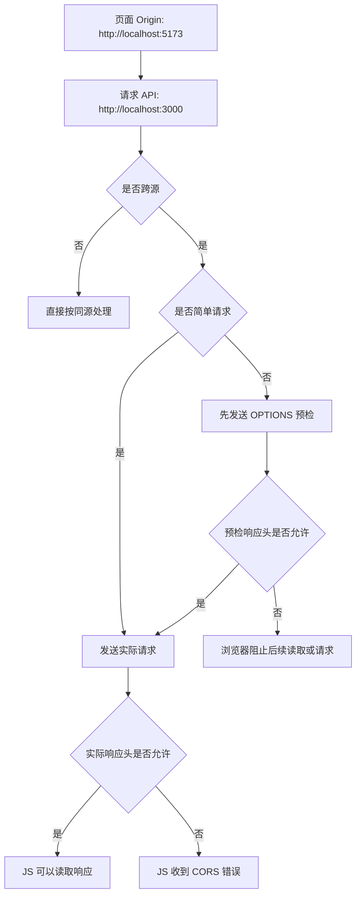

### 最小后端响应头

```http
Access-Control-Allow-Origin: http://localhost:5173
Access-Control-Allow-Methods: GET, POST, PUT, DELETE, OPTIONS
Access-Control-Allow-Headers: Content-Type, Authorization
Access-Control-Allow-Credentials: true
Vary: Origin
```

### CORS 排查表

| 现象 | 优先看哪里 | 常见原因 |
| --- | --- | --- |
| Console 报 CORS | Network 的 OPTIONS 和实际请求 | 后端没返回允许的 Origin |
| OPTIONS 失败 | 预检请求状态码和响应头 | 网关没放行 OPTIONS |
| 带 token 失败 | `Access-Control-Allow-Headers` | 没允许 `Authorization` |
| 带 Cookie 失败 | `credentials`、`Allow-Credentials`、Cookie 属性 | 前端或后端少配一边 |
| Postman 能通浏览器不通 | 浏览器 CORS 安全策略 | Postman 不执行浏览器同源策略 |

## 第四阶段：登录态链路

### Cookie Session 链路

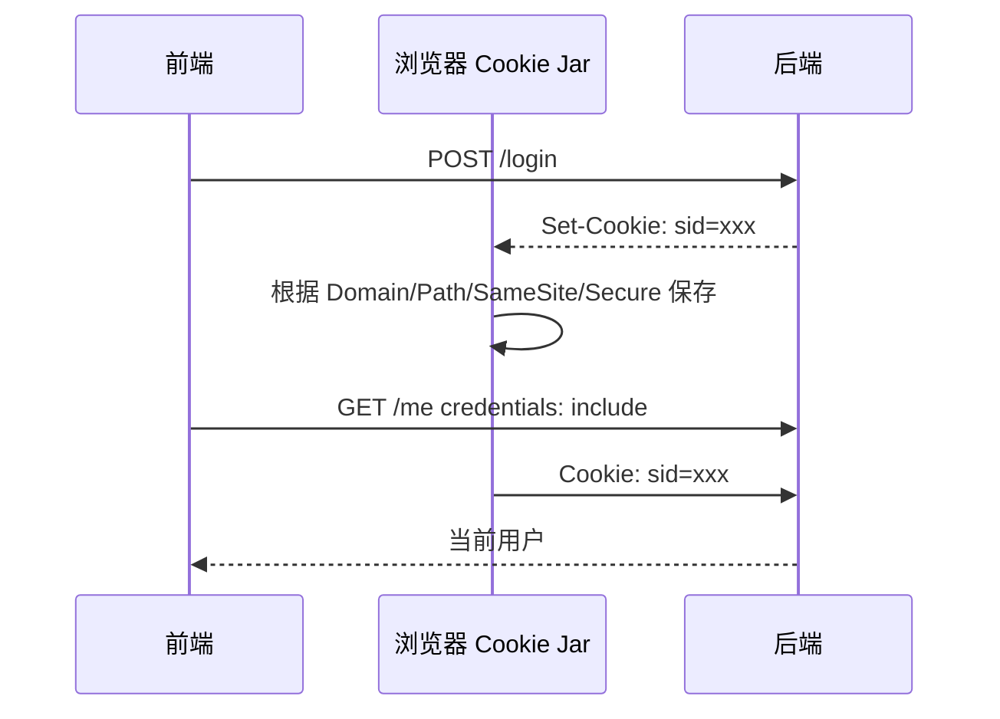

Cookie 登录态出问题时，不要只看页面 store。按下面顺序查：

1. 登录响应是否真的有 `Set-Cookie`。
2. Application 面板是否保存了 Cookie。
3. Cookie 的 Domain、Path 是否匹配当前请求。
4. 跨站场景 SameSite 是否允许。
5. HTTPS 场景 Secure 是否匹配。
6. `fetch` 或 axios 是否允许带 credentials。
7. 后端是否识别 Cookie 并返回用户。

### Token 链路

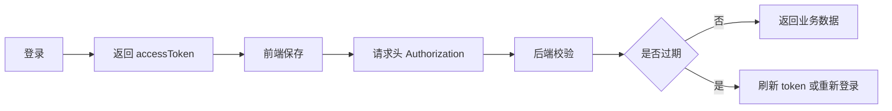

Token 方案重点是过期、刷新和泄漏风险：

| 问题 | 建议 |
| --- | --- |
| token 刷新后旧请求覆盖新状态 | 给刷新流程加队列或互斥 |
| 多标签页退出不同步 | 用 `BroadcastChannel` 或 storage 事件同步 |
| token 存 LocalStorage 被 XSS 读取 | 配合 CSP、输入输出转义、最小权限和过期策略 |
| 401 无限重试 | 设置重试上限和明确退出逻辑 |

## 第五阶段：缓存分层

### HTTP 缓存

MDN 对 HTTP 缓存的说明是：缓存会把响应和请求关联起来，并在后续请求中复用响应。项目里最容易出问题的是没有区分“HTML 入口”和“带 hash 的静态资源”。

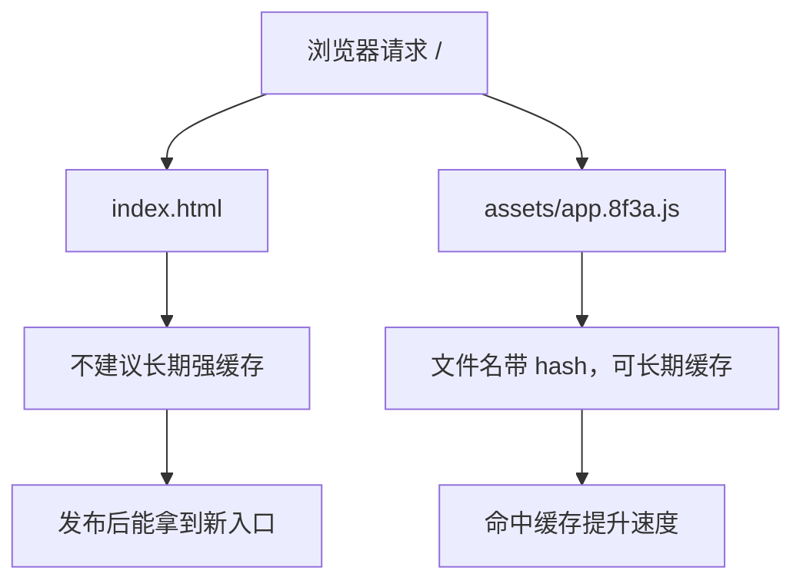

推荐策略：

```http
# index.html
Cache-Control: no-cache

# app.[hash].js / style.[hash].css
Cache-Control: public, max-age=31536000, immutable

# 业务接口
Cache-Control: no-store
```

这不是固定答案，而是常见单页应用的基准策略。接口是否能缓存，要看业务数据是否允许复用。

### Service Worker 缓存

Service Worker 可以拦截网络请求，并用缓存策略决定返回网络还是缓存。Chrome Workbox 文档把缓存策略理解为 Service Worker 的 fetch event 和 Cache 接口之间的交互，这对 PWA 很关键。

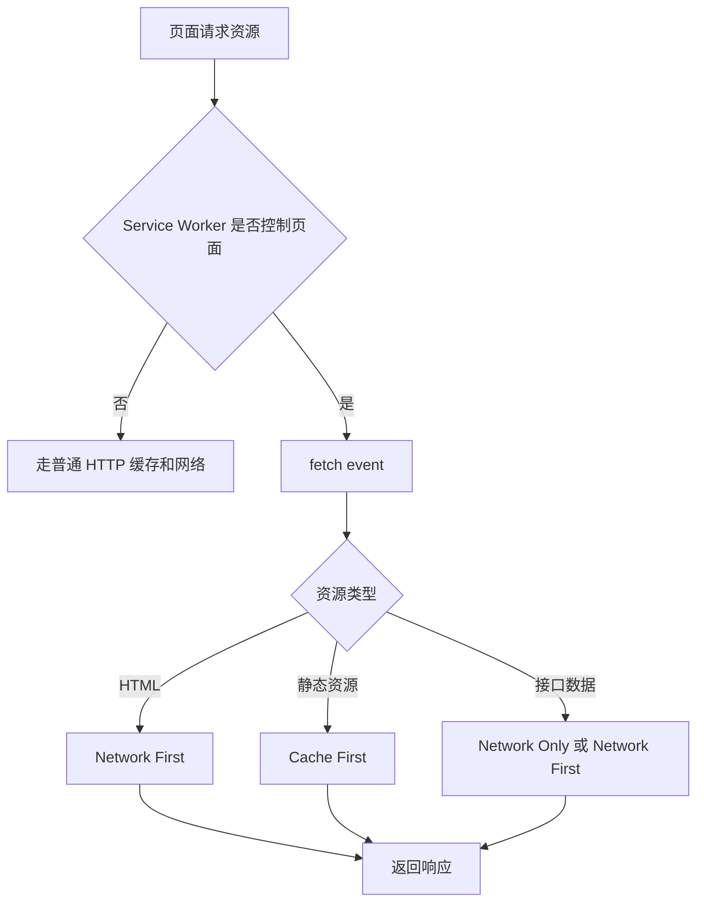

### 缓存排查路径

| 旧内容类型 | 优先排查 |
| --- | --- |
| 页面 HTML 是旧的 | Network 查看 `index.html` 的 `Cache-Control`、CDN 缓存 |
| JS/CSS 是旧的 | 文件名 hash、CDN purge、构建产物引用 |
| 接口数据旧 | 接口响应头、代理缓存、前端请求缓存参数 |
| 离线资源旧 | Application 面板的 Service Worker 和 Cache Storage |
| 只有部分用户旧 | CDN 节点、浏览器缓存、灰度发布版本 |

## 第六阶段：存储选择

### 存储选择图

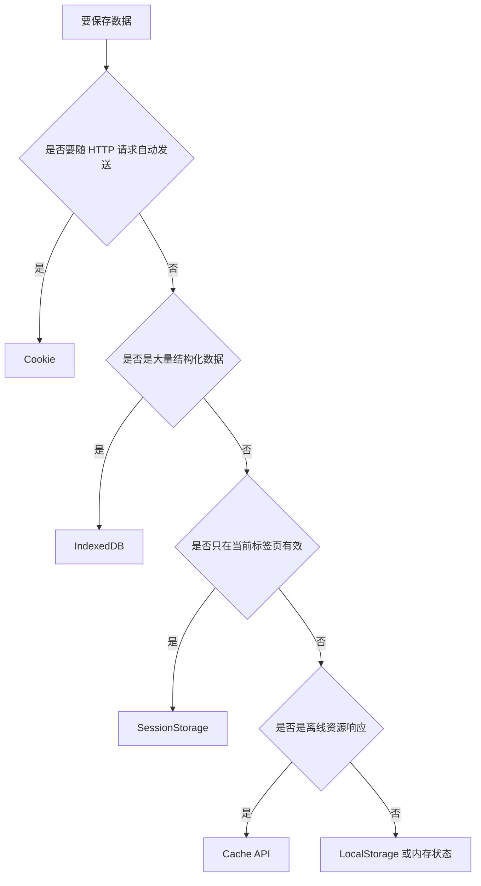

### 对比表

| 存储 | 适合 | 不适合 |
| --- | --- | --- |
| Cookie | 服务端会话、少量请求凭证 | 大数据、频繁写入、敏感明文 |
| LocalStorage | 简单偏好、非敏感配置 | token 高风险存储、复杂结构化数据 |
| SessionStorage | 当前标签页临时筛选条件 | 跨标签共享和长期保存 |
| IndexedDB | 大量结构化数据、离线草稿 | 简单开关配置 |
| Cache API | 请求和响应缓存、PWA 离线资源 | 业务权限和用户敏感资料 |
| 内存状态 | 页面运行期状态 | 刷新后需要恢复的数据 |

### 实战规则

1. 登录凭证是否能放前端存储，必须结合项目安全模型判断。
2. LocalStorage 读取要有 JSON 解析兜底，避免脏数据导致白屏。
3. 存储要设计版本号，结构变更时能迁移或丢弃旧数据。
4. 退出登录要清理用户相关存储、Service Worker 缓存和跨标签状态。
5. 多租户或多账号系统要避免不同账号共用同一份缓存 key。

## 第七阶段：DevTools 证据链

本阶段不是学习“点哪个标签”，而是建立可复用的证据记录。以请求问题为例，截图和排障记录至少要同时包含 URL、Method、Status、关键请求头、关键响应头、Timing 最大阶段和 Request ID。

<DocFigure
  src="/images/browser/network-request-headers.webp"
  alt="浏览器网络证据示例同时展示请求概要、请求头、响应头和链路 ID"
  caption="项目排障记录应保存能复核的请求事实，不能只写“接口有问题”或只截一个红色状态码。"
  :width="1440"
  :height="900"
/>

即使不附图片，也要把同样信息写入 `BROWSER_DEBUG_NOTES`：目标环境、完整请求路径、触发时间、Status、关键 Header、Request ID、耗时最大阶段、预期结果和实际结果。

### 排障总图

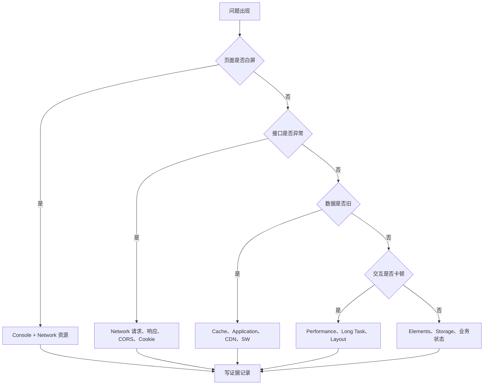

### Network 必看字段

| 字段 | 为什么重要 |
| --- | --- |
| Request URL | 是否请求到正确环境和路径 |
| Request Method | GET/POST/OPTIONS 是否符合预期 |
| Status Code | 是 HTTP 错误、重定向还是预检失败 |
| Request Headers | token、Cookie、Content-Type 是否带对 |
| Response Headers | CORS、Cache-Control、Set-Cookie、traceId |
| Payload | 请求参数是否符合接口约定 |
| Preview/Response | 业务错误码和响应结构 |
| Timing | DNS、连接、等待、下载哪一段慢 |
| Size | 是否来自 memory cache、disk cache 或网络 |

### Application 必看位置

| 位置 | 用途 |
| --- | --- |
| Cookies | 查登录态是否保存、Domain、Path、SameSite、Secure |
| Local Storage | 查前端配置、token、脏 JSON、用户偏好 |
| Session Storage | 查当前标签页临时状态 |
| IndexedDB | 查离线草稿、大量结构化数据 |
| Cache Storage | 查 Service Worker 缓存资源 |
| Service Workers | 查控制状态、更新状态、skip waiting、unregister |

## 第八阶段：常见项目场景

### 场景 1：Postman 能通，浏览器不通

排查顺序：

1. Network 是否有请求。
2. 是否先出现 OPTIONS。
3. OPTIONS 是否 2xx。
4. 预检响应是否包含允许的 Origin、Methods、Headers。
5. 实际请求响应是否也带 CORS 头。
6. 前端是否需要 credentials。
7. 后端是否错误使用 `*` 搭配 Credentials。

记录模板：

```md
## Postman 能通，浏览器不通

- 页面地址：
- API 地址：
- 是否跨源：
- OPTIONS 状态：
- 实际请求状态：
- Request Headers：
- Response Headers：
- Console 报错：
- 根因：
- 修复：
```

### 场景 2：登录后刷新变未登录

排查顺序：

1. 刷新后是否重新调用 `/me` 或用户信息接口。
2. 请求是否带 Cookie 或 Authorization。
3. Cookie 是否被 SameSite、Secure、Domain、Path 限制。
4. token 是否从存储恢复。
5. 前端路由守卫是否在用户信息恢复前误判未登录。
6. 多标签页是否同步了退出或刷新状态。

### 场景 3：上线后用户看到旧页面

排查顺序：

1. Network 勾选 Disable cache 后是否恢复。
2. `index.html` 是否被强缓存。
3. HTML 里引用的 JS/CSS 文件名是否是新 hash。
4. CDN 是否还有旧缓存。
5. Application 是否存在旧 Service Worker。
6. 是否灰度到了不同版本。

### 场景 4：接口数据没有更新

排查顺序：

1. 请求是否真的发出。
2. Query 参数和 body 是否是新条件。
3. 响应是否来自 memory/disk cache。
4. 接口响应头是否有缓存指令。
5. 前端状态是否被旧请求覆盖。
6. Service Worker 是否拦截了接口。

## 第九阶段：最小项目任务

按下面顺序完成“请求诊断工作台”：

1. 创建一个 Vite + TypeScript 小项目。
2. 做 5 个面板：请求、登录态、缓存、存储、调试证据。
3. 封装 `requestClient`，记录 URL、method、status、headers、duration、traceId。
4. 写 mock API，至少包含 `/login`、`/me`、`/users`、`/slow`、`/error`。
5. 模拟同源请求和跨源请求。
6. 模拟 Cookie Session 和 Token 登录。
7. 给 `index.html`、静态资源和接口设置不同缓存头。
8. 加一个最小 Service Worker，只缓存静态资源，不缓存用户接口。
9. 故意注入 CORS、Cookie、缓存、旧请求覆盖、localStorage 脏数据 5 类问题。
10. 用 DevTools 记录证据，并写入 `BROWSER_DEBUG_NOTES.md`。

## BROWSER_DEBUG_NOTES 模板

```md
# 浏览器排障记录

## 问题现象

## 复现步骤

## 环境

- 页面 URL：
- API URL：
- 浏览器：
- 登录用户：

## Console 证据

## Network 证据

- Request URL：
- Method：
- Status：
- Request Headers：
- Response Headers：
- Payload：
- Response：
- Timing：

## Application 证据

- Cookie：
- LocalStorage：
- SessionStorage：
- IndexedDB：
- Cache Storage：
- Service Worker：

## 根因

## 修复方案

## 回归验证

## 预防措施
```

这个模板比“接口报错了”更有价值。它能让另一个开发者复现、判断和验证，而不是重新猜。

## 第十阶段：上线前验收清单

| 检查项 | 通过标准 |
| --- | --- |
| 路由刷新 | 任意前端路由刷新后不 404 |
| API 环境 | dev、test、prod 的 baseURL 和代理规则清楚 |
| CORS | 跨源请求的 Origin、Methods、Headers、Credentials 配置正确 |
| 登录恢复 | 刷新后能恢复用户信息，过期后能明确退出 |
| 缓存 | `index.html` 不长期强缓存，hash 资源可长期缓存 |
| Service Worker | 发布新版本后有更新策略，不缓存用户敏感接口 |
| 存储 | 退出登录清理用户相关 Cookie、Storage 和缓存 |
| 错误态 | 401、403、404、422、500、网络失败有不同提示 |
| 弱网 | 慢请求有 loading、timeout 和重试边界 |
| 移动端 | Network 弱网模拟下核心流程可用 |
| 证据 | 线上问题能记录 traceId、请求头、响应头和复现步骤 |

## 和其他章节的关系

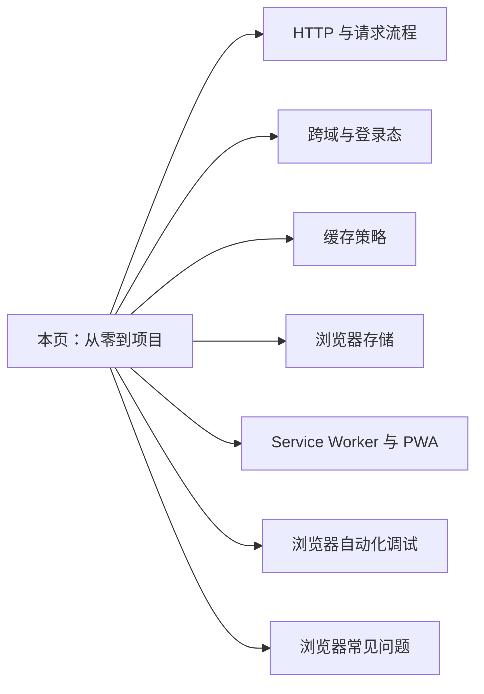

本页是项目入口，其他章节是专项深入。遇到具体问题时，不要停留在本页，要跳到专项章节查细节。

## 参考资料

- [MDN: Fetch API](https://developer.mozilla.org/en-US/docs/Web/API/Fetch_API)
- [MDN: Cross-Origin Resource Sharing](https://developer.mozilla.org/en-US/docs/Web/HTTP/Guides/CORS)
- [MDN: HTTP caching](https://developer.mozilla.org/en-US/docs/Web/HTTP/Guides/Caching)
- [MDN: Cache-Control](https://developer.mozilla.org/en-US/docs/Web/HTTP/Reference/Headers/Cache-Control)
- [MDN: Cache API](https://developer.mozilla.org/en-US/docs/Web/API/Cache)
- [Chrome Developers: Workbox caching strategies](https://developer.chrome.com/docs/workbox/caching-strategies-overview)
- [web.dev: Service worker caching and HTTP caching](https://web.dev/articles/service-worker-caching-and-http-caching)

## 下一步

继续按这个顺序深入：

1. [HTTP 与请求流程](/browser/http-request)：看懂请求、响应、状态码和 Network 面板。
2. [跨域与登录态](/browser/cors-auth)：专门排查 CORS、Cookie 和 401/403。
3. [缓存策略](/browser/cache)：处理发布缓存、接口缓存和旧版本资源。
4. [浏览器存储](/browser/storage)：选择 Cookie、Storage、IndexedDB 和 Cache API。
5. [浏览器自动化调试](/browser/browser-automation-debugging)：把手工排查沉淀成自动巡检。
6. [常见问题](/browser/troubleshooting)：按真实现象复盘。
