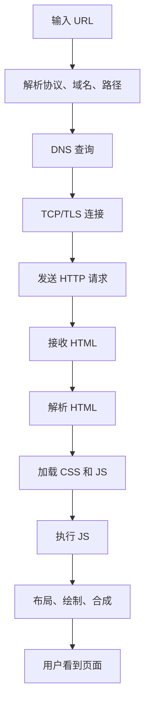
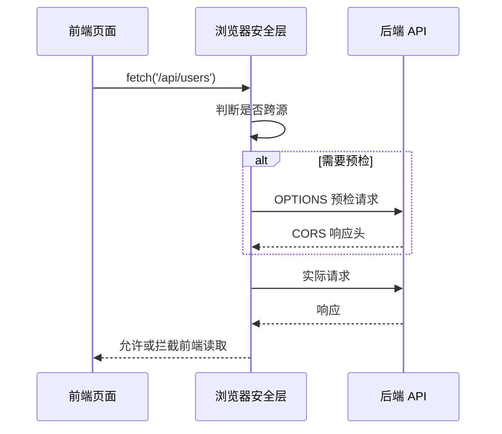
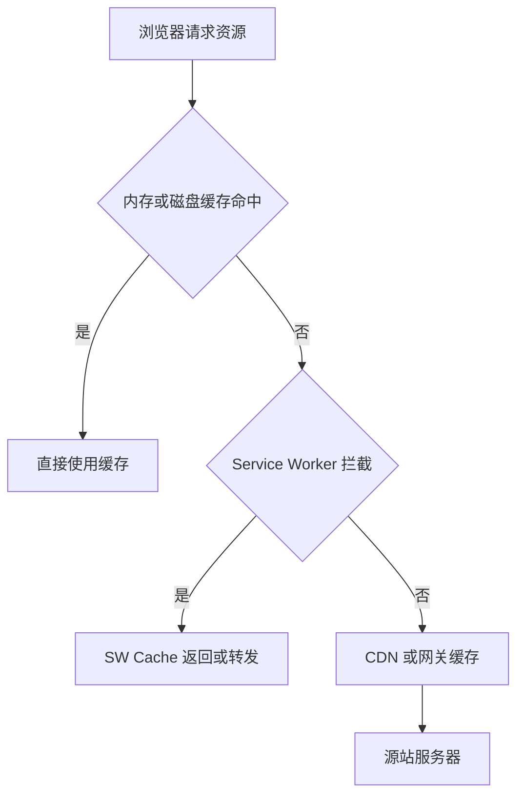
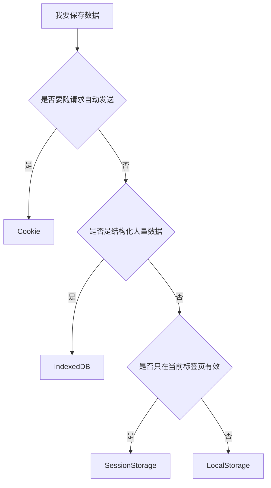
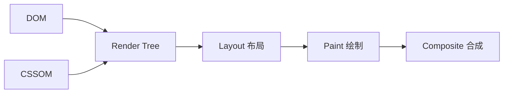
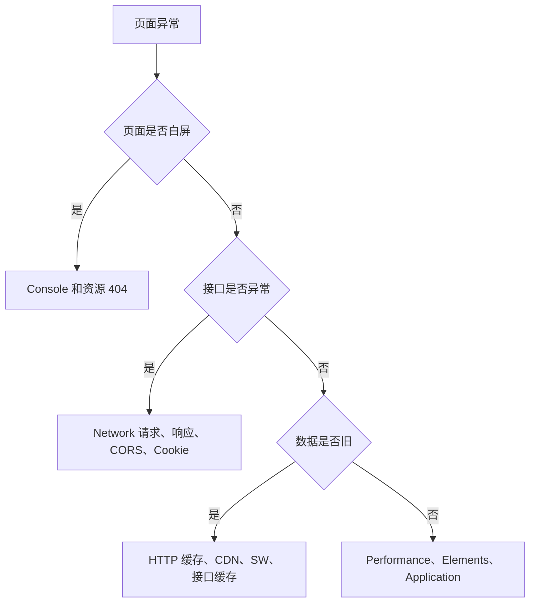

# 图解浏览器核心概念

## 适合谁看

适合已经会写前端页面，但对 HTTP 请求、跨域、缓存、登录态、存储、安全和渲染性能还没有形成完整链路的人。

浏览器不是简单的页面容器。它同时负责网络、安全、缓存、运行 JavaScript、管理存储、执行渲染和限制危险能力。很多真实项目问题，都发生在“代码没错，但浏览器规则不允许”这一层。

## 你会学到什么

- 从输入 URL 到页面渲染的大致过程。
- 请求、CORS、Cookie 和登录态如何串起来。
- HTTP 缓存、CDN 缓存、Service Worker 缓存的区别。
- 浏览器存储应该怎么选。
- 渲染流水线为什么会影响性能。
- 前端排错应该先看哪些面板。

## 从 URL 到页面

项目里常见的白屏、资源 404、跨域、缓存旧页面，都能放回这条链路里定位。

## 请求和 CORS

重点是：后端返回了响应，不代表前端一定能读到。浏览器会根据 CORS 响应头判断是否允许 JavaScript 访问结果。

排查时看 Network：

- 是否有 OPTIONS。
- OPTIONS 状态码是否正确。
- `Access-Control-Allow-Origin` 是否匹配。
- 带 Cookie 时是否设置 `Access-Control-Allow-Credentials`。
- 前端请求是否设置 `credentials`。

## Cookie 登录态

Cookie 是否能带出去，受这些条件影响：

| 条件 | 说明 |
| --- | --- |
| Domain | 当前域名是否匹配 |
| Path | 当前路径是否匹配 |
| SameSite | 跨站请求是否允许携带 |
| Secure | 是否要求 HTTPS |
| credentials | fetch/axios 是否允许带凭证 |

登录态问题不要只看前端 store。一定要看请求头里是否真的带了 Cookie。

## 缓存分层

用户看到旧页面时，可能不是同一层缓存：

| 缓存层 | 常见问题 | 排查位置 |
| --- | --- | --- |
| 浏览器 HTTP 缓存 | `index.html` 强缓存 | Network |
| CDN 缓存 | 发布后仍旧页面 | CDN 控制台 |
| Service Worker | PWA 继续返回旧资源 | Application |
| 接口缓存 | 数据不更新 | Response Headers |

前端发布时，`index.html` 不建议长期强缓存，带 hash 的 assets 可以长期缓存。

## 浏览器存储怎么选

| 存储 | 适合 | 不适合 |
| --- | --- | --- |
| Cookie | 服务端会话、少量状态 | 大数据、敏感明文 |
| LocalStorage | 简单持久偏好 | 高频读写、敏感数据 |
| SessionStorage | 当前标签页临时状态 | 跨标签共享 |
| IndexedDB | 大量结构化数据 | 简单配置 |
| Cache API | PWA 资源缓存 | 业务权限数据 |

敏感信息不要随便放 LocalStorage。是否能存，取决于安全模型和项目风险。

## 渲染流水线

性能问题常见来源：

- DOM 过多导致布局计算慢。
- 频繁读写布局属性导致强制同步布局。
- 大图片和大脚本阻塞首屏。
- 滚动时触发大量 JS。
- 动画修改 `top/left/width/height`，导致反复布局。

更稳定的动画优先修改 `transform` 和 `opacity`。

## 浏览器排错路径

排查优先级：

1. Console 是否有运行时错误。
2. Network 是否有资源 404 或接口失败。
3. Application 里 Cookie、Storage、Service Worker 是否正常。
4. Performance 是否有长任务或布局抖动。
5. Elements 里最终 DOM 和 CSS 是否符合预期。

## 实际项目常见问题

### 问题 1：Postman 能通，浏览器不通

通常是 CORS、Cookie、HTTPS 混合内容或浏览器安全限制。先看 Network，不要直接怀疑接口业务逻辑。

### 问题 2：上线后用户看到旧页面

先判断是 `index.html`、assets、CDN、Service Worker 还是接口缓存。不同层的处理方式不同。

### 问题 3：登录后刷新变未登录

检查 Cookie 是否保存、是否带出、SameSite/Secure 是否匹配、前端是否在刷新后恢复用户上下文。

## 下一步学习

继续学习 [HTTP 与请求流程](/browser/http-request)、[跨域与登录态](/browser/cors-auth)、[缓存策略](/browser/cache) 和 [渲染与性能](/browser/rendering-performance)。
