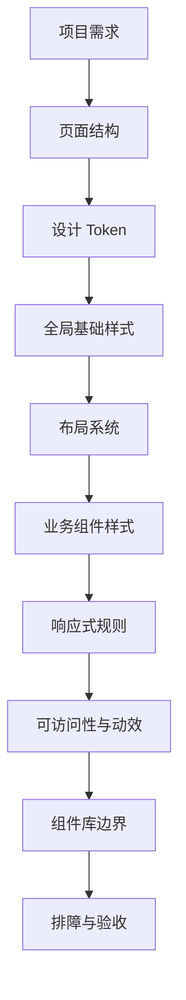
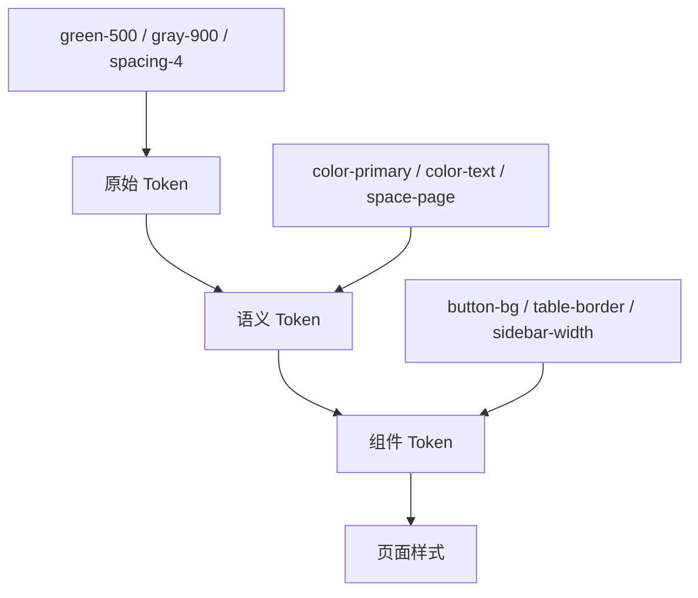
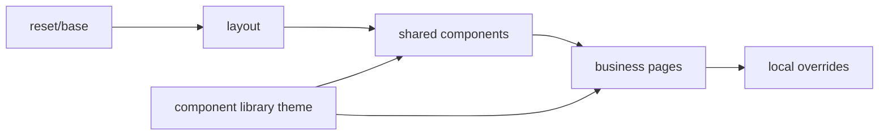
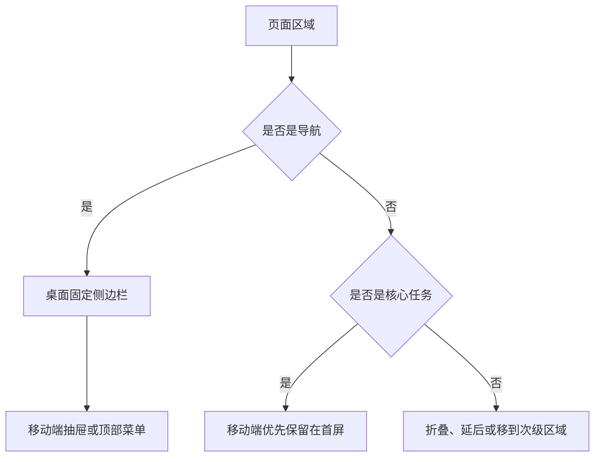
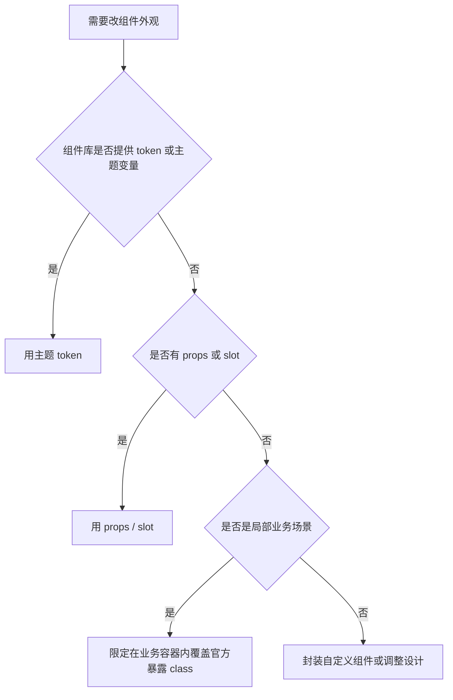
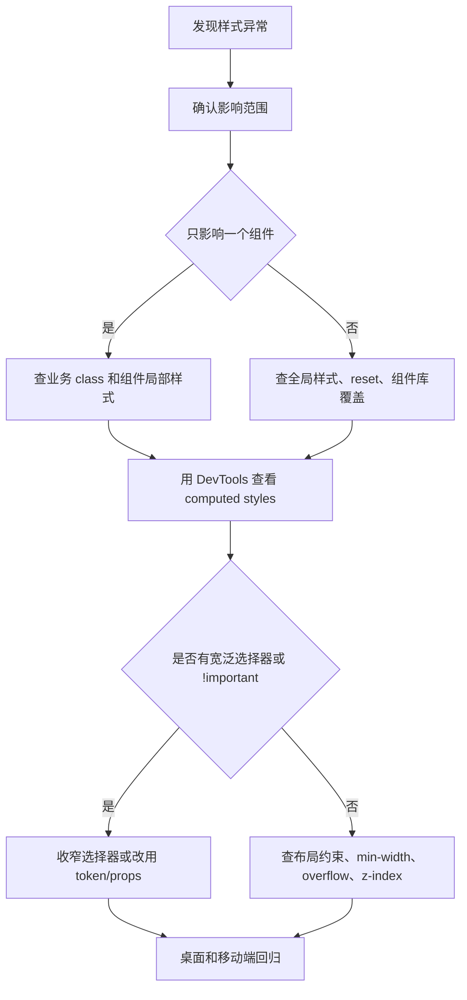

# CSS 从零到项目落地

## 这个页面解决什么

很多人学 CSS 时能写出单个按钮、单个卡片和单个布局，但一进入真实项目就开始混乱：

- 页面越写越多，全局样式互相影响。
- 桌面端看起来正常，移动端出现横向滚动。
- 接入组件库后，按钮、表格、弹窗被自己写的 CSS 污染。
- 主题色、间距、圆角和字体大小散落在几十个文件里。
- 图标按钮、头像、状态点在表格和工具栏里被挤压变形。
- 暗色模式、品牌换肤、响应式和可访问性都在后期补，越补越乱。

这一页用一个“后台管理系统样式骨架”做例子，把 CSS 基础、布局、响应式、设计 token、组件库边界、样式架构和排障验收串成一条完整落地路径。读完以后，你应该知道：真实项目的 CSS 不只是写属性，而是建立一套可维护的界面规则。

## 适合谁看

适合已经看过基础 CSS，但项目里仍然容易写乱的人：

- 会写选择器、颜色、间距、Flex 和 Grid。
- 知道媒体查询，但响应式经常靠临时修补。
- 接触过 Vue、React 或后台组件库。
- 想做一个稳定、可扩展、不污染组件库的前端项目。
- 经常遇到横向溢出、样式覆盖、弹层遮挡、表格压缩和主题变量失控。

如果你还没有 CSS 基础，建议先看 [CSS 学习导览](/css/introduction)、[盒模型与布局基础](/css/box-model-layout)、[Flex 与 Grid](/css/flex-grid) 和 [响应式设计](/css/responsive)。如果你已经在项目里遇到样式异常，可以并行查 [CSS 真实项目问题库](/projects/issues-css)。

## 项目目标

本页要做的不是“设计一套华丽页面”，而是建立一套能长期维护的样式基础。最终项目至少应该具备这些能力：

| 能力 | 要达到的结果 |
| --- | --- |
| 页面结构 | 有稳定的 `header`、`aside`、`main`、工具栏、内容区和表格区 |
| 布局策略 | 桌面端信息密度足够，移动端首屏不被侧边栏挤占 |
| 设计 token | 颜色、间距、圆角、阴影、字体和层级有统一变量 |
| 样式边界 | 全局样式、业务样式、组件库样式和工具类职责清楚 |
| 响应式 | 390px 移动端无横向滚动，内容仍然可读可操作 |
| 组件稳定性 | 头像、图标按钮、状态点、操作列不会被挤压变形 |
| 可访问性 | 焦点可见、颜色对比足够、减少动态效果可用 |
| 排障能力 | 能定位横向溢出、层级遮挡、组件库污染和主题变量问题 |

## 总体落地图



这张图要表达一个核心顺序：先定结构和规则，再写具体样式。真实项目里最容易出问题的做法，是先把页面堆出来，等错位以后再补 `!important`、固定宽度和各种临时覆盖。

## 第一阶段：先定义页面骨架

### 目标

先确定页面有哪些稳定区域。CSS 项目失败的一个常见原因是：样式已经写了很多，但 HTML 结构没有语义和层次，后续每个页面都要重新猜布局。

后台管理系统最小骨架如下：

```text
app-shell
  app-header
  app-body
    app-sidebar
    app-main
      page-header
      page-toolbar
      content-panel
```

对应的 HTML 可以这样写：

```html
<div class="app-shell">
  <header class="app-header">
    <a class="brand" href="/">Yok Admin</a>
    <nav class="top-nav" aria-label="顶部导航"></nav>
  </header>

  <div class="app-body">
    <aside class="app-sidebar" aria-label="主导航"></aside>

    <main class="app-main">
      <section class="page-header">
        <h1 class="page-title">用户管理</h1>
        <p class="page-description">管理用户、角色和启用状态。</p>
      </section>

      <section class="page-toolbar" aria-label="筛选与操作"></section>

      <section class="content-panel"></section>
    </main>
  </div>
</div>
```

### 结构规则

| 规则 | 原因 |
| --- | --- |
| 页面主内容用 `main` | 方便阅读器和浏览器理解页面主体 |
| 导航区域用 `nav` 或带 `aria-label` 的 `aside` | 避免多个导航区域含义不清 |
| 页面标题只保留一个主 `h1` | 搜索、可访问性和团队阅读都更清楚 |
| 工具栏单独成区 | 筛选、批量操作和新增按钮不会混进表格 |
| 表格、卡片、空态放在内容容器里 | 方便统一 loading、empty、error 和滚动策略 |

### 不推荐结构

```html
<div class="page">
  <div>
    <div>用户管理</div>
    <div>
      <div>搜索</div>
      <div>表格</div>
    </div>
  </div>
</div>
```

这种结构短期能显示，长期会带来三个问题：

1. 选择器只能写得越来越宽，比如 `.page div div`。
2. 样式很难复用，因为区域没有业务语义。
3. 出现错位时，很难判断是布局问题、内容问题还是组件问题。

## 第二阶段：建立设计 Token

### 目标

把颜色、间距、圆角、阴影、字体和层级从“随手写值”改成“统一变量”。CSS 自定义属性会参与层叠和继承，适合做主题变量和局部覆盖。MDN 对 CSS 自定义属性的说明也强调了它们的作用域和层叠特性。

### Token 分层图



### 推荐变量

```css
:root {
  --color-brand-50: #ecfdf7;
  --color-brand-100: #d4f8ea;
  --color-brand-500: #22b98f;
  --color-brand-700: #08785f;

  --color-bg-page: #f7faf8;
  --color-bg-surface: #ffffff;
  --color-text: #1f2a25;
  --color-text-muted: #65746d;
  --color-border: #dbe7e1;
  --color-danger: #d64545;
  --color-warning: #b7791f;

  --space-1: 4px;
  --space-2: 8px;
  --space-3: 12px;
  --space-4: 16px;
  --space-5: 20px;
  --space-6: 24px;
  --space-8: 32px;

  --radius-sm: 4px;
  --radius-md: 8px;
  --shadow-surface: 0 12px 30px rgb(31 42 37 / 8%);

  --header-height: 56px;
  --sidebar-width: 240px;
  --content-max-width: 1280px;
  --z-header: 30;
  --z-drawer: 50;
  --z-modal: 80;
}
```

### 暗色模式变量

```css
@media (prefers-color-scheme: dark) {
  :root {
    --color-bg-page: #101512;
    --color-bg-surface: #171f1b;
    --color-text: #eef8f2;
    --color-text-muted: #a6b8ae;
    --color-border: #2a3a32;
    --shadow-surface: 0 16px 36px rgb(0 0 0 / 32%);
  }
}
```

### Token 命名原则

| 类型 | 推荐 | 不推荐 |
| --- | --- | --- |
| 品牌色 | `--color-brand-500` | `--green` |
| 页面背景 | `--color-bg-page` | `--light-bg` |
| 文字颜色 | `--color-text-muted` | `--gray-text-small` |
| 间距 | `--space-4` | `--margin-normal` |
| 层级 | `--z-modal` | `--z-9999` |

不要把 token 命名成当前颜色外观，比如 `--light-green`。项目换品牌色或暗色模式时，这类名字会失真。语义 token 更稳定。

## 第三阶段：定义样式文件分层

### 目标

CSS 文件要有入口和边界。推荐的基础结构：

```text
src/styles/
  index.css
  tokens.css
  reset.css
  base.css
  layout.css
  utilities.css
  components.css
```

### 文件职责

| 文件 | 放什么 | 不放什么 |
| --- | --- | --- |
| `tokens.css` | CSS 变量、主题变量、层级变量 | 具体页面布局 |
| `reset.css` | 浏览器默认样式重置 | 业务 class |
| `base.css` | `body`、链接、标题、焦点等基础样式 | 组件库内部覆盖 |
| `layout.css` | 应用壳子、主布局、网格容器 | 具体用户模块表格样式 |
| `components.css` | 自研小组件样式，如空态、状态点 | 页面专属样式 |
| `utilities.css` | 少量工具类，如视觉隐藏 | 大量原子类堆叠 |

### 使用 cascade layers 管理优先级

现代 CSS 可以用 `@layer` 明确声明不同样式层的优先级。MDN 对 `@layer` 的说明是：它可以声明级联层，并在多个层之间定义优先顺序。项目里可以这样组织：

```css
@layer reset, tokens, base, layout, components, pages, utilities;

@import './reset.css' layer(reset);
@import './tokens.css' layer(tokens);
@import './base.css' layer(base);
@import './layout.css' layer(layout);
@import './components.css' layer(components);
@import './utilities.css' layer(utilities);
```

如果你的构建链或目标浏览器暂时不适合使用 `@layer`，也可以先用 import 顺序和命名约定管理，但原则不变：越基础的样式越靠前，越具体的业务样式越靠后，禁止靠无限提高选择器权重解决问题。

### 样式边界图



组件库样式应该通过主题 token、组件 props、官方 CSS 变量或明确限定的业务容器调整。不要默认去猜组件库内部 DOM。

## 第四阶段：写稳定的应用布局

### 桌面端布局

后台桌面端通常是顶部栏 + 侧边栏 + 内容区：

```css
.app-shell {
  min-height: 100vh;
  background: var(--color-bg-page);
  color: var(--color-text);
}

.app-header {
  position: sticky;
  top: 0;
  z-index: var(--z-header);
  display: flex;
  align-items: center;
  justify-content: space-between;
  min-height: var(--header-height);
  padding-inline: var(--space-6);
  background: var(--color-bg-surface);
  border-bottom: 1px solid var(--color-border);
}

.app-body {
  display: grid;
  grid-template-columns: var(--sidebar-width) minmax(0, 1fr);
  min-height: calc(100vh - var(--header-height));
}

.app-sidebar {
  border-right: 1px solid var(--color-border);
  background: var(--color-bg-surface);
}

.app-main {
  min-width: 0;
  padding: var(--space-6);
}

.content-panel {
  max-width: var(--content-max-width);
  margin-inline: auto;
  background: var(--color-bg-surface);
  border: 1px solid var(--color-border);
  border-radius: var(--radius-md);
  box-shadow: var(--shadow-surface);
}
```

这里最重要的细节是 `minmax(0, 1fr)` 和 `.app-main { min-width: 0; }`。很多横向滚动不是因为内容真的太宽，而是 Grid/Flex 子项默认最小宽度不允许收缩。

### 移动端布局

移动端不要把桌面侧边栏直接堆到首屏上方。移动端应该保留当前页面核心内容，把导航放进抽屉、底部导航或紧凑顶部菜单。

```css
@media (max-width: 768px) {
  .app-header {
    padding-inline: var(--space-4);
  }

  .app-body {
    display: block;
  }

  .app-sidebar {
    display: none;
  }

  .app-main {
    padding: var(--space-4);
  }

  .content-panel {
    border-radius: var(--radius-sm);
  }
}
```

### 响应式决策图



响应式不是把所有内容从左到右改成从上到下，而是重新决定移动端首屏最重要的任务。

## 第五阶段：做好页面工具栏

### 目标

后台系统的工具栏通常包含搜索、筛选、批量操作、新增按钮和视图切换。工具栏是最容易挤压变形的区域之一。

```html
<section class="page-toolbar" aria-label="用户筛选与操作">
  <form class="filter-form">
    <label class="filter-field">
      <span class="filter-label">关键字</span>
      <input class="filter-input" type="search" placeholder="姓名、手机号" />
    </label>
    <button class="toolbar-button" type="submit">查询</button>
  </form>

  <div class="toolbar-actions">
    <button class="icon-button" type="button" aria-label="刷新">R</button>
    <button class="primary-button" type="button">新增用户</button>
  </div>
</section>
```

```css
.page-toolbar {
  display: flex;
  align-items: flex-end;
  justify-content: space-between;
  gap: var(--space-4);
  padding: var(--space-4);
  border-bottom: 1px solid var(--color-border);
}

.filter-form {
  display: flex;
  flex-wrap: wrap;
  align-items: flex-end;
  gap: var(--space-3);
  min-width: 0;
}

.filter-field {
  display: grid;
  gap: var(--space-1);
  min-width: min(240px, 100%);
}

.toolbar-actions {
  display: flex;
  align-items: center;
  gap: var(--space-2);
  flex: 0 0 auto;
}

.icon-button {
  inline-size: 36px;
  block-size: 36px;
  flex: 0 0 36px;
  border-radius: var(--radius-sm);
}
```

### 工具栏移动端

```css
@media (max-width: 640px) {
  .page-toolbar {
    align-items: stretch;
    flex-direction: column;
  }

  .filter-form,
  .toolbar-actions {
    width: 100%;
  }

  .filter-field {
    width: 100%;
  }

  .toolbar-actions {
    justify-content: flex-end;
  }
}
```

注意图标按钮、头像、状态圆点必须设置稳定宽高和 `flex: 0 0 <size>`。否则它们在工具栏、表格操作列和响应式布局里很容易被挤成椭圆或窄条。

## 第六阶段：处理表格和长内容

### 目标

真实后台项目里，表格是最容易暴露 CSS 问题的地方：字段多、内容长、操作按钮多、状态复杂、移动端空间不足。

### 表格容器

```css
.table-region {
  overflow-x: auto;
  padding: var(--space-4);
}

.data-table {
  width: 100%;
  min-width: 760px;
  border-collapse: collapse;
}

.data-table th,
.data-table td {
  padding: var(--space-3);
  border-bottom: 1px solid var(--color-border);
  text-align: left;
  vertical-align: middle;
}
```

表格内容很多时，允许表格内部横向滚动，比让整个页面横向滚动更可控。移动端如果仍然需要完整操作，可以考虑卡片化列表，但这属于产品和组件设计决策，不是简单 CSS 补丁。

### 长文本处理

```css
.table-cell-text {
  overflow: hidden;
  max-width: 280px;
  text-overflow: ellipsis;
  white-space: nowrap;
}

.table-cell-code {
  overflow-wrap: anywhere;
  font-family: ui-monospace, SFMono-Regular, Menlo, Consolas, monospace;
}
```

### 操作列

```css
.table-actions {
  display: inline-flex;
  align-items: center;
  justify-content: flex-end;
  gap: var(--space-2);
  white-space: nowrap;
}

.table-actions .action-button {
  flex: 0 0 auto;
}
```

不要让操作按钮在窄列中任意换行，也不要用全局 `button { width: 100%; }` 影响表格按钮。

## 第七阶段：组件库样式边界

### 目标

如果项目使用 Element Plus、Ant Design Vue、Arco Design、TDesign、Naive UI 等组件库，CSS 要优先使用组件库提供的主题能力、props、CSS 变量和官方 class。不要依赖内部 DOM 层级。

### 禁止的写法

```css
.user-page div {
  box-sizing: border-box;
}

.toolbar button {
  height: 32px;
}

.content-panel * {
  font-size: 14px;
}
```

这些写法短期省事，长期会污染组件库内部结构。组件库升级后，内部 DOM 可能变化，宽泛选择器会让问题更难定位。

### 推荐的写法

```css
.user-page {
  --user-page-toolbar-gap: var(--space-3);
}

.user-page__toolbar {
  display: flex;
  gap: var(--user-page-toolbar-gap);
}

.user-page__status-dot {
  inline-size: 8px;
  block-size: 8px;
  flex: 0 0 8px;
  border-radius: 999px;
  background: var(--color-brand-500);
}
```

命中明确业务 class，既能表达意图，也不会污染组件库。

### 组件库覆盖判断流程



只有确认是局部业务场景时，才考虑局部覆盖，而且选择器必须限定在明确业务容器内。

## 第八阶段：使用容器查询增强组件适配

### 目标

媒体查询关注视口宽度，容器查询关注组件所在容器宽度。MDN 对容器查询的说明是：它们可以根据容器的尺寸或特征应用样式，而不是只根据视口。对于后台卡片、看板组件、搜索块和侧栏面板，容器查询比全局媒体查询更贴近组件复用场景。

### 示例：统计卡片

```css
.metric-card-grid {
  container-type: inline-size;
}

.metric-card {
  display: grid;
  grid-template-columns: minmax(0, 1fr) auto;
  gap: var(--space-3);
  padding: var(--space-4);
  border: 1px solid var(--color-border);
  border-radius: var(--radius-md);
}

@container (max-width: 360px) {
  .metric-card {
    grid-template-columns: 1fr;
  }

  .metric-card__trend {
    justify-self: start;
  }
}
```

### 什么时候用容器查询

| 场景 | 更适合 |
| --- | --- |
| 整个页面从桌面变移动端 | 媒体查询 |
| 同一个卡片放在主内容和侧栏，宽度不同 | 容器查询 |
| 页面导航在移动端变抽屉 | 媒体查询 |
| 图表卡片在窄容器内隐藏次要指标 | 容器查询 |
| 一个表单在弹窗和页面中布局不同 | 容器查询 |

容器查询不是媒体查询的替代品，而是补充。页面级决策用媒体查询，组件级适配优先考虑容器查询。

## 第九阶段：可访问性和动效

### 焦点状态

```css
:where(a, button, input, select, textarea):focus-visible {
  outline: 2px solid var(--color-brand-500);
  outline-offset: 2px;
}
```

不要因为默认 outline 不好看就直接 `outline: none`。如果要去掉默认样式，必须提供清晰的替代焦点状态。

### 减少动态效果

```css
@media (prefers-reduced-motion: reduce) {
  *,
  *::before,
  *::after {
    scroll-behavior: auto !important;
    animation-duration: 0.01ms !important;
    animation-iteration-count: 1 !important;
    transition-duration: 0.01ms !important;
  }
}
```

动效应服务于状态变化，比如展开、关闭、切换和反馈。后台、SaaS 和文档站不应该用大量无意义动画抢占注意力。

### 颜色和状态

状态不要只靠颜色表达：

```html
<span class="status-badge status-badge--enabled">
  <span class="status-badge__dot" aria-hidden="true"></span>
  已启用
</span>
```

```css
.status-badge {
  display: inline-flex;
  align-items: center;
  gap: var(--space-2);
}

.status-badge__dot {
  inline-size: 8px;
  block-size: 8px;
  flex: 0 0 8px;
  border-radius: 999px;
}
```

文字、图标和颜色一起表达状态，用户更容易理解，也更适合低视力或色觉差异用户。

## 第十阶段：排障和验收

### 样式问题定位流程



### 验收清单

| 检查项 | 通过标准 |
| --- | --- |
| 横向溢出 | 390px、768px、1440px 下页面整体无横向滚动 |
| 固定视觉元素 | 头像、图标按钮、状态点不会变成椭圆或窄条 |
| 表格区域 | 字段多时只在表格容器内滚动，不撑破页面 |
| 工具栏 | 搜索项和按钮在窄屏下能换行或堆叠 |
| 组件库控件 | 按钮、开关、输入框、弹窗、表格尺寸正常 |
| 焦点状态 | 键盘 Tab 能看清当前焦点 |
| 动效 | 关闭减少动态效果后不影响使用 |
| 主题变量 | 暗色模式或品牌变量切换后文字仍可读 |
| 选择器 | 没有 `.page div`、`.content *`、`div > div` 这类污染性选择器 |
| 覆盖策略 | 没有不明原因的 `!important` |

### 常见问题对应入口

| 问题 | 去哪里查 |
| --- | --- |
| 页面出现横向滚动 | [CSS 真实项目问题库](/projects/issues-css#问题-1-页面出现横向滚动) |
| 组件库按钮、表格、开关变形 | [CSS 真实项目问题库](/projects/issues-css#问题-2-组件库样式被业务-css-污染) |
| 头像和图标按钮被挤压 | [CSS 真实项目问题库](/projects/issues-css#问题-3-头像图标按钮和状态点被挤压变形) |
| 表格操作列压缩 | [CSS 真实项目问题库](/projects/issues-css#问题-4-表格操作列被压缩或换行混乱) |
| 弹窗、下拉被遮挡 | [CSS 真实项目问题库](/projects/issues-css#问题-6-sticky下拉弹窗和遮罩层互相遮挡) |
| 移动端首屏被导航占满 | [CSS 真实项目问题库](/projects/issues-css#问题-7-移动端首屏被桌面侧边栏或导航挤掉) |

## 最小项目任务

如果你想把本页内容练成项目，按下面顺序做：

1. 创建一个 `css-admin-shell` 小项目。
2. 写出 `app-shell`、`app-header`、`app-sidebar`、`app-main` 和 `content-panel`。
3. 建立 `tokens.css`、`base.css`、`layout.css`、`components.css`。
4. 做一个用户列表页面，包含搜索工具栏、表格、状态点和操作按钮。
5. 加入一个统计卡片区域，使用 Grid 和容器查询适配宽度。
6. 处理 390px、768px、1440px 三个视口。
7. 增加暗色模式变量。
8. 用 DevTools 检查横向溢出、computed styles 和焦点状态。
9. 写 `STYLE_GUIDE.md`，记录 token、目录、选择器规则和验收标准。
10. 故意注入 3 个样式问题，再按 [CSS 真实项目问题库](/projects/issues-css) 修复。

## STYLE_GUIDE 模板

```md
# 项目样式指南

## 样式目标

## 文件结构

## Token 说明

## 布局规则

## 响应式规则

## 组件库覆盖规则

## 禁止写法

## 常见问题

## 验收清单
```

样式指南不需要长篇大论，但必须让团队知道：哪些值可以改，哪些选择器禁止写，组件库样式应该如何调整。

## 参考资料

- [MDN: CSS Grid layout](https://developer.mozilla.org/en-US/docs/Web/CSS/Guides/Grid_layout)
- [MDN: Flexbox](https://developer.mozilla.org/en-US/docs/Learn_web_development/Core/CSS_layout/Flexbox)
- [MDN: CSS container queries](https://developer.mozilla.org/en-US/docs/Web/CSS/Guides/Containment/Container_queries)
- [MDN: CSS custom properties](https://developer.mozilla.org/en-US/docs/Web/CSS/Guides/Cascading_variables/Using_custom_properties)
- [MDN: @layer](https://developer.mozilla.org/en-US/docs/Web/CSS/Reference/At-rules/%40layer)

## 下一步

学完本页后，建议按这个顺序继续：

1. 回到 [项目样式架构](/css/architecture)，把样式目录和边界再整理一遍。
2. 进入 [设计 Token 与主题](/css/design-tokens)，把颜色、间距和组件库主题统一。
3. 用 [CSS 真实项目问题库](/projects/issues-css) 做排障练习。
4. 在 [学习路径练习包](/roadmap/practice-labs) 中完成 CSS 项目样式系统加练。
