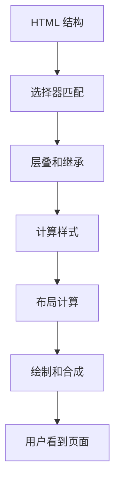
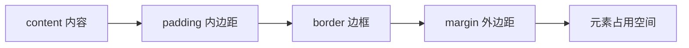
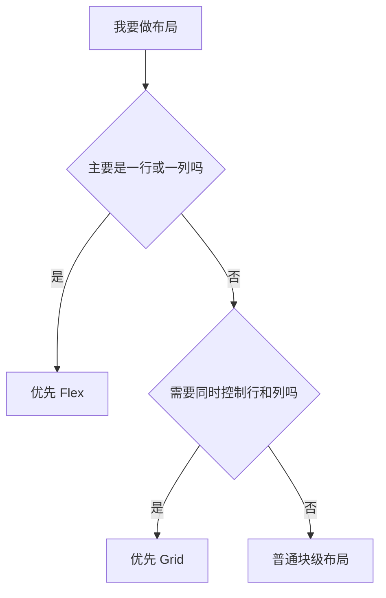
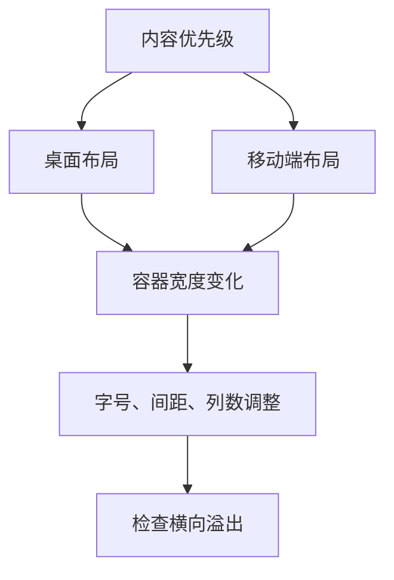
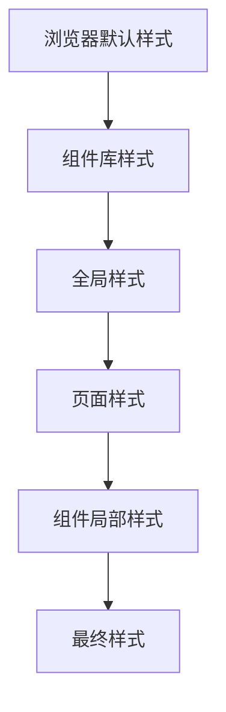
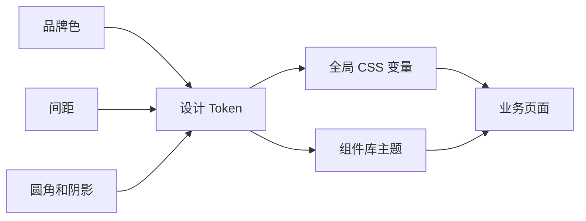
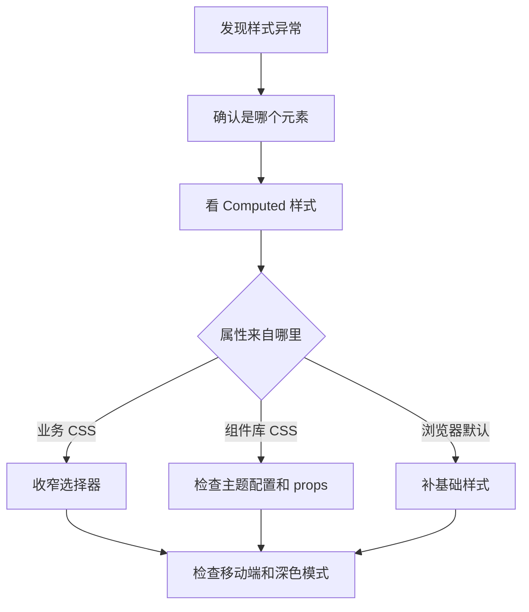

# 图解 CSS 核心概念

## 适合谁看

适合能写 CSS，但对盒模型、布局、响应式、样式层叠、组件库样式边界和排错路径还没有形成整体认识的人。

CSS 不是“记属性”。真实项目里最常见的问题是：布局为什么撑开、移动端为什么溢出、组件库为什么变形、主题变量为什么不生效。图解页先帮你建立全局视角，再进入具体章节。

## 你会学到什么

- CSS 从选择器到最终像素的大致过程。
- 盒模型、Flex、Grid 的定位。
- 响应式设计不是最后补 media query。
- 层叠、优先级和样式污染如何产生。
- 设计 token、主题和组件库样式边界如何配合。
- 样式问题应该按什么顺序排查。

## 图解目录



你写的 CSS 最终会进入浏览器的样式计算和布局流程。页面异常时，不要只盯着某个属性，要先判断问题发生在结构、选择器、层叠、布局还是渲染阶段。

## 盒模型图



初学者最容易混淆的是“元素自身尺寸”和“元素占用空间”。

| 部分 | 影响 |
| --- | --- |
| content | 内容区域，文本和图片主要在这里 |
| padding | 内容和边框之间的空间，会撑大元素 |
| border | 边框宽度也参与尺寸计算 |
| margin | 元素外部距离，不属于元素背景 |

项目中建议默认使用：

```css
* {
  box-sizing: border-box;
}
```

这样 `width` 会包含 content、padding、border，布局更容易预测。

## Flex 和 Grid 怎么选



| 场景 | 推荐 |
| --- | --- |
| 顶部工具栏 | Flex |
| 按钮组 | Flex |
| 卡片列表 | Grid |
| 仪表盘布局 | Grid |
| 表单 label + 控件 | Grid 或组件库表单布局 |
| 文章正文 | 普通文档流 |

不要把 Flex 和 Grid 当成竞争关系。Flex 适合一维分配，Grid 适合二维结构。

## 响应式不是只写断点



响应式设计先问“移动端最重要的信息是什么”，再问“断点写在哪里”。

常见策略：

- 卡片从三列变两列，再变一列。
- 工具栏按钮折行或收进菜单。
- 表格在移动端改成卡片列表或横向滚动容器。
- 固定尺寸元素设置 `flex-shrink: 0`。
- 文本容器设置合理 `min-width: 0`，防止撑开父级。

## 层叠和样式污染



组件库样式异常时，优先检查是否有宽泛选择器。

不推荐：

```css
.page button {
  height: 28px;
}

.content * {
  box-sizing: content-box;
}
```

推荐：

```css
.user-toolbar__action {
  min-height: 32px;
}

.permission-card__title {
  font-weight: 700;
}
```

业务样式要命中明确业务 class，不要依赖组件库内部 DOM 层级。

## 设计 Token 和主题变量



设计 token 的价值是让颜色、间距、圆角、阴影不散落在项目里。

建议沉淀：

| 类型 | 示例 |
| --- | --- |
| 颜色 | `--color-primary`、`--color-danger` |
| 间距 | `--space-2`、`--space-4` |
| 圆角 | `--radius-sm`、`--radius-md` |
| 阴影 | `--shadow-panel` |
| 字体 | `--font-size-body` |

如果项目使用组件库，优先通过组件库主题 token 或 CSS 变量定制，不要强行覆盖内部 class。

## CSS 排错路径



排查顺序：

1. 用 DevTools 选中异常元素。
2. 看 Computed 面板确认最终样式。
3. 找到覆盖来源。
4. 判断是业务选择器太宽、组件库主题问题，还是布局约束问题。
5. 修完后检查桌面和移动端。

## 实际项目常见问题

### 问题 1：移动端出现横向滚动

常见原因：

- 固定宽度大于视口。
- 表格或代码块没有滚动容器。
- Flex 子项没有 `min-width: 0`。
- 长单词或 URL 没有换行策略。

处理方式：

```css
.layout-main {
  min-width: 0;
}

.code-panel {
  overflow-x: auto;
}

.article-content {
  overflow-wrap: anywhere;
}
```

### 问题 2：头像、图标按钮被压扁

固定尺寸元素要禁止压缩。

```css
.user-avatar {
  width: 32px;
  height: 32px;
  flex: 0 0 32px;
  border-radius: 50%;
}
```

### 问题 3：组件库控件突然变形

优先搜索宽泛选择器：

```bash
rg "(\\.\\w+\\s+(div|span|button|\\*)|div > div|\\.\\w+ \\*)" src
```

不要直接加更高优先级覆盖。先定位污染来源。

## 下一步学习

继续学习 [盒模型与布局基础](/css/box-model-layout)、[Flex 与 Grid](/css/flex-grid)、[响应式设计](/css/responsive) 和 [项目样式架构](/css/architecture)。
