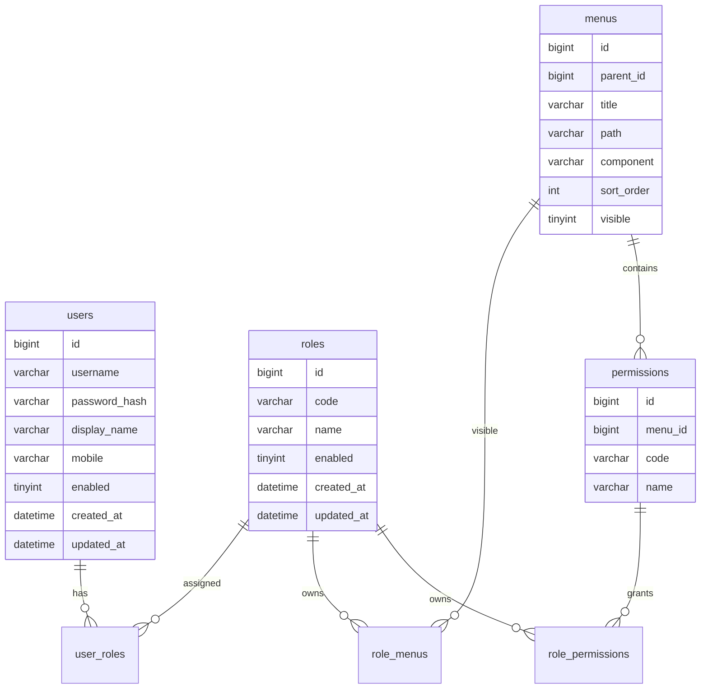
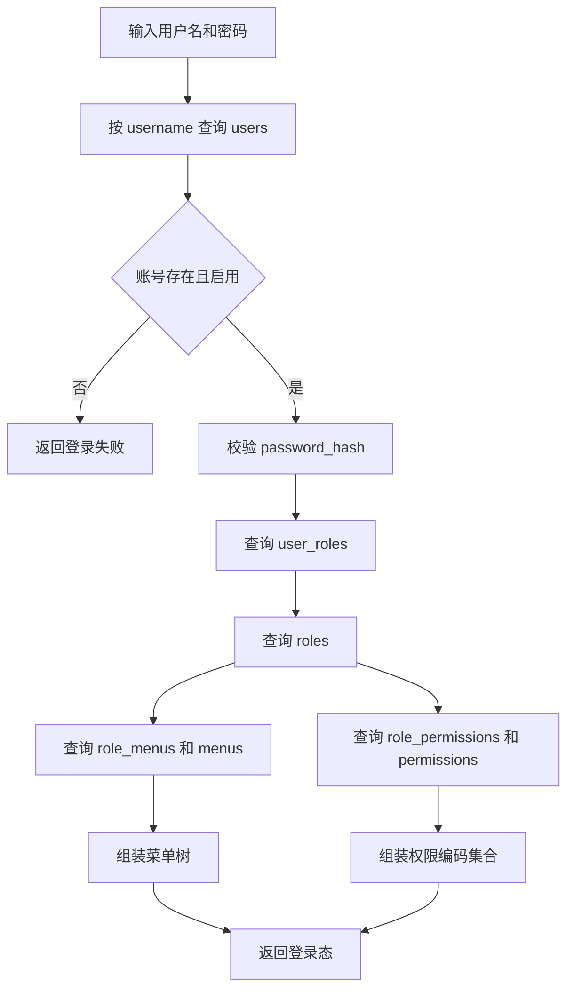
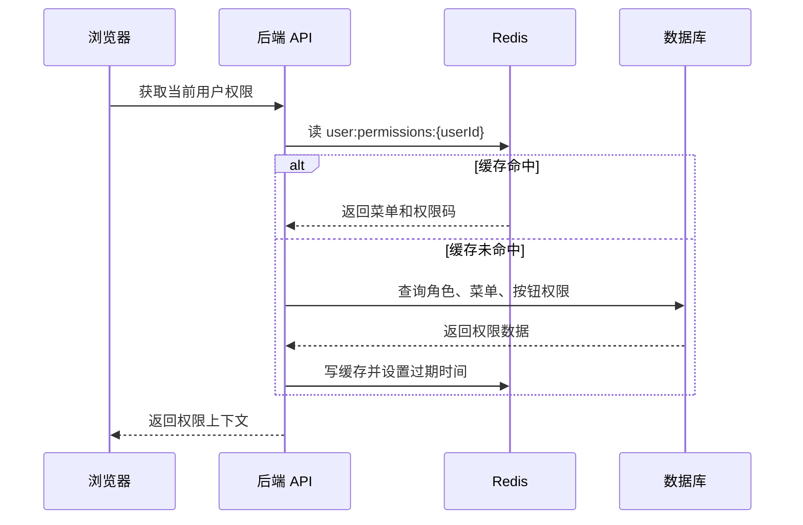

# 数据库项目落地实践

## 适合谁看

适合已经学过 MySQL、PostgreSQL、Redis、建模、索引和事务，但不知道如何把这些知识放进真实项目的人。

这篇会用一个“后台权限系统”的数据层作为案例，把表设计、字段说明、索引、迁移、种子数据、事务、缓存和排错串起来。读完后，你应该能看懂一个中小型后台项目的数据设计，也能自己为新模块设计数据库方案。

## 这篇解决什么

很多同学学数据库时会遇到一个断层：

- 能写 `SELECT`、`INSERT`、`UPDATE`。
- 知道索引、事务、缓存是什么。
- 但一到项目里，就不知道先建哪些表、字段怎么命名、索引怎么定、迁移说明怎么写。

真实项目的数据层不是“先建表再说”，而是从业务流程倒推出来：


不要跳过前面的“业务流程”和“核心对象”。如果对象没拆清楚，后面的表结构会一直返工。

## 案例背景：后台权限系统

后台权限最终要落到可查询的数据关系：用户归属租户，用户获得角色，角色拥有资源动作，数据范围再约束业务查询。

<DocFigure
  src="/images/database/permission-project.webp"
  alt="后台权限数据库从用户、用户角色、角色权限和数据范围生成带租户条件的业务查询"
  caption="前端隐藏按钮不会改变数据库查询范围；租户和数据范围必须进入最终 SQL 条件。"
  :width="1440"
  :height="900"
/>

后面的表设计会分别用唯一约束、外键、有效期与审计字段保证授权事实，而不是把权限都塞进用户表的一段 JSON。

我们设计一个最常见的企业后台权限系统，第一版包含：

- 用户管理。
- 角色管理。
- 菜单管理。
- 按钮权限。
- 用户登录后获取菜单。
- 管理员给用户分配角色。
- 管理员给角色分配菜单和按钮权限。

先不要急着写 SQL。先把业务语言翻译成数据对象。

| 业务概念 | 数据对象 | 说明 |
| --- | --- | --- |
| 员工或后台账号 | user | 能登录后台的人 |
| 岗位权限集合 | role | 一组菜单和按钮权限 |
| 页面菜单 | menu | 左侧菜单、页面路由、目录 |
| 页面按钮 | permission | 新增、编辑、删除、导出等按钮权限 |
| 用户拥有哪些角色 | user_role | 用户和角色的多对多关系 |
| 角色能看哪些菜单 | role_menu | 角色和菜单的多对多关系 |
| 角色能用哪些按钮 | role_permission | 角色和按钮权限的多对多关系 |

## 数据模型图



这个图先解决“谁和谁有关”。实际建表时还要补字段约束、索引、软删除、审计字段和迁移原因。

## 表设计顺序

建议按这个顺序设计：

1. 先设计主表：`users`、`roles`、`menus`、`permissions`。
2. 再设计关系表：`user_roles`、`role_menus`、`role_permissions`。
3. 最后补审计字段：`created_at`、`updated_at`、`created_by`、`updated_by`。
4. 如果业务要求保留历史，再增加 `deleted_at` 或独立审计日志表。

不要一开始就把所有未来功能都塞进表里。第一版只保留当前业务能确认的字段，扩展字段通过后续迁移补。

## 用户表设计

用户表保存后台账号，不保存明文密码。

```sql
CREATE TABLE users (
  id BIGINT PRIMARY KEY AUTO_INCREMENT COMMENT '用户主键，系统内部唯一标识',
  username VARCHAR(64) NOT NULL COMMENT '登录用户名，业务内唯一，不允许重复',
  password_hash VARCHAR(255) NOT NULL COMMENT '密码哈希值，禁止保存明文密码',
  display_name VARCHAR(64) NOT NULL COMMENT '后台展示姓名',
  mobile VARCHAR(32) NULL COMMENT '手机号，可为空，后续可用于二次验证',
  enabled TINYINT NOT NULL DEFAULT 1 COMMENT '账号是否启用：1 启用，0 禁用',
  created_at DATETIME NOT NULL DEFAULT CURRENT_TIMESTAMP COMMENT '创建时间',
  updated_at DATETIME NOT NULL DEFAULT CURRENT_TIMESTAMP ON UPDATE CURRENT_TIMESTAMP COMMENT '最后更新时间',
  UNIQUE KEY uk_users_username (username),
  KEY idx_users_enabled_created (enabled, created_at)
) COMMENT='后台用户表，保存可登录管理系统的账号';
```

字段设计说明：

| 字段 | 为什么需要 | 常见错误 |
| --- | --- | --- |
| `username` | 登录标识，必须唯一 | 没有唯一约束，导致两个账号同名 |
| `password_hash` | 保存密码哈希 | 保存明文密码，严重安全风险 |
| `enabled` | 禁用账号时不删除历史数据 | 直接删除账号，审计链路断掉 |
| `created_at` | 排查账号创建时间 | 没有时间字段，无法追溯 |
| `updated_at` | 排查最近修改 | 手动维护更新时间导致遗漏 |

索引说明：

- `uk_users_username` 用于登录时按用户名查找用户。
- `idx_users_enabled_created` 用于后台按启用状态筛选并按创建时间排序。

如果列表页只按 `username` 模糊搜索，普通 BTree 索引不一定能支持 `%keyword%`。不要为了模糊搜索盲目加索引，先确认查询方式。

## 角色表设计

角色是一组权限集合，推荐用稳定的 `code` 表示业务含义。

```sql
CREATE TABLE roles (
  id BIGINT PRIMARY KEY AUTO_INCREMENT COMMENT '角色主键',
  code VARCHAR(64) NOT NULL COMMENT '角色编码，例如 admin、operator、auditor，代码和配置中使用',
  name VARCHAR(64) NOT NULL COMMENT '角色名称，例如 超级管理员、运营人员、审计人员',
  description VARCHAR(255) NULL COMMENT '角色说明，描述适用岗位和权限边界',
  enabled TINYINT NOT NULL DEFAULT 1 COMMENT '角色是否启用：1 启用，0 禁用',
  created_at DATETIME NOT NULL DEFAULT CURRENT_TIMESTAMP COMMENT '创建时间',
  updated_at DATETIME NOT NULL DEFAULT CURRENT_TIMESTAMP ON UPDATE CURRENT_TIMESTAMP COMMENT '最后更新时间',
  UNIQUE KEY uk_roles_code (code),
  KEY idx_roles_enabled_created (enabled, created_at)
) COMMENT='后台角色表，用于承载一组菜单和按钮权限';
```

为什么需要 `code`：

- `id` 适合数据库关联，但不适合写进代码。
- `name` 可能被运营或管理员修改。
- `code` 稳定，适合配置默认管理员、审计角色、内置角色。

内置角色不要随便删除。更推荐通过 `enabled = 0` 禁用，或者加 `system_builtin` 字段标识系统内置。

## 菜单表设计

菜单表用于生成左侧菜单和路由。

```sql
CREATE TABLE menus (
  id BIGINT PRIMARY KEY AUTO_INCREMENT COMMENT '菜单主键',
  parent_id BIGINT NULL COMMENT '父级菜单 ID，NULL 表示顶级菜单',
  title VARCHAR(64) NOT NULL COMMENT '菜单展示名称',
  path VARCHAR(128) NOT NULL COMMENT '前端路由路径，例如 /users',
  component VARCHAR(128) NULL COMMENT '前端组件路径或组件标识，目录节点可为空',
  icon VARCHAR(64) NULL COMMENT '菜单图标标识',
  sort_order INT NOT NULL DEFAULT 0 COMMENT '同级菜单排序，数值越小越靠前',
  visible TINYINT NOT NULL DEFAULT 1 COMMENT '是否在菜单中显示：1 显示，0 隐藏但可路由访问',
  enabled TINYINT NOT NULL DEFAULT 1 COMMENT '菜单是否启用：1 启用，0 禁用',
  created_at DATETIME NOT NULL DEFAULT CURRENT_TIMESTAMP COMMENT '创建时间',
  updated_at DATETIME NOT NULL DEFAULT CURRENT_TIMESTAMP ON UPDATE CURRENT_TIMESTAMP COMMENT '最后更新时间',
  UNIQUE KEY uk_menus_path (path),
  KEY idx_menus_parent_sort (parent_id, sort_order),
  KEY idx_menus_enabled_visible (enabled, visible)
) COMMENT='后台菜单表，用于生成菜单树和动态路由';
```

`parent_id` 可以做外键，也可以只做业务约束。企业后台里如果菜单调整频繁，强外键可能让批量导入更麻烦；如果团队数据库治理成熟，外键能减少脏数据。

这里的关键索引是 `idx_menus_parent_sort`。生成菜单树时经常按父节点查子节点，并按排序字段排序。

## 按钮权限表设计

按钮权限属于具体页面。

```sql
CREATE TABLE permissions (
  id BIGINT PRIMARY KEY AUTO_INCREMENT COMMENT '按钮权限主键',
  menu_id BIGINT NOT NULL COMMENT '所属菜单 ID',
  code VARCHAR(128) NOT NULL COMMENT '权限编码，例如 user:create、user:update、user:delete',
  name VARCHAR(64) NOT NULL COMMENT '权限名称，例如 新增用户、编辑用户、删除用户',
  description VARCHAR(255) NULL COMMENT '权限说明，描述该权限允许执行的操作',
  created_at DATETIME NOT NULL DEFAULT CURRENT_TIMESTAMP COMMENT '创建时间',
  updated_at DATETIME NOT NULL DEFAULT CURRENT_TIMESTAMP ON UPDATE CURRENT_TIMESTAMP COMMENT '最后更新时间',
  UNIQUE KEY uk_permissions_code (code),
  KEY idx_permissions_menu (menu_id)
) COMMENT='后台按钮权限表，用于控制页面操作按钮和接口权限';
```

编码建议使用：

```text
业务域:动作
user:create
user:update
user:delete
role:assign-menu
```

不要使用中文作为权限编码。中文适合展示，编码要稳定、可搜索、可写入接口鉴权逻辑。

## 关系表设计

用户和角色、角色和菜单、角色和按钮都是多对多关系。

```sql
CREATE TABLE user_roles (
  user_id BIGINT NOT NULL COMMENT '用户 ID',
  role_id BIGINT NOT NULL COMMENT '角色 ID',
  created_at DATETIME NOT NULL DEFAULT CURRENT_TIMESTAMP COMMENT '绑定时间',
  PRIMARY KEY (user_id, role_id),
  KEY idx_user_roles_role (role_id)
) COMMENT='用户角色关系表，一个用户可以拥有多个角色';

CREATE TABLE role_menus (
  role_id BIGINT NOT NULL COMMENT '角色 ID',
  menu_id BIGINT NOT NULL COMMENT '菜单 ID',
  created_at DATETIME NOT NULL DEFAULT CURRENT_TIMESTAMP COMMENT '授权时间',
  PRIMARY KEY (role_id, menu_id),
  KEY idx_role_menus_menu (menu_id)
) COMMENT='角色菜单关系表，一个角色可以访问多个菜单';

CREATE TABLE role_permissions (
  role_id BIGINT NOT NULL COMMENT '角色 ID',
  permission_id BIGINT NOT NULL COMMENT '按钮权限 ID',
  created_at DATETIME NOT NULL DEFAULT CURRENT_TIMESTAMP COMMENT '授权时间',
  PRIMARY KEY (role_id, permission_id),
  KEY idx_role_permissions_permission (permission_id)
) COMMENT='角色按钮权限关系表，一个角色可以拥有多个按钮权限';
```

关系表为什么用联合主键：

- 防止重复绑定。
- 查询某个用户的角色时直接走主键前缀。
- 不需要额外自增 ID。

为什么还要给反向字段建索引：

- 删除角色前要查哪些用户绑定了这个角色。
- 删除菜单前要查哪些角色使用了这个菜单。
- 审计某个权限被哪些角色拥有时需要反向查询。

## 登录后的查询链路

用户登录后，后端通常要返回用户信息、角色、菜单树和按钮权限。



这条链路会用到这些索引：

- `users.username`。
- `user_roles.user_id`。
- `role_menus.role_id`。
- `role_permissions.role_id`。
- `menus.parent_id, sort_order`。

如果这些索引缺失，登录或刷新页面时会越来越慢。

## 角色授权的事务设计

给角色重新分配菜单和按钮权限时，最简单稳定的方式是“先删后插”，但必须放在事务里。

```ts
await db.transaction(async (tx) => {
  await tx.roleMenu.deleteMany({
    where: { roleId }
  })

  await tx.roleMenu.createMany({
    data: menuIds.map((menuId) => ({
      roleId,
      menuId
    })),
    skipDuplicates: true
  })

  await tx.rolePermission.deleteMany({
    where: { roleId }
  })

  await tx.rolePermission.createMany({
    data: permissionIds.map((permissionId) => ({
      roleId,
      permissionId
    })),
    skipDuplicates: true
  })
})
```

这段代码要注意：

- 事务中只做数据库写入，不要调用远程接口。
- `roleId` 必须先确认存在。
- `menuIds` 和 `permissionIds` 要校验是否都存在。
- 保存成功后删除权限缓存。
- 操作人、操作前后差异要写审计日志。

如果没有事务，可能出现菜单更新成功、按钮权限更新失败，角色权限就会变成半更新状态。

## 权限缓存设计

权限数据读多写少，可以缓存。



缓存 key 示例：

```ts
function userPermissionCacheKey(userId: number) {
  return `admin:user-permissions:${userId}`
}

function rolePermissionVersionKey(roleId: number) {
  return `admin:role-permission-version:${roleId}`
}
```

第一版可以简单处理：

- 用户登录后缓存用户权限，设置 10 到 30 分钟过期。
- 修改用户角色后删除该用户权限缓存。
- 修改角色权限后删除拥有该角色的用户权限缓存。

规模变大后再考虑权限版本号、消息通知和批量失效。

## 迁移说明怎么写

迁移脚本不应该只有 SQL，还要有说明。建议每次建表或改表都写清楚：

```text
变更目的：
新增后台权限系统基础表，用于支持用户、角色、菜单和按钮权限。

影响范围：
新增 users、roles、menus、permissions、user_roles、role_menus、role_permissions。

数据约束：
username 唯一；role code 唯一；menu path 唯一；permission code 唯一。
关系表使用联合主键，避免重复绑定。

索引原因：
登录按 username 查询；权限加载按 user_id 和 role_id 查询；菜单树按 parent_id + sort_order 查询。

回滚策略：
如果未上线业务数据，可删除新增表。
如果已经上线并产生数据，不允许直接 drop，需要先导出备份并确认回滚方案。
```

这类说明能让半年后的维护者知道“当时为什么这样建”。

## 种子数据

权限系统通常需要内置菜单和超级管理员角色。

```sql
INSERT INTO roles (code, name, description)
VALUES ('admin', '超级管理员', '系统内置角色，拥有全部后台权限');

INSERT INTO menus (title, path, component, sort_order)
VALUES
  ('系统管理', '/system', NULL, 10),
  ('用户管理', '/system/users', 'system/users/index', 11),
  ('角色管理', '/system/roles', 'system/roles/index', 12);

INSERT INTO permissions (menu_id, code, name)
VALUES
  (2, 'user:create', '新增用户'),
  (2, 'user:update', '编辑用户'),
  (2, 'user:delete', '删除用户'),
  (3, 'role:assign-menu', '分配菜单权限');
```

实际项目中不要硬编码 `menu_id = 2`。更稳妥的做法是按 `path` 查到菜单 ID 后再插入按钮权限。

种子数据要满足两个要求：

- 可重复执行，不产生重复数据。
- 变更可追踪，知道哪个版本新增了哪个菜单或权限。

## 接口和表的关系

把接口先列出来，再检查是否有对应表和索引。

| 接口 | 使用的表 | 需要的索引 |
| --- | --- | --- |
| 登录 | users、user_roles、roles、role_menus、menus、role_permissions、permissions | users.username、user_roles.user_id、role_menus.role_id |
| 用户列表 | users | enabled + created_at、username 视查询方式决定 |
| 创建用户 | users、user_roles | users.username 唯一、user_roles 联合主键 |
| 修改用户角色 | users、user_roles | user_roles.user_id、user_roles.role_id |
| 菜单树 | menus | parent_id + sort_order |
| 修改角色权限 | roles、role_menus、role_permissions | role_menus.role_id、role_permissions.role_id |

如果接口和索引没有对应关系，后续数据量一大就会出现慢查询。

## 实际项目常见问题

### 问题 1：角色删除后，用户还带着旧权限

根因通常是：

- 删除角色时没有清理 `user_roles`。
- 用户权限缓存没有失效。
- 前端 Pinia 里仍保存旧菜单。

处理顺序：

1. 数据库事务中删除角色关系。
2. 删除相关用户权限缓存。
3. 让前端刷新用户上下文。
4. 记录审计日志。

### 问题 2：按钮权限只在前端隐藏，接口仍然能调用

前端隐藏按钮只能优化体验，不能替代后端鉴权。

后端每个敏感接口都要检查权限码：

```ts
await requirePermission(currentUser.id, 'user:delete')
```

否则用户可以直接通过 Network 或脚本调用接口。

### 问题 3：菜单 path 被修改后，用户收藏链接失效

菜单 `path` 是用户可见链接，也是前端路由契约。修改前要确认：

- 是否有旧链接需要兼容。
- 是否要做路由重定向。
- 是否影响权限编码。
- 是否影响菜单缓存。

重要菜单路径不要频繁修改。确实要改时，作为一次兼容性变更处理。

### 问题 4：权限更新后部分用户仍看到旧菜单

常见原因：

- Redis 权限缓存没删。
- 浏览器仍保存旧用户上下文。
- 多个后端实例中有本地内存缓存。

第一版建议不要使用本地内存缓存权限。使用 Redis 时，修改权限后必须删除相关用户缓存。

## 上线前检查清单

| 检查项 | 怎么检查 |
| --- | --- |
| 表注释是否完整 | 查看建表 SQL，确认表和字段都有业务说明 |
| 唯一约束是否存在 | username、role code、menu path、permission code |
| 关系表是否防重复 | 是否使用联合主键或唯一索引 |
| 登录链路索引是否存在 | username、user_id、role_id 查询是否走索引 |
| 事务是否覆盖完整 | 分配权限是否存在半更新风险 |
| 缓存是否会失效 | 修改角色、菜单、用户角色后是否删除权限缓存 |
| 审计日志是否记录 | 谁在什么时间改了什么权限 |
| 种子数据是否可重复执行 | 重跑 migration/seed 是否产生重复菜单 |
| 回滚是否明确 | 已上线数据是否禁止直接 drop |

## 学完后你应该能做到

你不需要一开始就设计出大型权限平台，但至少应该能做到：

- 从业务对象推导表结构。
- 写出字段、约束、索引和注释。
- 解释每个索引对应哪个接口。
- 把多表写入放进事务。
- 判断哪些数据可以缓存，哪些缓存必须失效。
- 为迁移写清楚变更目的、影响范围和回滚策略。

## 下一步学习

下一步可以继续学习 [索引与查询优化](/database/indexes)、[事务、锁与并发](/database/transactions) 和 [数据库与缓存问题](/projects/issues-database)。
