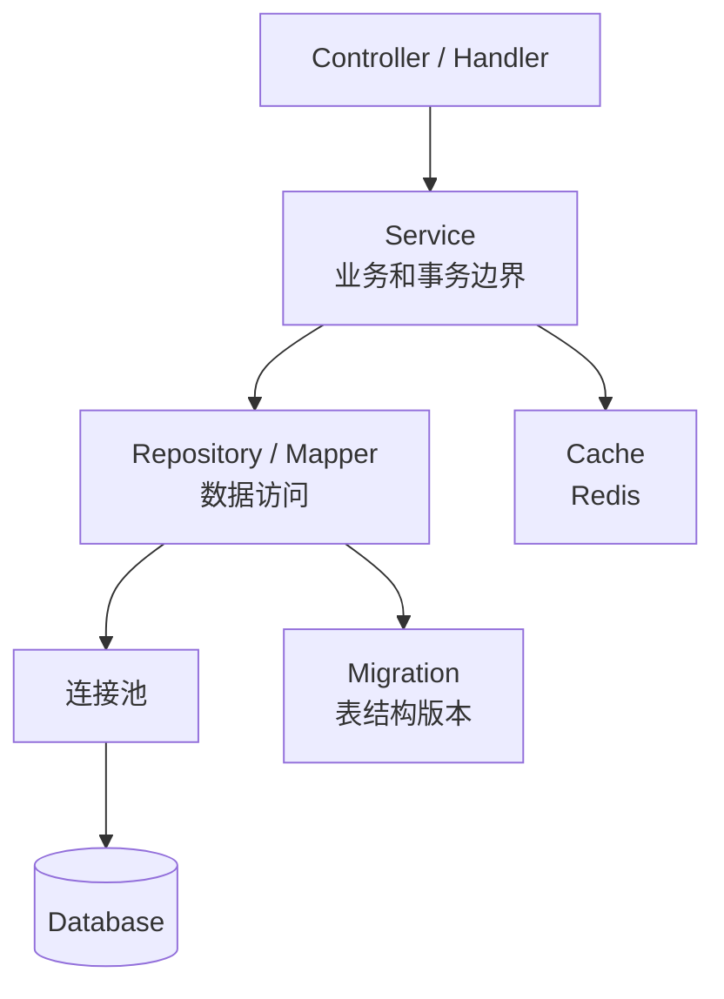
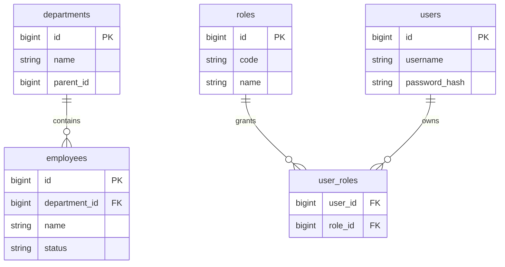
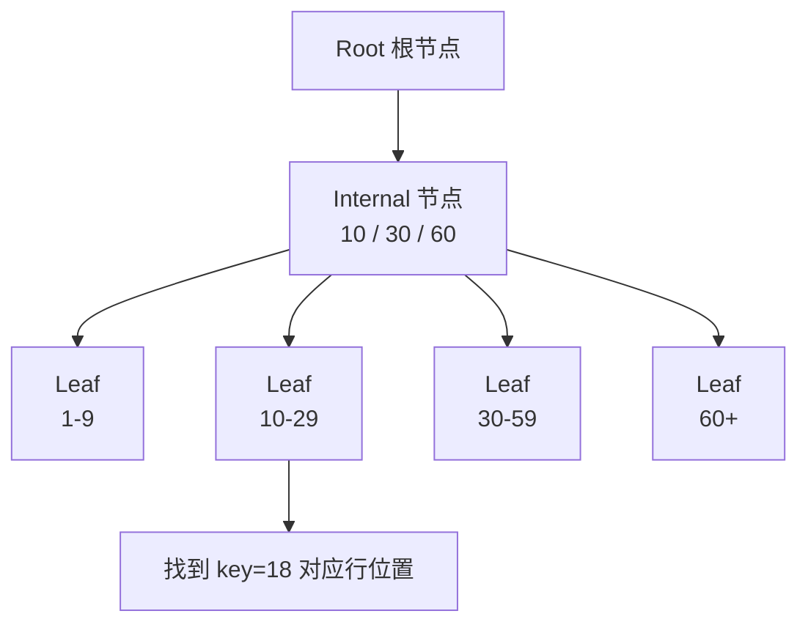
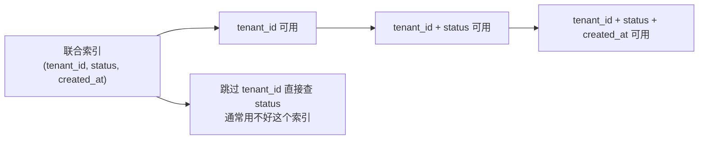
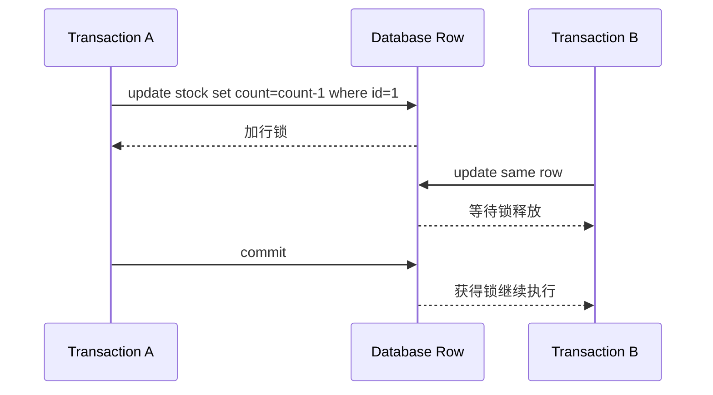
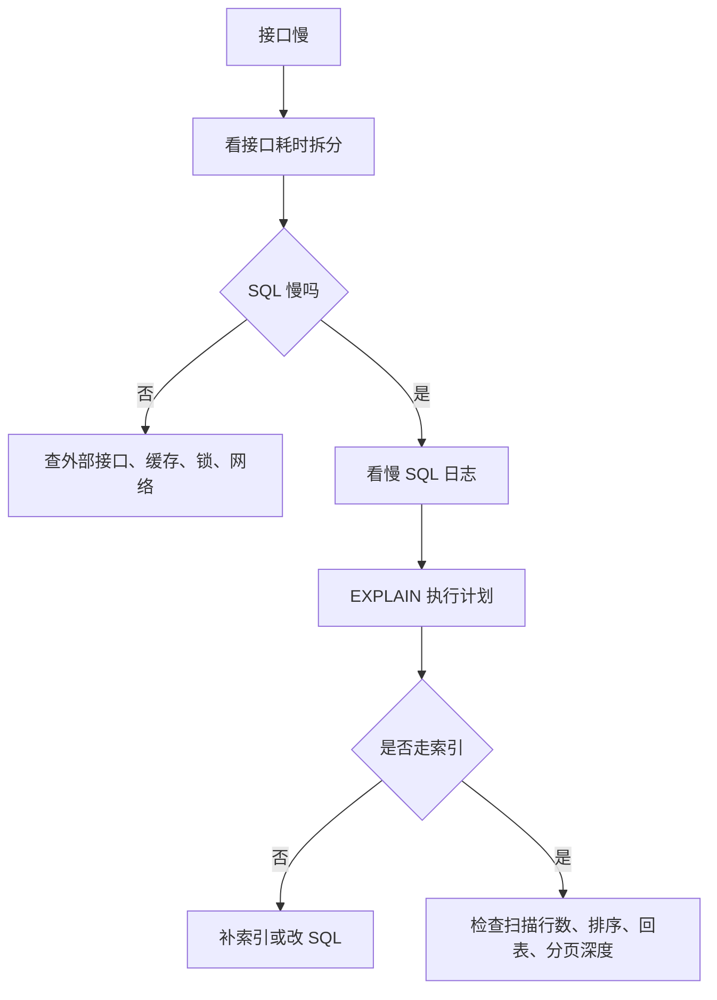
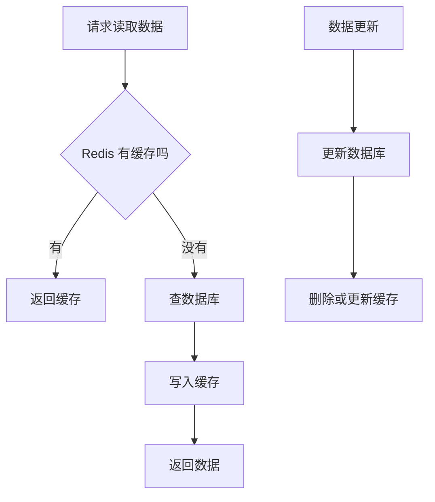
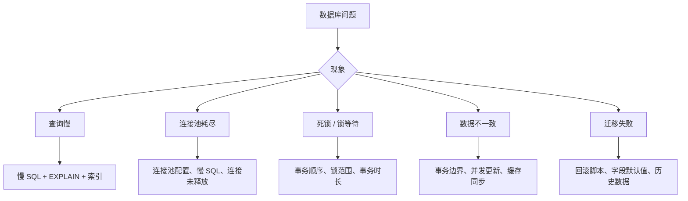

# 图解数据库核心概念

## 这个页面解决什么

数据库文档如果只讲 SQL 语法，很难解决真实项目问题。实际开发更需要理解：表怎么设计、索引怎么工作、事务为什么会锁、慢查询怎么定位、缓存和数据库如何配合。

## 适合谁看

适合已经能写增删改查，但对表关系、索引、事务锁、慢查询、缓存一致性和数据库排错还缺少整体模型的人。

## 一张图理解后端如何访问数据库

关键理解：

- Service 决定业务动作和事务边界。
- Repository/Mapper 负责 SQL 和数据映射。
- 连接池负责复用数据库连接。
- 迁移脚本负责表结构变更可追踪。

## 一张图理解表设计

设计表时要先回答：

- 这个表代表什么业务对象。
- 主键是什么。
- 哪些字段必须唯一。
- 哪些字段可以为空。
- 和其他表是什么关系。
- 查询最常按什么条件过滤。

## 一张图理解 B+Tree 索引查找

索引不是“越多越好”。它能加快查询，但会增加写入成本和存储成本。

适合建索引：

- 高频查询条件。
- 高频排序字段。
- join 字段。
- 唯一约束字段。

不适合盲目建索引：

- 区分度很低的字段。
- 很少查询的字段。
- 频繁更新的大字段。

## 一张图理解联合索引最左前缀

如果索引是 `(tenant_id, status, created_at)`，查询最好从 `tenant_id` 开始。跳过最左列，数据库很可能无法充分利用索引。

## 一张图理解事务隔离和锁

事务越长，锁持有越久。不要在事务中做：

- 外部 HTTP 调用。
- 大文件处理。
- 人工确认等待。
- 大批量无分页处理。

## 一张图理解慢查询排查

慢查询不要靠猜。至少要看：

- SQL 文本。
- 参数。
- 执行耗时。
- 扫描行数。
- 执行计划。
- 表数据量。

## 一张图理解缓存和数据库

缓存不能替代数据库一致性。常见策略：

- 读多写少：查询缓存，更新后删除缓存。
- 热点数据：设置过期时间和防击穿。
- 强一致场景：谨慎使用缓存，或引入版本号。

## 一张图理解数据库问题定位

## 下一步学习

继续学习 [数据建模与表设计](/database/modeling)，或进入 [索引与查询优化](/database/indexes)。
