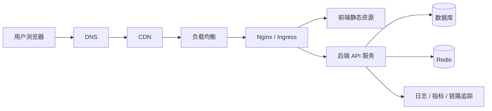
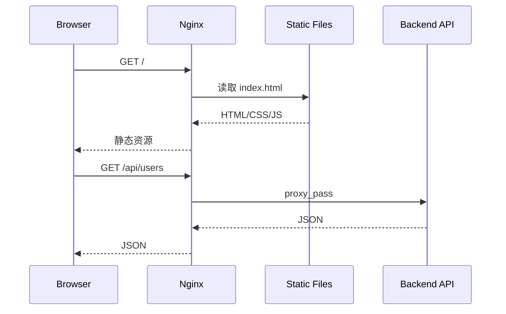
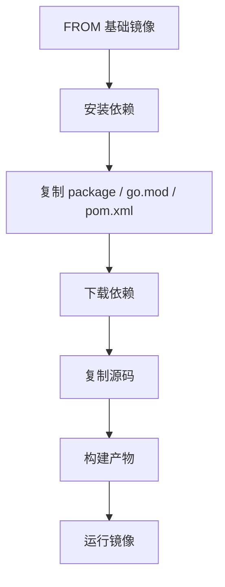
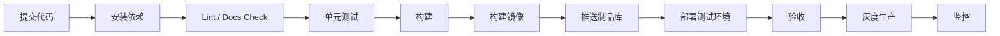
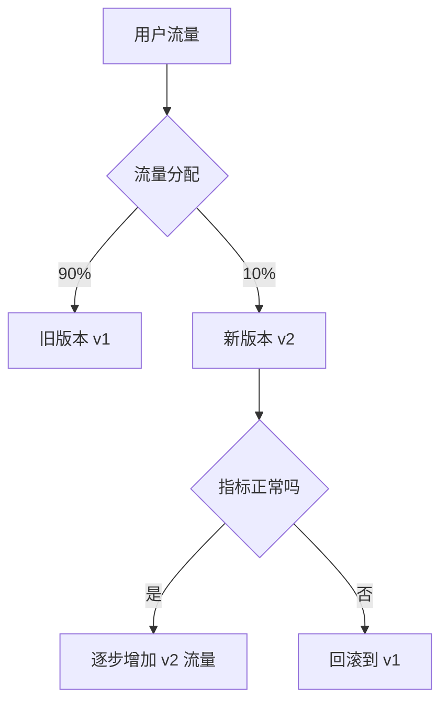
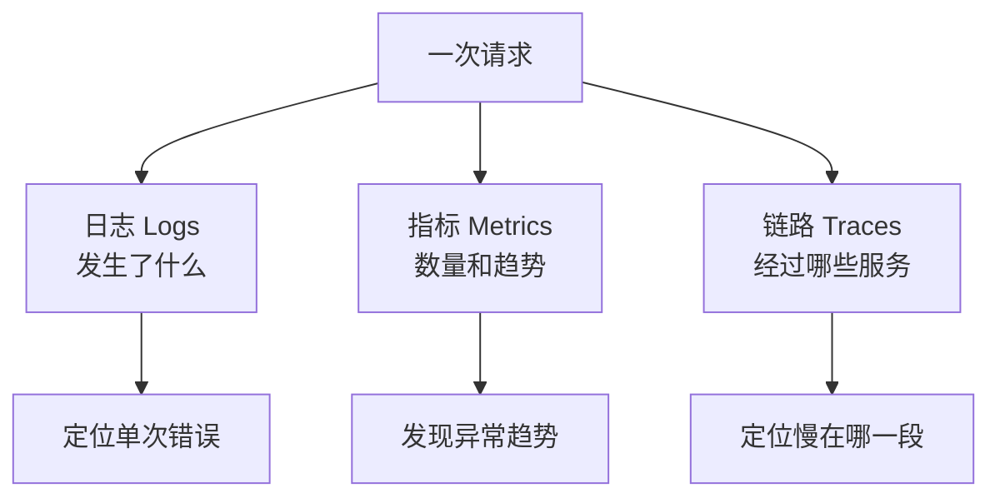
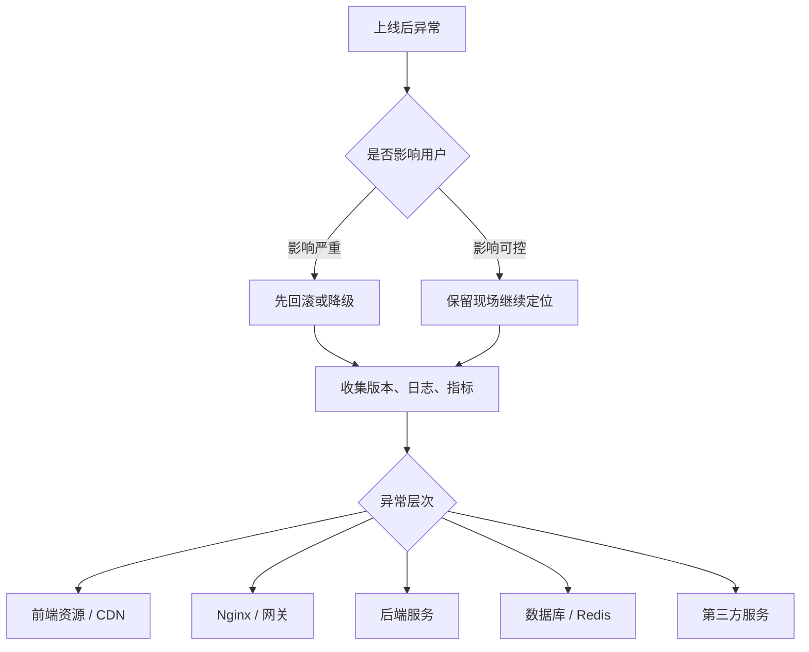

# 图解 DevOps 核心概念

## 这个页面解决什么

DevOps 容易被误解成“会点 Linux、Docker、Nginx 命令”。真实项目里更重要的是理解请求如何到达服务、镜像如何构建、发布如何灰度、出了问题如何回滚。

## 适合谁看

适合已经能完成项目开发，但对服务器、Nginx、Docker、CI/CD、灰度发布、监控和线上排错缺少全链路理解的人。

## 一张图理解线上请求链路

排查线上问题时，要先判断请求卡在哪一层：

- 域名解析。
- CDN 缓存。
- Nginx 代理。
- 前端静态资源。
- 后端接口。
- 数据库或缓存。

## 一张图理解 Nginx 反向代理

常见问题：

- `base` 路径不对导致资源 404。
- API 代理路径多一段或少一段。
- 刷新页面 404，没有回退到 `index.html`。
- 缓存策略导致旧前端资源没更新。

## 一张图理解 Docker 镜像分层

镜像优化的关键：

- 依赖层和源码层分开，提升缓存命中。
- 多阶段构建，只把产物放进运行镜像。
- 不把 `.env`、密钥、无关文件打进镜像。
- 镜像标签要能追踪 commit。

## 一张图理解 CI/CD

CI/CD 的目标不是“自动点发布”，而是让每一步都可重复、可追踪、可回滚。

## 一张图理解蓝绿发布和灰度发布

灰度时至少观察：

- 错误率。
- 接口延迟。
- 业务转化。
- 日志异常。
- 数据库慢查询。
- 资源使用率。

## 一张图理解可观测性

日志、指标、链路追踪解决的问题不同：

- 日志适合看单次请求细节。
- 指标适合看趋势和告警。
- 链路追踪适合看跨服务耗时。

## 一张图理解上线故障排查

上线排查原则：

1. 先止血。
2. 再保留证据。
3. 再定位根因。
4. 最后补测试、监控和复盘。

## 下一步学习

继续学习 [Linux 与 Shell 基础](/devops/linux-shell)，或进入 [Nginx 静态部署与代理](/devops/nginx)。
