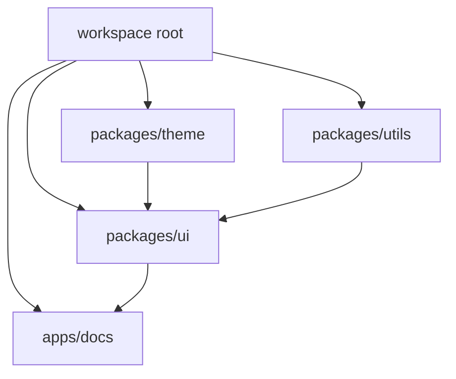
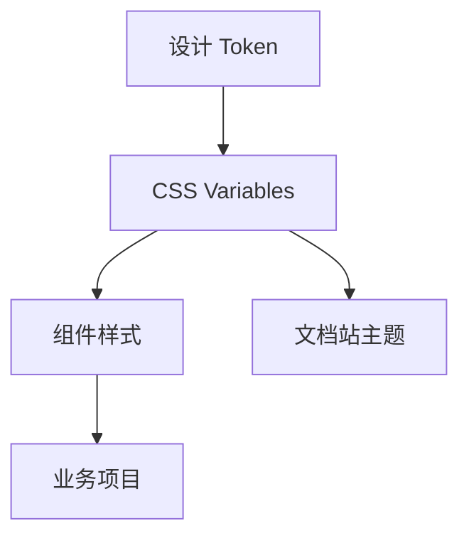
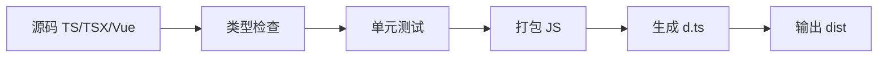
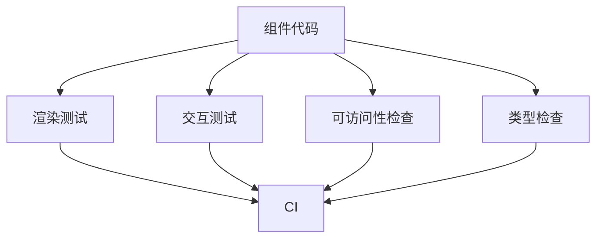
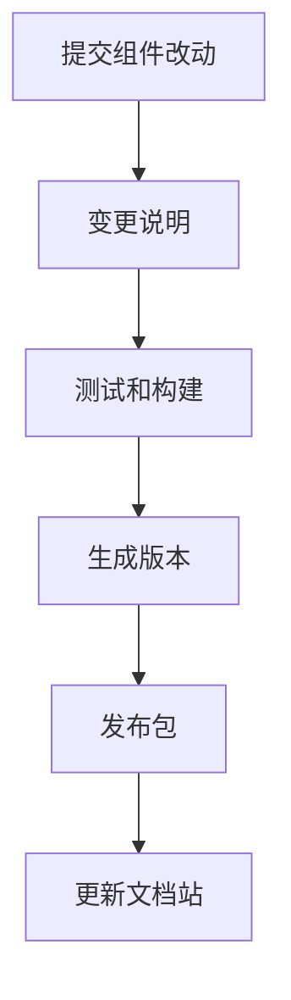

# 组件库工程从零到项目

## 适合谁看

适合已经会写业务组件，但想把按钮、表单、弹窗、表格、主题和文档整理成团队可复用组件库的人。

组件库工程不是“把组件复制到一个 packages 目录”。它要解决组件 API、样式边界、主题 token、测试、构建、文档、版本和发布治理。

## 项目目标

第一版组件库包含：

- Monorepo 工作区。
- `@team/ui` 组件包。
- `@team/theme` 主题 token。
- 文档站或示例站。
- Button、Input、Dialog、TableToolbar 等基础组件。
- TypeScript 类型声明。
- 单元测试和基础可访问性检查。
- 构建产物。
- 版本发布说明。

## 整体结构



推荐目录：

```text
.
├─ apps/
│  └─ docs/
├─ packages/
│  ├─ ui/
│  │  ├─ src/
│  │  │  ├─ button/
│  │  │  ├─ dialog/
│  │  │  ├─ input/
│  │  │  └─ index.ts
│  │  └─ package.json
│  ├─ theme/
│  │  ├─ src/tokens.css
│  │  └─ package.json
│  └─ utils/
├─ package.json
├─ pnpm-workspace.yaml
└─ tsconfig.base.json
```

## 组件 API 设计

组件 API 要稳定、少而清晰。

以 Button 为例：

```ts
export interface ButtonProps {
  variant?: 'primary' | 'secondary' | 'danger'
  size?: 'sm' | 'md' | 'lg'
  disabled?: boolean
  loading?: boolean
  type?: 'button' | 'submit' | 'reset'
}
```

API 设计原则：

| 原则 | 说明 |
| --- | --- |
| 少即是多 | 第一版不要暴露过多 props |
| 语义优先 | `variant="danger"` 比 `red` 更稳定 |
| 可组合 | 图标、文本、loading 状态要能组合 |
| 可访问 | disabled、focus、aria 不能缺 |
| 可测试 | 状态变化可以通过 DOM 行为验证 |

## 样式和主题边界



不要让组件样式依赖业务页面 class。组件库只依赖自己的 class 和 token。

```css
.ui-button {
  display: inline-flex;
  align-items: center;
  justify-content: center;
  min-height: var(--ui-control-height-md);
  border-radius: var(--ui-radius-md);
}

.ui-button--primary {
  background: var(--ui-color-primary);
  color: var(--ui-color-on-primary);
}
```

不要写：

```css
.admin-page .ui-button span {
  font-size: 12px;
}
```

业务项目如果需要不同风格，应该通过主题 token 或组件 props 控制。

## 构建流程



组件库构建产物至少包含：

- ESM 入口。
- 类型声明。
- 样式文件。
- package exports。

`package.json` 示例：

```json
{
  "name": "@team/ui",
  "type": "module",
  "main": "./dist/index.cjs",
  "module": "./dist/index.js",
  "types": "./dist/index.d.ts",
  "exports": {
    ".": {
      "types": "./dist/index.d.ts",
      "import": "./dist/index.js"
    },
    "./style.css": "./dist/style.css"
  }
}
```

## 文档站内容

每个组件文档至少包含：

- 组件用途。
- 什么时候使用。
- 基础示例。
- 变体示例。
- Props 表。
- 事件或回调。
- 可访问性说明。
- 常见错误。

文档结构建议：

```text
docs/
├─ introduction.md
├─ theme.md
├─ components/
│  ├─ button.md
│  ├─ input.md
│  └─ dialog.md
└─ changelog.md
```

## 组件测试



Button 至少测试：

- 默认渲染。
- variant class。
- disabled 状态不能点击。
- loading 状态显示。
- `type="submit"` 能传递。

Dialog 至少测试：

- 打开和关闭。
- ESC 关闭。
- 焦点不丢失。
- title 和 aria 属性存在。

## 版本和发布



版本说明要写清：

- 新增了什么。
- 修复了什么。
- 是否有 breaking change。
- 业务项目是否需要改代码。

组件库升级最怕“看起来只是样式改动”，实际影响业务页面布局。每次改全局 token、组件尺寸、DOM 结构、props 默认值，都要重点说明。

## 验收清单

- Monorepo 能一条命令安装和启动。
- 组件包能单独构建。
- 文档站能展示所有基础组件。
- 组件样式不污染业务页面。
- 主题 token 集中管理。
- TypeScript 类型声明正确生成。
- 关键组件有测试。
- README 写清安装、使用、开发、构建和发布。
- CHANGELOG 记录版本变化。

## 实际项目常见问题

### 问题 1：业务项目覆盖组件库内部 DOM

根因通常是组件 API 不够用，业务只好写内部选择器。优先补组件 props、slot 或 token，而不是鼓励业务覆盖内部 DOM。

### 问题 2：组件库升级导致业务页面错位

检查组件尺寸、display、gap、默认 margin、DOM 结构和 token 是否变化。升级前要在示例站和关键业务页做回归。

### 问题 3：文档和组件行为不一致

文档示例应该直接引用组件真实代码，不要复制一份伪实现。每次组件行为变化同步更新文档。

## 下一步学习

继续学习 [Monorepo 项目组织](/engineering/monorepo)、[代码规范](/engineering/eslint-prettier)、[测试策略](/engineering/testing)、[包体积分析](/engineering/bundle-analysis) 和 [项目样式架构](/css/architecture)。
