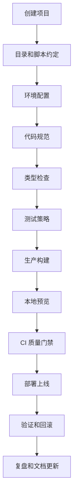
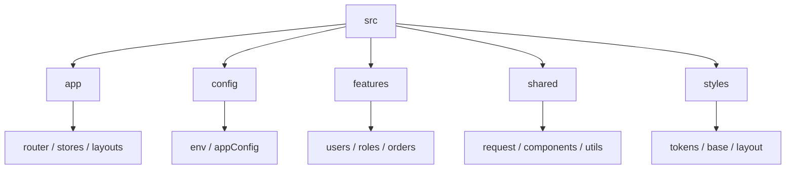
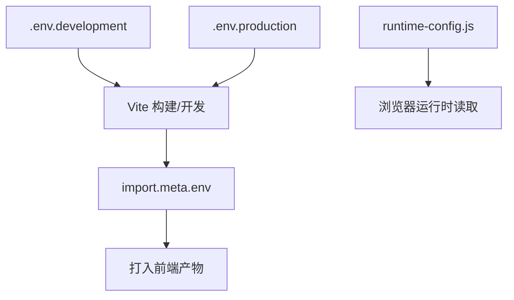
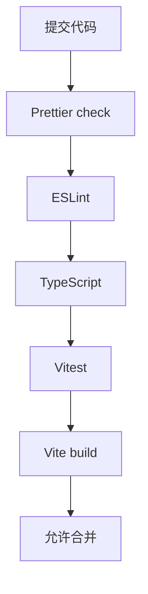
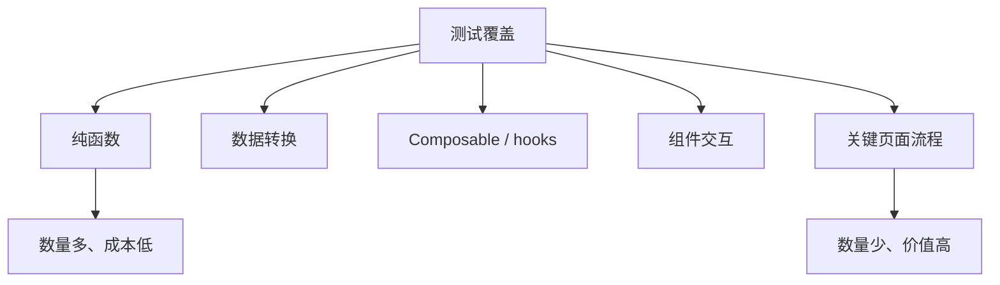
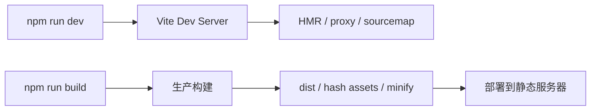
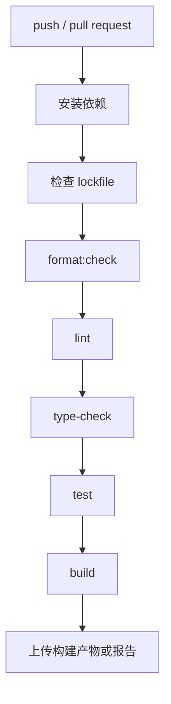
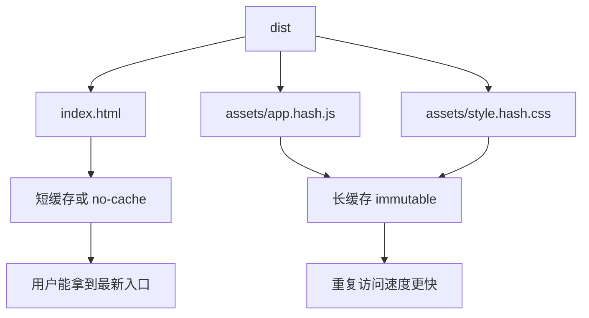
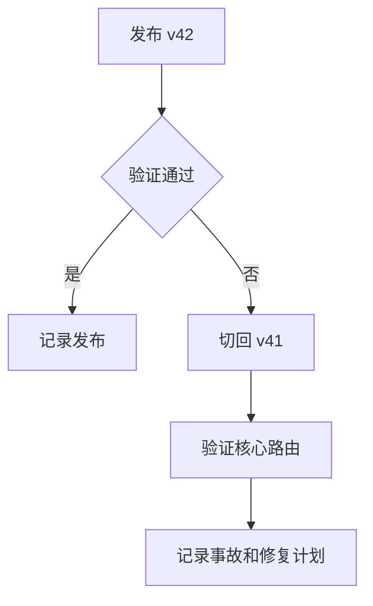
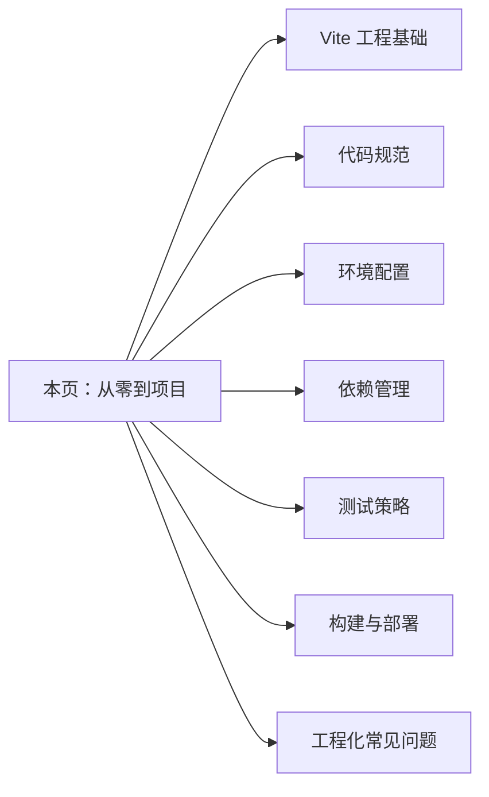

# 前端工程化从零到项目落地

## 这个页面解决什么

很多人学前端工程化时，会分别看 Vite、ESLint、Prettier、TypeScript、环境变量、测试、构建和部署，但真正做项目时仍然会卡在这些问题上：

- 项目能跑，但目录、脚本、环境和 README 没有统一约定。
- 开发环境正常，测试环境和生产环境接口地址错了。
- ESLint、Prettier、TypeScript、测试、构建各自能跑，但没有形成质量门禁。
- 依赖升级后 CI 失败，本地却复现不了。
- 构建产物上线后刷新 404、缓存旧文件、回滚困难。
- 新人加入项目时，不知道从哪里启动、如何联调、提交前要跑哪些命令。

这一页用一个“Vue Admin 工程骨架”项目，把前端工程化从创建项目、目录约定、环境配置、规范、测试、构建、预览、CI、部署和回滚串成完整流程。目标不是装很多工具，而是让项目能长期稳定协作和交付。

## 适合谁看

适合已经能写 Vue 或 React 页面，但准备进入真实团队项目的人：

- 会用 Vite 启动项目，但不清楚 dev 和 build 的差异。
- 写过 ESLint、Prettier、Vitest 配置，但不知道怎么放进团队流程。
- 做过 `.env.development`，但不确定构建时变量和运行时配置的区别。
- 遇到过本地能跑、CI 或生产失败的问题。
- 想让项目具备 README、质量门禁、部署清单和回滚记录。

如果你还没有工程化基础，先看 [前端工程化学习导览](/engineering/introduction)、[图解前端工程化核心概念](/engineering/visual-guide) 和 [Vite 工程基础](/engineering/vite)。

## 项目目标

本页要落地的是一个最小但完整的前端工程项目，不是一个只会显示页面的 demo。

| 能力 | 最小要求 | 验收方式 |
| --- | --- | --- |
| 创建项目 | Vite + TypeScript + Vue 或 React | `npm run dev` 能启动 |
| 目录约定 | app、features、shared、styles、tests 边界清楚 | README 能解释目录职责 |
| 环境配置 | dev、test、staging、production 有明确配置来源 | 页面能显示当前环境和 API 地址 |
| 代码规范 | ESLint + Prettier + TypeScript | `lint`、`format:check`、`type-check` 通过 |
| 测试 | 核心纯函数、请求转换、组件交互有测试 | `test` 通过 |
| 构建 | 生产构建能输出可部署产物 | `build` 通过 |
| 预览 | 本地预览生产产物 | `preview` 可访问 |
| CI | 安装、检查、测试、构建流水线清楚 | CI 失败能定位步骤 |
| 部署 | assets 缓存、路由 fallback、版本号 | 上线后刷新路由不 404 |
| 回滚 | 保留版本、回滚步骤、发布记录 | `RELEASE_CHECKLIST.md` 有记录 |

## 总体流程图

工程交付从静态检查开始，经过测试、构建、预览验收和渐进发布。每一阶段都必须关联同一个提交与产物，失败时阻止后续阶段。

<DocFigure
  src="/images/engineering/project-pipeline.webp"
  alt="前端工程流水线依次执行静态检查、自动测试、构建产物、预览验收和渐进发布"
  caption="构建成功只是中间结果；版本、产物、审批、监控和回滚记录共同组成交付证据。"
  :width="1440"
  :height="900"
/>

后面的每个阶段都会补对应命令和交付物，避免 CI 只显示一个无法追溯环境与产物的绿色勾。



这条链路的重点是：每一步都要有命令、文档和验收标准。工程化不是“配置文件越多越专业”，而是让问题能被稳定发现、定位和修复。

## 第一阶段：创建项目

### 技术选择

本页以 Vite + TypeScript + Vue 为例。Vite 官方文档把 dev server 和 production build 区分得很清楚：开发阶段强调快速启动和 HMR，构建阶段输出可部署静态产物。

推荐起步栈：

| 能力 | 推荐 |
| --- | --- |
| 构建工具 | Vite |
| 语言 | TypeScript |
| 前端框架 | Vue 3 或 React |
| 包管理器 | npm、pnpm 或团队统一工具 |
| 单元测试 | Vitest |
| 代码检查 | ESLint |
| 格式化 | Prettier |
| 类型检查 | vue-tsc 或 tsc |

### 初始化命令

```bash
npm create vite@latest admin-engineering-demo -- --template vue-ts
cd admin-engineering-demo
npm install
npm run dev
```

项目创建后，不要马上写业务页面。先补工程骨架。

### 最小脚本

```json
{
  "scripts": {
    "dev": "vite",
    "type-check": "vue-tsc --noEmit",
    "lint": "eslint .",
    "format": "prettier --write .",
    "format:check": "prettier --check .",
    "test": "vitest run",
    "test:watch": "vitest",
    "build": "vite build",
    "preview": "vite preview"
  }
}
```

脚本名称要少而清楚。团队里最重要的是大家都知道提交前跑什么，CI 跑什么，发布前跑什么。

## 第二阶段：目录结构

### 推荐目录

```text
admin-engineering-demo/
  README.md
  RELEASE_CHECKLIST.md
  package.json
  vite.config.ts
  tsconfig.json
  eslint.config.js
  prettier.config.js
  .env.development
  .env.test
  .env.staging
  .env.production
  src/
    app/
      main.ts
      router/
      stores/
      layouts/
    config/
      appConfig.ts
      env.ts
    features/
      users/
    shared/
      request/
      components/
      utils/
    styles/
      index.css
  tests/
    setup.ts
```

### 目录职责

| 目录 | 放什么 | 不应该放什么 |
| --- | --- | --- |
| `src/app` | 应用入口、路由、全局状态、布局 | 具体业务模块实现 |
| `src/config` | 环境变量读取、运行时配置、应用配置 | 组件里散落的 `import.meta.env` |
| `src/features` | 按业务聚合页面、组件、service、types | 全站通用工具 |
| `src/shared` | 请求、基础组件、工具函数、常量 | 某个业务模块专属状态 |
| `src/styles` | 全局样式、token、布局样式 | 组件库内部 DOM 覆盖 |
| `tests` | 测试配置、集成测试辅助 | 生产代码 |

### 目录关系图



工程化目录的目标不是“看起来分层”，而是让新人能预测文件放哪里、问题从哪里查。

## 第三阶段：环境配置

### 构建时变量和运行时配置

Vite 官方文档说明，Vite 会把特定环境常量暴露在 `import.meta.env` 上，并在构建时静态替换。也就是说，Vite 环境变量不是浏览器运行时动态读取的服务器环境变量。



### 推荐 `.env`

```env
VITE_APP_NAME=Admin Engineering Demo
VITE_API_BASE_URL=/api
VITE_APP_ENV=development
VITE_ENABLE_MOCK=true
```

只有以 `VITE_` 开头的变量会暴露给前端代码。不要把数据库密码、后端密钥、云服务密钥放进前端 `.env`。

### 集中读取配置

```ts
export interface AppConfig {
  appName: string
  appEnv: 'development' | 'test' | 'staging' | 'production'
  apiBaseUrl: string
  enableMock: boolean
}

export const appConfig: AppConfig = {
  appName: import.meta.env.VITE_APP_NAME,
  appEnv: import.meta.env.VITE_APP_ENV,
  apiBaseUrl: import.meta.env.VITE_API_BASE_URL,
  enableMock: import.meta.env.VITE_ENABLE_MOCK === 'true'
}
```

业务组件不要直接读取 `import.meta.env`。统一经过配置模块，后续才能做校验、兜底、运行时配置和测试替换。

### 环境配置验收

| 检查项 | 标准 |
| --- | --- |
| dev/test/prod | 每个环境有明确 API 来源 |
| 变量命名 | 前端变量统一 `VITE_` 前缀 |
| 敏感信息 | 前端环境变量没有密钥 |
| 配置读取 | 组件不散落读取 `import.meta.env` |
| 构建验证 | 不同 mode 构建后能确认配置来源 |

## 第四阶段：代码规范

### 工具分工

ESLint 官方文档把 ESLint 定义为识别和报告 JavaScript 代码模式的工具，目标是让代码更一致并避免问题。Prettier 官方文档强调它是 opinionated formatter，会重新打印代码来保持一致格式。两者不要混用职责：

| 工具 | 负责 | 不负责 |
| --- | --- | --- |
| ESLint | 代码质量、潜在错误、最佳实践 | 大量格式细节 |
| Prettier | 统一格式化 | 判断业务逻辑是否合理 |
| TypeScript | 类型边界、接口约束、编译期检查 | 运行时接口真实性 |

### 质量门禁图



### 推荐提交前命令

```bash
npm run format:check
npm run lint
npm run type-check
npm run test
npm run build
```

如果项目很大，可以在本地做增量检查，在 CI 做全量检查。但第一次建立项目时，先把全量命令跑通。

### 常见规范误区

| 误区 | 后果 | 修正 |
| --- | --- | --- |
| 只装 Prettier 不装 ESLint | 格式统一，但低级代码问题发现不了 | 两者都保留 |
| ESLint 规则过严 | 团队大量时间花在绕规则 | 从 recommended 开始，逐步加规则 |
| 自动修复不进 CI | 本地和 CI 结果不一致 | CI 跑 check，不直接静默修改 |
| 忽略 TypeScript 错误 | 构建和运行时风险后移 | 类型错误必须进入门禁 |

## 第五阶段：测试策略

### 测试金字塔

Vitest 是面向 Vite 生态的测试框架，能复用 Vite 的解析和转换链路。初期不用追求测试数量，优先覆盖最容易回归的稳定边界。



### 优先测试什么

| 对象 | 为什么测 |
| --- | --- |
| DTO 到 ViewModel 转换 | 接口字段变化容易影响页面 |
| 表单校验函数 | 业务规则容易反复修改 |
| 权限判断函数 | 错误会造成越权或误拦截 |
| 请求错误分类 | 401、403、422、500 处理不能混乱 |
| 配置读取 | 环境变量错会导致整站请求错误 |

### 示例

```ts
import { describe, expect, it } from 'vitest'
import { normalizeUser } from './normalizeUser'

describe('normalizeUser', () => {
  it('maps nullable mobile to display text', () => {
    expect(normalizeUser({ id: 1, name: 'Ada', mobile: null })).toEqual({
      id: 1,
      name: 'Ada',
      mobileText: '-'
    })
  })
})
```

测试不是为了追覆盖率数字，而是把关键业务边界固定下来。

## 第六阶段：构建和产物

### dev 和 build 的差异



开发服务器和生产构建差异很大：

- 开发代理只在本地生效。
- 生产资源通常带 hash。
- 环境变量在构建时写入静态产物。
- 路由刷新依赖服务器 fallback。
- 缓存策略依赖服务器或 CDN 配置。

### 构建验收

```bash
npm run build
npm run preview
```

预览时至少检查：

| 检查项 | 标准 |
| --- | --- |
| 首页 | 能访问 |
| 二级路由 | 刷新不 404 |
| 接口地址 | 指向预期环境 |
| 静态资源 | JS/CSS/image 没有 404 |
| Console | 无启动错误 |
| Network | 资源压缩和缓存头符合预期 |

## 第七阶段：CI 质量门禁

### CI 流程



### 示例流程

```yaml
name: frontend-quality

on:
  pull_request:
  push:
    branches: [main]

jobs:
  quality:
    runs-on: ubuntu-latest
    steps:
      - uses: actions/checkout@v4
      - uses: actions/setup-node@v4
        with:
          node-version: 22
          cache: npm
      - run: npm ci
      - run: npm run format:check
      - run: npm run lint
      - run: npm run type-check
      - run: npm run test
      - run: npm run build
```

CI 的价值不是“有一个绿色标记”，而是让团队知道哪一步失败、失败后怎么修。

### CI 失败排查

| 失败位置 | 常见原因 |
| --- | --- |
| `npm ci` | lockfile 和 package.json 不一致、Node 版本不匹配 |
| `format:check` | 本地没格式化 |
| `lint` | 未使用变量、导入顺序、规则冲突 |
| `type-check` | 类型边界漂移、路径别名配置不一致 |
| `test` | 测试依赖时间、随机数、真实网络 |
| `build` | 环境变量缺失、大小写路径、动态导入错误 |

## 第八阶段：部署和缓存

### 产物部署图



推荐缓存思路：

```http
# index.html
Cache-Control: no-cache

# assets/*.hash.js
Cache-Control: public, max-age=31536000, immutable
```

如果项目使用 CDN、Nginx、对象存储或平台托管，缓存头要在部署层配置。前端构建本身不会自动解决所有线上缓存问题。

### 路由 fallback

单页应用使用 history 路由时，服务端要把未知前端路由 fallback 到 `index.html`：

```nginx
location / {
  try_files $uri $uri/ /index.html;
}
```

否则 `/admin/users` 本地能访问，上线刷新会 404。

### 回滚模型



不要等事故发生才想回滚。发布前就要知道上一版本在哪里、如何切换、谁确认、如何通知。

## 第九阶段：项目文档

### README 最小结构

```md
# Admin Engineering Demo

## 技术栈

## 目录结构

## 环境要求

## 启动

## 常用脚本

## 环境变量

## 开发流程

## 提交前检查

## 构建和预览

## 部署说明

## 常见问题
```

README 的目标是让新人不问人也能启动项目。不要只写一句 `npm install && npm run dev`。

### 发布清单

```md
# 发布检查清单

## 发布版本

## 变更范围

## 构建信息

- Commit：
- Node：
- 包管理器：
- 构建命令：
- 构建产物：

## 发布前检查

- [ ] format:check
- [ ] lint
- [ ] type-check
- [ ] test
- [ ] build
- [ ] preview
- [ ] 核心路由刷新
- [ ] 接口环境确认
- [ ] 缓存策略确认

## 回滚方案

## 验证记录

## 问题复盘
```

这份清单能让发布从“靠经验”变成“按证据执行”。

## 第十阶段：常见项目问题

### 问题 1：本地能跑，CI 安装失败

排查：

1. 本地和 CI 的 Node 版本是否一致。
2. 是否提交了 lockfile。
3. 是否混用了 npm、pnpm、yarn。
4. package.json 和 lockfile 是否不同步。
5. 私有源或 registry 是否配置正确。

### 问题 2：测试环境接口地址错了

排查：

1. 当前 build mode 是什么。
2. `.env.test` 或 `.env.staging` 是否存在。
3. 变量是否有 `VITE_` 前缀。
4. 配置是否集中读取。
5. 是否把构建时变量误当运行时变量。

### 问题 3：构建后页面空白

排查：

1. Console 是否有资源加载失败。
2. `base` 配置是否匹配部署路径。
3. 动态导入 chunk 是否 404。
4. 路由 fallback 是否配置。
5. 是否有只在开发环境存在的 mock 或代理。

### 问题 4：依赖升级后样式错乱

排查：

1. lockfile 改了哪些包。
2. 组件库是否升级了 major/minor。
3. 全局 CSS 是否污染组件库。
4. 主题 token 是否改名。
5. 构建产物是否混用了旧缓存。

### 问题 5：发布后用户还看到旧页面

排查：

1. `index.html` 是否被长期缓存。
2. CDN 是否清理或版本切换。
3. assets 是否带 hash。
4. Service Worker 是否仍返回旧缓存。
5. 用户是否命中灰度旧版本。

## 最小项目任务

按下面顺序完成一个工程化练习项目：

1. 创建 Vite + TypeScript 项目。
2. 补 README 和目录说明。
3. 建立 `src/config`，集中读取环境配置。
4. 添加 ESLint、Prettier、TypeScript 检查脚本。
5. 添加 Vitest，至少测试 3 个核心函数。
6. 配置 `build` 和 `preview`。
7. 写 `RELEASE_CHECKLIST.md`。
8. 模拟 dev、test、production 三套 API 配置。
9. 模拟一次依赖升级，记录升级原因和回滚方式。
10. 模拟一次发布，验证核心路由和缓存策略。

## 练习交付物

| 文件 | 必须包含 |
| --- | --- |
| `README.md` | 技术栈、目录、启动、脚本、环境变量、开发流程 |
| `RELEASE_CHECKLIST.md` | 构建信息、发布前检查、回滚方案、验证记录 |
| `ENGINEERING_NOTES.md` | 配置决策、问题记录、依赖升级记录 |
| `src/config/appConfig.ts` | 环境配置集中读取 |
| `tests/` | 核心函数或组件测试 |
| `.env.example` | 所有必需环境变量说明 |

## 和其他章节的关系



本页负责把工程化能力串起来。遇到具体问题时，继续进入专项章节。

## 参考资料

- [Vite: Env Variables and Modes](https://vite.dev/guide/env-and-mode)
- [Vite: Building for Production](https://vite.dev/guide/build)
- [Vitest: Getting Started](https://vitest.dev/guide/)
- [ESLint: Getting Started](https://eslint.org/docs/latest/use/getting-started)
- [Prettier: Configuration File](https://prettier.io/docs/configuration)

## 下一步

继续按这个顺序深入：

1. [Vite 工程基础](/engineering/vite)：理解开发服务器、构建、代理和路径别名。
2. [环境配置](/engineering/env-config)：区分构建时变量和运行时配置。
3. [代码规范](/engineering/eslint-prettier)：建立团队一致性。
4. [测试策略](/engineering/testing)：把关键边界测试化。
5. [构建与部署](/engineering/build-deploy)：处理发布缓存、路由刷新和回滚。
6. [工程化常见问题](/engineering/troubleshooting)：按真实现象排查。
