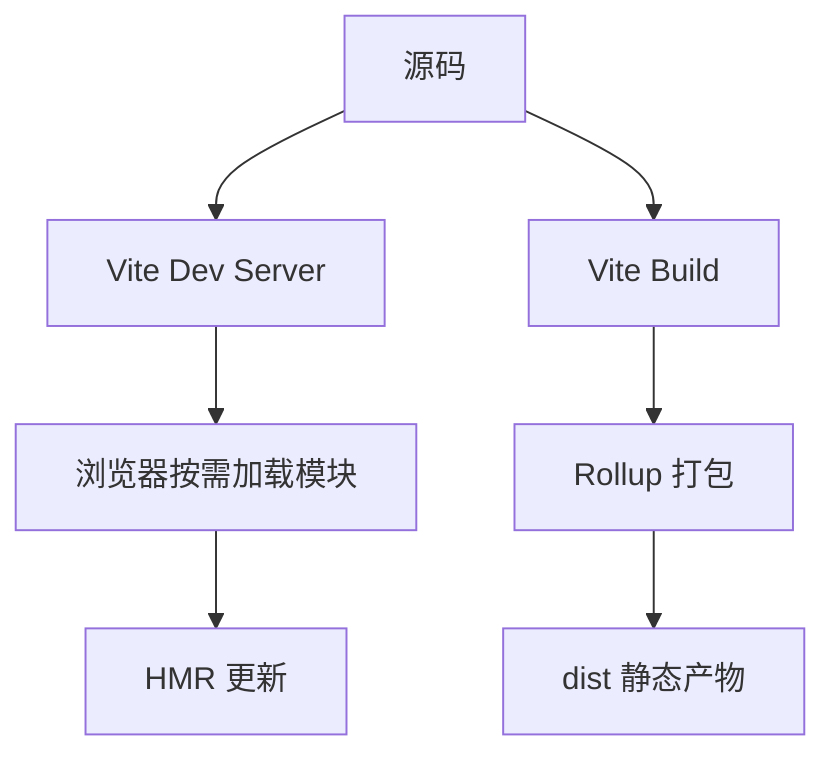
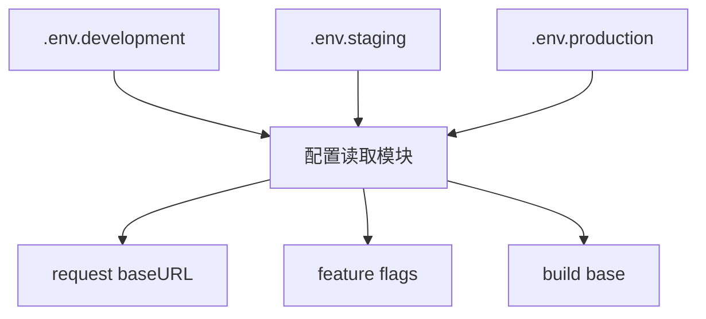
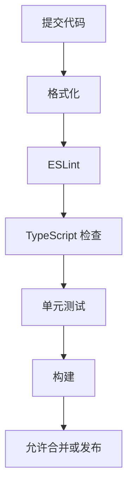
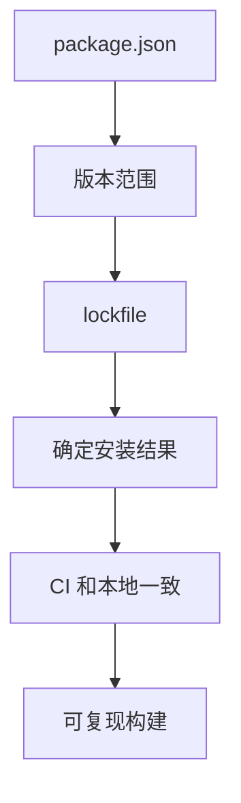
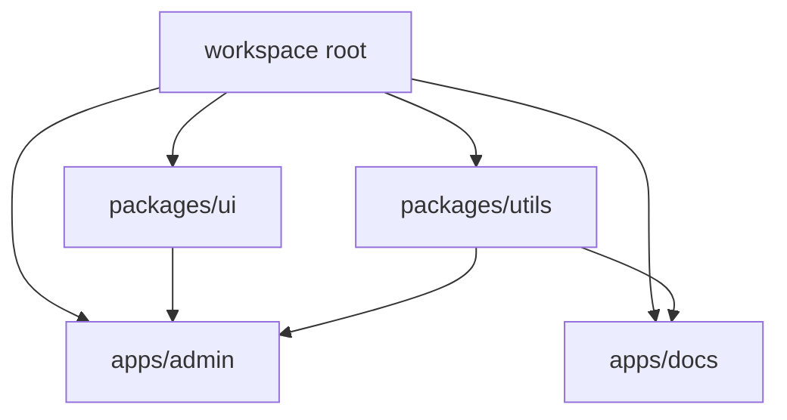
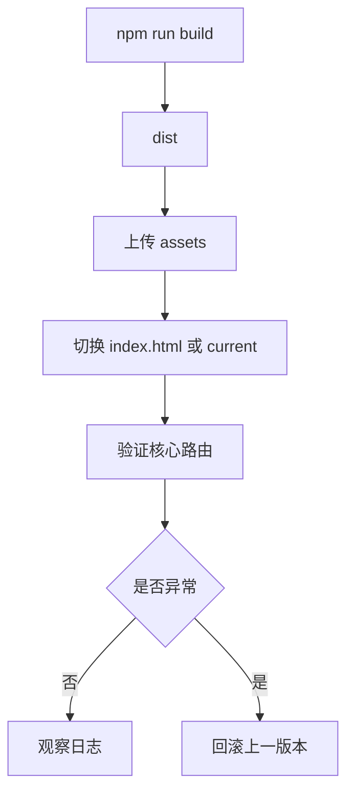
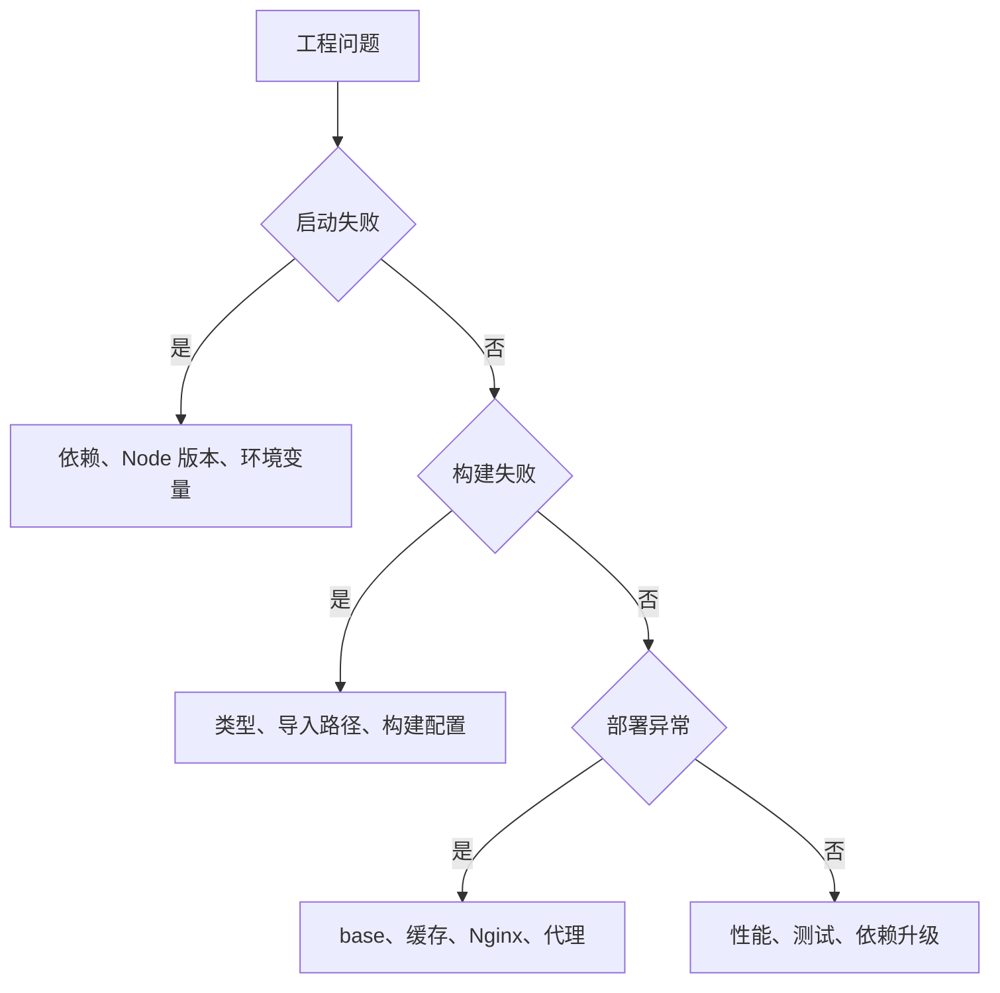

# 图解前端工程化核心概念

## 适合谁看

适合已经能写页面，但对 Vite、环境变量、依赖管理、代码规范、测试、构建、部署和 Monorepo 还没有系统认识的人。

工程化的目标不是装很多工具，而是让项目在多人协作、长期迭代和频繁发布时仍然稳定。

## 你会学到什么

- 一个前端项目从开发到上线会经过哪些环节。
- Vite、TypeScript、ESLint、测试、构建、部署分别解决什么问题。
- 环境变量、请求配置和发布配置如何区分。
- 依赖和 lockfile 为什么影响稳定性。
- 构建产物、缓存、回滚和线上排错如何串起来。

## 工程化全流程

每一步都应该有明确脚本和文档。新人不应该靠问人才能启动项目。

## Vite 开发到构建

本地开发服务器和生产构建不是一回事：

- dev server 提供 HMR、开发代理、未压缩模块。
- build 输出静态资源、hash 文件、压缩产物。
- 本地 proxy 不能代表生产 Nginx 代理。

## 环境配置链路

前端环境变量要区分：

| 类型 | 示例 | 生效时机 |
| --- | --- | --- |
| 构建时变量 | `VITE_API_BASE_URL` | 构建时写入产物 |
| 运行时配置 | `/runtime-config.js` | 浏览器加载时读取 |
| 服务端环境变量 | `DATABASE_URL` | 后端进程运行时读取 |

不要在业务组件里到处读取环境变量。集中到配置模块里。

## 代码质量门禁

质量门禁要从低成本开始：

- 格式化统一风格。
- ESLint 发现低级错误。
- TypeScript 防止类型边界漂移。
- 测试覆盖核心函数和关键组件。
- 构建确认生产产物能生成。

## 依赖管理

真实项目不要随意删除 lockfile。依赖升级要能回答：

- 升级了哪些包。
- 为什么升级。
- 是否有 breaking changes。
- 是否通过测试和构建。
- 如何回滚。

## Monorepo 关系

Monorepo 适合多应用、多包、组件库和工具库共存。不要为了“看起来高级”过早引入。只有当复用和协作问题真实存在时，再让项目进入多包治理。

## 构建部署和回滚

前端上线重点：

- `index.html` 不长期强缓存。
- assets 带 hash 后可长期缓存。
- 二级路由刷新不 404。
- 发布有版本号。
- 回滚能找到上一版本。

## 工程化排错路径

## 实际项目常见问题

### 问题 1：本地能跑，CI 构建失败

检查 Node 版本、包管理器版本、lockfile、大小写路径、环境变量和是否依赖本地未提交文件。

### 问题 2：构建后接口地址错误

确认是构建时变量还是运行时配置。Vite 变量构建后已经写入静态资源。

### 问题 3：依赖升级后页面样式异常

先看组件库 changelog、全局 CSS、主题 token 和 lockfile diff，不要直接写更高优先级覆盖。

## 下一步学习

继续学习 [Vite 工程基础](/engineering/vite)、[代码规范](/engineering/eslint-prettier)、[环境配置](/engineering/env-config) 和 [构建与部署](/engineering/build-deploy)。
