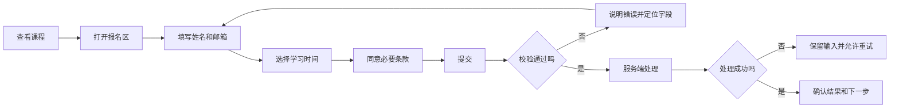
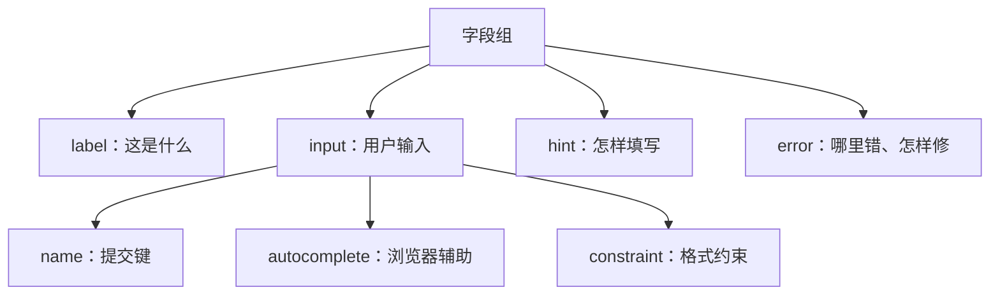
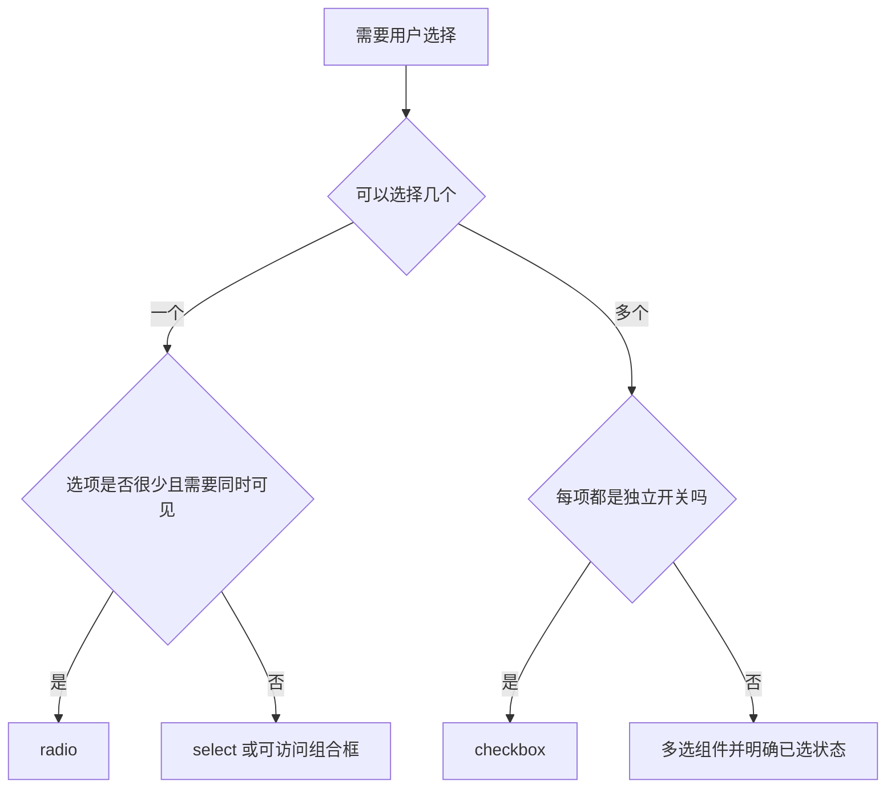
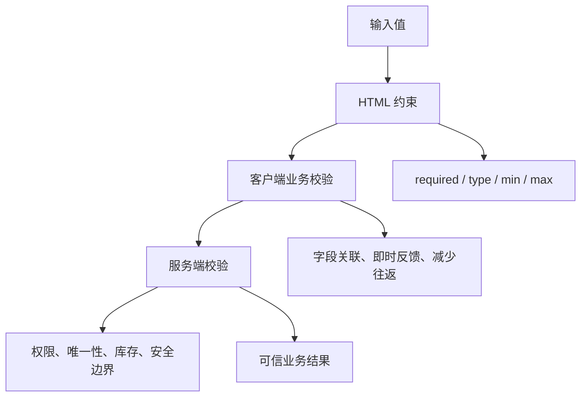
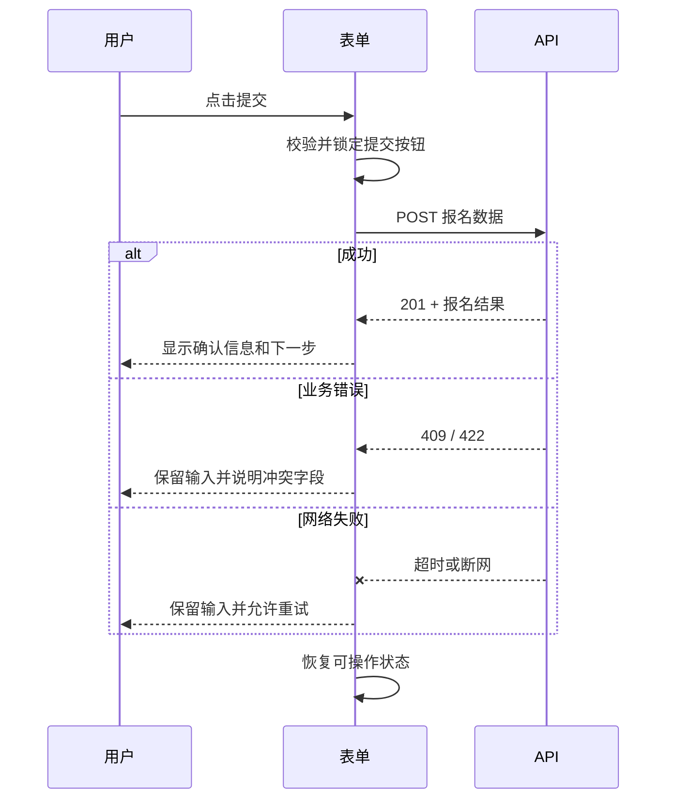
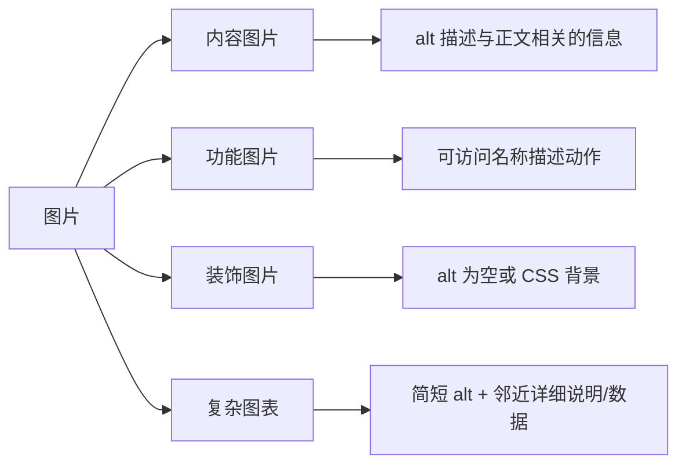
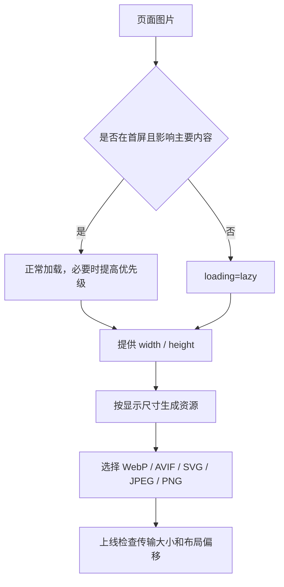
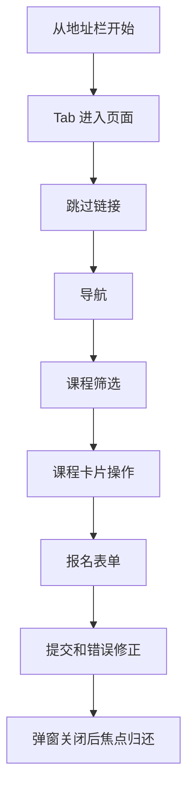

# 表单、图片与无障碍

## 这个页面解决什么

表单、图片和交互控件是“页面能显示”与“用户能完成任务”之间的关键边界。本页用一个课程报名场景讲清楚：

- 怎样设计字段、标签、帮助和错误关系。
- 原生校验、业务校验和服务端校验怎样分工。
- 提交中、失败和成功状态怎样表达。
- 图片怎样兼顾内容、清晰度、布局稳定和加载成本。
- 怎样用键盘、缩放和辅助技术验收页面。

## 1. 先画出报名任务



先确定任务和状态，再决定组件。不要从“需要几个输入框”开始，因为用户还需要理解、修正、等待和确认。

## 2. 使用真实 form

```html
<form action="/api/enrollments" method="post" data-enroll-form>
  <fieldset>
    <legend>报名信息</legend>
    <!-- fields -->
  </fieldset>

  <button type="submit">确认报名</button>
</form>
```

真实 `form` 提供：

- Enter 提交约定。
- 浏览器原生字段和提交语义。
- JavaScript 失效时的基础提交路径。
- `FormData`、`checkValidity()` 和 `reportValidity()` 等平台 API。

如果脚本成功初始化并提供了完整错误摘要，可以通过 `form.noValidate = true` 切换到自定义错误 UI。不要把 `novalidate` 直接写死在 HTML 中：这样脚本失败时，浏览器仍可使用 `required`、`type`、`minlength` 等原生约束保护基础提交路径。

## 3. 每个字段都有完整关系



```html
<div class="form-field" data-field="email">
  <label for="email">邮箱</label>
  <p id="email-hint" class="form-field__hint">用于接收课程和上课提醒。</p>
  <input
    id="email"
    name="email"
    type="email"
    autocomplete="email"
    inputmode="email"
    aria-describedby="email-hint email-error"
    required
  />
  <p id="email-error" class="form-field__error" hidden></p>
</div>
```

### 属性怎样选择

| 属性 | 解决的问题 | 示例 |
| --- | --- | --- |
| `id` + `for` | 标签与控件关联 | 点击标签聚焦输入框 |
| `name` | 提交字段键 | `email=user@example.com` |
| `type` | 数据语义和浏览器约束 | `email`、`url`、`date` |
| `autocomplete` | 帮助用户快速且准确填写 | `name`、`email`、`tel` |
| `inputmode` | 提示移动端键盘布局 | `numeric`、`email` |
| `required` | 表达必填约束 | 必填邮箱 |
| `aria-describedby` | 关联帮助和错误文本 | `email-hint email-error` |
| `aria-invalid` | 表达当前无效状态 | 校验失败后设置 `true` |

`inputmode` 不会验证数据，`type` 也不能替代业务校验。

## 4. 选择控件按数据模型决定



### 单选

```html
<fieldset>
  <legend>每周可学习时间</legend>
  <label><input type="radio" name="studyTime" value="3" required /> 3 小时以内</label>
  <label><input type="radio" name="studyTime" value="6" /> 3 到 6 小时</label>
  <label><input type="radio" name="studyTime" value="10" /> 6 小时以上</label>
</fieldset>
```

同一组 radio 使用相同 `name`。`fieldset` 和 `legend` 让用户知道这组选项共同回答什么问题。

### 同意条款

```html
<div class="form-field">
  <label>
    <input type="checkbox" name="agreement" aria-describedby="agreement-help" required />
    我已阅读并同意报名规则
  </label>
  <p id="agreement-help"><a href="/terms">在独立页面查看报名规则</a></p>
</div>
```

不要把链接点击和勾选行为混成一个不可区分的区域。用户应能单独查看条款。

## 5. 校验分三层



### HTML 约束

适合表达通用规则：

```html
<input name="name" minlength="2" maxlength="40" required />
<input name="email" type="email" maxlength="120" required />
<input name="seats" type="number" min="1" max="5" step="1" required />
```

### 客户端业务校验

适合快速反馈，但不是安全边界：

```js
function validateEnrollment(values) {
  const errors = {}

  if (values.name.trim().length < 2) {
    errors.name = '姓名至少填写 2 个字符。'
  }

  if (!values.courseId) {
    errors.courseId = '请选择要报名的课程。'
  }

  if (!values.agreement) {
    errors.agreement = '请先阅读并同意报名规则。'
  }

  return errors
}
```

### 服务端校验

服务端仍要检查：

- 请求体类型与长度。
- 课程是否存在、是否开放报名。
- 用户是否有权限。
- 名额是否足够。
- 同一用户是否重复报名。
- CSRF、速率限制和审计要求。

客户端传来的 `disabled`、价格、用户 ID 或权限结果都不可信。

## 6. 错误不能只靠颜色

```html
<div class="form-field form-field--invalid" data-field="email">
  <label for="email">邮箱</label>
  <input
    id="email"
    name="email"
    type="email"
    aria-invalid="true"
    aria-describedby="email-error"
  />
  <p id="email-error" class="form-field__error">
    邮箱格式不正确，请输入例如 name@example.com。
  </p>
</div>
```

错误信息要同时回答：

1. 哪个字段有问题。
2. 当前值违反了什么规则。
3. 用户下一步怎样修正。

### 顶部错误摘要

长表单提交失败后，可以显示摘要：

```html
<section class="error-summary" tabindex="-1" aria-labelledby="error-summary-title" hidden>
  <h2 id="error-summary-title">还有 2 项需要修改</h2>
  <ul>
    <li><a href="#email">邮箱格式不正确</a></li>
    <li><a href="#agreement">请同意报名规则</a></li>
  </ul>
</section>
```

显示后通过脚本调用 `focus()`，让键盘和读屏用户立即知道提交失败。摘要链接应能跳到对应字段。

## 7. 提交状态需要防重复和可恢复



```js
async function submitEnrollment(form) {
  const submitButton = form.querySelector('[type="submit"]')
  const status = form.querySelector('[data-form-status]')

  submitButton.disabled = true
  status.textContent = '正在提交报名信息...'

  try {
    const response = await fetch(form.action, {
      method: form.method,
      body: new FormData(form)
    })

    if (!response.ok) {
      throw new Error(`提交失败：HTTP ${response.status}`)
    }

    status.textContent = '报名成功，请检查邮箱。'
    form.reset()
  } catch (error) {
    status.textContent = '暂时无法提交。你的输入已保留，请稍后重试。'
    console.error(error)
  } finally {
    submitButton.disabled = false
  }
}
```

真实项目还要处理请求超时、幂等键、业务错误字段映射和日志追踪。不要在请求开始时清空表单。

## 8. live region 只播报重要变化

```html
<p data-form-status aria-live="polite"></p>
```

适合播报：

- 表单提交结果。
- 异步搜索结果数量。
- 内容保存完成。
- 操作失败且当前焦点不会经过错误文本。

不要把整个页面设为 live region，也不要在每次按键时播报大段内容。`polite` 通常适合非紧急状态；必须立即中断的错误才考虑更强提示。

## 9. 图片先判断内容作用



### 内容图片

```html

```

### 装饰图片

```html

```

空 `alt` 表示图片无需被播报。省略 `alt` 可能导致辅助技术读取文件名。

### 功能图标

```html
<button type="button" aria-label="搜索课程">
  <svg aria-hidden="true"><!-- search icon --></svg>
</button>
```

名称描述动作，不要只描述“放大镜图标”。

## 10. 响应式图片解决两个不同问题

### 分辨率切换

同一构图提供不同尺寸：

```html

```

浏览器根据设备像素密度、视口和 `sizes` 选择候选资源。

### 艺术指导

不同视口需要不同裁切：

```html
<picture>
  <source
    media="(max-width: 640px)"
    srcset="course-portrait.webp"
    width="720"
    height="960"
  />
  <source
    media="(min-width: 641px)"
    srcset="course-landscape.webp"
    width="1280"
    height="720"
  />
  
</picture>
```

`picture` 用于内容构图变化，不只是换文件格式。

## 11. 图片尺寸和加载优先级



建议：

- 首屏关键图不要默认懒加载。
- 列表后方图片可使用 `loading="lazy"`。
- 所有内容图片设置真实宽高或稳定 `aspect-ratio`。
- 不要用一张 4000px 原图缩成 240px 卡片。
- 图标和简单图形适合 SVG；照片通常适合现代有损格式。
- 透明像素和精细截图是否适合 PNG，要根据清晰度和体积权衡。

## 12. 视频和音频必须有替代方式

```html
<video controls width="960" poster="lesson-poster.webp">
  <source src="lesson.webm" type="video/webm" />
  <source src="lesson.mp4" type="video/mp4" />
  <track
    kind="captions"
    srclang="zh"
    src="lesson.zh.vtt"
    label="中文字幕"
    default
  />
  当前浏览器无法播放视频。<a href="lesson.mp4">下载课程视频</a>。
</video>
```

按内容需要提供：

- 准确字幕。
- 文本稿。
- 音频描述或正文说明。
- 可键盘操作的原生控制，或完整实现自定义控制。
- 不自动播放带声音媒体。

## 13. 键盘验收不是按几次 Tab



逐项检查：

- 焦点顺序是否与视觉和阅读顺序一致。
- 焦点样式是否在浅色、深色和高对比场景下可见。
- 自定义菜单、弹窗或组合框是否遵循对应键盘模式。
- 错误后是否能定位问题。
- 没有无法离开的区域。
- hover 才出现的操作也能通过焦点发现。

不要随意使用正数 `tabindex` 重排焦点。修正 DOM 顺序通常更可靠。

## 14. 缩放和文本增长验收

在 200% 浏览器缩放、系统大字体和长文本下检查：

- 文本不被固定高度裁剪。
- 按钮文字能换行或有足够宽度。
- 表单标签和错误不会重叠。
- 内容顺序不被绝对定位破坏。
- 页面核心任务不要求横向和纵向同时滚动。
- 图标不会与文字相互遮挡。

```css
.action-button {
  min-height: 2.75rem;
  padding: 0.625rem 1rem;
  white-space: normal;
}

.form-field {
  min-width: 0;
}

.form-field__error {
  overflow-wrap: anywhere;
}
```

## 实战验收矩阵

| 场景 | 操作 | 合格结果 |
| --- | --- | --- |
| 无鼠标 | 只用键盘完成报名 | 顺序合理、焦点可见、可提交和修错 |
| 390px | 打开目录并填写表单 | 无页面级横向滚动 |
| 200% 缩放 | 完成相同任务 | 内容不遮挡、不丢失 |
| 图片失败 | 阻止图片请求 | 替代文本和布局仍可理解 |
| 脚本失败 | 阻止 JS | 核心内容可读，原生表单有降级路径 |
| 慢网络 | Fast 3G 或离线切换 | 状态明确、不重复提交、不清空输入 |
| 服务端 422 | 返回字段错误 | 错误映射到字段并可修正 |
| 服务端 500 | 模拟失败 | 保留输入并允许重试 |

## 项目检查清单

```text
[ ] 使用真实 form、label、fieldset 和 legend
[ ] 所有提交字段都有 name
[ ] 输入类型和 autocomplete 合理
[ ] 错误不只依赖颜色
[ ] 错误文字说明修复方法
[ ] 长表单有错误摘要和焦点处理
[ ] 提交中防重复，失败保留输入
[ ] 服务端重新校验并忽略不可信身份字段
[ ] 内容图片有上下文相关 alt
[ ] 装饰图片使用空 alt
[ ] 图片有稳定尺寸和合适资源大小
[ ] 首屏关键图没有机械懒加载
[ ] 视频有字幕和必要替代内容
[ ] 键盘、390px、200% 缩放和弱网通过
```

## 参考资料

- [MDN Forms and Buttons](https://developer.mozilla.org/en-US/docs/Learn_web_development/Core/Structuring_content/HTML_forms)
- [MDN Responsive Images](https://developer.mozilla.org/en-US/docs/Learn/HTML/Multimedia_and_embedding/Responsive_images)
- [MDN Label Element](https://developer.mozilla.org/en-US/docs/Web/HTML/Reference/Elements/label)
- [MDN Source Element in Picture](https://developer.mozilla.org/en-US/docs/Web/HTML/Reference/Elements/source#using_height_and_width_attributes_with_picture)
- [MDN HTML Accessibility](https://developer.mozilla.org/en-US/docs/Learn_web_development/Core/Accessibility/HTML)
- [W3C WAI Forms Tutorial](https://www.w3.org/WAI/tutorials/forms/)
- [W3C WAI Images Tutorial](https://www.w3.org/WAI/tutorials/images/)

## 下一步学习

进入 [前端基础从零到项目](/frontend/project-from-zero)，实现课程筛选、详情导航、响应式图片和完整报名表单。遇到异常时，使用 [HTML 与无障碍真实项目问题库](/projects/issues-html-accessibility) 按现象排查。
