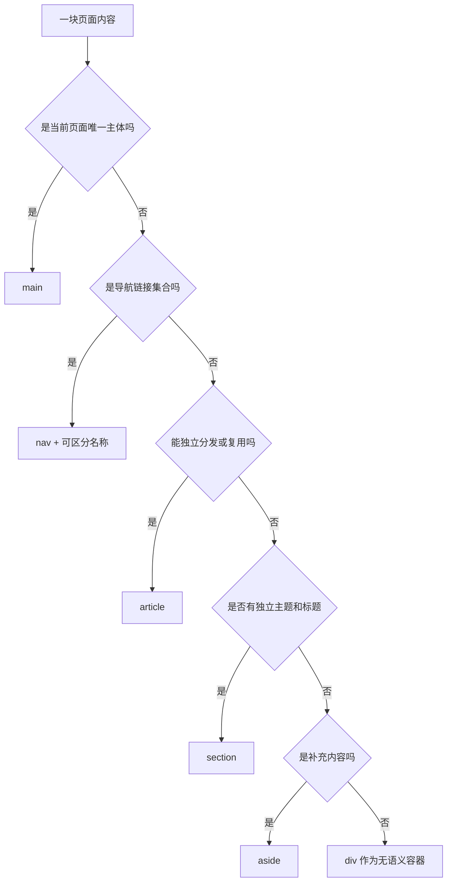
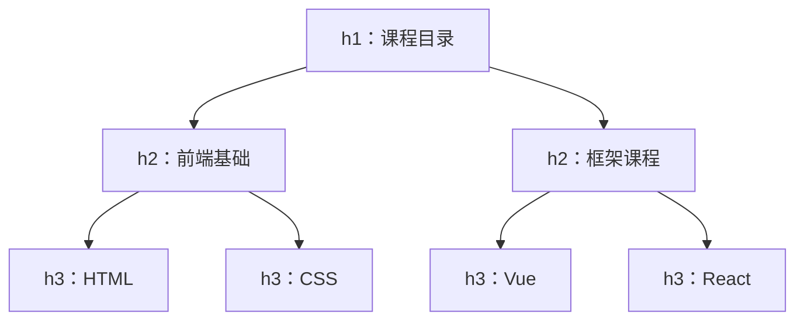
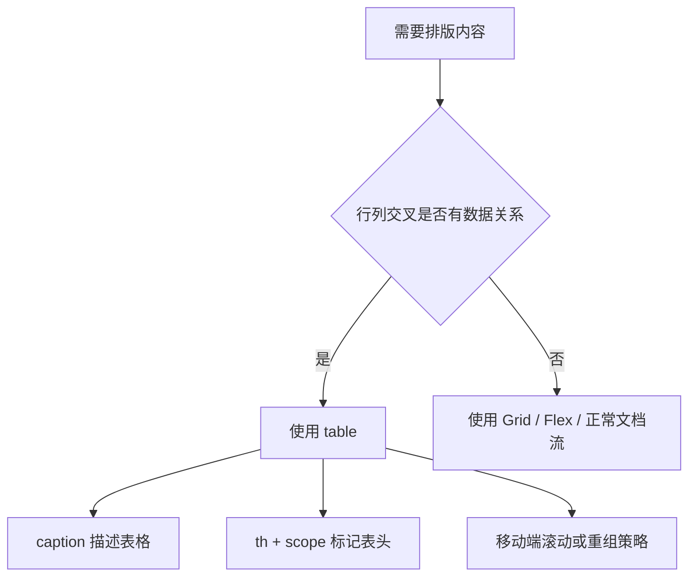
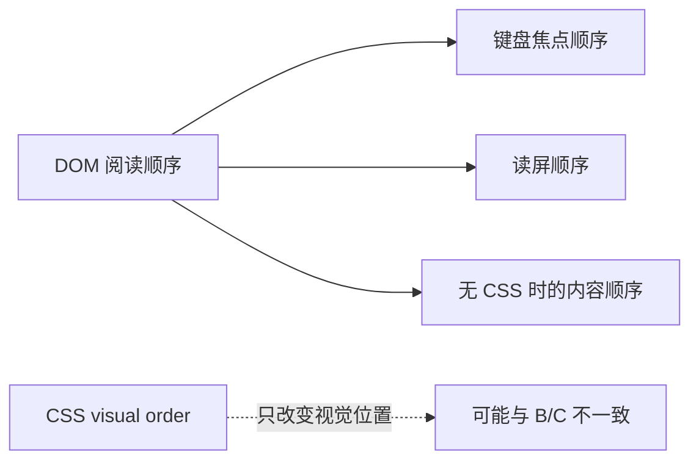

# HTML 语义与页面结构

## 这个页面解决什么

HTML 的任务不是把内容“包起来”，而是告诉浏览器这段内容是什么、彼此有什么关系、用户可以怎样操作。正确语义会直接影响：

- 键盘和辅助技术操作。
- 页面在 CSS 或 JavaScript 失败时的可用性。
- 搜索引擎和分享工具理解内容。
- 团队阅读 DOM 和编写样式的成本。
- 自动化测试能否用稳定角色定位元素。

## 从完整文档骨架开始

```html
<!doctype html>
<html lang="zh-CN">
  <head>
    <meta charset="UTF-8" />
    <meta name="viewport" content="width=device-width, initial-scale=1" />
    <meta name="description" content="学习 HTML、CSS 和 JavaScript 的课程目录。" />
    <title>课程目录 | Yok Study</title>
    <link rel="stylesheet" href="/styles.css" />
    <script type="module" src="/src/main.js"></script>
  </head>
  <body>
    <a class="skip-link" href="#main-content">跳到主要内容</a>
    <header><!-- 站点头部 --></header>
    <main id="main-content"><!-- 当前页面主体 --></main>
    <footer><!-- 站点页脚 --></footer>
  </body>
</html>
```

### head 里每项解决什么

| 内容 | 作用 | 常见错误 |
| --- | --- | --- |
| `charset` | 尽早确定字符编码 | 放得太晚导致文本解析异常 |
| `viewport` | 让移动端按设备宽度布局 | 缺失后页面像桌面版缩小 |
| `title` | 浏览器标签、历史和搜索标题 | 每页都写同一个标题 |
| `description` | 描述页面主题 | 堆关键词或与正文无关 |
| stylesheet | 加载样式 | 路径只在开发环境有效 |
| module script | 加载交互入口 | 阻塞解析或找不到生产路径 |

## 页面区域怎样选择

先观察下面的最终页面：主文章、补充目录和标题层级即使去掉装饰也仍然清楚。重点不是每个方框长什么样，而是页面地标与 DOM 阅读顺序是否一致。

<DocFigure
  src="/images/frontend/semantic-article.webp"
  alt="语义化文章页面，主区域包含文章标题、元数据和章节，右侧补充区域显示本页目录。"
  caption="Article 承载可独立阅读的主内容，Aside 只放补充导航；标题级别和 DOM 顺序在 CSS 失效后仍应成立。"
  :width="1440"
  :height="900"
/>

图中的视觉边框只是帮助观察。真正的语义来自 `main`、`article`、`section`、`aside`、标题和链接本身，不能用一组无意义的 `div` 加相似样式冒充。



### 常用区域元素

| 元素 | 适合内容 | 注意点 |
| --- | --- | --- |
| `header` | 页面或区域头部 | 不等于只能出现一次 |
| `nav` | 主要导航、目录、分页 | 多个 `nav` 需要可区分名称 |
| `main` | 当前页面主要内容 | 一个文档通常只有一个可见 `main` |
| `article` | 文章、课程卡片、评论 | 内容应能相对独立理解 |
| `section` | 有主题的一组内容 | 通常应有标题 |
| `aside` | 相关链接、补充信息 | 不要把所有侧栏都机械写成 `aside` |
| `footer` | 页面或区域尾部 | 可用于作者、版权、相关链接 |
| `div` | 纯布局或脚本容器 | 没有更合适语义时再用 |

## 标题层级是内容目录



推荐规则：

1. 先根据内容关系决定标题层级。
2. 再通过 class 控制视觉大小。
3. 不要因为想要小字号就从 `h2` 跳到 `h5`。
4. 卡片标题是否使用标题元素，取决于它是否构成页面大纲的一部分。
5. 弹窗和独立区域要有可感知名称。

```html
<main>
  <h1>课程目录</h1>

  <section aria-labelledby="frontend-heading">
    <h2 id="frontend-heading">前端基础</h2>

    <article>
      <h3>HTML 语义与页面结构</h3>
      <p>理解浏览器原生结构和交互语义。</p>
      <a href="/courses/html">查看课程</a>
    </article>
  </section>
</main>
```

## 文本内容不要全部使用 span

| 内容 | 推荐元素 |
| --- | --- |
| 普通段落 | `p` |
| 无顺序列表 | `ul` + `li` |
| 有顺序步骤 | `ol` + `li` |
| 名称和值 | `dl` + `dt` + `dd` |
| 强调重要性 | `strong` |
| 语气强调 | `em` |
| 行内代码 | `code` |
| 一段代码 | `pre` + `code` |
| 时间或日期 | `time` |
| 引用 | `blockquote` 或 `q` |

`strong` 和 `em` 表达语义，粗体和斜体只是默认样式。不要用它们只为了改变外观。

## 链接必须有真实目的地

```html
<a href="/courses/html">查看 HTML 课程</a>
<a href="/downloads/frontend-checklist.pdf" download>下载验收清单</a>
<a href="#enroll-form">前往报名表单</a>
```

链接文字应在离开上下文后仍有意义：

```html
<!-- 不清楚 -->
<a href="/courses/html">点击这里</a>

<!-- 清楚 -->
<a href="/courses/html">查看 HTML 课程详情</a>
```

不要使用 `href="#"` 再阻止默认行为模拟按钮。这会制造错误历史记录、滚动到顶部和键盘语义问题。

### 外部链接和新窗口

只有确实需要时才使用 `target="_blank"`。新窗口会改变用户预期，应在链接文字或上下文中说明。现代浏览器通常会为 `_blank` 提供 `noopener` 行为，但项目规范仍应明确外部链接策略。

## 按钮必须声明 type

```html
<form>
  <button type="button">打开帮助</button>
  <button type="submit">提交报名</button>
</form>
```

在表单内，省略 `type` 的 `button` 默认可能提交表单。所有按钮都显式写 `type`，能减少维护时的意外行为。

### 图标按钮需要名称

```html
<button type="button" aria-label="关闭报名弹窗">
  <svg aria-hidden="true"><!-- 图标 --></svg>
</button>
```

如果按钮同时有可见文字，图标通常应隐藏于辅助技术，避免名称重复。

## 列表表达集合关系

课程、导航、步骤和标签集合都适合列表：

```html
<ul class="course-list">
  <li>
    <article class="course-card">
      <h2>HTML 基础</h2>
      <p>学习页面结构与原生语义。</p>
    </article>
  </li>
  <li>
    <article class="course-card">
      <h2>CSS 布局</h2>
      <p>学习响应式布局和样式边界。</p>
    </article>
  </li>
</ul>
```

如果 CSS 去掉列表符号，要确认辅助技术仍能识别列表。不要为了少写一个元素，把本来是集合的数据改成一串无关系的 `div`。

## 表格只用于二维数据



```html
<table>
  <caption>课程学习时间与难度</caption>
  <thead>
    <tr>
      <th scope="col">课程</th>
      <th scope="col">时间</th>
      <th scope="col">难度</th>
    </tr>
  </thead>
  <tbody>
    <tr>
      <th scope="row">HTML</th>
      <td>4 小时</td>
      <td>入门</td>
    </tr>
  </tbody>
</table>
```

不要用表格控制整页布局。布局交给 CSS，数据关系交给表格。

## details 和 dialog 的边界

### 可展开补充内容

```html
<details>
  <summary>报名需要准备什么？</summary>
  <p>准备可接收确认邮件的邮箱即可。</p>
</details>
```

`details` 适合 FAQ 和可折叠说明，原生提供展开状态与键盘行为。

### 需要阻断当前任务的弹窗

```html
<dialog id="enroll-dialog" aria-labelledby="enroll-title">
  <h2 id="enroll-title">报名 HTML 课程</h2>
  <form method="dialog">
    <button type="submit">取消</button>
  </form>
</dialog>
```

`dialog.showModal()` 可以建立模态行为，但仍要处理初始焦点、关闭后的焦点归还、表单提交和不支持场景。确认提示不一定都需要弹窗，页面内反馈通常更轻量。

## DOM 顺序必须先合理



Flexbox 的 `order` 和 Grid 定位可以改变视觉顺序，但通常不会同步改变 DOM 与读屏顺序。先让 DOM 顺序符合阅读和操作逻辑，再做视觉布局。

## 元数据和语言不可忽略

### 页面语言

```html
<html lang="zh-CN">
```

页面中出现不同语言片段时可以局部标记：

```html
<p>CSS 的全称是 <span lang="en">Cascading Style Sheets</span>。</p>
```

### 每页独立标题

推荐格式：

```text
页面主题 | 产品或站点名
```

例如：

```html
<title>HTML 语义课程 | Yok Study</title>
```

标题应该能让用户在多个浏览器标签和历史记录中区分页面。

## 常见错误对照

| 错误写法 | 问题 | 推荐 |
| --- | --- | --- |
| 全页面都是 `div` | 结构和操作语义丢失 | 使用原生区域与内容元素 |
| `div onclick` | 无默认键盘和按钮语义 | `button type="button"` |
| `a href="#"` 做操作 | 错误导航和历史行为 | 使用按钮 |
| 占位符当 label | 输入后字段名称消失 | 可见 `label` |
| 标题只按字号选择 | 大纲混乱 | 先按内容层级选择 |
| 表格做页面布局 | 小屏和读屏体验差 | CSS Grid/Flex |
| CSS `order` 重排所有内容 | 视觉与焦点顺序不一致 | DOM 先按逻辑排序 |
| 图标按钮没有名称 | 辅助技术不知道动作 | 可见文本或 `aria-label` |

## 浏览器验收方法

### 关闭 CSS

页面应该仍然：

- 标题层级清楚。
- 内容顺序合理。
- 链接和按钮能区分。
- 表单字段有名称。
- 核心内容没有被 CSS 背景图独占。

### 只用键盘

检查：

- Tab 顺序是否符合阅读顺序。
- 每个焦点是否可见。
- 链接和按钮能否激活。
- 展开区、弹窗和表单能否完成。
- 没有键盘陷阱。

### 看 Accessibility 面板

重点确认：

- role 是否符合元素行为。
- name 是否准确。
- disabled、expanded、invalid 等状态是否正确。
- 标题和区域是否能形成清楚导航。

## 项目检查清单

```text
[ ] html 设置正确 lang
[ ] 每页有独立 title 和 description
[ ] 页面有一个清楚的主 h1
[ ] 标题层级不因字号而跳级
[ ] 主体、导航和补充区域语义清楚
[ ] 跳转使用真实链接
[ ] 操作使用正确 type 的按钮
[ ] 列表和二维数据使用对应结构
[ ] 图标按钮有可访问名称
[ ] DOM 顺序与阅读和焦点顺序一致
[ ] 关闭 CSS 后核心内容仍可理解
[ ] 仅键盘可以完成核心任务
```

## 参考资料

- [WHATWG HTML Semantics](https://html.spec.whatwg.org/multipage/semantics.html)
- [MDN Semantic HTML](https://developer.mozilla.org/en-US/curriculum/core/semantic-html/)
- [MDN HTML Accessibility](https://developer.mozilla.org/en-US/docs/Learn_web_development/Core/Accessibility/HTML)
- [W3C WAI Page Structure](https://www.w3.org/WAI/tutorials/page-structure/)

## 下一步学习

继续学习 [表单、图片与无障碍](/frontend/forms-media-accessibility)，把页面结构扩展为可输入、可校验、可响应不同设备的完整任务。随后进入 [前端基础从零到项目](/frontend/project-from-zero) 实践。
