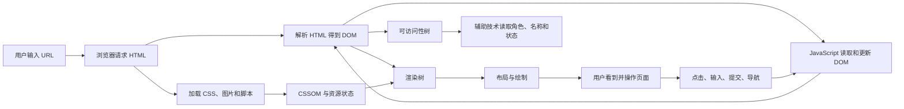

# 前端基础学习导览

## 这个模块解决什么

前端框架会帮你组织组件和状态，但浏览器最终接收的仍然是 HTML、CSS、JavaScript 和静态资源。基础不牢时，项目里经常出现这些问题：

- 页面能显示，但标题层级、导航、表单和按钮没有正确语义。
- 鼠标能操作，键盘或读屏软件却无法完成任务。
- 图片把页面撑开，移动端下载了远超需要的大图。
- JavaScript 加载失败后，页面完全不可用。
- 表单只有红色边框，没有可理解的错误提示。
- 页面刷新、前进后退或网络变慢后，交互状态失控。
- 会写 Vue 或 React，却说不清浏览器怎样把资源变成页面。

这个模块先建立 Web 平台的共同底座，再把深入内容交给 CSS、JavaScript、TypeScript、浏览器与框架模块。

## 适合谁看

适合以下学习者：

- 第一次系统学习前端。
- 会复制页面代码，但不知道标签为什么这样选。
- 准备学习 Vue 或 React，希望先补齐浏览器原生基础。
- 页面经常出现表单、图片、键盘操作或移动端问题。
- 想从“页面能显示”提升到“页面可理解、可操作、可交付”。

如果你已经会写框架项目，也建议用本模块检查自己的 HTML、表单和无障碍基础。

## 先建立一张总图



不要把前端理解成“写几个组件”。一个可用页面至少包含五条链路：

| 链路 | 核心问题 |
| --- | --- |
| 内容结构 | 浏览器、搜索引擎和辅助技术能否理解页面 |
| 视觉布局 | 不同屏幕、内容长度和系统设置下是否稳定 |
| 资源加载 | HTML、CSS、脚本、字体和图片能否正确到达 |
| 用户交互 | 鼠标、键盘、触摸和表单提交是否有清楚反馈 |
| 质量验证 | 弱网、失败、空数据、缩放和移动端是否可用 |

## 推荐学习顺序

<LearningPath :steps="[
  { title: '图解前端页面核心概念', description: '先用图理解 DOM、CSSOM、渲染、语义、表单、图片、事件和渐进增强。', link: '/frontend/visual-guide', badge: '图解' },
  { title: 'HTML 语义与页面结构', description: '掌握文档骨架、标题层级、区域、链接、按钮、列表和表格。', link: '/frontend/html-semantics', badge: '结构' },
  { title: '表单、图片与无障碍', description: '完成可提交、可报错、可键盘操作并能适配不同设备的内容。', link: '/frontend/forms-media-accessibility', badge: '可用' },
  { title: 'HTML 与 CSS 快速入门', description: '用盒模型、Flex、Grid 和响应式规则搭出稳定页面。', link: '/frontend/html-css', badge: '布局' },
  { title: '前端基础从零到项目', description: '不用框架完成一个课程目录与报名页，串起结构、样式、交互和验收。', link: '/frontend/project-from-zero', badge: '项目' },
  { title: 'HTML 与无障碍问题库', description: '按现象排查点击、表单、图片、焦点、页面跳动和脚本失效。', link: '/projects/issues-html-accessibility', badge: '问题库' },
  { title: '前端基础专项练习', description: '通过 10 个渐进练习、故障注入和验收清单巩固基础。', link: '/roadmap/frontend-foundation-practice', badge: '练习' },
  { title: '前端基础常见问题', description: '快速定位标签选择、资源路径、表单行为和键盘操作问题。', link: '/frontend/troubleshooting', badge: '排错' }
]" />

## 学习边界

本模块回答“平台怎样工作”和“一个页面怎样正确落地”，深入能力由独立模块继续承接：

| 想深入什么 | 下一模块 |
| --- | --- |
| 盒模型、层叠、Flex、Grid、响应式和主题 | [CSS 学习导览](/css/introduction) |
| 数据、函数、DOM 事件、异步和模块化 | [JavaScript 学习导览](/javascript/introduction) |
| 类型、接口、泛型和工程配置 | [TypeScript 学习导览](/typescript/introduction) |
| HTTP、缓存、存储、安全和渲染性能 | [浏览器与网络导览](/browser/introduction) |
| 组件、状态、路由和工程项目 | [Vue 学习导览](/vue/introduction) |

这里不会重复完整讲解每个 CSS 属性或 JavaScript 语法，而是说明它们怎样在一个真实页面里协作。

## 必须掌握的 HTML 决策

### 链接还是按钮

判断依据不是外观，而是行为：

| 目标 | 元素 | 示例 |
| --- | --- | --- |
| 跳到另一个 URL | `a` | 查看课程详情 |
| 执行当前页面动作 | `button` | 打开筛选、保存表单 |
| 提交表单 | `button type="submit"` | 报名 |
| 重置表单 | `button type="reset"`，谨慎使用 | 清空全部字段 |

原生元素自带键盘、焦点、表单和辅助技术语义。用 `div` 模拟按钮，会迫使你重新实现这些能力。

### 图片有没有信息

| 图片作用 | `alt` 应怎样写 |
| --- | --- |
| 传递内容 | 描述与上下文相关的信息 |
| 按钮或链接里的图标 | 描述动作，或由旁边文字提供名称 |
| 纯装饰 | 使用空 `alt=""` |
| 图表 | 提供简短替代文本，并在正文给出数据或结论 |

不要把文件名写成替代文本，也不要对所有图片都写“图片”。

### 表单错误告诉谁

错误不能只靠红色表达。至少需要：

- 字段有可见 `label`。
- 错误文字说明问题和修复方式。
- 输入框通过 `aria-describedby` 关联错误。
- 无效字段设置 `aria-invalid="true"`。
- 提交失败后把焦点移动到错误摘要或第一个错误字段。

## 学习方法

每个章节按下面顺序练习：

```text
先看图建立模型
↓
自己写最小 HTML
↓
关闭 CSS，检查结构是否仍可理解
↓
关闭 JavaScript，检查核心内容是否仍可访问
↓
只用键盘完成任务
↓
切到 390px 和 200% 缩放
↓
故意制造错误并记录证据
```

<PracticeBlock title="不要从框架组件开始猜 HTML" tone="mint">
先写清楚内容、操作和页面区域，再决定组件边界。组件只是组织方式，正确的 HTML 语义仍然要落到最终 DOM 上。
</PracticeBlock>

## 完成标准

完成本模块后，你应该能够：

- 用语义元素描述页面结构，而不是全部使用 `div`。
- 解释 DOM、CSSOM、布局、绘制和 JavaScript 的关系。
- 选择正确的链接、按钮、表单控件、标题和区域元素。
- 写出有标签、错误提示、成功反馈和键盘流程的表单。
- 为内容图片、装饰图片和响应式图片选择正确方案。
- 在无 CSS、无 JavaScript、弱网和移动端条件下保留核心任务。
- 用 DevTools 和键盘检查页面，而不是只凭肉眼判断。
- 完成一个不依赖框架的可部署页面，并留下验收记录。

## 参考资料

- [WHATWG HTML Living Standard](https://html.spec.whatwg.org/)
- [MDN Semantic HTML](https://developer.mozilla.org/en-US/curriculum/core/semantic-html/)
- [MDN HTML Accessibility](https://developer.mozilla.org/en-US/docs/Learn_web_development/Core/Accessibility/HTML)
- [W3C WAI Tutorials](https://www.w3.org/WAI/tutorials/)

## 下一步学习

第一次学习先进入 [图解前端页面核心概念](/frontend/visual-guide)。已经能写页面但经常遇到交互或无障碍问题，可以直接看 [HTML 与无障碍真实项目问题库](/projects/issues-html-accessibility)。
