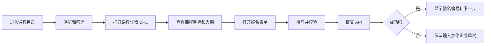
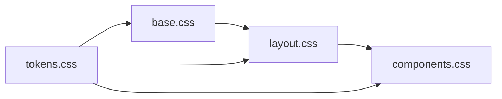
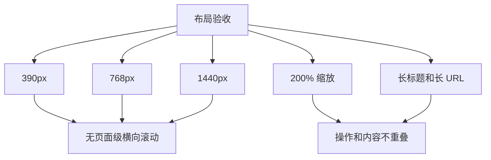
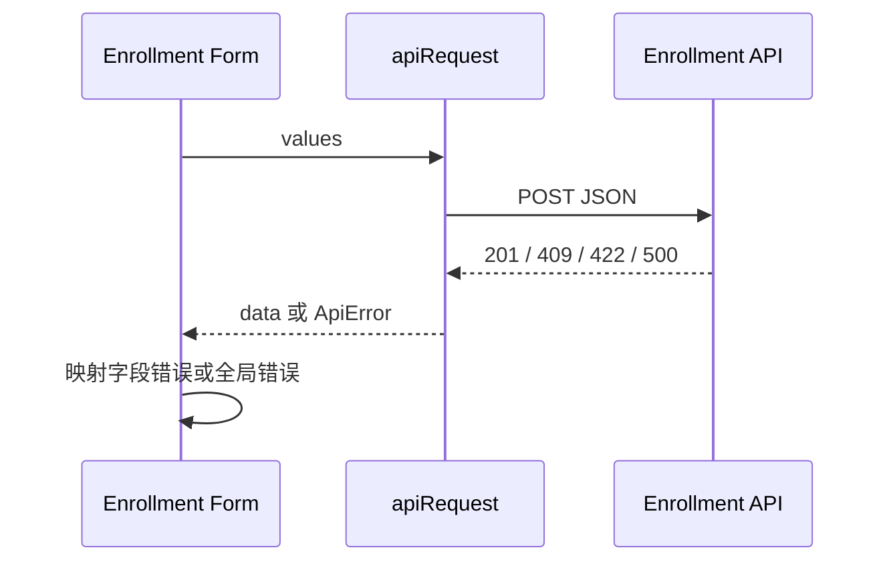
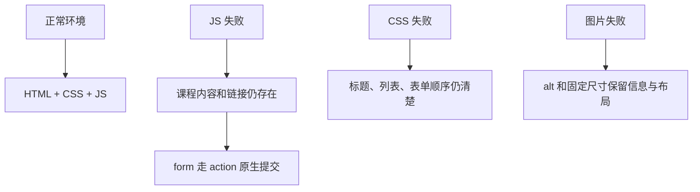
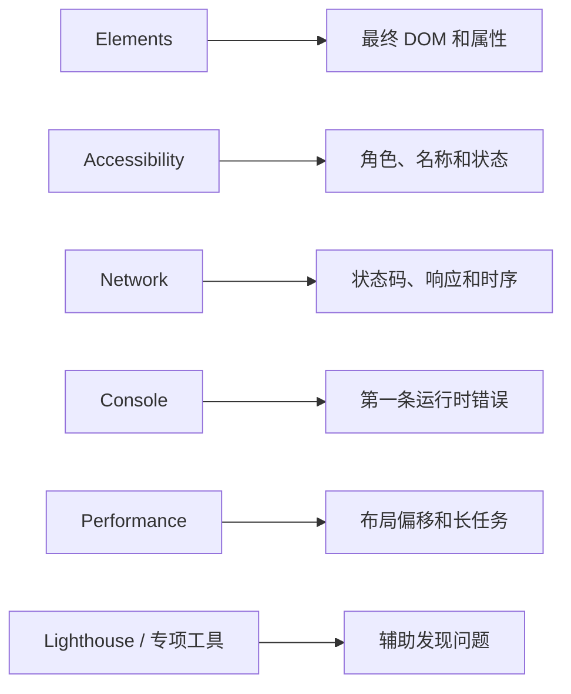

# 前端基础从零到项目：课程目录与报名页

## 这个项目解决什么

很多初学者能分别写 HTML、CSS 和 JavaScript，却不知道怎样把它们组合成一个可交付页面。本项目不使用 Vue 或 React，而是用浏览器原生能力完成一个课程目录与报名页，重点练习：

- 先设计内容和任务，再写页面结构。
- 使用语义 HTML、真实链接、按钮和表单。
- 建立响应式布局和稳定图片尺寸。
- 用 JavaScript 做渐进增强，而不是接管所有内容。
- 处理加载、空数据、错误、提交中和成功状态。
- 完成键盘、移动端、弱网和生产构建验收。

做完后再学习框架，你会更清楚组件最终应该输出什么 DOM，也更容易判断问题来自平台、样式还是框架状态。

## 项目最终效果

项目名称：`course-catalog`。

用户可以：

1. 在首页理解站点和课程分类。
2. 使用真实链接打开课程详情。
3. 按关键词和难度筛选课程。
4. 在没有 JavaScript 时浏览服务端或静态生成的课程列表。
5. 打开报名表单，填写姓名、邮箱和学习时间。
6. 看懂字段错误、提交状态和报名结果。
7. 只用键盘完成核心任务。
8. 在手机、桌面、200% 缩放和弱网下正常使用。

## 完整用户链路



## 技术选择

| 能力 | 选择 | 原因 |
| --- | --- | --- |
| 开发服务器与构建 | Vite Vanilla | 启动快，保留原生平台学习重点 |
| 页面结构 | HTML | 直接练习语义和渐进增强 |
| 样式 | 原生 CSS | 掌握布局、层叠和响应式约束 |
| 交互 | ES Modules | 学习模块、DOM、事件和 fetch |
| 数据 | 静态 JSON + Mock API | 先完成浏览器链路，再替换真实后端 |
| 测试 | 浏览器手工矩阵 + 可选自动化 | 先学会观察证据，再引入测试框架 |

本章示例基于当前 Vite 主线项目结构。具体依赖版本以创建项目时的锁文件为准，不把版本号硬编码进业务代码。

## 项目目录

```text
course-catalog/
├─ index.html
├─ about.html
├─ learning-path.html
├─ terms.html
├─ courses/
│  ├─ html.html
│  └─ css.html
├─ public/
│  └─ images/
│     ├─ course-html-640.webp
│     ├─ course-html-1280.webp
│     └─ course-css-640.webp
├─ src/
│  ├─ main.js
│  ├─ data/
│  │  └─ courses.js
│  ├─ features/
│  │  ├─ course-filter.js
│  │  └─ enrollment-form.js
│  ├─ shared/
│  │  ├─ api.js
│  │  └─ dom.js
│  └─ styles/
│     ├─ tokens.css
│     ├─ base.css
│     ├─ layout.css
│     └─ components.css
├─ server/
│  └─ mock-api.mjs
├─ vite.config.js
├─ ACCESSIBILITY_CHECKLIST.md
├─ DEBUG_NOTES.md
├─ RELEASE_CHECKLIST.md
├─ package.json
└─ README.md
```

目录按职责拆分：数据、功能、共享能力和样式互不混放。不要在 `main.js` 里堆完整项目。

## 第 0 阶段：写成功标准

开发前先创建 `README.md`，记录用户目标与验收：

```md
# Course Catalog

## 核心任务

- 浏览课程
- 打开真实详情 URL
- 筛选课程
- 提交报名

## 启动

npm install
npm run mock
npm run dev

## 发布前命令

npm run build
npm run preview

## 质量门槛

- 390px、768px、1440px 无页面级横向滚动
- 只用键盘可以完成报名
- 200% 缩放不丢内容或操作
- JavaScript 失败时课程和详情链接仍可访问
- 报名失败时保留输入并允许重试
```

### 状态矩阵

| 区域 | 正常 | 加载 | 空数据 | 错误 | 禁用 |
| --- | --- | --- | --- | --- | --- |
| 课程列表 | 展示卡片 | 骨架或文字 | 无匹配课程 | 数据加载失败 | 不适用 |
| 筛选 | 可输入 | 不适用 | 结果为 0 | 脚本异常时保留原列表 | 条件不可用时禁用 |
| 报名表单 | 可编辑 | 提交中 | 不适用 | 字段或服务错误 | 提交中禁用按钮 |
| 图片 | 正常资源 | 保留尺寸 | 不适用 | alt 和背景仍可理解 | 不适用 |

没有状态矩阵，项目很容易只完成“理想路径”。

## 第 1 阶段：创建项目和脚本

```bash
npm create vite@latest course-catalog -- --template vanilla
cd course-catalog
npm install
npm run dev
```

确认 `package.json` 至少有：

```json
{
  "scripts": {
    "dev": "vite",
    "mock": "node server/mock-api.mjs",
    "build": "vite build",
    "preview": "vite preview"
  }
}
```

项目包含首页、课程详情、学习路线、关于和条款等多个 HTML 入口。Vite 默认构建只以根 `index.html` 为入口，因此必须显式配置多页面构建：

```js
// vite.config.js
import { fileURLToPath, URL } from 'node:url'
import { defineConfig } from 'vite'

function page(path) {
  return fileURLToPath(new URL(path, import.meta.url))
}

const apiProxy = {
  '/api': {
    target: 'http://127.0.0.1:4174',
    changeOrigin: true
  }
}

export default defineConfig({
  build: {
    rollupOptions: {
      input: {
        home: page('./index.html'),
        about: page('./about.html'),
        learningPath: page('./learning-path.html'),
        terms: page('./terms.html'),
        htmlCourse: page('./courses/html.html'),
        cssCourse: page('./courses/css.html')
      }
    }
  },
  server: { proxy: apiProxy },
  preview: { proxy: apiProxy }
})
```

`server.proxy` 让开发服务器把 `/api` 转发到本地 Mock API；`preview.proxy` 让生产预览使用同一条接口链路。真实部署时由同源后端、网关或平台路由接管 `/api`，不要把本地端口发布到浏览器代码里。

开发时打开两个终端：

```bash
# 终端 1：Mock API
npm run mock

# 终端 2：前端
npm run dev
```

创建 `about.html`、`learning-path.html` 和 `terms.html` 时可以复用同一份站点头部与基础样式，但每页必须有独立 `title`、`h1` 和真实内容。不要只创建空文件骗过构建。

### 提供一个可运行的 Mock API

`server/mock-api.mjs` 使用 Node 内置模块，不需要额外依赖。它同时接受 JavaScript 发出的 JSON 和无 JavaScript 时原生 form 发出的 URL 编码数据：

```js
// server/mock-api.mjs
import { randomUUID } from 'node:crypto'
import { createServer } from 'node:http'

const port = 4174
const allowedCourses = new Set(['html-basics', 'css-layout'])
const enrollments = new Set()

function sendJson(response, status, body, traceId) {
  response.writeHead(status, {
    'content-type': 'application/json; charset=utf-8',
    'x-content-type-options': 'nosniff',
    'x-trace-id': traceId
  })
  response.end(JSON.stringify(body))
}

function sendHtml(response, status, enrollmentId) {
  response.writeHead(status, {
    'content-type': 'text/html; charset=utf-8',
    'content-security-policy': "default-src 'none'; style-src 'unsafe-inline'",
    'x-content-type-options': 'nosniff'
  })
  response.end(`<!doctype html>
    <html lang="zh-CN">
      <meta charset="UTF-8" />
      <meta name="viewport" content="width=device-width, initial-scale=1" />
      <title>报名成功</title>
      <main>
        <h1>报名成功</h1>
        <p>报名编号：${enrollmentId}</p>
        <p><a href="/">返回课程目录</a></p>
      </main>
    </html>`)
}

function sendHtmlFailure(response, status, title, message) {
  response.writeHead(status, {
    'content-type': 'text/html; charset=utf-8',
    'content-security-policy': "default-src 'none'",
    'x-content-type-options': 'nosniff'
  })
  response.end(`<!doctype html>
    <html lang="zh-CN">
      <meta charset="UTF-8" />
      <meta name="viewport" content="width=device-width, initial-scale=1" />
      <title>${title}</title>
      <main>
        <h1>${title}</h1>
        <p>${message}</p>
        <p><a href="/courses/html.html#enroll">返回报名表单</a></p>
      </main>
    </html>`)
}

function readBody(request, maxBytes = 16_384) {
  return new Promise((resolve, reject) => {
    let raw = ''

    request.setEncoding('utf8')
    request.on('data', (chunk) => {
      raw += chunk
      if (raw.length > maxBytes) {
        reject(new Error('BODY_TOO_LARGE'))
      }
    })
    request.on('end', () => resolve(raw))
    request.on('error', reject)
  })
}

function parseBody(request, raw) {
  const contentType = request.headers['content-type'] ?? ''

  if (contentType.includes('application/json')) {
    return JSON.parse(raw)
  }

  if (contentType.includes('application/x-www-form-urlencoded')) {
    return Object.fromEntries(new URLSearchParams(raw))
  }

  throw new Error('UNSUPPORTED_CONTENT_TYPE')
}

function normalizeInput(input) {
  return {
    courseId: String(input?.courseId ?? '').trim(),
    name: String(input?.name ?? '').trim(),
    email: String(input?.email ?? '').trim().toLowerCase(),
    studyTime: String(input?.studyTime ?? ''),
    agreement: input?.agreement === true || input?.agreement === 'on',
    responseMode: String(input?.responseMode ?? 'json')
  }
}

function validate(input) {
  const errors = {}

  if (!allowedCourses.has(input.courseId)) errors.courseId = '课程不存在或未开放报名'
  if (input.name.length < 2 || input.name.length > 40) errors.name = '姓名需要 2 到 40 个字符'
  if (!/^\S+@\S+\.\S+$/.test(input.email)) errors.email = '邮箱格式不正确'
  if (!['3', '6', '10'].includes(input.studyTime)) errors.studyTime = '请选择有效学习时间'
  if (!input.agreement) errors.agreement = '请先同意报名规则'

  return errors
}

const server = createServer(async (request, response) => {
  const traceId = randomUUID()
  const url = new URL(request.url ?? '/', `http://${request.headers.host}`)

  if (request.method !== 'POST' || url.pathname !== '/api/enrollments') {
    sendJson(response, 404, { message: '接口不存在' }, traceId)
    return
  }

  try {
    const input = normalizeInput(parseBody(request, await readBody(request)))
    const errors = validate(input)

    if (Object.keys(errors).length > 0) {
      if (input.responseMode === 'html') {
        sendHtmlFailure(response, 422, '报名信息需要修改', '请返回表单，检查所有必填字段后重新提交。')
        return
      }
      sendJson(response, 422, { message: '报名信息不完整', errors }, traceId)
      return
    }

    if (input.email === 'slow@example.com') {
      await new Promise((resolve) => setTimeout(resolve, 3_000))
    }

    if (input.email === 'server-error@example.com') {
      sendJson(response, 500, { message: '模拟服务暂时不可用' }, traceId)
      return
    }

    const uniqueKey = `${input.courseId}:${input.email}`

    if (enrollments.has(uniqueKey)) {
      if (input.responseMode === 'html') {
        sendHtmlFailure(response, 409, '请勿重复报名', '该邮箱已经报名当前课程。')
        return
      }
      sendJson(response, 409, { message: '该邮箱已报名当前课程' }, traceId)
      return
    }

    enrollments.add(uniqueKey)
    const enrollmentId = `ENR-${randomUUID().slice(0, 8)}`

    if (input.responseMode === 'html') {
      sendHtml(response, 201, enrollmentId)
      return
    }

    sendJson(response, 201, {
      enrollmentId,
      courseId: input.courseId,
      status: 'confirmed'
    }, traceId)
  } catch (error) {
    const status = error instanceof Error && error.message === 'BODY_TOO_LARGE' ? 413 : 400
    sendJson(response, status, { message: '请求体无法解析' }, traceId)
  }
})

server.listen(port, '127.0.0.1', () => {
  console.log(`Mock API: http://127.0.0.1:${port}`)
})
```

这个 Mock 只用于本地学习。使用 `slow@example.com` 可以模拟 3 秒慢请求，使用 `server-error@example.com` 可以模拟 500，重复提交同一个课程和邮箱可以得到 409。原生 form 失败时它返回一个简单 HTML 结果页；生产服务更适合重新渲染包含原值和字段错误的表单，避免用户重复输入。Mock 把重复报名存在内存中，进程重启后会丢失；生产系统必须使用数据库唯一约束、事务、速率限制、可信 Origin/CSRF 防护和结构化日志。

### 第一轮证据

不要看到首页就算完成。记录：

```text
Node 版本：
包管理器版本：
开发服务器 URL：
首页 Document 状态码：
main.js 状态码：
Console 错误数量：
```

如果启动失败，先看终端第一条错误、当前目录和 Node 版本，不要反复删除依赖。

## 第 2 阶段：先写静态内容和真实 URL

### 首页骨架

```html
<body>
  <a class="skip-link" href="#main-content">跳到主要内容</a>

  <header class="site-header">
    <a class="site-brand" href="/">Yok Study</a>
    <nav aria-label="主导航">
      <ul class="site-nav">
        <li><a aria-current="page" href="/">课程</a></li>
        <li><a href="/learning-path.html">学习路线</a></li>
        <li><a href="/about.html">关于</a></li>
      </ul>
    </nav>
  </header>

  <main id="main-content" class="page-main">
    <header class="page-header">
      <h1>前端课程目录</h1>
      <p>从浏览器原生能力开始，逐步进入工程项目。</p>
    </header>

    <section aria-labelledby="course-heading">
      <h2 id="course-heading">全部课程</h2>
      <ul class="course-grid" data-course-list>
        <!-- 首屏课程由 HTML 提供，脚本只增强筛选 -->
      </ul>
    </section>
  </main>

  <footer class="site-footer">
    <p><small>&copy; 2026 Yok Study</small></p>
  </footer>
</body>
```

### 一张课程卡片

```html
<li data-course-card data-title="html 语义" data-level="beginner">
  <article class="course-card">
    
    <div class="course-card__body">
      <p class="course-card__level">入门</p>
      <h3><a href="/courses/html.html">HTML 语义与页面结构</a></h3>
      <p>学习标题、区域、链接、按钮、列表和表单原生语义。</p>
    </div>
  </article>
</li>
```

列表内容直接存在于 HTML，因此：

- 脚本加载失败仍可浏览。
- 链接可复制、新标签打开和刷新。
- 搜索和辅助技术能读取内容。
- 首屏无需等待 JavaScript 拼接。

大量动态数据项目可以服务端渲染或构建生成 HTML，不必手写每张卡片。

## 第 3 阶段：建立样式基础

### 样式依赖顺序



`src/main.js` 只导入一个入口样式：

```js
import './styles/tokens.css'
import './styles/base.css'
import './styles/layout.css'
import './styles/components.css'
```

### Token

```css
:root {
  color-scheme: light;
  --color-brand: #08785f;
  --color-brand-strong: #055a48;
  --color-text: #1f2a25;
  --color-muted: #5f6f67;
  --color-surface: #ffffff;
  --color-page: #f5faf7;
  --color-border: #d7e5de;
  --color-danger: #b42318;
  --color-focus: #006bd6;
  --space-1: 0.25rem;
  --space-2: 0.5rem;
  --space-3: 0.75rem;
  --space-4: 1rem;
  --space-6: 1.5rem;
  --space-8: 2rem;
  --radius-sm: 0.25rem;
  --radius-md: 0.5rem;
  --content-width: 75rem;
}
```

### Base

```css
*,
*::before,
*::after {
  box-sizing: border-box;
}

html {
  font-family: system-ui, sans-serif;
  line-height: 1.5;
}

body {
  min-width: 20rem;
  margin: 0;
  color: var(--color-text);
  background: var(--color-page);
}

img {
  display: block;
  max-width: 100%;
  height: auto;
}

button,
input,
select,
textarea {
  font: inherit;
}

:focus-visible {
  outline: 3px solid var(--color-focus);
  outline-offset: 3px;
}
```

不要全局删除 `outline`。焦点样式是键盘用户的位置提示。

### 布局

```css
.site-header,
.page-main,
.site-footer {
  width: min(100% - 2rem, var(--content-width));
  margin-inline: auto;
}

.site-header {
  display: flex;
  align-items: center;
  justify-content: space-between;
  gap: var(--space-4);
  min-height: 4rem;
}

.course-grid {
  display: grid;
  grid-template-columns: repeat(auto-fit, minmax(min(100%, 18rem), 1fr));
  gap: var(--space-6);
  padding: 0;
  list-style: none;
}
```

### 卡片不是整页容器

```css
.course-card {
  height: 100%;
  overflow: hidden;
  border: 1px solid var(--color-border);
  border-radius: var(--radius-md);
  background: var(--color-surface);
}

.course-card__image {
  width: 100%;
  aspect-ratio: 16 / 9;
  object-fit: cover;
}

.course-card__body {
  padding: var(--space-4);
}
```

## 第 4 阶段：移动端和内容增长



移动端导航不要把桌面横向链接硬塞成一行。基础项目可以先允许换行：

```css
.site-nav {
  display: flex;
  flex-wrap: wrap;
  gap: var(--space-2) var(--space-4);
  padding: 0;
  list-style: none;
}

@media (max-width: 40rem) {
  .site-header {
    align-items: flex-start;
    flex-direction: column;
    padding-block: var(--space-4);
  }
}
```

如果导航项目很多，再实现带按钮状态、焦点和 Escape 行为的菜单，而不是只把完整桌面侧栏堆到页面顶部。

### 内容压力测试

临时把标题改成：

```text
HTMLSemanticStructureAndAccessibilityForInternationalCoursePlatform
```

确认卡片、网格和按钮不会被撑破。需要时使用：

```css
.course-card__body {
  min-width: 0;
  overflow-wrap: anywhere;
}
```

## 第 5 阶段：用渐进增强实现筛选

### HTML 筛选表单

```html
<form class="course-filter" role="search" data-course-filter>
  <div class="form-field">
    <label for="course-query">搜索课程</label>
    <input id="course-query" name="query" type="search" autocomplete="off" />
  </div>

  <div class="form-field">
    <label for="course-level">难度</label>
    <select id="course-level" name="level">
      <option value="">全部难度</option>
      <option value="beginner">入门</option>
      <option value="intermediate">进阶</option>
    </select>
  </div>

  <button type="submit">筛选</button>
  <button type="reset">清除</button>
</form>

<p data-filter-status aria-live="polite"></p>
```

没有 JavaScript 时，表单可以使用 GET 参数交给服务器；纯静态演示里，即使提交没有服务端筛选，原始课程仍可阅读。脚本加载后增强为即时筛选。

### 功能模块

```js
// src/features/course-filter.js
export function setupCourseFilter() {
  const form = document.querySelector('[data-course-filter]')
  const list = document.querySelector('[data-course-list]')
  const status = document.querySelector('[data-filter-status]')

  if (!form || !list || !status) return

  const cards = [...list.querySelectorAll('[data-course-card]')]

  function applyFilter() {
    const formData = new FormData(form)
    const query = String(formData.get('query') ?? '').trim().toLocaleLowerCase('zh-CN')
    const level = String(formData.get('level') ?? '')
    let visibleCount = 0

    for (const card of cards) {
      const title = card.dataset.title?.toLocaleLowerCase('zh-CN') ?? ''
      const cardLevel = card.dataset.level ?? ''
      const matchesQuery = !query || title.includes(query)
      const matchesLevel = !level || cardLevel === level
      const visible = matchesQuery && matchesLevel

      card.hidden = !visible
      if (visible) visibleCount += 1
    }

    status.textContent = visibleCount === 0
      ? '没有匹配课程，请调整筛选条件。'
      : `找到 ${visibleCount} 门课程。`
  }

  form.addEventListener('submit', (event) => {
    event.preventDefault()
    applyFilter()
  })

  form.addEventListener('reset', () => {
    queueMicrotask(applyFilter)
  })
}
```

`reset` 事件触发时字段值可能尚未恢复，因此在微任务里读取重置后的值。更完整的即时搜索可监听 `input`，并根据数据量决定是否防抖。

### 入口文件

```js
import './styles/tokens.css'
import './styles/base.css'
import './styles/layout.css'
import './styles/components.css'
import { setupCourseFilter } from './features/course-filter.js'
import { setupEnrollmentForm } from './features/enrollment-form.js'

setupCourseFilter()
setupEnrollmentForm()
```

## 第 6 阶段：建立报名表单

```html
<section id="enroll" aria-labelledby="enroll-heading">
  <h2 id="enroll-heading">报名课程</h2>

  <div class="error-summary" data-error-summary tabindex="-1" hidden></div>

  <form action="/api/enrollments" method="post" data-enroll-form>
    <input type="hidden" name="courseId" value="html-basics" />
    <input type="hidden" name="responseMode" value="html" />

    <div class="form-field" data-field="name">
      <label for="name">姓名</label>
      <input id="name" name="name" autocomplete="name" minlength="2" required />
      <p id="name-error" class="form-field__error" hidden></p>
    </div>

    <div class="form-field" data-field="email">
      <label for="email">邮箱</label>
      <input id="email" name="email" type="email" autocomplete="email" required />
      <p id="email-error" class="form-field__error" hidden></p>
    </div>

    <fieldset id="study-time-field" data-field="studyTime">
      <legend>每周学习时间</legend>
      <label><input id="study-time-3" type="radio" name="studyTime" value="3" required /> 3 小时以内</label>
      <label><input id="study-time-6" type="radio" name="studyTime" value="6" /> 3 到 6 小时</label>
      <label><input id="study-time-10" type="radio" name="studyTime" value="10" /> 6 小时以上</label>
      <p id="studyTime-error" class="form-field__error" hidden></p>
    </fieldset>

    <div id="agreement-field" class="form-field" data-field="agreement">
      <label>
        <input
          type="checkbox"
          id="agreement"
          name="agreement"
          aria-describedby="agreement-help agreement-error"
          required
        />
        我已阅读并同意报名规则
      </label>
      <p id="agreement-help"><a href="/terms.html">在独立页面查看报名规则</a></p>
      <p id="agreement-error" class="form-field__error" hidden></p>
    </div>

    <button type="submit">确认报名</button>
    <p data-form-status aria-live="polite"></p>
  </form>
</section>
```

表单是页面内真实区域，不一定需要弹窗。移动端长表单通常更适合独立页面或正常文档流。

`courseId` 表达“报名哪门课”，不能靠当前页面标题猜测；服务端必须再次确认课程存在且可报名。`responseMode=html` 只用于无 JavaScript 的原生提交，让本地 Mock 返回结果页面；JavaScript 构造 JSON 时不会携带它。

## 第 7 阶段：集中处理字段错误

```js
function getValues(form) {
  const data = new FormData(form)

  return {
    courseId: String(data.get('courseId') ?? '').trim(),
    name: String(data.get('name') ?? '').trim(),
    email: String(data.get('email') ?? '').trim(),
    studyTime: String(data.get('studyTime') ?? ''),
    agreement: data.get('agreement') === 'on'
  }
}

function validate(values) {
  const errors = {}

  if (!values.courseId) {
    errors.courseId = '当前课程无法报名，请刷新页面后重试。'
  }

  if (values.name.length < 2) {
    errors.name = '姓名至少填写 2 个字符。'
  }

  if (!/^\S+@\S+\.\S+$/.test(values.email)) {
    errors.email = '请输入有效邮箱，例如 name@example.com。'
  }

  if (!values.studyTime) {
    errors.studyTime = '请选择每周学习时间。'
  }

  if (!values.agreement) {
    errors.agreement = '请先阅读并同意报名规则。'
  }

  return errors
}
```

示例正则只做基础反馈，不声称完整判断所有合法邮箱。真实有效性仍依赖确认邮件和服务端规则。

### 渲染单字段错误

```js
const visibleFieldNames = ['name', 'email', 'studyTime', 'agreement']

function updateDescribedBy(control, errorId, shouldInclude) {
  const ids = new Set((control.getAttribute('aria-describedby') ?? '').split(/\s+/).filter(Boolean))

  if (shouldInclude) ids.add(errorId)
  else ids.delete(errorId)

  if (ids.size > 0) control.setAttribute('aria-describedby', [...ids].join(' '))
  else control.removeAttribute('aria-describedby')
}

function setFieldError(form, fieldName, message) {
  const wrapper = form.querySelector(`[data-field="${fieldName}"]`)
  const error = form.querySelector(`#${fieldName}-error`)

  if (!wrapper || !error) return false

  const controls = [...wrapper.querySelectorAll(`[name="${fieldName}"]`)]
  const hasError = Boolean(message)

  for (const control of controls) {
    control.setAttribute('aria-invalid', String(hasError))
    updateDescribedBy(control, error.id, hasError)
  }

  error.textContent = message ?? ''
  error.hidden = !hasError

  return hasError
}

function clearErrors(form) {
  for (const fieldName of visibleFieldNames) {
    setFieldError(form, fieldName, '')
  }

  const summary = form.closest('section')?.querySelector('[data-error-summary]')
  summary?.replaceChildren()
  if (summary) summary.hidden = true
}

function renderErrors(form, errors) {
  clearErrors(form)

  const entries = visibleFieldNames
    .filter((fieldName) => typeof errors[fieldName] === 'string')
    .map((fieldName) => [fieldName, errors[fieldName]])

  if (entries.length === 0) return false

  const summary = form.closest('section')?.querySelector('[data-error-summary]')
  if (!summary) return false

  const heading = document.createElement('h3')
  heading.textContent = `还有 ${entries.length} 项需要修改`
  const list = document.createElement('ul')

  for (const [fieldName, message] of entries) {
    setFieldError(form, fieldName, message)

    const item = document.createElement('li')
    const link = document.createElement('a')
    const target = form.querySelector(`[name="${fieldName}"]`)
    const targetId = target?.id || `${fieldName}-field`

    link.href = `#${targetId}`
    link.textContent = message
    link.addEventListener('click', (event) => {
      event.preventDefault()
      target?.focus()
    })
    item.append(link)
    list.append(item)
  }

  summary.replaceChildren(heading, list)
  summary.hidden = false
  return true
}

function focusErrorSummary(form) {
  form.closest('section')?.querySelector('[data-error-summary]')?.focus()
}
```

这套实现通过 `data-field` 找字段组，因此同时支持单个 input、radio 组和 checkbox。它不会覆盖原有帮助文本的 `aria-describedby`，而是只增加或移除当前错误 ID。服务端返回的字段名仍需经过 `visibleFieldNames` 白名单，不能直接拼进选择器或 HTML。

## 第 8 阶段：封装请求和错误语义



```js
// src/shared/api.js
export class ApiError extends Error {
  constructor(message, { status, details, traceId } = {}) {
    super(message)
    this.name = 'ApiError'
    this.status = status
    this.details = details
    this.traceId = traceId
  }
}

export async function apiRequest(url, options) {
  const response = await fetch(url, {
    headers: { 'Content-Type': 'application/json' },
    ...options
  })

  const contentType = response.headers.get('content-type') ?? ''
  const body = contentType.includes('application/json')
    ? await response.json()
    : null

  if (!response.ok) {
    throw new ApiError(body?.message ?? `请求失败：HTTP ${response.status}`, {
      status: response.status,
      details: body?.errors,
      traceId: response.headers.get('x-trace-id')
    })
  }

  return body
}
```

### 提交闭环

```js
// src/features/enrollment-form.js
import { apiRequest, ApiError } from '../shared/api.js'

export function setupEnrollmentForm() {
  const form = document.querySelector('[data-enroll-form]')
  if (!(form instanceof HTMLFormElement)) return

  const submitButton = form.querySelector('[type="submit"]')
  const status = form.querySelector('[data-form-status]')

  if (!(submitButton instanceof HTMLButtonElement) || !status) return

  form.addEventListener('submit', async (event) => {
    event.preventDefault()

    const values = getValues(form)
    const errors = validate(values)

    if (Object.keys(errors).length > 0) {
      const hasVisibleErrors = renderErrors(form, errors)
      status.textContent = '请修改报名信息后再次提交。'
      if (hasVisibleErrors) focusErrorSummary(form)
      return
    }

    clearErrors(form)
    submitButton.disabled = true
    status.textContent = '正在提交报名信息...'

    try {
      const result = await apiRequest(form.action, {
        method: 'POST',
        body: JSON.stringify(values)
      })

      clearErrors(form)
      form.reset()
      status.textContent = `报名成功，编号：${result.enrollmentId}`
    } catch (error) {
      if (error instanceof ApiError && error.status === 422) {
        const hasVisibleErrors = renderErrors(form, error.details ?? {})
        status.textContent = error.details?.courseId
          ? '当前课程无法报名，请刷新页面或返回课程目录。'
          : '请修改报名信息后再次提交。'
        if (hasVisibleErrors) focusErrorSummary(form)
      } else if (error instanceof ApiError && error.status === 409) {
        status.textContent = error.traceId
          ? `${error.message}。问题编号：${error.traceId}`
          : error.message
      } else {
        status.textContent = error instanceof ApiError && error.traceId
          ? `暂时无法报名。问题编号：${error.traceId}`
          : '暂时无法报名。输入已保留，请稍后重试。'
      }
    } finally {
      submitButton.disabled = false
    }
  })

  // 监听器注册成功后，再切换到自定义错误摘要。
  // JavaScript 失败时仍保留浏览器原生约束校验。
  form.noValidate = true
}
```

`getValues`、`validate`、`renderErrors`、`focusErrorSummary` 和 `clearErrors` 现在已经形成完整调用链。真实项目中应分别导出可测试函数，并对单字段、radio 组、checkbox、422、409 和 500 编写测试。

## 第 9 阶段：设计服务端响应契约

前端无法靠猜测稳定处理错误。与后端约定：

### 成功

```http
HTTP/1.1 201 Created
Content-Type: application/json

{
  "enrollmentId": "ENR-20260721-001",
  "courseId": "html-basics",
  "status": "confirmed"
}
```

### 字段错误

```http
HTTP/1.1 422 Unprocessable Content
Content-Type: application/json

{
  "message": "报名信息不完整",
  "errors": {
    "email": "该邮箱已报名当前课程"
  }
}
```

### 业务冲突

```http
HTTP/1.1 409 Conflict
Content-Type: application/json
X-Trace-Id: trace-abc123

{
  "message": "课程名额已满"
}
```

不要把所有失败都返回 `200`，也不要让前端解析后端堆栈或数据库错误。

## 第 10 阶段：无 JavaScript 和失败降级



检查方式：

1. 在 DevTools 阻止 `main.js`。
2. 刷新并确认课程内容和详情链接仍存在。
3. 检查表单是否至少有真实 `action` 与 `method`。
4. 阻止 CSS，确认内容和字段顺序可理解。
5. 阻止图片，确认 alt 有意义且页面不塌陷。

如果后端只接受 JSON，需要为原生表单提供同源 HTML 接口或明确的不可用提示。渐进增强必须有真实后端支持，不能只靠写一个 `action` 假装完成。

## 第 11 阶段：键盘和焦点验收

### 跳过导航

```css
.skip-link {
  position: fixed;
  inset-block-start: var(--space-2);
  inset-inline-start: var(--space-2);
  z-index: 100;
  transform: translateY(-200%);
}

.skip-link:focus {
  transform: translateY(0);
}
```

### 错误后焦点

提交失败后：

1. 更新字段错误。
2. 生成顶部错误摘要。
3. 显示摘要。
4. 调用摘要的 `focus()`。
5. 摘要内链接跳转到字段。

不要在用户输入每个字符时强制移动焦点。

### 验收记录

在 `ACCESSIBILITY_CHECKLIST.md` 写：

```md
## Keyboard

- [ ] Tab 顺序与 DOM 顺序一致
- [ ] 每个焦点可见
- [ ] 筛选可提交和重置
- [ ] 课程详情使用真实链接
- [ ] 报名错误后焦点进入摘要
- [ ] 摘要链接能定位字段
- [ ] 提交成功后能理解下一步

## Zoom and viewport

- [ ] 390px 无整页横向滚动
- [ ] 200% 缩放无内容遮挡
- [ ] 长标题不撑破卡片
- [ ] 错误文本可换行
```

## 第 12 阶段：用 DevTools 建立证据链



工具报告不是最终答案。发现问题后要回到具体 DOM、网络响应和操作路径确认根因。

### 必做故障注入

| 故障 | 怎样制造 | 预期结果 |
| --- | --- | --- |
| JS 404 | 临时改错入口路径 | 内容和链接仍可读 |
| 图片 404 | 阻止一张课程图 | alt 可理解、布局稳定 |
| 课程为 0 | 筛选不存在关键词 | 显示明确空态 |
| API 422 | 返回邮箱字段错误 | 映射到字段和摘要 |
| API 500 | Mock 返回 500 | 保留输入并允许重试 |
| 慢请求 | Network 节流 | 提交按钮禁用且状态可感知 |
| 超长标题 | 替换为长英文 | 卡片不撑破 |
| 200% 缩放 | 浏览器缩放 | 无遮挡和操作丢失 |

## 第 13 阶段：构建与预览

```bash
npm run build

# 终端 1
npm run mock

# 终端 2
npm run preview
```

确认 `dist/` 中存在所有多页入口：

```text
dist/index.html
dist/about.html
dist/learning-path.html
dist/terms.html
dist/courses/html.html
dist/courses/css.html
```

必须在 preview 再检查，因为开发环境和生产构建可能在以下方面不同：

- 资源路径。
- 文件名哈希。
- 模块大小写。
- 环境变量。
- 静态托管回退规则。
- 缓存响应头。

### Network 验收

```text
Document: 200
CSS: 200，Content-Type 正确
JS module: 200，Content-Type 正确
首屏图片: 200，尺寸匹配显示区域
非首屏图片: 滚动接近时再加载
报名 API: 201 / 409 / 422 / 500 语义明确
Console: 无错误
```

## 第 14 阶段：发布清单

`RELEASE_CHECKLIST.md`：

```md
# Release Checklist

## Structure
- [ ] title、description、lang 正确
- [ ] h1 和区域标题清楚
- [ ] 链接和按钮语义正确

## Responsive
- [ ] 390px / 768px / 1440px
- [ ] 200% zoom
- [ ] 长内容和图片失败

## Interaction
- [ ] 筛选正常、空态清楚
- [ ] 表单正常、字段错误、服务错误
- [ ] 重复提交受控
- [ ] 失败保留输入

## Accessibility
- [ ] Keyboard only
- [ ] Focus visible
- [ ] Error summary
- [ ] Image alternatives

## Production
- [ ] npm run build
- [ ] npm run preview
- [ ] Direct URL refresh
- [ ] No console errors
- [ ] Assets and API status verified
```

## 常见实现偏差

### 偏差 1：脚本从空 body 生成全部页面

结果：脚本失败时页面空白，首屏依赖执行，结构难验证。

修正：重要内容优先存在于 HTML、服务端渲染或构建产物，脚本负责增强。

### 偏差 2：卡片整体绑定 click

结果：无法新标签打开、焦点不清楚、卡片内多个操作冲突。

修正：标题或明确操作使用真实 `a`，其他动作使用 `button`。

### 偏差 3：所有错误只显示 Toast

结果：用户不知道具体字段，提示消失后无法回看。

修正：字段错误放在字段旁，页面级错误保留在状态区，必要时使用错误摘要。

### 偏差 4：加载开始就 reset 表单

结果：失败后用户输入丢失。

修正：成功确认后再 reset，失败保留数据。

### 偏差 5：只在桌面鼠标环境验收

结果：移动端溢出、键盘不可用、缩放遮挡直到上线才发现。

修正：把视口、缩放、键盘和失败注入写进发布清单。

## 最终交付物

```text
[ ] 可运行源码
[ ] README 启动与项目说明
[ ] 真实课程详情 URL
[ ] 响应式课程列表和图片
[ ] 筛选正常、空态和清除逻辑
[ ] 报名表单与完整状态
[ ] API 成功和错误契约
[ ] ACCESSIBILITY_CHECKLIST.md
[ ] DEBUG_NOTES.md，至少记录 6 个问题
[ ] RELEASE_CHECKLIST.md
[ ] 生产 build 和 preview 证据
```

## 参考资料

- [Vite Getting Started](https://vite.dev/guide/)
- [Vite Multi-Page App](https://vite.dev/guide/build#multi-page-app)
- [WHATWG HTML Living Standard](https://html.spec.whatwg.org/)
- [MDN Forms and Buttons](https://developer.mozilla.org/en-US/docs/Learn_web_development/Core/Structuring_content/HTML_forms)
- [MDN Submit Event](https://developer.mozilla.org/en-US/docs/Web/API/HTMLFormElement/submit_event)
- [W3C WAI Tutorials](https://www.w3.org/WAI/tutorials/)

## 下一步学习

完成项目后，进入 [前端基础专项练习](/roadmap/frontend-foundation-practice) 做故障注入，再用 [HTML 与无障碍真实项目问题库](/projects/issues-html-accessibility) 复盘。之后继续学习 [JavaScript](/javascript/introduction)、[CSS](/css/introduction) 和 [Vue](/vue/introduction)。
