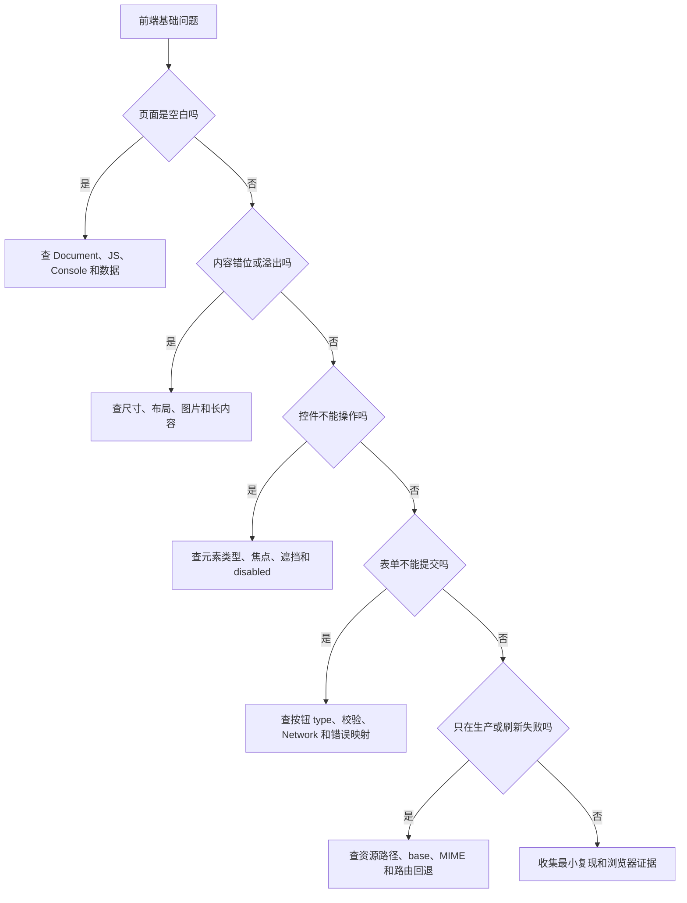

# 前端基础常见问题

## 这个页面怎样使用

这页用于快速分流。先按现象找到最短检查路径；需要完整根因、修复代码和预防方式时，再进入 [HTML 与无障碍真实项目问题库](/projects/issues-html-accessibility)。

## 快速分流图



## 页面空白

按顺序检查：

1. Network 中 Document 是否为 200。
2. Document 响应是否真的是 HTML，而不是网关错误页。
3. 主 CSS 和 JS 是否为 200，MIME 是否正确。
4. Console 第一条错误是什么。
5. Elements 中主体内容是否存在。
6. 禁用 CSS 后内容是否出现。
7. 禁用 JavaScript 后是否有静态回退。

不要先清缓存或重装依赖。先确认是哪一层没有产生内容。

## 链接点击没反应

| 检查 | 判断 |
| --- | --- |
| 是否为 `a` 且有 `href` | 导航应使用真实链接 |
| 是否被透明元素遮挡 | Elements 检查命中元素和层级 |
| 是否有 click 监听报错 | 看 Console 第一条错误 |
| 是否调用了 `preventDefault` | 确认是否有替代导航逻辑 |
| URL 是否有效 | 直接复制到地址栏访问 |

## 按钮意外提交

表单内所有按钮显式声明：

```html
<button type="button">普通操作</button>
<button type="submit">提交表单</button>
```

如果仍重复提交，检查是否同时监听 `click` 和 `submit` 并各自发请求。网络请求应集中在 `submit` 流程。

## Tab 找不到控件

先看最终元素：

- 操作是否使用 `button`。
- 导航是否使用有 `href` 的 `a`。
- 元素是否被 `disabled`、`hidden`、`inert` 或 `display: none` 排除。
- 是否误用了负 `tabindex`。
- 焦点样式是否被全局 CSS 删除。

不要用大量 `tabindex="1"`、`tabindex="2"` 修复。优先修正 DOM 和原生元素。

## 输入框点击标签不聚焦

确认 `label for` 与 `input id` 完全一致：

```html
<label for="user-email">邮箱</label>
<input id="user-email" name="email" type="email" />
```

组件循环中要保证 `id` 唯一。重复 id 会让标签指向错误字段。

## 错误提示读不到

```html
<input
  id="email"
  aria-invalid="true"
  aria-describedby="email-error"
/>
<p id="email-error">请输入有效邮箱。</p>
```

长表单还需要错误摘要和焦点处理。不要只显示 Toast 或红色边框。

## 图片变形

区分两种目标：

```css
/* 完整显示图片 */
.content-image {
  width: 100%;
  height: auto;
}

/* 固定卡片比例并允许裁切 */
.card-image {
  width: 100%;
  aspect-ratio: 16 / 9;
  object-fit: cover;
}
```

如果 HTML 的 `width`/`height` 比例与真实资源不一致，也可能造成错误占位和跳动。

## 页面有横向滚动

先在 Console 定位可疑元素：

```js
console.table(
  [...document.querySelectorAll('body *')]
    .filter((element) => element.getBoundingClientRect().right > innerWidth)
    .map((element) => ({
      element,
      right: element.getBoundingClientRect().right,
      width: element.getBoundingClientRect().width
    }))
)
```

常见来源：

- `width: 100vw` 叠加滚动条。
- 固定像素宽度超过容器。
- Grid/Flex 子项缺少 `min-width: 0`。
- 长英文、URL、代码不换行。
- 表格、图片或 SVG 没有局部滚动或尺寸约束。

详细排查进入 [CSS 真实项目问题库](/projects/issues-css)。

## 图片、字体或脚本只在生产 404

检查：

```text
请求 URL
构建产物中是否存在
文件名大小写
Vite base
public 路径与 import 资源是否混用
服务器 Content-Type
子路径部署配置
```

必须运行：

```bash
npm run build
npm run preview
```

开发服务器成功不能证明生产资源路径正确。

## 详情页站内跳转正常，刷新 404

这是服务器路由与客户端路由不一致：

- 多页站需要真实 HTML 文件。
- SPA 需要正确 fallback 到 `index.html`。
- SSR/元框架需要对应平台运行时。
- 静态导出只能访问实际生成的路由。

修复后用地址栏直接打开深层 URL，不只站内点击。

## 弹窗关闭后焦点消失

打开前记录触发元素，打开后移动焦点，关闭后归还：

```js
let trigger

function openDialog(button) {
  trigger = button
  dialog.showModal()
  dialog.querySelector('input, button')?.focus()
}

dialog.addEventListener('close', () => trigger?.focus())
```

同时检查背景是否仍能获得焦点，以及弹窗是否有标题。

## 关闭 JavaScript 后什么都没有

先判断项目类型：

| 类型 | 推荐策略 |
| --- | --- |
| 内容站 | 静态生成或服务端渲染核心内容 |
| 无框架页面 | 核心 HTML 直接存在，JS 渐进增强 |
| SPA 业务系统 | 清楚加载/失败回退、错误监控和恢复入口 |
| 表单 | 有真实 action，或明确说明必须启用 JS |

不要用 `<noscript>` 放一整套与主内容长期不同步的页面。

## 最小问题报告

提问或提交缺陷时至少提供：

```text
复现 URL：
浏览器与系统：
视口与缩放：
输入方式：
最短复现步骤：
期望结果：
实际结果：
Console 第一条错误：
Network 异常请求：
最终 DOM / Accessibility 信息：
开发环境还是生产环境：
```

## 下一步学习

需要完整案例时进入 [HTML 与无障碍真实项目问题库](/projects/issues-html-accessibility)。想系统验证能力，完成 [前端基础专项练习](/roadmap/frontend-foundation-practice)。
