# 图解前端页面核心概念

## 这个页面解决什么

初学前端最容易把 HTML、CSS、JavaScript 当成三门互不相关的语法。本页用图把它们放回同一条浏览器链路，重点回答：

- 浏览器怎样从 HTML 得到可见页面。
- 语义结构为什么会影响键盘、读屏、搜索和维护。
- 表单从输入到提交经历哪些状态。
- 图片和脚本为什么会影响布局与加载性能。
- CSS 和 JavaScript 失败时，页面怎样保留核心能力。
- 出现“能看但不能用”时，应该沿哪条路径排查。

建议先顺着每张图讲一遍，再打开 DevTools 对照真实页面。

## 1. 一个页面不是一张图片

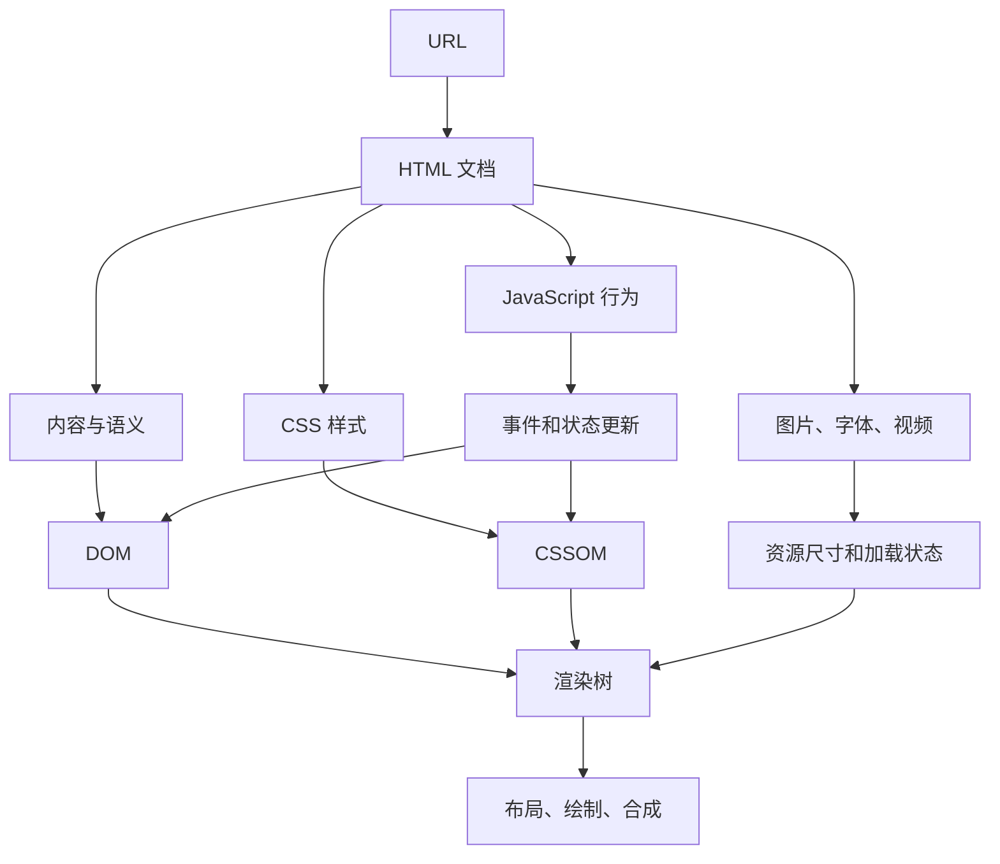

页面至少有四种事实：

| 事实 | 由谁表达 | 示例 |
| --- | --- | --- |
| 内容是什么 | HTML | 标题、文章、表单、导航 |
| 看起来怎样 | CSS | 尺寸、位置、颜色、响应式 |
| 用户操作后怎样变化 | JavaScript | 筛选、校验、请求、弹窗 |
| 外部资源是什么 | URL 与响应 | 图片、字体、模块、接口数据 |

CSS 不能替代语义，JavaScript 也不应该把所有内容从零拼出来。分工越清楚，页面越容易维护和降级。

## 2. 浏览器解析 HTML 是边下载边建树

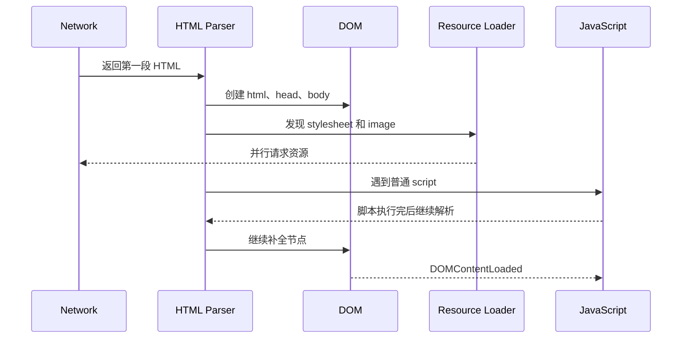

重要结论：

- 普通同步 `<script>` 可能暂停 HTML 解析。
- `defer` 脚本会在文档解析后按顺序执行，适合依赖 DOM 的页面脚本。
- `type="module"` 默认具有延后执行特性，并使用模块作用域。
- 图片通常不会阻止 DOM 构建，但没有稳定尺寸会在加载后推动内容。
- `DOMContentLoaded` 与所有图片都加载完成不是一回事。

最小文档骨架：

```html
<!doctype html>
<html lang="zh-CN">
  <head>
    <meta charset="UTF-8" />
    <meta name="viewport" content="width=device-width, initial-scale=1" />
    <title>课程目录</title>
    <link rel="stylesheet" href="/styles.css" />
    <script type="module" src="/src/main.js"></script>
  </head>
  <body>
    <main id="main-content"></main>
  </body>
</html>
```

## 3. DOM 是结构，不是源码文本

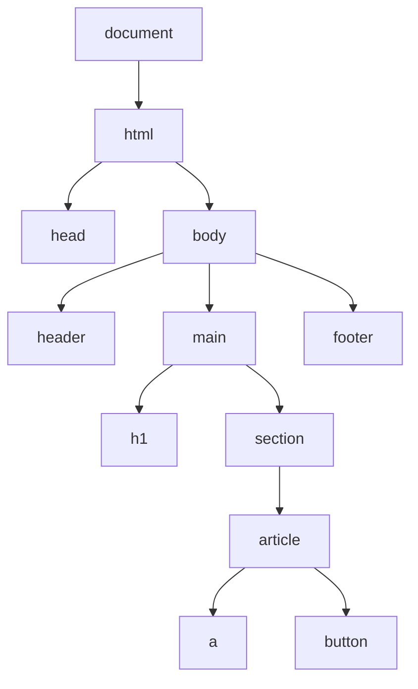

HTML 源码经过解析后会变成 DOM。浏览器可能纠正不完整结构，所以 Elements 面板里的 DOM 不一定与源码逐字相同。

排查结构问题时区分：

| 证据 | 回答什么 |
| --- | --- |
| 查看页面源代码 | 服务器最初返回了什么 |
| Elements 面板 | 浏览器解析和脚本修改后是什么 |
| Network 的 Document 响应 | 实际收到的状态码、响应头和正文 |
| JavaScript 日志 | 哪段行为修改了节点或状态 |

## 4. 视觉树和可访问性树不是同一棵树

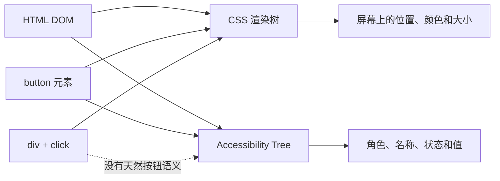

一个视觉上像按钮的 `div`，在可访问性树里可能只是普通容器。原生 `button` 通常已经提供：

- button 角色。
- 键盘焦点。
- Enter 和 Space 激活。
- `disabled` 状态。
- 表单提交行为。

优先使用正确元素，再用 CSS 改外观；ARIA 不能自动补齐所有键盘和表单行为。

## 5. 页面区域和标题形成阅读地图

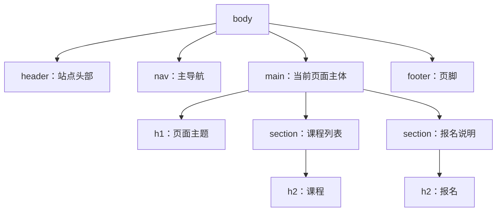

清楚结构让用户可以：

- 通过标题快速扫描。
- 使用辅助技术在区域和标题之间跳转。
- 在 CSS 失效时仍看懂内容顺序。
- 让团队从标签上理解区域职责。

不要为了字体大小跳过标题级别。视觉大小交给 CSS，文档层级交给 `h1` 到 `h6`。

## 6. 链接和按钮的决策图

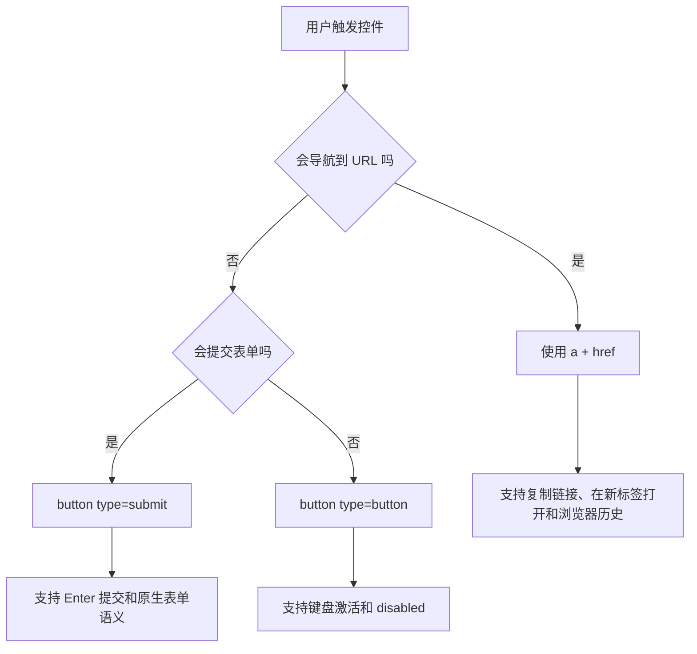

常见错误：

```html
<!-- 错：没有真实导航能力 -->
<div onclick="location.href='/courses/html'">查看课程</div>

<!-- 错：默认 type=submit，可能误提交表单 -->
<button>打开帮助</button>
```

推荐：

```html
<a href="/courses/html">查看 HTML 课程</a>
<button type="button" aria-expanded="false" aria-controls="help-panel">
  打开帮助
</button>
```

## 7. 表单是一条状态链

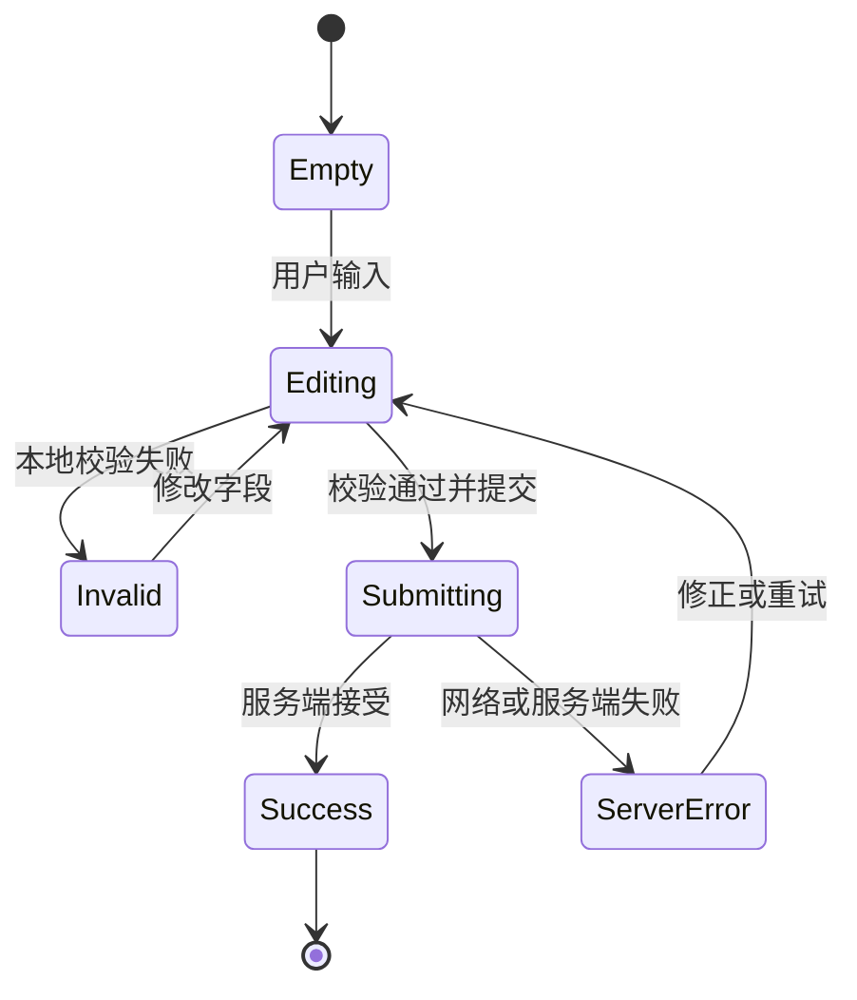

一个完整表单不只有输入框和提交按钮，还需要：

| 状态 | 页面必须表达什么 |
| --- | --- |
| 初始 | 字段用途、必填信息、输入格式 |
| 编辑 | 当前值、焦点、帮助信息 |
| 无效 | 哪个字段错、为什么错、怎样修 |
| 提交中 | 防重复提交、可感知进度 |
| 成功 | 结果和下一步 |
| 失败 | 错误类型、已保留的数据、重试方式 |

服务端必须重新校验。浏览器校验改善体验，但不能作为安全边界。

## 8. label、描述和错误要形成可计算关系

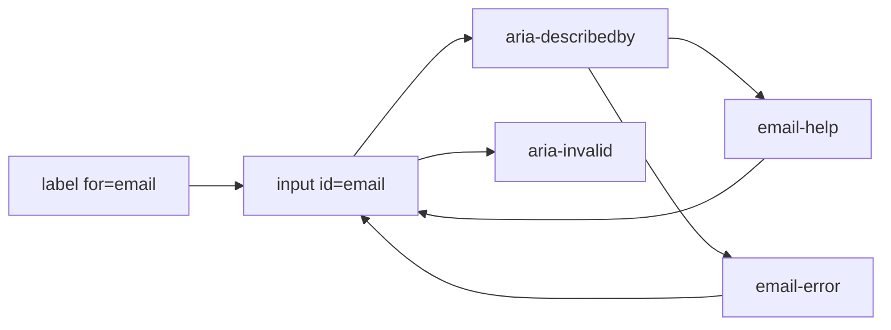

```html
<div class="form-field">
  <label for="email">邮箱</label>
  <p id="email-help">用于接收报名确认。</p>
  <input
    id="email"
    name="email"
    type="email"
    autocomplete="email"
    aria-describedby="email-help email-error"
    aria-invalid="true"
    required
  />
  <p id="email-error" role="alert">请输入有效邮箱，例如 name@example.com。</p>
</div>
```

占位符不能替代标签。用户输入后占位符会消失，且它通常不适合承担持续可见的字段名称。

## 9. 图片选择由用途和容器共同决定

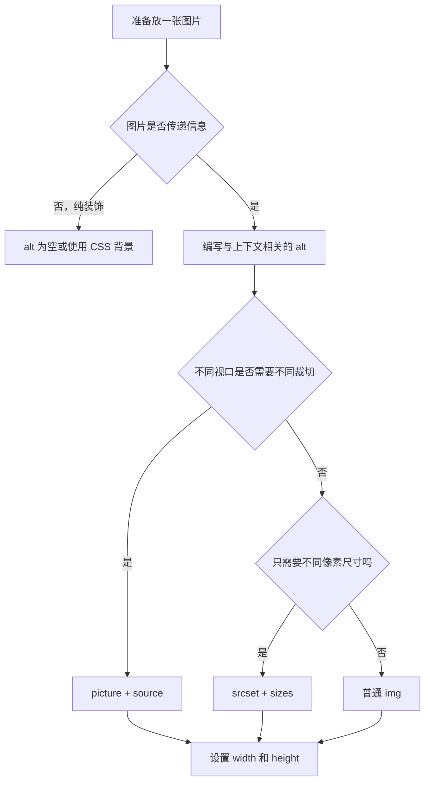

`width` 和 `height` 不只是显示尺寸提示。浏览器可以提前计算宽高比，为图片保留空间，减少加载后的布局偏移。

```html

```

首屏关键图片不要机械添加 `loading="lazy"`。延迟加载适合首屏之外的资源。

## 10. CSS 布局先解决约束，再解决装饰

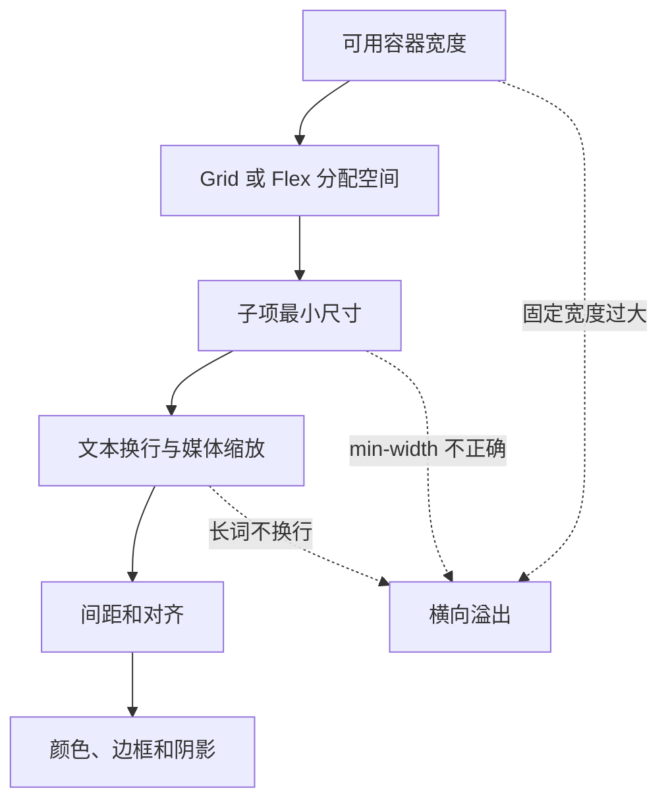

稳健的内容网格：

```css
.course-grid {
  display: grid;
  grid-template-columns: repeat(auto-fit, minmax(min(100%, 18rem), 1fr));
  gap: 1rem;
}

.course-card {
  min-width: 0;
}

.course-card__image {
  display: block;
  width: 100%;
  height: auto;
  aspect-ratio: 16 / 9;
  object-fit: cover;
}

.course-card__description {
  overflow-wrap: anywhere;
}
```

详细布局规则继续看 [CSS 学习导览](/css/introduction)。

## 11. 移动端不是桌面端缩小版

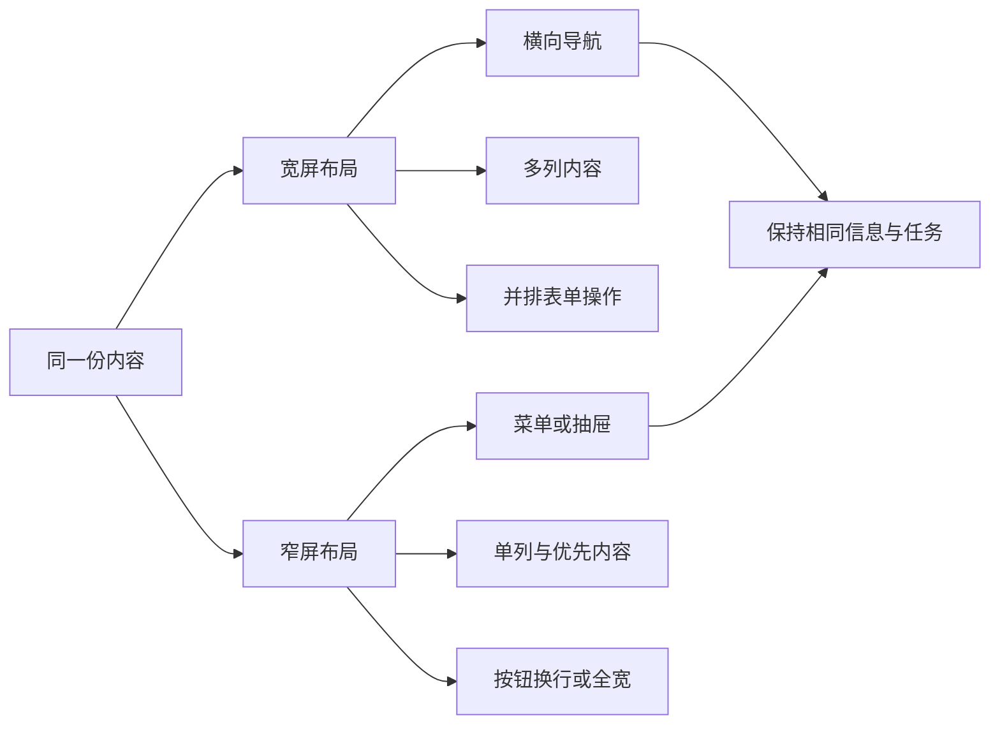

响应式要调整信息组织，而不是隐藏重要能力：

- 主任务仍应在首屏容易发现。
- 导航收进菜单后要有明确按钮名称和展开状态。
- 表格应选择局部滚动、关键字段卡片或分层详情，而不是把所有列压到不可读。
- 触摸目标需要足够空间，不能只靠 hover 暴露操作。
- 200% 缩放后仍应能阅读和操作。

## 12. 事件会沿 DOM 路径传播

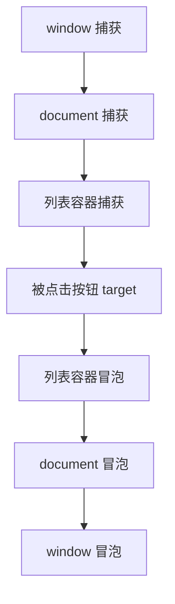

事件委托利用冒泡，在稳定父容器上处理动态列表：

```js
const courseList = document.querySelector('[data-course-list]')

courseList?.addEventListener('click', (event) => {
  const button = event.target.closest('[data-enroll-course]')

  if (!button || !courseList.contains(button)) return

  openEnrollDialog(button.dataset.enrollCourse)
})
```

注意：

- 用 `closest` 找真实动作元素，不要假设点击目标一定是按钮本身。
- 事件委托不能代替正确 HTML，动作仍应使用 `button` 或 `a`。
- 全局事件、Observer、定时器和订阅需要明确清理点。

## 13. 渐进增强让失败更可控

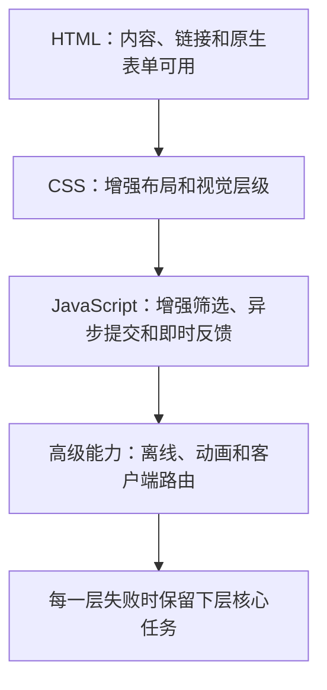

以报名表单为例：

1. HTML 使用真实 `form action="/api/enroll" method="post"`。
2. 没有 JavaScript 时，浏览器仍能正常提交和导航到结果页。
3. JavaScript 可拦截提交，增加加载态和局部更新。
4. 异步请求失败时，显示错误并允许重试，不清空用户输入。

这不意味着所有应用都必须完全无 JavaScript，而是核心内容和失败边界要明确。

## 14. 焦点是键盘用户的当前位置

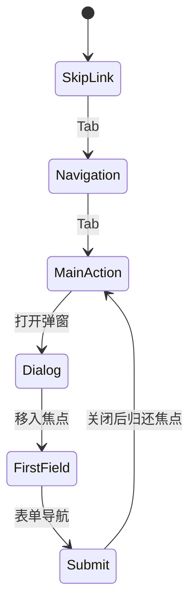

弹窗、菜单和错误提示需要管理焦点：

- 打开弹窗后把焦点移入弹窗。
- 弹窗打开时不要让焦点跑到背景页面。
- Escape 关闭是否适用要根据组件行为决定。
- 关闭后把焦点还给触发按钮。
- 不要用 `outline: none` 删除焦点可见性，除非提供同等清楚的替代样式。

```css
:focus-visible {
  outline: 3px solid #08785f;
  outline-offset: 3px;
}
```

## 15. 页面导航要保留浏览器能力

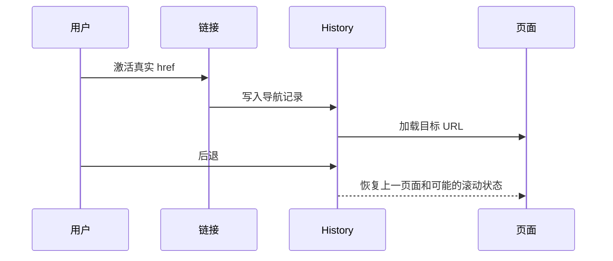

真实 URL 带来的能力包括：

- 复制和分享。
- 新标签打开。
- 前进和后退。
- 书签。
- 服务端日志和访问分析。
- 刷新后恢复当前页面。

不要把所有“页面”藏在一个点击后切换 `display` 的容器里；应用路由也应维护真实 URL 和历史语义。

## 16. 排障从现象进入证据链

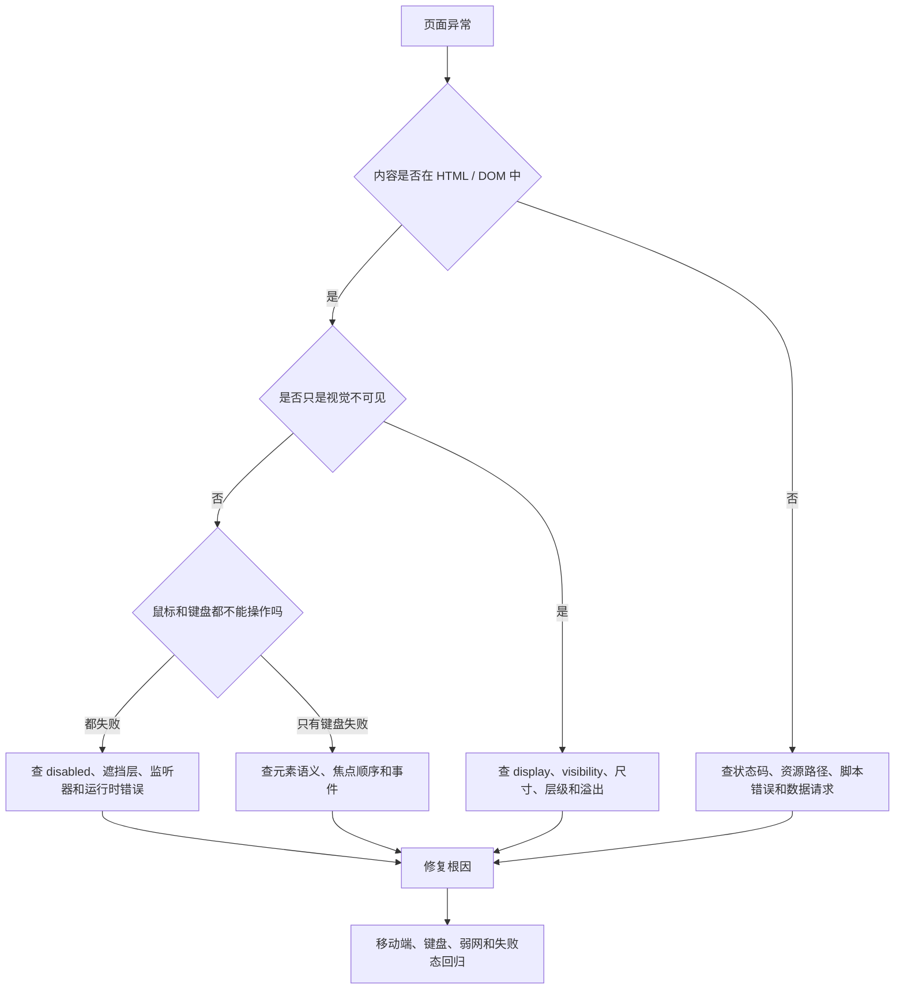

建议固定收集：

```text
复现 URL、视口和操作步骤
Document / CSS / JS / 图片的状态码
Console 第一条错误
Elements 中最终 DOM
Computed 中最终尺寸与可见性
Accessibility 面板中的角色和名称
仅键盘操作结果
关闭 JavaScript 后的核心内容
390px、1440px 和 200% 缩放结果
```

## 一张图串起完整交付

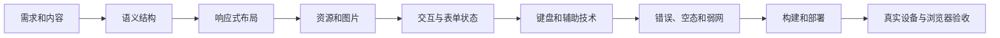

顺序很重要。结构错误不能靠最后补一个 ARIA 属性解决；资源和布局没有约束，也不能靠上线后临时隐藏溢出解决。

## 最小自测

读完后尝试不看正文回答：

1. DOM、CSSOM 和渲染结果分别是什么？
2. 为什么视觉上像按钮，不代表它是可用按钮？
3. 表单错误为什么不能只显示红色边框？
4. `srcset`、`sizes`、`width` 和 `height` 各解决什么？
5. 为什么移动端适配不是把桌面布局整体缩小？
6. 渐进增强如何降低脚本失败的影响？
7. 键盘焦点在弹窗打开和关闭时应该去哪里？
8. 页面不可点击时，怎样区分语义、遮挡和脚本问题？

如果其中三个问题回答不清楚，回到对应图，沿箭头用自己的话讲一遍。

## 参考资料

- [WHATWG HTML Living Standard](https://html.spec.whatwg.org/)
- [MDN Semantic HTML](https://developer.mozilla.org/en-US/curriculum/core/semantic-html/)
- [MDN HTML Accessibility](https://developer.mozilla.org/en-US/docs/Learn_web_development/Core/Accessibility/HTML)
- [MDN Responsive Images](https://developer.mozilla.org/en-US/docs/Learn/HTML/Multimedia_and_embedding/Responsive_images)
- [W3C WAI Tutorials](https://www.w3.org/WAI/tutorials/)

## 下一步学习

继续学习 [HTML 语义与页面结构](/frontend/html-semantics)，再进入 [表单、图片与无障碍](/frontend/forms-media-accessibility)。想直接把整条链路做成作品，可以进入 [前端基础从零到项目](/frontend/project-from-zero)。
