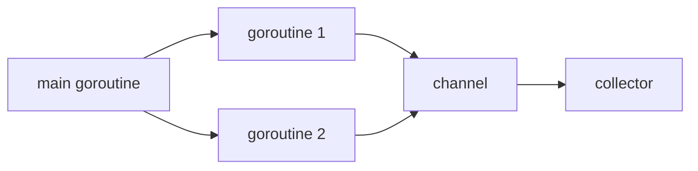

# 并发：goroutine、channel、select

## 这个页面解决什么

Go 的并发能力很强，但也容易写出 goroutine 泄漏、channel 死锁、数据竞争。要先理解模型，再写并发代码。

## goroutine

```go
go func() {
    doWork()
}()
```

goroutine 很轻量，但不是免费资源。每个 goroutine 都需要退出条件。

## channel

```go
ch := make(chan string)

go func() {
    ch <- "done"
}()

msg := <-ch
```

channel 用于 goroutine 之间通信。

## 并发模型



## select

```go
select {
case result := <-resultCh:
    return result, nil
case <-ctx.Done():
    return nil, ctx.Err()
}
```

`select` 常用于等待多个 channel，尤其是结果和取消信号。

## WaitGroup

```go
var wg sync.WaitGroup
for _, item := range items {
    item := item
    wg.Add(1)
    go func() {
        defer wg.Done()
        process(item)
    }()
}
wg.Wait()
```

## 数据竞争

多个 goroutine 同时读写共享变量时，会出现数据竞争。

```go
var count int
go func() { count++ }()
go func() { count++ }()
```

使用：

- channel 汇总结果。
- `sync.Mutex` 保护共享状态。
- `sync/atomic` 处理简单原子计数。

## 实际项目问题

### 1. goroutine 泄漏

没有退出条件，或者发送 channel 后无人接收。

解决：

- 传入 context。
- channel 关闭规则明确。
- select 监听取消。

### 2. channel 死锁

无缓冲 channel 发送和接收必须同时准备好。没人接收时发送会阻塞。

### 3. 并发打爆下游

给每个任务开 goroutine，结果数据库或外部接口被打满。

解决：

- worker pool。
- semaphore。
- 限流。
- context 超时。

## 最佳实践

- 每个 goroutine 都要知道什么时候退出。
- 共享数据要有同步策略。
- 不用 channel 也可以并发，简单场景 Mutex 更清晰。
- 并发数量要受控。
- 使用 `go test -race` 检查数据竞争。

## 下一步学习

继续学习 [Context、HTTP 服务与中间件](/go/context-http)。
