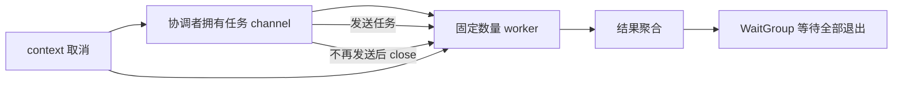
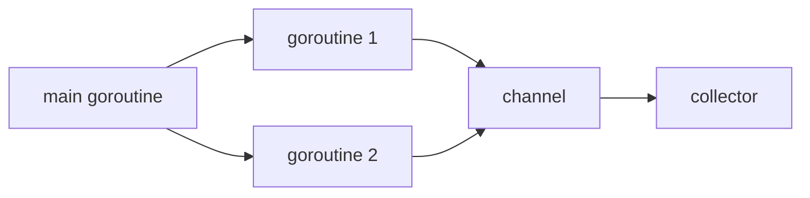

# 并发：goroutine、channel、select

## 适合谁看

适合会写 `go func()`，但还不能明确回答“谁创建、谁停止、谁关闭 channel、并发上限是多少”的读者。

## 先建立心智模型

并发代码不是“启动越多越快”，而是管理一组有生命周期的工作。创建 goroutine 的位置必须同时定义退出条件、错误归属和等待方式。



## 从最小示例开始

### goroutine

```go
go func() {
    doWork()
}()
```

goroutine 很轻量，但不是免费资源。每个 goroutine 都需要退出条件。

### channel

```go
ch := make(chan string)

go func() {
    ch <- "done"
}()

msg := <-ch
```

channel 用于 goroutine 之间通信。

### 并发模型



### select

```go
select {
case result := <-resultCh:
    return result, nil
case <-ctx.Done():
    return nil, ctx.Err()
}
```

`select` 常用于等待多个 channel，尤其是结果和取消信号。

### WaitGroup

```go
var wg sync.WaitGroup
for _, item := range items {
    item := item
    wg.Add(1)
    go func() {
        defer wg.Done()
        process(item)
    }()
}
wg.Wait()
```

### 数据竞争

多个 goroutine 同时读写共享变量时，会出现数据竞争。

```go
var count int
go func() { count++ }()
go func() { count++ }()
```

使用：

- channel 汇总结果。
- `sync.Mutex` 保护共享状态。
- `sync/atomic` 处理简单原子计数。

## 放进真实项目

### channel 所有权与关闭规则

- 发送方拥有 channel，并在确定不会再发送时关闭。
- 接收方读取关闭状态，不关闭自己不拥有的 channel。
- channel 不必总是关闭；只有接收方需要“不会再有值”这个信号时才关闭。
- 向已关闭 channel 发送会 panic，重复关闭也会 panic。

受控 worker pool：

```go
func runWorkers(ctx context.Context, jobs <-chan Job, workers int) error {
    var wg sync.WaitGroup
    wg.Add(workers)
    for range workers {
        go func() {
            defer wg.Done()
            for {
                select {
                case <-ctx.Done():
                    return
                case job, ok := <-jobs:
                    if !ok { return }
                    process(ctx, job)
                }
            }
        }()
    }
    wg.Wait()
    return ctx.Err()
}
```

### sync 工具怎么选

| 需求 | 优先工具 |
| --- | --- |
| 等待一组 goroutine 结束 | `sync.WaitGroup` |
| 保护复合共享状态 | `sync.Mutex` / `RWMutex` |
| 一次性初始化 | `sync.Once` |
| 简单计数或布尔状态 | `sync/atomic` |
| 传递数据与所有权 | channel |
| 请求范围取消 | `context.Context` |

Mutex 通常比“为了不用锁而套 channel”更清楚。channel 适合通信和所有权转移，不是所有共享状态的默认答案。

## 常见错误与根因

### 1. goroutine 泄漏

没有退出条件，或者发送 channel 后无人接收。

解决：

- 传入 context。
- channel 关闭规则明确。
- select 监听取消。

### 2. channel 死锁

无缓冲 channel 发送和接收必须同时准备好。没人接收时发送会阻塞。

### 3. 并发打爆下游

给每个任务开 goroutine，结果数据库或外部接口被打满。

解决：

- worker pool。
- semaphore。
- 限流。
- context 超时。

### 4. 错误 channel 无人读取

goroutine 尝试发送错误，但调用方已提前返回，发送永久阻塞。使用容量为 1 的结果 channel，或让发送也监听 `ctx.Done()`。

### 5. 只在测试结尾看 goroutine 数

goroutine 数会受运行时影响，单纯比较数量容易误报。应结合 goroutine profile、阻塞堆栈和能重复触发的生命周期测试判断泄漏。

## 验证清单

- [ ] 每个 `go` 语句旁都能指出退出条件与等待者。
- [ ] channel 的创建者、发送者和关闭者唯一且明确。
- [ ] 下游并发量有固定上限，不随输入无限增长。
- [ ] 所有阻塞发送、接收和外部调用都能响应取消。
- [ ] 共享数据有 Mutex、atomic 或单一所有者，不混用隐含策略。
- [ ] 已运行 `go test -race ./...`，并用重复测试覆盖取消和关闭路径。

## 下一步学习

继续学习 [Context、HTTP 服务与中间件](/go/context-http)。
