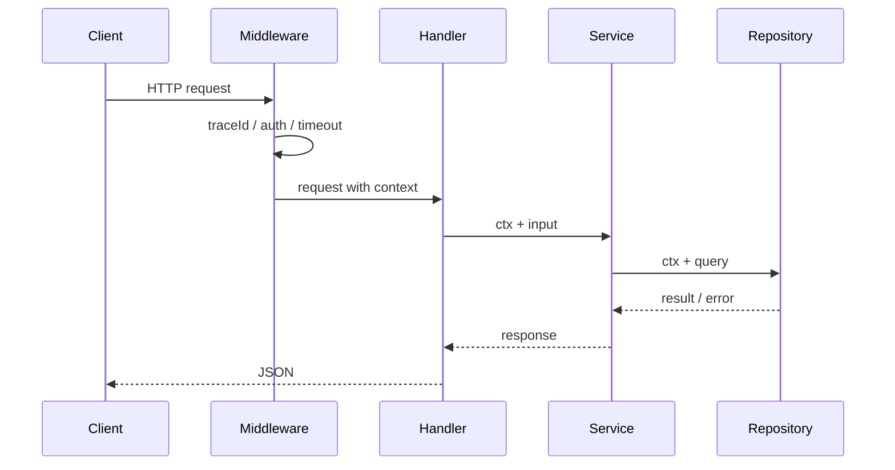

# Context、HTTP 服务与中间件

## 这个页面解决什么

Go 后端服务必须处理超时、取消、日志、鉴权、traceId 和优雅关闭。`context.Context` 是请求生命周期的核心。

## context 做什么

`context` 用于传递：

- 取消信号。
- 超时时间。
- 请求级元数据。

不要把大量业务参数塞进 context。业务参数应显式传递。

## 请求生命周期



## HTTP Handler

```go
func GetUser(service *UserService) http.HandlerFunc {
    return func(w http.ResponseWriter, r *http.Request) {
        ctx := r.Context()
        user, err := service.GetUser(ctx, 1)
        if err != nil {
            writeError(w, err)
            return
        }
        writeJSON(w, user)
    }
}
```

## 中间件

```go
func Timeout(next http.Handler) http.Handler {
    return http.HandlerFunc(func(w http.ResponseWriter, r *http.Request) {
        ctx, cancel := context.WithTimeout(r.Context(), 3*time.Second)
        defer cancel()
        next.ServeHTTP(w, r.WithContext(ctx))
    })
}
```

## 优雅关闭

```go
srv := &http.Server{Addr: ":8080", Handler: router}

go func() {
    if err := srv.ListenAndServe(); err != http.ErrServerClosed {
        log.Fatal(err)
    }
}()

ctx, cancel := context.WithTimeout(context.Background(), 10*time.Second)
defer cancel()
_ = srv.Shutdown(ctx)
```

## 实际项目问题

### 1. 数据库查询不传 context

请求已经超时，SQL 仍在执行。应使用 `QueryContext`、`ExecContext`。

### 2. context 作为结构体字段保存

不要把请求 context 保存到长期对象里。context 生命周期跟请求走。

### 3. 中间件顺序混乱

推荐顺序：

```text
recover
↓
request id / trace
↓
logging
↓
timeout
↓
auth
↓
handler
```

## 最佳实践

- Handler 第一时间取 `r.Context()`。
- Service 和 Repository 都接收 ctx。
- 所有外部调用支持超时。
- context 只放请求级元数据。
- 服务关闭时使用 graceful shutdown。

## 下一步学习

继续学习 [数据库、事务与仓储层](/go/database-transaction)。
