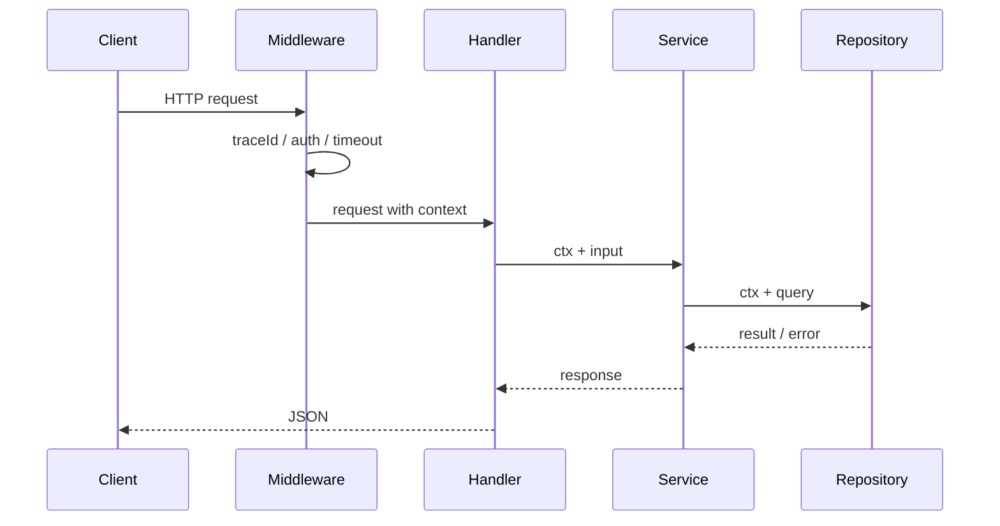

# Context、HTTP 服务与中间件

## 适合谁看

适合正在写 HTTP API，需要把客户端取消、服务端 deadline、数据库查询和优雅关闭串成一条生命周期的读者。

## 先建立心智模型

`context` 是一棵只向下传播的取消树。父 context 取消会通知所有子节点；子节点完成不会反向取消父节点。它传递的是生命周期信号和少量请求元数据，不是可选参数容器。

## 从最小示例开始

### context 做什么

`context` 用于传递：

- 取消信号。
- 超时时间。
- 请求级元数据。

不要把大量业务参数塞进 context。业务参数应显式传递。

### 请求生命周期



### HTTP Handler

```go
func GetUser(service *UserService) http.HandlerFunc {
    return func(w http.ResponseWriter, r *http.Request) {
        ctx := r.Context()
        user, err := service.GetUser(ctx, 1)
        if err != nil {
            writeError(w, err)
            return
        }
        writeJSON(w, user)
    }
}
```

### 中间件

```go
func Timeout(next http.Handler) http.Handler {
    return http.HandlerFunc(func(w http.ResponseWriter, r *http.Request) {
        ctx, cancel := context.WithTimeout(r.Context(), 3*time.Second)
        defer cancel()
        next.ServeHTTP(w, r.WithContext(ctx))
    })
}
```

## 放进真实项目

Deadline 中间件只用 `context.WithTimeout` 包装请求并同步调用下游，不需要额外启动 handler goroutine。额外 goroutine 会让响应写入越过中间件生命周期，造成并发写、泄漏和难以关闭。

```go
func Deadline(timeout time.Duration) func(http.Handler) http.Handler {
    return func(next http.Handler) http.Handler {
        return http.HandlerFunc(func(w http.ResponseWriter, r *http.Request) {
            ctx, cancel := context.WithTimeout(r.Context(), timeout)
            defer cancel()
            next.ServeHTTP(w, r.WithContext(ctx))
        })
    }
}
```

中间件从外到内建议为：Request ID -> access log -> recover -> deadline -> content type -> route handler。最外层 Request ID 确保 panic、超时和 404 都能关联；access log 包住 recover 才能记录最终状态。

### 优雅关闭

```go
srv := &http.Server{Addr: ":8080", Handler: router}

go func() {
    if err := srv.ListenAndServe(); err != http.ErrServerClosed {
        log.Fatal(err)
    }
}()

ctx, cancel := context.WithTimeout(context.Background(), 10*time.Second)
defer cancel()
_ = srv.Shutdown(ctx)
```

关闭顺序应是：收到信号 -> readiness 变 503 -> 停止接受新连接 -> 等待在途请求 -> 超时后强制关闭 -> 关闭数据库。liveness 不应因为数据库短暂故障变 500，否则编排系统可能反复重启本来可以恢复的进程。

## 常见错误与根因

### 1. 数据库查询不传 context

请求已经超时，SQL 仍在执行。应使用 `QueryContext`、`ExecContext`。

### 2. context 作为结构体字段保存

不要把请求 context 保存到长期对象里。context 生命周期跟请求走。

### 3. 中间件顺序混乱

推荐顺序：

```text
recover
↓
request id / trace
↓
logging
↓
timeout
↓
auth
↓
handler
```

### 4. 用 `context.Background()` 断开请求取消

Repository 若换成 Background，客户端已离开后 SQL 仍会占连接。除非是明确独立、可追踪、可关闭的后台任务，否则继续传入请求 ctx。

### 5. 把 context 保存进 Service 字段

Service 生命周期通常跨请求，保存第一个请求的 ctx 会把后续调用绑定到错误生命周期。ctx 应作为每个方法的第一个参数显式传递。

## 验证清单

- [ ] Handler、Service、Repository 和外部调用使用同一请求取消链。
- [ ] 每个 `WithCancel`、`WithTimeout`、`WithDeadline` 都调用 cancel。
- [ ] deadline 中间件同步调用下游，不额外启动 handler goroutine。
- [ ] context value 的 key 是私有类型，只保存 request ID 等请求元数据。
- [ ] readiness 在关闭开始时先变 503，liveness 仍能反映进程存活。
- [ ] Shutdown 有上限，超时后有明确强制关闭路径。

## 下一步学习

如果你还没有做过完整后端项目，继续进入 [Go HTTP API 从零到项目落地](/go/http-api-project-from-zero)，把 HTTP、middleware、context、数据库、测试和部署串成一个可运行 API。已经有项目经验后，再学习 [数据库、事务与仓储层](/go/database-transaction)。
