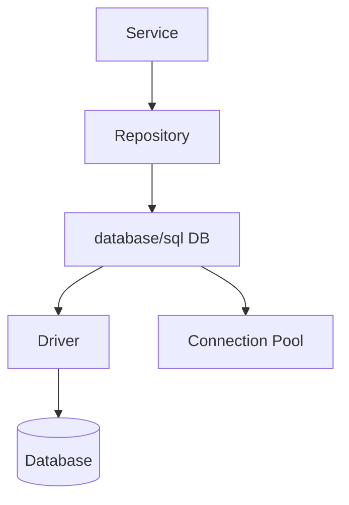
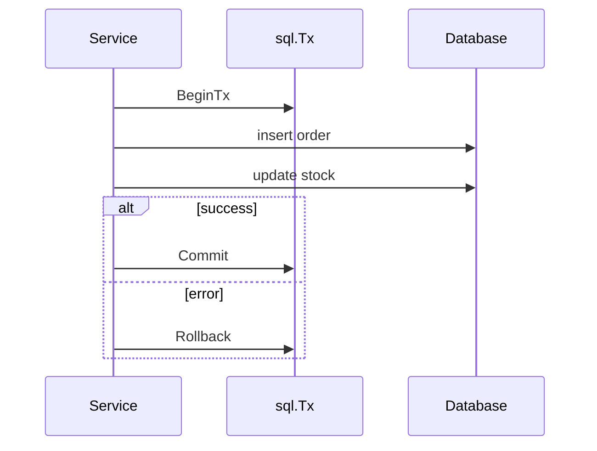

# 数据库、事务与仓储层

## 这个页面解决什么

Go 标准库的 `database/sql` 提供通用数据库接口。项目里要理解连接池、context、事务、扫描结果和仓储层边界。

## database/sql 结构



`*sql.DB` 不是一个单独连接，而是连接池句柄，应在应用启动时创建并复用。

## 查询示例

```go
func (r *UserRepository) FindByID(ctx context.Context, id int64) (*User, error) {
    row := r.db.QueryRowContext(ctx, `
        select id, name, email
        from users
        where id = ?
    `, id)

    var user User
    if err := row.Scan(&user.ID, &user.Name, &user.Email); err != nil {
        return nil, fmt.Errorf("scan user id=%d: %w", id, err)
    }
    return &user, nil
}
```

## 事务

```go
tx, err := db.BeginTx(ctx, nil)
if err != nil {
    return err
}
defer tx.Rollback()

// 执行多条 SQL

if err := tx.Commit(); err != nil {
    return err
}
```

`defer tx.Rollback()` 在 Commit 成功后会返回已提交错误，通常可以忽略。这样能保证异常路径自动回滚。

## 事务边界



## 连接池设置

常见设置：

```go
db.SetMaxOpenConns(20)
db.SetMaxIdleConns(10)
db.SetConnMaxLifetime(time.Hour)
```

连接数要结合数据库能力、服务副本数和 SQL 耗时设置。

## 实际项目问题

### 1. rows 没有关闭

```go
rows, err := db.QueryContext(ctx, query)
if err != nil {
    return err
}
defer rows.Close()
```

不关闭会导致连接不能及时归还连接池。

### 2. 事务里调用外部接口

和 Java 一样，事务里调用外部接口会拉长锁持有时间。应把外部调用移出事务，或者使用事件机制。

### 3. SQL 超时无法取消

没有把请求 ctx 传进数据库调用，导致请求超时后数据库仍执行。

## 最佳实践

- `*sql.DB` 全局复用，不每次请求创建。
- 查询必须传 context。
- `rows` 必须关闭。
- 事务边界放在 Service 或专门的 transaction helper。
- 慢查询和连接池指标要可观测。

## 下一步学习

继续学习 [测试、Benchmark 与 Fuzzing](/go/testing)。
