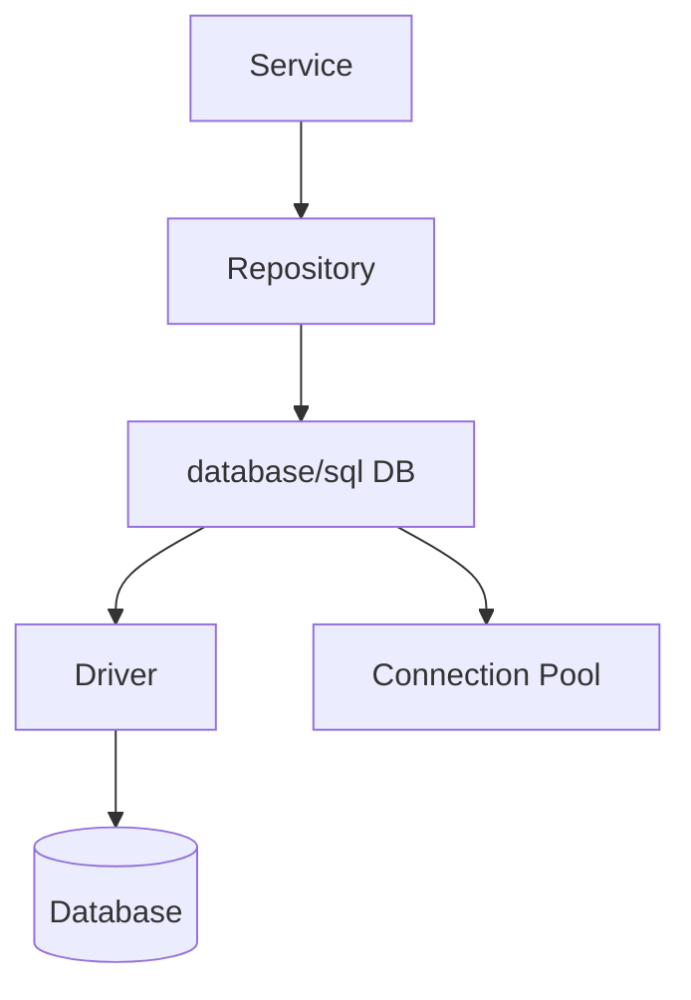
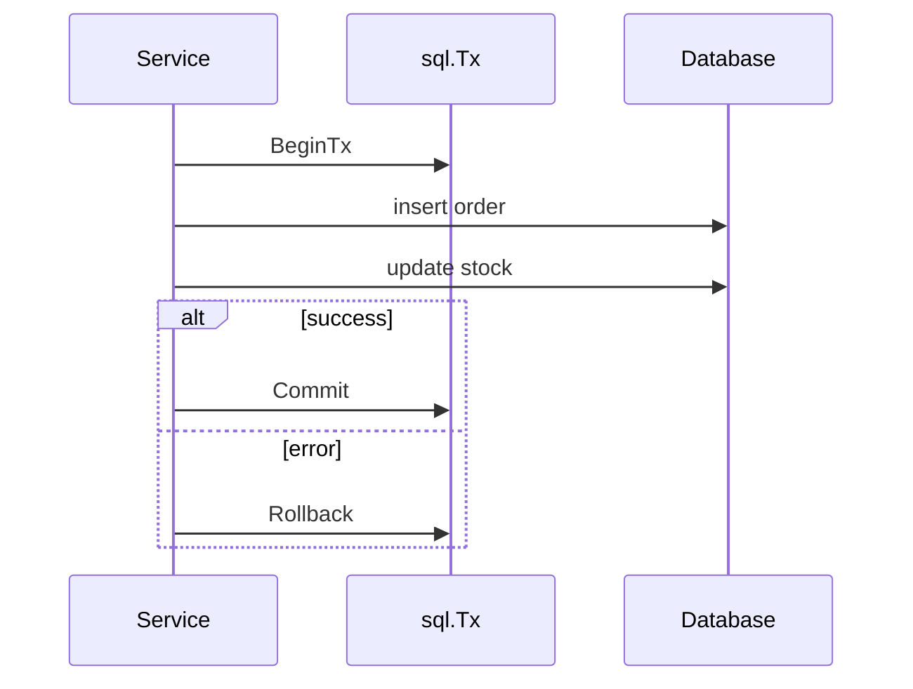

# 数据库、事务与仓储层

## 适合谁看

适合第一次使用 `database/sql`，或遇到连接耗尽、事务泄漏、丢失更新和迁移漂移的读者。示例以 PostgreSQL 18.4 与 pgx 为基线。

## 先建立心智模型

`*sql.DB` 是并发安全的连接池句柄，不是一条连接。每次查询会借用连接，只有 `Rows` 关闭、事务提交/回滚或 `Conn` 关闭后才能归还。

## 从最小示例开始

### database/sql 结构



`*sql.DB` 不是一个单独连接，而是连接池句柄，应在应用启动时创建并复用。

### 查询示例

```go
func (r *UserRepository) FindByID(ctx context.Context, id int64) (*User, error) {
    row := r.db.QueryRowContext(ctx, `
        select id, name, email
        from users
        where id = $1
    `, id)

    var user User
    if err := row.Scan(&user.ID, &user.Name, &user.Email); err != nil {
        return nil, fmt.Errorf("scan user id=%d: %w", id, err)
    }
    return &user, nil
}
```

### 事务

```go
tx, err := db.BeginTx(ctx, nil)
if err != nil {
    return err
}
defer tx.Rollback()

// 执行多条 SQL

if err := tx.Commit(); err != nil {
    return err
}
```

`defer tx.Rollback()` 在 Commit 成功后会返回已提交错误，通常可以忽略。这样能保证异常路径自动回滚。

### 事务边界



## 放进真实项目

### 连接池设置

常见设置：

```go
db.SetMaxOpenConns(20)
db.SetMaxIdleConns(10)
db.SetConnMaxLifetime(time.Hour)
```

连接数要结合数据库能力、服务副本数和 SQL 耗时设置。

### 乐观锁防止丢失更新

```sql
update tasks
set title = $1, version = version + 1, updated_at = now()
where id = $2 and version = $3
returning id, title, version;
```

更新不到行时，需要在同一语句快照中区分“不存在”和“版本冲突”，否则并发删除可能被误报为 404。客户端收到 409 后重新读取，不做无限重试。

### 迁移是数据库契约

迁移除表和列外还应声明：外键删除行为、check/unique 约束、分页索引、表列中文注释、向下迁移和版本状态。集成测试应查询 PostgreSQL catalog，而不是只断言 SQL 文件存在。

本站示例使用 `ON DELETE RESTRICT` 保护仍有任务的用户，并为 `(created_at DESC, id DESC)` 的稳定分页准备匹配索引。

## 常见错误与根因

### 1. rows 没有关闭

```go
rows, err := db.QueryContext(ctx, query)
if err != nil {
    return err
}
defer rows.Close()
```

不关闭会导致连接不能及时归还连接池。

### 2. 事务里调用外部接口

和 Java 一样，事务里调用外部接口会拉长锁持有时间。应把外部调用移出事务，或者使用事件机制。

### 3. SQL 超时无法取消

没有把请求 ctx 传进数据库调用，导致请求超时后数据库仍执行。

### 4. 在事务中使用 `db.ExecContext`

这会从连接池借另一条连接，操作不属于当前事务。事务开始后必须通过 `tx.QueryContext`、`tx.ExecContext` 或包装后的统一接口执行。

### 5. 忽略 `rows.Err()`

循环中网络或解码错误可能只在结束后出现。`for rows.Next()` 后必须检查 `rows.Err()`，否则会把不完整结果当成功。

## 验证清单

- [ ] `*sql.DB` 只在启动时创建，关闭时释放。
- [ ] 查询传 context，`Rows`、`Tx` 和专用 `Conn` 都有成对释放。
- [ ] 扫描后检查 `rows.Err()`，并用 `errors.Is(err, sql.ErrNoRows)` 分类。
- [ ] 事务中的所有 SQL 都通过同一个 `*sql.Tx` 执行。
- [ ] 乐观锁、外键和唯一约束有真实 PostgreSQL 并发测试。
- [ ] 连接池参数按副本数与数据库容量计算，并观察等待与慢查询。
- [ ] 迁移支持版本检查、失败清理和明确回滚策略。

## 下一步学习

继续学习 [测试、Benchmark 与 Fuzzing](/go/testing)。
