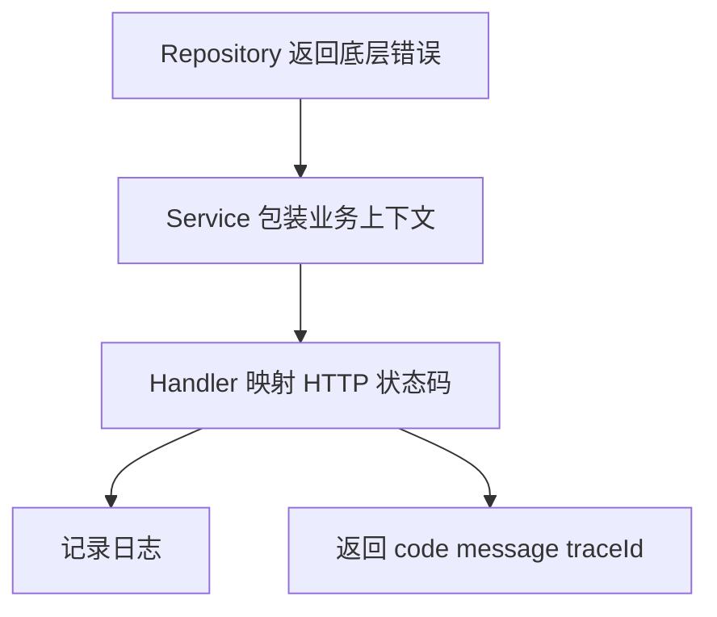

# 错误处理、日志与配置

## 这个页面解决什么

Go 没有异常机制，错误通过返回值显式传递。项目里要建立一致的错误包装、日志、配置和响应策略，否则排查会很痛苦。

## 错误返回

```go
func CreateUser(ctx context.Context, input CreateUserInput) (*User, error) {
    if input.Email == "" {
        return nil, ErrInvalidEmail
    }
    return nil, nil
}
```

调用方必须处理 error：

```go
user, err := service.CreateUser(ctx, input)
if err != nil {
    return nil, err
}
```

## 错误包装

```go
user, err := repo.FindByID(ctx, id)
if err != nil {
    return nil, fmt.Errorf("find user by id %d: %w", id, err)
}
```

`%w` 保留原始错误，调用方可以用 `errors.Is` 或 `errors.As` 判断。

## 错误流转



## 日志

日志应包含：

- traceId。
- 用户或租户。
- 业务对象 id。
- 错误上下文。
- 耗时。

不要记录 token、密码、完整身份证、完整银行卡。

## 配置

推荐配置来源：

```text
默认配置
↓
配置文件
↓
环境变量
↓
启动参数或配置中心
```

敏感配置只走环境变量或密钥系统。

## 实际项目问题

### 1. 只返回 err，没有上下文

问题：

```go
return err
```

日志里只看到 `record not found`，不知道查的是哪个用户。

解决：

```go
return fmt.Errorf("load user profile userID=%d: %w", userID, err)
```

### 2. Handler 里重复打印错误

每一层都打印会导致日志噪声。通常在 HTTP 边界统一记录一次，内部只包装错误。

### 3. 配置默认值掩盖生产错误

生产数据库地址缺失时，程序用本地默认地址启动，风险很高。关键配置应启动时强校验。

## 最佳实践

- 错误要携带上下文。
- 可判断错误用 sentinel error 或自定义类型。
- 日志在边界层统一输出。
- 配置启动时校验。
- 错误响应不要暴露内部实现细节。

## 下一步学习

继续学习 [并发：goroutine、channel、select](/go/concurrency)。
