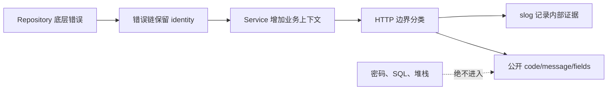
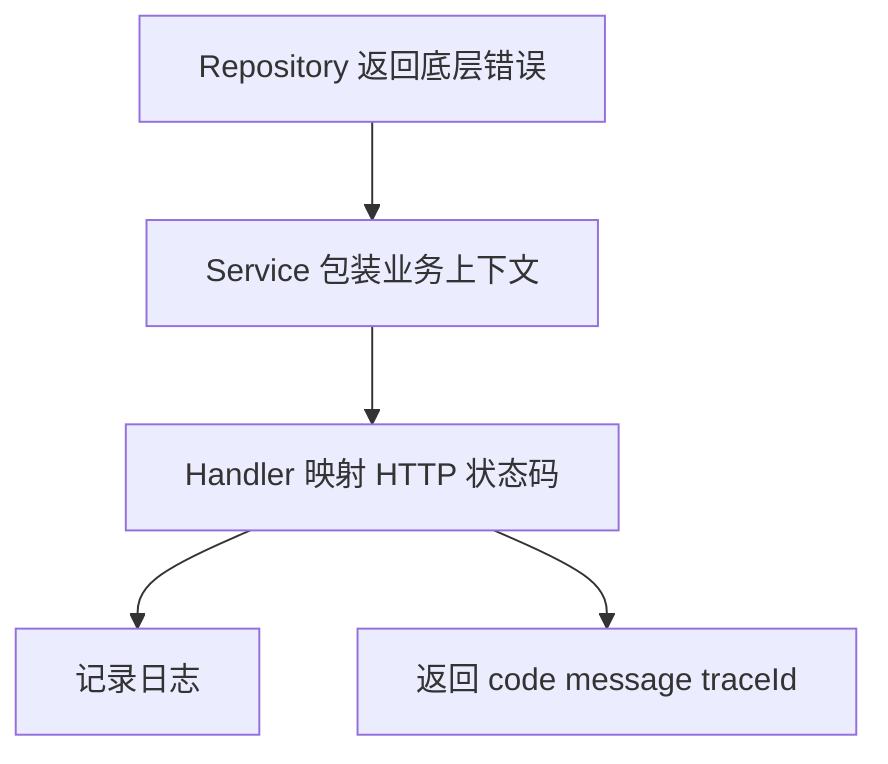

# 错误处理、日志与配置

## 适合谁看

适合能返回 `error`，但还不清楚何时包装、何时分类、在哪一层记录日志，以及怎样保证配置和日志不泄露密钥的读者。

## 先建立心智模型

可靠错误同时服务三类读者：代码需要稳定分类，运维需要定位上下文，最终用户只应看到安全且可行动的信息。这三部分不应混成同一个字符串。



## 从最小示例开始

### 错误返回

```go
func CreateUser(ctx context.Context, input CreateUserInput) (*User, error) {
    if input.Email == "" {
        return nil, ErrInvalidEmail
    }
    return nil, nil
}
```

调用方必须处理 error：

```go
user, err := service.CreateUser(ctx, input)
if err != nil {
    return nil, err
}
```

### 错误包装

```go
user, err := repo.FindByID(ctx, id)
if err != nil {
    return nil, fmt.Errorf("find user by id %d: %w", id, err)
}
```

`%w` 保留原始错误，调用方可以用 `errors.Is` 或 `errors.As` 判断：

```go
if errors.Is(err, context.DeadlineExceeded) {
    // 映射为稳定的超时错误
}

var validation *ValidationError
if errors.As(err, &validation) {
    // 读取字段级错误
}
```

需要同时清理多个资源时，`errors.Join` 能保留每个错误的 identity：

```go
return errors.Join(serverErr, db.Close())
```

### 错误流转



## 放进真实项目

### slog 字段契约

日志字段名要像 API 一样稳定。推荐最小 HTTP 事件字段：

| 字段 | 含义 | 注意 |
| --- | --- | --- |
| `request_id` | 单次请求关联键 | Header 与响应 envelope 一致 |
| `method`、`path` | HTTP 入口 | 不记录带敏感查询参数的原始 URL |
| `status`、`duration`、`bytes` | 结果与耗时 | 保持类型稳定 |
| `error_kind` | 稳定分类 | 不用整个错误文本做聚合键 |
| `resource_id` | 业务对象 | 只在允许记录时添加 |

```go
logger.InfoContext(ctx, "http request",
    "request_id", requestID,
    "method", r.Method,
    "path", r.URL.Path,
    "status", status,
    "duration", time.Since(startedAt),
)
```

每个失败请求通常只在最外层记录一次。内部层通过 `%w` 增加上下文，多层重复打印会造成告警计数失真。

### 日志

日志应包含：

- traceId。
- 用户或租户。
- 业务对象 id。
- 错误上下文。
- 耗时。

不要记录 token、密码、完整身份证、完整银行卡。

### 配置

推荐配置来源：

```text
默认配置
↓
配置文件
↓
环境变量
↓
启动参数或配置中心
```

敏感配置只走环境变量或密钥系统。

配置先解析到强类型结构，再一次性校验跨字段约束，例如最大空闲连接数不能大于最大打开连接数。关键配置缺失时立即启动失败，不回退到可能连接错误环境的地址。

## 常见错误与根因

### 1. 只返回 err，没有上下文

问题：

```go
return err
```

日志里只看到 `record not found`，不知道查的是哪个用户。

解决：

```go
return fmt.Errorf("load user profile userID=%d: %w", userID, err)
```

### 2. Handler 里重复打印错误

每一层都打印会导致日志噪声。通常在 HTTP 边界统一记录一次，内部只包装错误。

### 3. 配置默认值掩盖生产错误

生产数据库地址缺失时，程序用本地默认地址启动，风险很高。关键配置应启动时强校验。

### 4. `fmt.Errorf` 没有 `%w`

`fmt.Errorf("load user: %v", err)` 只保留文字，`errors.Is` 无法继续识别原错误。需要构成错误链时必须使用 `%w`。

### 5. 把 panic 值返回客户端

panic 可能包含 SQL、文件路径或用户输入。Recover 应记录类型和堆栈，客户端固定得到通用 500，不回显 panic 值。

### 6. 打印完整配置

使用 `%+v` 很容易把密码和 token 输出。只记录环境名、监听地址、池大小等非敏感安全摘要。

## 验证清单

- [ ] 需要分类的错误都能通过 `errors.Is` 或 `errors.As` 判断。
- [ ] 包装文本包含操作与资源上下文，但不含密钥。
- [ ] 每个失败请求只在明确边界记录一次，字段名可稳定检索。
- [ ] 客户端依据稳定错误码，不解析中文 message。
- [ ] panic、未知数据库错误和连接串不会进入响应。
- [ ] 配置在监听端口前完成强类型解析与跨字段校验。
- [ ] 日志测试断言没有密码、token、SQL 和请求 body。

## 下一步学习

继续学习 [并发：goroutine、channel、select](/go/concurrency)。
