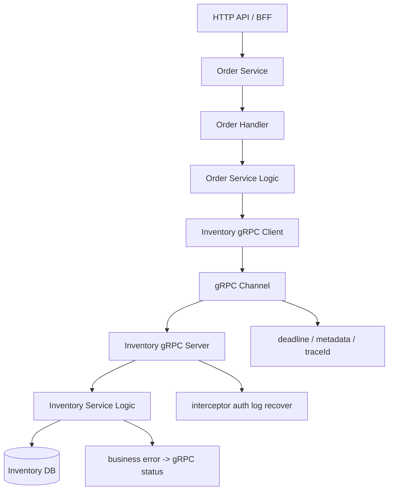
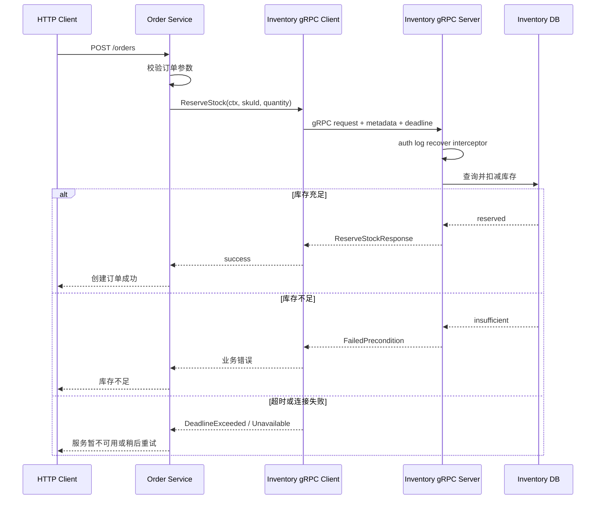
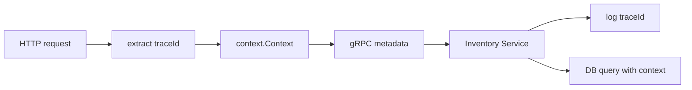
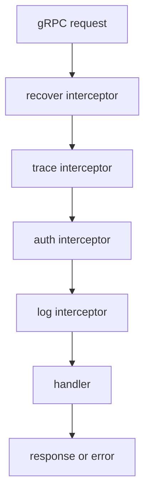

# Go gRPC 与服务间通信项目

## 这个页面解决什么

Go 写完 HTTP API 后，很多团队会继续遇到服务间通信问题：

- 后台 API 需要调用用户服务、订单服务、库存服务，但 HTTP JSON 契约越来越难维护。
- 前端接口和内部服务接口混在一起，导致外部 API 变化影响内部服务。
- 请求超时、取消、重试、错误码、traceId 没有统一约定。
- Protobuf 文件不知道怎么组织，生成代码和业务代码互相污染。
- gRPC 一跑通就结束，没有处理拦截器、鉴权、流式调用、测试和排障。

这篇用一个“订单服务调用库存服务”的小项目，把 gRPC、Protobuf、Go 生成代码、服务端实现、客户端调用、超时、错误、拦截器和联调排障串成完整闭环。

## 适合谁看

- 已经完成 [Go HTTP API 从零到项目落地](/go/http-api-project-from-zero)，想继续理解微服务通信的人。
- 会写 Go HTTP handler，但不知道 gRPC 服务怎么定义、生成和组织的人。
- 正在做内部服务调用、网关、BFF、任务服务或云原生服务的人。
- 遇到过 gRPC 超时、连接失败、错误码不一致、proto 字段兼容问题的人。

## gRPC 先解决什么

gRPC 的核心价值不是“比 HTTP 更高级”，而是把服务间通信变成强契约：

| 问题 | HTTP JSON 常见情况 | gRPC / Protobuf 做法 |
| --- | --- | --- |
| 契约 | 文档和代码可能不一致 | `.proto` 是接口定义，生成客户端和服务端代码 |
| 类型 | 字段类型靠约定 | message 字段类型明确 |
| 多语言 | 每种语言手写 DTO | 多语言生成代码 |
| 性能 | JSON 文本编码体积大 | Protobuf 二进制编码更紧凑 |
| 调用 | 自己封装 client、错误、超时 | gRPC 提供统一调用模型 |
| 流式 | 需要自己设计协议 | 支持服务端流、客户端流、双向流 |

官方 gRPC Go 快速开始强调：使用 Go gRPC 需要 Go、`protoc` 和 Go 的 protoc 插件；基础教程会从 `.proto` 定义服务、生成服务端/客户端代码，再实现 Go 客户端和服务端。

## 总体架构

项目建议命名为 `go-order-grpc`。它包含两个内部服务：

- `order-service`：接收订单创建请求。
- `inventory-service`：提供库存查询和扣减能力。



这张图说明一个关键点：gRPC 通常用于服务内部通信，不一定直接暴露给浏览器。前端仍然可以走 HTTP API，后端服务之间再用 gRPC。

## 最终项目结构

```text
go-order-grpc/
  README.md
  API_CONTRACT.md
  GRPC_CONTRACT.md
  TROUBLESHOOTING.md
  go.mod
  api/
    proto/
      inventory/v1/inventory.proto
      order/v1/order.proto
    gen/
      go/
  cmd/
    order-service/
      main.go
    inventory-service/
      main.go
  internal/
    platform/
      grpcx/
      logx/
      config/
    order/
      handler.go
      service.go
      inventory_client.go
    inventory/
      grpc_server.go
      service.go
      repository.go
  tests/
```

每个目录的职责：

| 目录 | 职责 |
| --- | --- |
| `api/proto` | 服务契约，只放 `.proto` 文件 |
| `api/gen/go` | 生成代码，不手写业务逻辑 |
| `cmd/order-service` | 订单服务启动入口 |
| `cmd/inventory-service` | 库存服务启动入口 |
| `internal/platform/grpcx` | gRPC server、client、interceptor、metadata 工具 |
| `internal/order` | 订单业务和库存服务客户端适配 |
| `internal/inventory` | 库存 gRPC 服务实现和仓储层 |

## 调用链路

一次创建订单的服务间调用可以这样理解：



真正的项目里，订单创建还会涉及事务、消息、补偿和幂等。本篇先把服务通信链路打通。

## Protobuf 契约

先定义库存服务：

```proto
syntax = "proto3";

package inventory.v1;

option go_package = "example.com/go-order-grpc/api/gen/go/inventory/v1;inventoryv1";

service InventoryService {
  rpc GetStock(GetStockRequest) returns (GetStockResponse);
  rpc ReserveStock(ReserveStockRequest) returns (ReserveStockResponse);
  rpc WatchStock(WatchStockRequest) returns (stream StockEvent);
}

message GetStockRequest {
  string sku_id = 1;
}

message GetStockResponse {
  string sku_id = 1;
  int64 available = 2;
  int64 reserved = 3;
}

message ReserveStockRequest {
  string request_id = 1;
  string sku_id = 2;
  int64 quantity = 3;
}

message ReserveStockResponse {
  string reservation_id = 1;
  string sku_id = 2;
  int64 quantity = 3;
}

message WatchStockRequest {
  repeated string sku_ids = 1;
}

message StockEvent {
  string sku_id = 1;
  int64 available = 2;
  string reason = 3;
}
```

### 字段设计规则

| 规则 | 原因 |
| --- | --- |
| 字段编号一旦发布不要复用 | 老客户端可能仍然按旧编号解析 |
| 请求里放 `request_id` | 支持幂等、日志追踪和重试排查 |
| 数量使用整数 | 金额、数量、库存不要用浮点数表达精确值 |
| `go_package` 必须稳定 | 生成代码路径和包名会影响导入 |
| 枚举和状态要预留未知值 | 避免新状态导致老客户端崩溃 |

Protobuf 契约一旦被多个服务使用，就要像数据库迁移一样谨慎治理。

## 生成代码

安装工具：

```bash
go install google.golang.org/protobuf/cmd/protoc-gen-go@latest
go install google.golang.org/grpc/cmd/protoc-gen-go-grpc@latest
```

确认 `$(go env GOPATH)/bin` 在 `PATH` 中。

生成命令示例：

```bash
protoc \
  --go_out=api/gen/go --go_opt=paths=source_relative \
  --go-grpc_out=api/gen/go --go-grpc_opt=paths=source_relative \
  api/proto/inventory/v1/inventory.proto
```

团队项目建议把命令放进 `Makefile`：

```makefile
.PHONY: proto
proto:
	protoc \
	  --go_out=api/gen/go --go_opt=paths=source_relative \
	  --go-grpc_out=api/gen/go --go-grpc_opt=paths=source_relative \
	  api/proto/inventory/v1/inventory.proto
```

生成代码不要手改。契约变化时改 `.proto`，再重新生成。

## 服务端实现

服务端实现生成的接口：

```go
type InventoryServer struct {
	inventoryv1.UnimplementedInventoryServiceServer
	service *Service
}

func (s *InventoryServer) ReserveStock(
	ctx context.Context,
	req *inventoryv1.ReserveStockRequest,
) (*inventoryv1.ReserveStockResponse, error) {
	if req.GetSkuId() == "" || req.GetQuantity() <= 0 {
		return nil, status.Error(codes.InvalidArgument, "sku_id and quantity are required")
	}

	reservation, err := s.service.Reserve(ctx, ReserveCommand{
		RequestID: req.GetRequestId(),
		SkuID:     req.GetSkuId(),
		Quantity:  req.GetQuantity(),
	})
	if err != nil {
		return nil, toGRPCError(err)
	}

	return &inventoryv1.ReserveStockResponse{
		ReservationId: reservation.ID,
		SkuId:         reservation.SkuID,
		Quantity:      reservation.Quantity,
	}, nil
}
```

服务端启动：

```go
func main() {
	listener, err := net.Listen("tcp", ":9090")
	if err != nil {
		log.Fatal(err)
	}

	server := grpc.NewServer(
		grpc.ChainUnaryInterceptor(
			recoverInterceptor,
			traceInterceptor,
			logInterceptor,
		),
	)

	inventoryv1.RegisterInventoryServiceServer(server, inventoryServer)

	log.Println("inventory grpc server listening on :9090")
	if err := server.Serve(listener); err != nil {
		log.Fatal(err)
	}
}
```

## 客户端调用

订单服务通过 client 调库存服务：

```go
type InventoryClient struct {
	client inventoryv1.InventoryServiceClient
}

func (c *InventoryClient) ReserveStock(ctx context.Context, skuID string, quantity int64) error {
	ctx, cancel := context.WithTimeout(ctx, 800*time.Millisecond)
	defer cancel()

	req := &inventoryv1.ReserveStockRequest{
		RequestId: requestIDFromContext(ctx),
		SkuId:     skuID,
		Quantity:  quantity,
	}

	_, err := c.client.ReserveStock(ctx, req)
	if err != nil {
		return fromGRPCError(err)
	}

	return nil
}
```

连接创建：

```go
conn, err := grpc.NewClient(
	"inventory-service:9090",
	grpc.WithTransportCredentials(insecure.NewCredentials()),
)
if err != nil {
	return err
}

inventoryClient := inventoryv1.NewInventoryServiceClient(conn)
```

生产环境不要直接使用 `insecure.NewCredentials()`，要按团队网络边界配置 TLS、mTLS 或服务网格。

## 错误码映射

gRPC 错误不能全部当成系统异常。推荐建立业务错误到 gRPC status 的映射：

| 业务场景 | gRPC code | HTTP 网关可映射 |
| --- | --- | ---: |
| 参数缺失、格式错误 | `InvalidArgument` | 400 |
| 未登录或凭证无效 | `Unauthenticated` | 401 |
| 无权限访问资源 | `PermissionDenied` | 403 |
| 库存不存在 | `NotFound` | 404 |
| 库存不足 | `FailedPrecondition` | 409 |
| 请求超时 | `DeadlineExceeded` | 504 |
| 服务不可用 | `Unavailable` | 503 |
| 未预期错误 | `Internal` | 500 |

错误转换示例：

```go
func toGRPCError(err error) error {
	switch {
	case errors.Is(err, ErrInsufficientStock):
		return status.Error(codes.FailedPrecondition, "insufficient stock")
	case errors.Is(err, ErrSKUNotFound):
		return status.Error(codes.NotFound, "sku not found")
	default:
		return status.Error(codes.Internal, "internal error")
	}
}
```

## Metadata、Trace 和超时

服务间通信必须传递链路信息：



客户端注入 metadata：

```go
md := metadata.Pairs(
	"x-trace-id", traceID,
	"x-service-name", "order-service",
)
ctx = metadata.NewOutgoingContext(ctx, md)
```

服务端读取 metadata：

```go
md, _ := metadata.FromIncomingContext(ctx)
traceIDs := md.Get("x-trace-id")
```

超时建议：

| 调用 | 建议 |
| --- | --- |
| 前端到 HTTP API | 5 到 15 秒，按业务调整 |
| HTTP API 到内部 gRPC | 300ms 到 2s，按依赖重要性调整 |
| gRPC 到数据库 | 使用同一个 ctx，不要重新创建无限期 context |
| 批量任务 | 单独设计任务超时，不要复用在线请求超时 |

不要在 service 或 repository 里使用 `context.Background()` 替代请求传入的 `ctx`，否则取消和超时会失效。

## 拦截器

gRPC interceptor 类似 HTTP middleware，用来处理横切逻辑：



推荐放进 interceptor 的能力：

| 能力 | 说明 |
| --- | --- |
| recover | 防止 panic 直接打崩请求 |
| trace | 提取或生成 traceId |
| log | 记录方法名、耗时、状态码 |
| auth | 校验服务间 token、mTLS 身份或调用方 |
| metrics | 记录请求量、耗时、错误率 |

不要把具体业务规则放进通用 interceptor。比如“库存不能小于 0”属于库存服务，不属于拦截器。

## 流式调用

gRPC 支持多种调用方式：

| 类型 | 适合场景 |
| --- | --- |
| Unary | 普通请求响应，例如查询库存、扣减库存 |
| Server streaming | 服务端连续返回，例如库存变化订阅、日志流 |
| Client streaming | 客户端连续上传，例如批量导入 |
| Bidirectional streaming | 双向实时通信，例如实时协同、代理隧道 |

库存事件可以用服务端流：

```go
func (s *InventoryServer) WatchStock(
	req *inventoryv1.WatchStockRequest,
	stream inventoryv1.InventoryService_WatchStockServer,
) error {
	ctx := stream.Context()

	events := s.service.Watch(ctx, req.GetSkuIds())
	for event := range events {
		if err := stream.Send(&inventoryv1.StockEvent{
			SkuId:     event.SkuID,
			Available: event.Available,
			Reason:    event.Reason,
		}); err != nil {
			return err
		}
	}

	return ctx.Err()
}
```

流式调用一定要处理取消和背压。客户端断开后，服务端应尽快停止 goroutine，避免泄漏。

## 测试与联调

最小测试清单：

| 测试 | 验证内容 |
| --- | --- |
| proto 生成 | `make proto` 后生成代码可编译 |
| service 单测 | 库存充足、库存不足、SKU 不存在 |
| gRPC handler 测试 | 参数错误、成功响应、错误码映射 |
| client 测试 | 超时、连接失败、业务错误转换 |
| interceptor 测试 | traceId、日志、panic recover |
| 集成测试 | order-service 调 inventory-service 完成下单链路 |

联调样例要保存成功和失败两类：

```text
ReserveStock success:
- request_id: req-001
- sku_id: sku-1001
- quantity: 2
- response: reservation_id=resv-001

ReserveStock failed:
- request_id: req-002
- sku_id: sku-1001
- quantity: 99999
- code: FailedPrecondition
- message: insufficient stock
```

## 常见问题

### 客户端一直连接失败

排查顺序：

1. 服务端监听地址和端口是否正确。
2. 容器或 Kubernetes Service 名称是否能解析。
3. 客户端地址是否写成了 `localhost`，导致在容器内指向自己。
4. TLS/insecure 配置是否和服务端一致。
5. 防火墙、NetworkPolicy 或安全组是否放行。

### 调用经常 DeadlineExceeded

排查顺序：

1. 客户端设置的 timeout 是否过短。
2. 服务端是否卡在数据库查询、锁等待或外部依赖。
3. context 是否传到了 repository。
4. 是否有重试放大了请求量。
5. 日志和指标里是否能看到同一个 traceId。

### proto 改了但服务不兼容

排查顺序：

1. 是否删除或复用了旧字段编号。
2. 是否改变了字段语义。
3. 是否生成代码后没有提交或部署。
4. 客户端和服务端版本是否同时升级导致灰度窗口内不兼容。
5. 是否缺少契约测试。

### 错误码全是 Internal

这通常说明没有做错误映射：

- Service 层只返回普通 `error` 字符串。
- gRPC handler 没有把业务错误转换为 `status.Error`。
- 客户端没有解析 `status.Code(err)`。
- panic 没有被 recover interceptor 转换和记录。

## 交付文档模板

项目里新增 `GRPC_CONTRACT.md`：

```md
# gRPC 服务契约

## 服务列表

## proto 文件路径

## 生成命令

## 方法说明

## metadata 约定

## timeout 和重试策略

## 错误码映射

## 版本兼容规则

## 联调样例

## 常见问题
```

没有契约文档的 gRPC 项目，后续会在 proto 兼容、错误码、超时和调用方排查上反复返工。

## 学习顺序

建议按这个顺序推进：

1. 先完成 [Go HTTP API 从零到项目落地](/go/http-api-project-from-zero)，理解 handler、service、repository 和 context。
2. 学习本页，补齐 `.proto`、生成代码、服务端、客户端和错误映射。
3. 回到 [Context、HTTP 服务与中间件](/go/context-http)，确认超时和取消能贯穿服务调用。
4. 学习 [性能分析与线上诊断](/go/performance)，为超时、连接数、goroutine 泄漏做排查准备。
5. 用 [前后端联调排查](/projects/integration-debugging) 的证据清单保存服务间调用样例。

## 参考资料

- [gRPC Go Quick start](https://grpc.io/docs/languages/go/quickstart/)
- [gRPC Go Basics tutorial](https://grpc.io/docs/languages/go/basics/)
- [Introduction to gRPC](https://grpc.io/docs/what-is-grpc/introduction/)
- [Protocol Buffers Overview](https://protobuf.dev/overview/)
