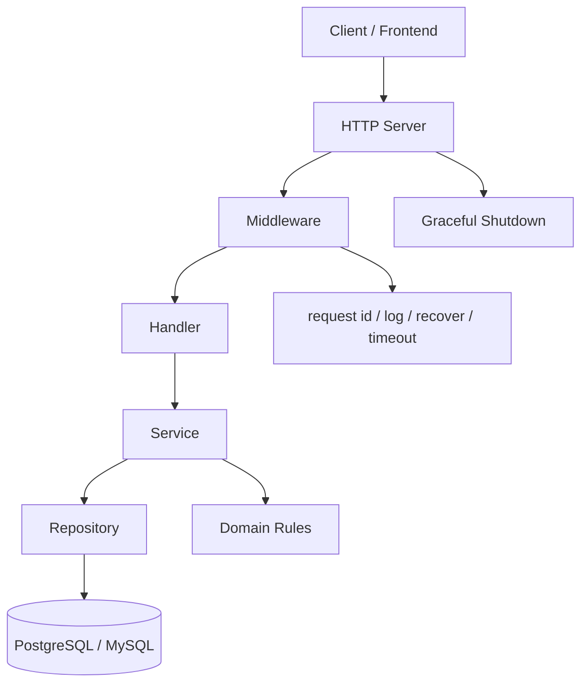
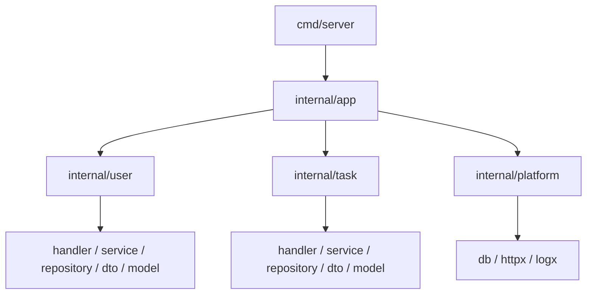
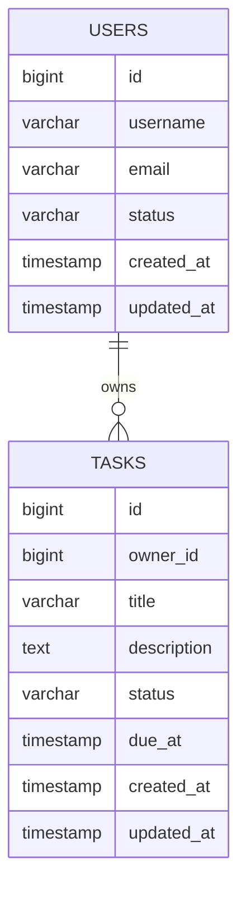
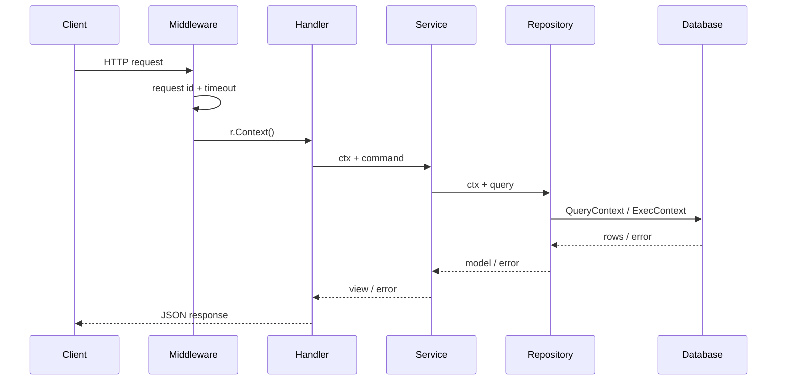
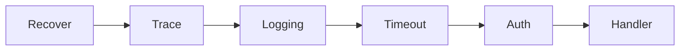
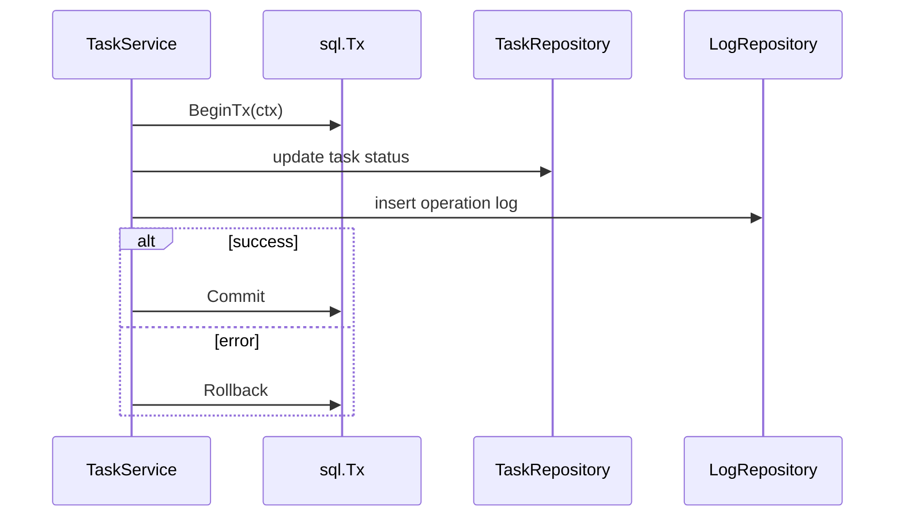
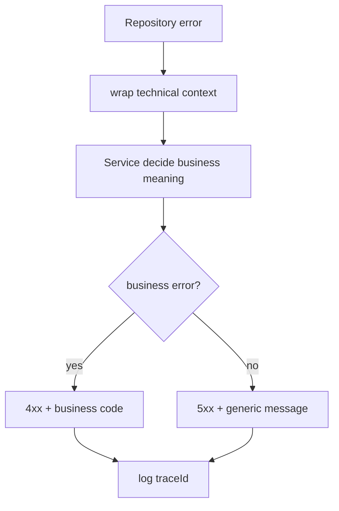
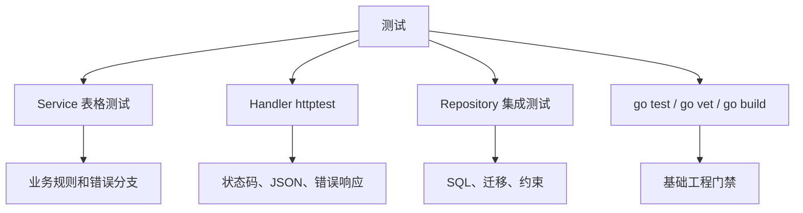
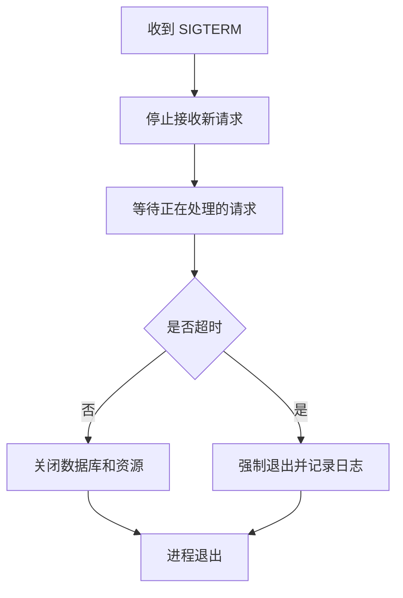

# Go HTTP API 从零到项目落地

## 这个页面解决什么

Go 很适合写 HTTP API、网关、后台服务和基础设施工具，但初学时常见两个问题：语法看起来简单，项目一大就不知道怎么分包；或者目录分得很复杂，却没有把 context、错误、数据库、测试和部署串起来。

这篇用一个“任务与用户 API”项目，把 Go 后端从 `go mod init`、目录组织、HTTP 路由、中间件、数据库、事务、测试、构建到部署串成完整闭环。读完后，你应该能回答：

- 一个 Go HTTP API 项目应该怎么组织目录。
- `cmd`、`internal`、handler、service、repository 分别负责什么。
- 为什么 `context.Context` 要贯穿 Handler、Service、Repository。
- 如何设计列表分页、新增、编辑、完成任务和用户关联接口。
- 如何处理错误响应、traceId、日志、数据库迁移和测试。
- 项目上线后出现超时、连接池耗尽、goroutine 泄漏和配置错误时从哪里查。

这不是语法章节，而是项目落地手册。你可以把它作为 Go 后端第一个可交付 API 的实施路线。

## 适合谁看

- 已经学过 Go 基础语法，准备写第一个后端 API 的人。
- 前端、Node.js 或 Java 开发者想补一个 Go 服务端项目的人。
- 会写 `http.HandleFunc`，但不知道 handler、service、repository 怎么拆的人。
- 想理解 Go 项目如何管理 context、错误、日志、配置和优雅关闭的人。
- 想做一个能给 Vue Admin、React 管理台或移动端调用的轻量后端 API 的人。

## 最终项目

项目建议命名为 `go-task-api`。它不是完整微服务平台，但要覆盖真实 Go 后端项目的核心能力。

```text
go-task-api/
  README.md
  API_CONTRACT.md
  TROUBLESHOOTING.md
  go.mod
  go.sum
  cmd/
    server/
      main.go
  internal/
    app/
      server.go
      routes.go
    config/
      config.go
    platform/
      db/
      httpx/
      logx/
    user/
      handler.go
      service.go
      repository.go
      model.go
      dto.go
    task/
      handler.go
      service.go
      repository.go
      model.go
      dto.go
  migrations/
    001_create_users_tasks.sql
  tests/
```

最终至少交付：

| 模块 | 必须完成 |
| --- | --- |
| 用户 | 用户列表、详情、新增、启停 |
| 任务 | 任务列表、详情、新增、编辑、完成、删除 |
| HTTP | 路由、中间件、JSON 请求响应、状态码 |
| context | 请求超时、取消、数据库调用传递 context |
| 错误 | 业务错误、参数错误、系统错误、统一响应 |
| 日志 | request id、traceId、耗时、错误日志 |
| 数据库 | users、tasks 表和迁移脚本 |
| 测试 | service 表格测试、handler 测试、repository 集成测试 |
| 构建 | gofmt、go test、go build、Docker 镜像 |
| 交付文档 | README、API_CONTRACT、TROUBLESHOOTING |

## 项目总图



这张图说明 Go 后端的三个核心边界：

1. Handler 只处理 HTTP 协议、参数和响应。
2. Service 处理业务规则、事务和跨仓储编排。
3. Repository 只处理 SQL、扫描结果和数据库错误转换。

## 技术选择

Go 官方文档推荐通过 `go` 命令和 Go Modules 开发包与应用；Go 的官方入门教程也会先安装 Go、创建模块、运行代码，再使用外部模块。这个项目以标准库为主，避免一开始被框架复杂度分散注意力。

| 项目 | 推荐选择 | 原因 |
| --- | --- | --- |
| Go 版本 | 以团队 CI 和生产镜像为准，学习时用当前稳定版本 | Go 1 兼容承诺让项目升级相对平滑 |
| 模块管理 | Go Modules | 官方依赖管理方式，`go.mod` 和 `go.sum` 可追踪 |
| HTTP | 标准库 `net/http` 或轻量路由库 | 先理解请求生命周期，再引入框架 |
| 数据库 | `database/sql` + 驱动 | 理解连接池、事务、context 和 SQL 边界 |
| 迁移 | goose、golang-migrate 或团队已有工具 | 让表结构变更可追踪 |
| 测试 | 标准库 `testing`、`httptest` | 不依赖复杂测试框架也能覆盖关键路径 |
| 日志 | `log/slog` 或团队日志库 | 结构化日志便于线上排查 |

初学建议先用标准库 `net/http` + `database/sql` + `testing`。等你理解边界后，再引入 Gin、Echo、Chi、sqlc、GORM、OpenTelemetry 或更完整的服务治理组件。

## 创建项目

第一步是创建模块。

```bash
mkdir go-task-api
cd go-task-api
go mod init example.com/go-task-api
```

最小入口：

```go
package main

import (
	"log"
	"net/http"
)

func main() {
	mux := http.NewServeMux()
	mux.HandleFunc("/health", func(w http.ResponseWriter, r *http.Request) {
		w.WriteHeader(http.StatusOK)
		_, _ = w.Write([]byte("ok"))
	})

	log.Println("server listening on :8080")
	if err := http.ListenAndServe(":8080", mux); err != nil {
		log.Fatal(err)
	}
}
```

第一次验收只看三件事：

1. `go run ./cmd/server` 能启动。
2. `/health` 返回 200。
3. `go test ./...` 能执行，即使暂时没有测试。

## 分包设计

Go 项目不要一开始照搬复杂分层，也不要把所有代码写进 `main.go`。推荐以业务模块为主，技术平台能力放进 `platform`。



### 每层职责

| 位置 | 放什么 | 不放什么 |
| --- | --- | --- |
| `cmd/server` | 程序入口、加载配置、组装依赖、启动服务 | 业务逻辑、SQL |
| `internal/app` | 路由注册、Server 组装、生命周期 | 具体业务规则 |
| `internal/platform` | 数据库、日志、HTTP 工具、配置适配 | 业务模块代码 |
| `internal/user` | 用户业务完整闭环 | 任务业务逻辑 |
| `handler.go` | HTTP 参数、状态码、JSON | SQL、事务 |
| `service.go` | 业务规则、事务、跨仓储编排 | HTTP 响应细节 |
| `repository.go` | SQL、扫描结果、数据库错误转换 | 业务决策 |

Go 的包边界应该服务于“可读”和“可测”。如果某个接口只有一个实现且没有测试替换需求，不要为了抽象而抽象。

## 数据模型

先做最小任务系统：



### 迁移脚本示例

下面以 PostgreSQL 为例。MySQL 可以把 `bigserial` 换成 `bigint auto_increment`，并用字段 `comment` 或数据字典文档记录含义。

```sql
create table users (
  id bigserial primary key,
  username varchar(64) not null,
  email varchar(128) not null,
  status varchar(20) not null,
  created_at timestamp not null,
  updated_at timestamp not null,
  constraint uk_users_username unique (username),
  constraint uk_users_email unique (email)
);

create table tasks (
  id bigserial primary key,
  owner_id bigint not null,
  title varchar(128) not null,
  description text,
  status varchar(20) not null,
  due_at timestamp,
  created_at timestamp not null,
  updated_at timestamp not null,
  constraint fk_tasks_owner foreign key (owner_id) references users(id)
);

create index idx_tasks_owner_status on tasks(owner_id, status);
create index idx_tasks_due_at on tasks(due_at);

comment on table users is '任务系统用户表。保存任务负责人和后台访问用户的基础资料。';
comment on column users.id is '用户主键。由数据库生成，不承载业务含义。';
comment on column users.username is '用户名。全局唯一，用于展示、审计和任务负责人识别。';
comment on column users.email is '用户邮箱。全局唯一，可用于通知、登录或找回账号。';
comment on column users.status is '用户状态。建议取值 ACTIVE、DISABLED；停用用户不能继续创建或认领任务。';
comment on column users.created_at is '用户创建时间。用于审计和排序。';
comment on column users.updated_at is '用户最后更新时间。用于排查缓存旧值和同步延迟。';

comment on table tasks is '任务主表。保存任务标题、描述、负责人、状态和截止时间。';
comment on column tasks.owner_id is '任务负责人，引用 users.id。用于按用户筛选任务和权限判断。';
comment on column tasks.title is '任务标题。必填，控制长度是为了避免列表页和通知内容被长文本撑破。';
comment on column tasks.description is '任务描述。可为空，用于补充任务背景。';
comment on column tasks.status is '任务状态。建议取值 TODO、DOING、DONE、CANCELLED。';
comment on column tasks.due_at is '截止时间。可为空，用于提醒、排序和逾期统计。';
```

唯一约束是为了防止用户身份冲突；`tasks.owner_id` 外键是为了避免任务指向不存在的负责人；`idx_tasks_owner_status` 支持后台高频“按负责人和状态筛选”；`idx_tasks_due_at` 支持截止时间排序和提醒扫描。

## API 设计

先完成任务管理闭环，不要一开始设计过多接口。

| 方法 | 路径 | 用途 |
| --- | --- | --- |
| `GET` | `/api/tasks` | 任务分页列表 |
| `GET` | `/api/tasks/{id}` | 任务详情 |
| `POST` | `/api/tasks` | 新增任务 |
| `PUT` | `/api/tasks/{id}` | 编辑任务 |
| `PATCH` | `/api/tasks/{id}/status` | 更新任务状态 |
| `DELETE` | `/api/tasks/{id}` | 删除任务 |
| `GET` | `/api/users` | 用户列表 |

统一成功响应：

```json
{
  "code": "OK",
  "message": "success",
  "traceId": "2ad7f9c1",
  "data": {
    "id": 1,
    "title": "整理项目文档"
  }
}
```

统一错误响应：

```json
{
  "code": "TASK_NOT_FOUND",
  "message": "任务不存在",
  "traceId": "2ad7f9c1"
}
```

分页响应：

```json
{
  "code": "OK",
  "message": "success",
  "traceId": "2ad7f9c1",
  "data": {
    "items": [],
    "page": 1,
    "pageSize": 20,
    "total": 0
  }
}
```

把这些约定写进 `API_CONTRACT.md`，避免前端联调时字段名、分页结构和错误码反复漂移。

## Handler、Service、Repository

### Handler

Handler 负责读取 HTTP 请求、校验基础参数、调用 Service、写响应。

```go
func (h *TaskHandler) Create(w http.ResponseWriter, r *http.Request) {
	ctx := r.Context()

	var req CreateTaskRequest
	if err := json.NewDecoder(r.Body).Decode(&req); err != nil {
		httpx.WriteError(w, http.StatusBadRequest, "BAD_REQUEST", "请求 JSON 不正确")
		return
	}

	task, err := h.service.Create(ctx, req.ToCommand())
	if err != nil {
		httpx.WriteAppError(w, err)
		return
	}

	httpx.WriteJSON(w, http.StatusCreated, task)
}
```

### Service

Service 负责业务规则和事务边界。

```go
func (s *TaskService) Create(ctx context.Context, cmd CreateTaskCommand) (*TaskView, error) {
	if strings.TrimSpace(cmd.Title) == "" {
		return nil, NewBusinessError("TASK_TITLE_REQUIRED", "任务标题不能为空")
	}

	owner, err := s.users.FindByID(ctx, cmd.OwnerID)
	if err != nil {
		return nil, fmt.Errorf("find task owner: %w", err)
	}
	if owner.Disabled() {
		return nil, NewBusinessError("OWNER_DISABLED", "负责人已停用")
	}

	task := NewTask(cmd.OwnerID, cmd.Title, cmd.Description, cmd.DueAt)
	if err := s.tasks.Save(ctx, task); err != nil {
		return nil, fmt.Errorf("save task: %w", err)
	}

	return ToTaskView(task), nil
}
```

### Repository

Repository 负责 SQL 和扫描结果。

```go
func (r *TaskRepository) FindByID(ctx context.Context, id int64) (*Task, error) {
	row := r.db.QueryRowContext(ctx, `
		select id, owner_id, title, description, status, due_at, created_at, updated_at
		from tasks
		where id = $1
	`, id)

	var task Task
	if err := row.Scan(
		&task.ID,
		&task.OwnerID,
		&task.Title,
		&task.Description,
		&task.Status,
		&task.DueAt,
		&task.CreatedAt,
		&task.UpdatedAt,
	); err != nil {
		if errors.Is(err, sql.ErrNoRows) {
			return nil, NewBusinessError("TASK_NOT_FOUND", "任务不存在")
		}
		return nil, fmt.Errorf("scan task id=%d: %w", id, err)
	}

	return &task, nil
}
```

## context 和请求生命周期

Go HTTP 项目的关键是让请求生命周期可控。请求超时后，数据库查询和外部调用也应该停止。



### 必须遵守

- Handler 取 `r.Context()`，不要自己创建孤立的 `context.Background()`。
- Service 和 Repository 方法都显式接收 `ctx context.Context`。
- 数据库调用使用 `QueryContext`、`ExecContext`、`BeginTx`。
- 外部 HTTP 调用设置超时，并使用同一个请求上下文。
- 不要把 context 保存到结构体字段里。

## 中间件

推荐中间件顺序：

```text
recover
↓
request id / trace
↓
logging
↓
timeout
↓
auth
↓
handler
```



### timeout 示例

```go
func Timeout(duration time.Duration, next http.Handler) http.Handler {
	return http.HandlerFunc(func(w http.ResponseWriter, r *http.Request) {
		ctx, cancel := context.WithTimeout(r.Context(), duration)
		defer cancel()
		next.ServeHTTP(w, r.WithContext(ctx))
	})
}
```

### recover 示例

```go
func Recover(next http.Handler) http.Handler {
	return http.HandlerFunc(func(w http.ResponseWriter, r *http.Request) {
		defer func() {
			if recovered := recover(); recovered != nil {
				httpx.WriteError(w, http.StatusInternalServerError, "INTERNAL_ERROR", "系统错误")
			}
		}()
		next.ServeHTTP(w, r)
	})
}
```

recover 只能兜底，不应该替代正常错误处理。业务错误要显式返回，不要靠 panic 控制流程。

## 事务边界

完成任务时可能需要写任务状态、写操作日志、发送事件。数据库写入必须在事务里保持一致。



事务建议：

- 事务边界放在 Service 或专门 transaction helper。
- 不要在事务里做慢外部 HTTP 调用。
- `defer tx.Rollback()` 兜底，成功后再 `Commit`。
- 事务内所有 SQL 使用同一个 `tx`。
- 事务失败要保留 traceId 和关键业务 ID。

## 错误和日志

Go 的错误处理要保留上下文，但不要把所有错误都暴露给前端。



错误设计：

| 错误 | HTTP 状态 | 示例 code |
| --- | ---: | --- |
| JSON 解析失败 | 400 | `BAD_REQUEST` |
| 参数校验失败 | 400 | `VALIDATION_ERROR` |
| 资源不存在 | 404 | `TASK_NOT_FOUND` |
| 业务冲突 | 409 | `TASK_ALREADY_DONE` |
| 未认证 | 401 | `UNAUTHORIZED` |
| 无权限 | 403 | `FORBIDDEN` |
| 系统错误 | 500 | `INTERNAL_ERROR` |

日志建议：

- 每个请求有 request id 或 traceId。
- 记录 method、path、status、duration、remote ip。
- 业务错误记录 warn，系统错误记录 error。
- 不打印 token、密码、身份证、银行卡等敏感数据。
- 数据库慢查询和外部调用超时要能定位到业务 ID。

## 测试策略

Go 的标准库测试能力足够支撑第一个后端项目。



### Service 表格测试

```go
func TestTaskServiceCreate(t *testing.T) {
	cases := []struct {
		name    string
		command CreateTaskCommand
		wantErr bool
	}{
		{name: "valid task", command: CreateTaskCommand{Title: "整理文档", OwnerID: 1}},
		{name: "empty title", command: CreateTaskCommand{Title: "", OwnerID: 1}, wantErr: true},
	}

	for _, tc := range cases {
		t.Run(tc.name, func(t *testing.T) {
			// arrange service with fake repositories
			// act
			// assert
		})
	}
}
```

### Handler 测试

```go
func TestCreateTaskHandlerBadJSON(t *testing.T) {
	req := httptest.NewRequest(http.MethodPost, "/api/tasks", strings.NewReader("{bad json"))
	rec := httptest.NewRecorder()

	handler.ServeHTTP(rec, req)

	if rec.Code != http.StatusBadRequest {
		t.Fatalf("status = %d, want %d", rec.Code, http.StatusBadRequest)
	}
}
```

最小检查命令：

```bash
gofmt -w .
go test ./...
go vet ./...
go build -o bin/server ./cmd/server
```

## 配置和运行

配置来源要清楚，不能把生产配置写死在代码里。

```text
环境变量
↓
配置文件
↓
默认值
↓
启动时打印非敏感配置摘要
```

建议配置项：

| 配置 | 含义 |
| --- | --- |
| `APP_ENV` | 当前环境：dev、test、prod |
| `HTTP_ADDR` | HTTP 监听地址，例如 `:8080` |
| `DB_DSN` | 数据库连接串，敏感信息不提交仓库 |
| `READ_TIMEOUT` | HTTP 读取超时 |
| `WRITE_TIMEOUT` | HTTP 写入超时 |
| `SHUTDOWN_TIMEOUT` | 优雅关闭等待时间 |

配置检查清单：

- README 写清必需环境变量。
- 启动时校验 `DB_DSN` 等关键配置。
- 日志只打印配置摘要，不打印密码。
- 本地、测试、生产环境的配置差异明确。
- Docker 和 CI 使用同一套环境变量名称。

## 优雅关闭和部署

Go 服务通常以单个二进制部署。发布时要处理正在执行的请求。



Server 示例：

```go
srv := &http.Server{
	Addr:         cfg.HTTPAddr,
	Handler:      router,
	ReadTimeout:  5 * time.Second,
	WriteTimeout: 10 * time.Second,
	IdleTimeout:  60 * time.Second,
}
```

构建：

```bash
go build -ldflags "-X main.version=$COMMIT" -o bin/server ./cmd/server
```

Dockerfile：

```dockerfile
FROM golang:1.26 AS build
WORKDIR /app
COPY go.mod go.sum ./
RUN go mod download
COPY . .
RUN CGO_ENABLED=0 GOOS=linux go build -o /server ./cmd/server

FROM gcr.io/distroless/static-debian12
COPY --from=build /server /server
ENTRYPOINT ["/server"]
```

如果项目依赖 CGO、证书、时区或系统库，运行镜像要按实际依赖调整，不要盲目追求最小镜像。

## 交付验收

| 项目 | 验收标准 |
| --- | --- |
| 模块初始化 | `go.mod`、`go.sum` 正确提交 |
| 本地启动 | `/health` 返回 200 |
| 任务 CRUD | 列表、详情、新增、编辑、完成、删除闭环 |
| context | Handler、Service、Repository 都传递 ctx |
| 数据库 | 迁移脚本可执行，字段和约束有说明 |
| 错误响应 | 业务错误和系统错误能区分 |
| 日志 | 请求日志包含 traceId、状态码和耗时 |
| 测试 | service、handler、repository 有基础测试 |
| 构建 | `go test ./...` 和 `go build ./cmd/server` 通过 |
| 部署 | 容器可启动，支持优雅关闭 |
| 文档 | README、API_CONTRACT、TROUBLESHOOTING 完整 |

## 常见问题和排查

| 问题 | 先查什么 | 对应章节 |
| --- | --- | --- |
| 请求超时后 SQL 还在跑 | 是否使用 `QueryContext`、`ExecContext` | context 和请求生命周期 |
| goroutine 数量持续上涨 | 是否启动 goroutine 后没有退出条件 | [Go 常见问题](/go/troubleshooting) |
| 数据库连接耗尽 | rows 是否关闭、连接池配置、慢 SQL | [数据库、事务与仓储层](/go/database-transaction) |
| JSON 字段为空 | tag、请求字段名、大小写、零值 | Handler、Service、Repository |
| 事务没有回滚 | 是否所有写入都用同一个 tx | 事务边界 |
| 容器里找不到配置 | 工作目录、环境变量、配置来源 | 配置和运行 |
| 关闭时请求被强杀 | 是否使用 `http.Server.Shutdown` | 优雅关闭和部署 |
| 线上延迟升高 | pprof、慢 SQL、外部调用、连接池 | [性能分析与线上诊断](/go/performance) |

## 练习任务

按下面顺序做，不要一开始就引入复杂框架。

1. `go mod init` 并创建 `/health`。
2. 建立 `cmd/server`、`internal/app`、`internal/task`、`internal/user`。
3. 增加配置读取和启动时配置校验。
4. 增加 recover、trace、logging、timeout 中间件。
5. 建 users、tasks 表和迁移脚本。
6. 完成任务列表和新增接口。
7. 增加任务状态更新和业务错误。
8. 给数据库调用传递 context。
9. 写 service 表格测试和 handler 测试。
10. 构建二进制和 Docker 镜像。
11. 写 README、API_CONTRACT、TROUBLESHOOTING。

完成后，把这个后端接给一个 Vue 或 React 任务列表页面。联调时如果出现分页字段、错误响应、跨域、旧请求覆盖或部署路径问题，回到 [前端项目排障图谱](/projects/frontend-debugging-map)、[前后端联调排查](/projects/integration-debugging) 和 [部署、缓存与 DevOps 问题](/projects/issues-deployment)。

## 参考资料

- [Go Documentation](https://go.dev/doc/)
- [Tutorial: Get started with Go](https://go.dev/doc/tutorial/getting-started)
- [Tutorial: Create a Go module](https://go.dev/doc/tutorial/create-module)
- [How to Write Go Code](https://go.dev/doc/code)
- [Go Modules Reference](https://go.dev/ref/mod)

## 下一步学习

继续学习 [数据库、事务与仓储层](/go/database-transaction)，再进入 [测试、Benchmark 与 Fuzzing](/go/testing) 和 [项目结构、构建与部署](/go/project-deployment)。如果你正在做全栈项目，把本页 API 接到 [前端综合实战练习](/roadmap/frontend-capstone-lab) 或自己的 Vue Admin 页面中。
