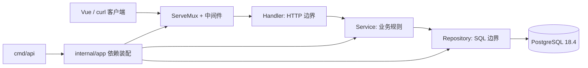
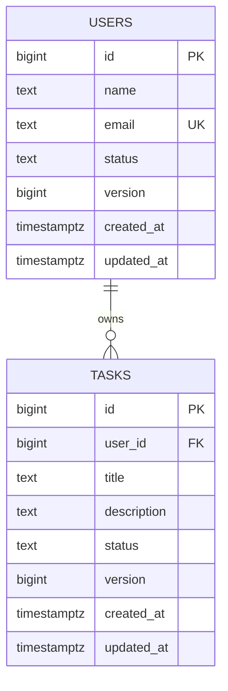
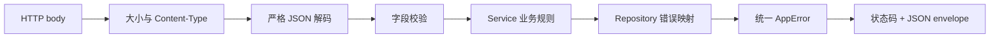
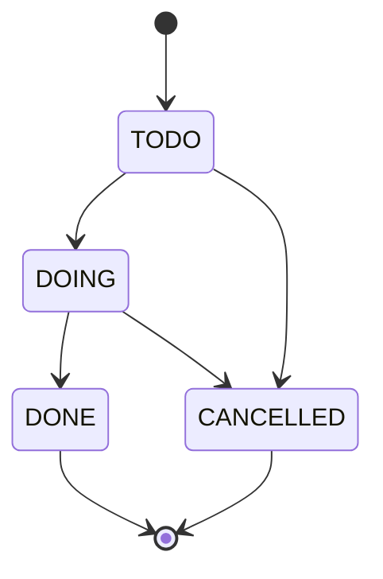
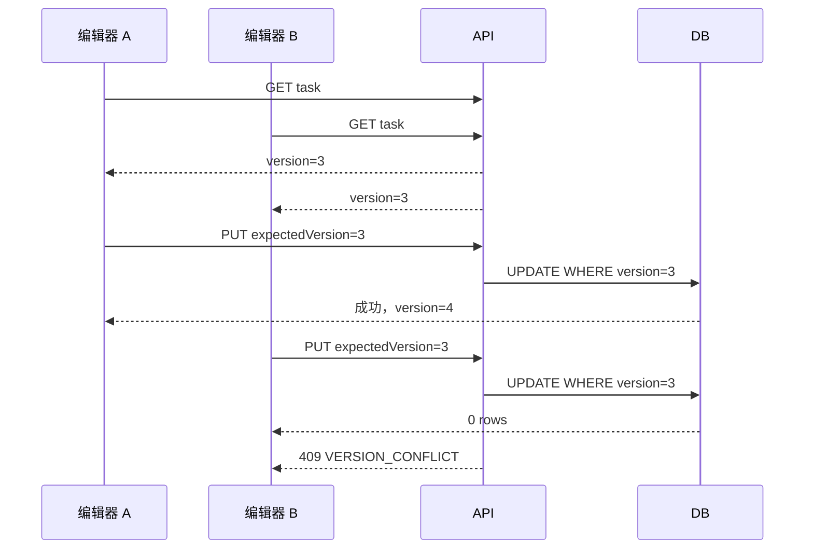
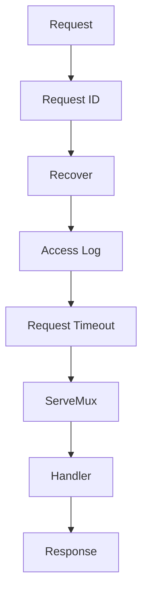
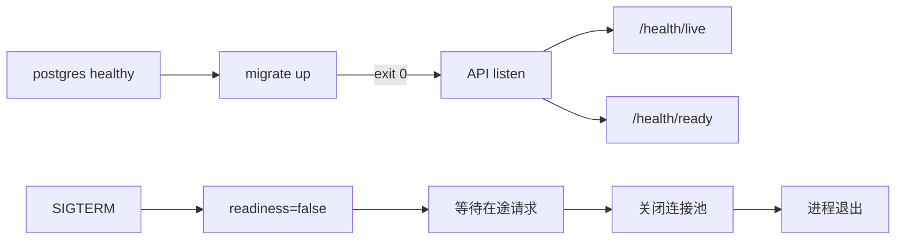

# Go HTTP API 从零到项目落地

## 这个页面解决什么

这是一篇可以照着运行的工程教程。我们只使用一套已经在本仓库验证过的方案：**Go 1.26.5、标准库 `net/http` ServeMux、`database/sql`、pgx v5、golang-migrate、`log/slog`、PostgreSQL 18.4 和 Docker Compose**。

最终项目位于 `examples/go-task-api`。正文用 `<<<` 直接导入真实源码，示例更新后文档构建会立即发现路径错误，避免“教程代码能看但不能运行”。

## 适合谁看

- 已能读懂函数、结构体、接口和基本 goroutine，准备开发第一个 Go API。
- 会写 `http.HandleFunc`，但不清楚 Handler、Service、Repository 的职责。
- 想把 Context、错误契约、数据库、测试、容器和优雅关闭串起来。
- 需要给 Vue 管理后台提供一套行为稳定、可联调的本地 API。

若对 Context、事务或测试还不熟悉，先阅读 [Context 与 HTTP](/go/context-http)、[数据库与事务](/go/database-transaction) 和 [测试](/go/testing)。

## 1. 明确目标与接口

项目管理用户和任务，共提供 12 条路由：

| 能力 | 方法与路径 | 关键规则 |
| --- | --- | --- |
| 存活 | `GET /health/live` | 不访问数据库，只判断进程能否服务 |
| 就绪 | `GET /health/ready` | 检查关闭状态和数据库连接 |
| 用户列表/创建 | `GET/POST /api/users` | 分页、状态过滤、email 唯一 |
| 用户详情 | `GET /api/users/{id}` | 不存在返回稳定 404 |
| 用户状态 | `PATCH /api/users/{id}/status` | 使用 `expectedVersion` 乐观锁 |
| 任务列表/创建 | `GET/POST /api/tasks` | 用户、状态、分页过滤 |
| 任务详情/替换 | `GET/PUT /api/tasks/{id}` | 更新必须携带旧 version |
| 任务状态 | `PATCH /api/tasks/{id}/status` | 状态机限制转换方向 |
| 任务删除 | `DELETE /api/tasks/{id}` | 删除也检查 version |

成功响应使用 `{ success, data, requestId }`，失败响应使用 `{ success, error, requestId }`。业务冲突不是 500；未知字段、第二个 JSON 值和超过 1 MiB 的 body 都会被拒绝。

### 总体架构



依赖只能朝一个方向移动：

```text
cmd -> app -> handler -> service -> repository -> database/sql -> PostgreSQL
```

Handler 不写 SQL，Repository 不决定 HTTP 状态码，Service 不依赖 `http.ResponseWriter`。这个约束让每一层都能单独测试。

## 2. 创建模块

从空目录开始：

```bash
mkdir go-task-api
cd go-task-api
go mod init example.com/go-task-api
```

示例的完整模块文件如下。`go 1.26.0` 表示模块语言和语义基线；构建、测试和容器验证使用 Go 1.26.5。

<<< ../../examples/go-task-api/go.mod{go}

执行第一次依赖检查：

```bash
go mod tidy
go mod verify
go list -m all
```

`go.sum` 是依赖内容校验记录，应与 `go.mod` 一起提交。不要手工删除其中“看不懂”的条目；依赖变化后运行 `go mod tidy`，再审查 diff。

## 3. 建立目录与依赖边界

最终目录不是按 MVC 机械拆分，而是以 `user`、`task` 领域为主，平台能力集中在 `platform`：

```text
examples/go-task-api/
├── cmd/
│   ├── api/                 # HTTP 服务入口
│   ├── migrate/             # 独立迁移命令
│   └── healthcheck/         # 镜像内健康检查程序
├── internal/
│   ├── app/                 # 路由、依赖装配、生命周期
│   ├── config/              # 强类型环境变量
│   ├── platform/
│   │   ├── database/        # 连接池和迁移适配
│   │   └── httpx/           # JSON、错误、响应和中间件
│   ├── user/                # 用户领域完整闭环
│   └── task/                # 任务领域完整闭环
├── migrations/              # 嵌入二进制的版本化 SQL
├── tests/                   # 真实 PostgreSQL/API 集成测试
├── API_CONTRACT.md
├── TROUBLESHOOTING.md
├── Dockerfile
└── compose.yaml
```

`internal` 是 Go 工具链能够理解的可见性边界：模块外部不能直接导入内部包。`cmd` 中只保留“读取配置、创建应用、运行”这种进程级职责，业务代码不能回流到入口。

## 4. 先做强类型配置

配置必须在监听端口前完成解析和校验。否则错误的 duration、连接数或数据库地址会在流量到来后才暴露。

<<< ../../examples/go-task-api/internal/config/config.go{go}

阅读时重点找四类防线：

1. 默认值只服务于本地开发，关键生产配置仍需显式提供。
2. duration 使用 `time.ParseDuration`，不能把字符串留到业务层再解析。
3. 最大空闲连接不能超过最大打开连接。
4. 错误信息只指出变量名，不回显完整 `DATABASE_URL`。

本地环境模板：

<<< ../../examples/go-task-api/.env.example{dotenv}

推荐加载方式：

```bash
cp .env.example .env
set -a
source .env
set +a
```

`.env` 只能放本地非敏感配置，必须由 Git 忽略。生产密钥应由部署平台的 Secret 能力注入。

## 5. 用迁移定义数据库事实

应用不在启动时偷偷建表。独立 migration command 负责 schema，API 只有在迁移成功后才启动。

### 数据模型



真实 migration 同时定义字段、约束、索引和中文数据库注释：

<<< ../../examples/go-task-api/migrations/000001_create_users_tasks.up.sql{sql}

需要逐项理解：

- `lower(email)` 唯一索引把大小写不同的同一邮箱视为冲突。
- `CHECK` 约束让绕过 API 的非法状态写入也会失败。
- `(created_at DESC, id DESC)` 为稳定分页提供唯一的次级排序。
- `version` 从 0 开始，条件更新成功后递增。
- 外键使用明确删除行为，不能依赖数据库默认值猜测。

本地执行：

```bash
docker compose up -d postgres
docker compose exec postgres pg_isready -U app -d taskdb
go run ./cmd/migrate up
go run ./cmd/migrate version
```

预期版本：

```text
version=1 dirty=false
```

不要在生产环境随意运行 `down`。删除表和数据属于破坏性操作，生产迁移通常采用向前修复，并为兼容窗口保留旧字段。

## 6. 先稳定错误与 JSON 契约

在写领域 Handler 前先统一协议边界，否则每条路由会产生不同的错误格式。

### 请求链



错误模型将公开 message 与内部 cause 分离：

<<< ../../examples/go-task-api/internal/platform/httpx/error.go{go}

严格 JSON 解码器负责 body 上限、媒体类型、未知字段、空 body 和尾随值：

<<< ../../examples/go-task-api/internal/platform/httpx/json.go{go}

为什么要在这里一次做完？

| 情况 | 宽松解码的后果 | 严格契约 |
| --- | --- | --- |
| `emali` 拼错 | 字段被忽略，业务收到空 email | `UNKNOWN_FIELD` |
| body 后追加第二段 JSON | 第一段成功，剩余数据被忽略 | `INVALID_JSON` |
| 上传数百 MB | 进程内存和带宽被占用 | `BODY_TOO_LARGE` |
| 数据库异常 | SQL 和连接信息泄露 | 对外统一 `INTERNAL_ERROR` |

## 7. 完成用户领域

一个领域包包含模型、repository 接口与 PostgreSQL 实现、service 和 handler。先从模型与稳定业务码开始：

<<< ../../examples/go-task-api/internal/user/model.go{go}

### Service：规则属于业务层

<<< ../../examples/go-task-api/internal/user/service.go{go}

Service 负责：

- 去除空白、规范化 email、校验 Unicode 字符数。
- 限制用户状态转换。
- 把 `context.Context` 原样传给 repository。
- 不知道 HTTP status，也不操作数据库连接池。

### Repository：SQL 属于持久化边界

<<< ../../examples/go-task-api/internal/user/repository_postgres.go{go}

阅读 Repository 时依次检查：

1. 每个查询都使用 `QueryContext`、`QueryRowContext` 或 `ExecContext`。
2. `rows.Close()` 与 `rows.Err()` 都被处理。
3. 参数通过占位符传入，用户值不直接拼进 SQL。
4. PostgreSQL 唯一约束被转换为领域冲突，而不是泄露驱动错误。
5. 更新通过 `WHERE id = $1 AND version = $2` 检查旧版本。

### Handler：只翻译 HTTP

<<< ../../examples/go-task-api/internal/user/handler.go{go}

Handler 的职责顺序是：解析 path/query/body，调用 service，把结果映射为 HTTP 响应。它不自行重新实现 email 校验，也不判断 PostgreSQL 错误码。

## 8. 完成任务领域

任务比用户多两个工程问题：状态机和并发修改。

<<< ../../examples/go-task-api/internal/task/model.go{go}

### 状态机



不能只校验“目标状态是否属于枚举”，还要校验“当前状态能否进入目标状态”。已完成任务不能重新回到处理中，除非产品明确设计恢复流程。

### Service 与 Repository

完整业务规则：

<<< ../../examples/go-task-api/internal/task/service.go{go}

PostgreSQL 实现包含筛选、稳定分页、事务、乐观锁和删除：

<<< ../../examples/go-task-api/internal/task/repository_postgres.go{go}

### 乐观锁为什么必要



如果不带 version，B 会静默覆盖 A 的更新。发生 409 后应该重新读取并决定如何合并；自动重试同一份旧数据只会再次表达过时意图。

任务 Handler 直接来自可运行示例：

<<< ../../examples/go-task-api/internal/task/handler.go{go}

## 9. 装配路由与中间件

Go 1.22+ ServeMux 支持 method pattern 和 path value，因此本项目不需要额外路由框架。

<<< ../../examples/go-task-api/internal/app/router.go{go}

### 中间件顺序



顺序会改变可观察行为：

- Request ID 必须在日志和错误响应之前生成。
- Recover 必须包住后续处理，panic 才能被脱敏记录。
- Access log 要观察最终状态码和耗时。
- Timeout 通过 Context 传播，不创建一个无法收回的 handler goroutine。

中间件的真实实现包含 request ID 校验、响应状态记录、panic 恢复和 deadline：

<<< ../../examples/go-task-api/internal/platform/httpx/middleware.go{go}

应用装配和关闭生命周期集中在 `internal/app`：

<<< ../../examples/go-task-api/internal/app/app.go{go}

## 10. 用测试证明边界

不要只测纯函数。不同风险需要不同测试层：

| 层级 | 工具 | 证明什么 |
| --- | --- | --- |
| Service 单元测试 | fake repository | 校验、状态机、错误传递 |
| Handler 测试 | `httptest` | 状态码、Header、JSON 契约 |
| Repository 集成测试 | Testcontainers + PostgreSQL 18.4 | SQL、约束、事务、并发 |
| API 集成测试 | 真实路由与数据库 | 完整生命周期和协议边界 |
| Fuzz | Go fuzzing | 解码器面对任意输入不 panic |
| Race | `-race` | 并发访问没有数据竞争 |

完整 API 集成测试直接启动真实 PostgreSQL，并执行用户与任务生命周期：

<<< ../../examples/go-task-api/tests/api_integration_test.go{go}

最小质量检查：

```bash
go test ./...
go test -race ./...
go vet ./...
test -z "$(gofmt -l .)"
go build ./cmd/...
```

真实数据库检查：

```bash
go test -tags=integration ./... -count=1 -v
go test -race -tags=integration ./... -count=1
```

集成测试不能在 Docker 不可用时静默标记成功。环境缺失应该明确失败或由 CI job 条件控制，否则绿色结果没有证明数据库行为。

## 11. 构建 Docker 镜像

多阶段构建生成三个静态二进制，最终镜像使用 distroless nonroot：

<<< ../../examples/go-task-api/Dockerfile{dockerfile}

Compose 固定启动依赖：PostgreSQL 健康 → migration 成功退出 → API 启动并通过 readiness。

<<< ../../examples/go-task-api/compose.yaml{yaml}



`depends_on` 的服务顺序本身不等于可用性。本项目同时使用 PostgreSQL healthcheck、migration `service_completed_successfully` 与 API healthcheck。

## 12. 执行真实 smoke test

从示例目录启动：

```bash
cd examples/go-task-api
POSTGRES_PORT=55432 docker compose -p go-task-api up -d --build
docker compose -p go-task-api ps
```

如果宿主机 5432 空闲，可以省略 `POSTGRES_PORT=55432`。这个变量只改变宿主机映射，API 容器仍连接 `postgres:5432`。

### 健康检查

```bash
curl -sS http://127.0.0.1:8080/health/live \
  -H 'X-Request-ID: docs-smoke-001'
```

实际响应结构：

```json
{"success":true,"data":{"status":"alive"},"requestId":"docs-smoke-001"}
```

```bash
curl -sS http://127.0.0.1:8080/health/ready \
  -H 'X-Request-ID: docs-smoke-002'
```

```json
{"success":true,"data":{"status":"ready"},"requestId":"docs-smoke-002"}
```

下面是完整 Compose 链路的实际运行结果。`postgres` 必须先 healthy，独立 migration 必须 `exit 0`，API 才会启动并以 `nonroot:nonroot` 通过健康检查。

<DocFigure
  src="/images/go/go-task-api-ready.webp"
  alt="Go Task API 依次完成 PostgreSQL 健康检查、数据库迁移、非 root 启动并返回 ready"
  caption="Readiness 会实际执行数据库 PingContext；数据库不可用或进程进入关闭阶段时应返回 503。"
  :width="1440"
  :height="900"
/>

对应文本证据：镜像使用 Go 1.26.5 和 PostgreSQL 18.4，迁移版本为 1；`docker inspect` 显示用户 `nonroot:nonroot`、容器状态 `healthy`；ready 响应的 `data.status` 为 `ready`。

### 创建用户和任务

```bash
curl -i -X POST http://127.0.0.1:8080/api/users \
  -H 'Content-Type: application/json' \
  -H 'X-Request-ID: docs-user-001' \
  -d '{"name":"张三","email":"zhangsan@example.com"}'
```

记录响应中的用户 `id`，再创建任务：

```bash
curl -i -X POST http://127.0.0.1:8080/api/tasks \
  -H 'Content-Type: application/json' \
  -H 'X-Request-ID: docs-task-001' \
  -d '{"ownerId":1,"title":"完成 Go API 验收","description":"保留命令和响应证据"}'
```

继续用返回的 `version` 测试更新。然后故意再次发送旧 `expectedVersion`，应得到 `409 TASK_VERSION_CONFLICT`。

实际冒烟流程中，任务创建为 `version=0`；第一个 `PUT` 成功后变为 `version=1`；第二个请求仍携带 `expectedVersion=0`，服务端的 `UPDATE ... WHERE version=0` 已匹配不到记录，因此返回 409。

<DocFigure
  src="/images/go/go-task-version-conflict.webp"
  alt="Go Task API 两个客户端同时持有任务 version 0，第一个更新到 version 1，第二个收到 409 TASK_VERSION_CONFLICT"
  caption="数据库条件更新保证旧版本最多成功一次，稳定错误码让客户端能够触发刷新与冲突处理。"
  :width="1440"
  :height="900"
/>

### 验证错误边界

未知字段：

```bash
curl -i -X POST http://127.0.0.1:8080/api/users \
  -H 'Content-Type: application/json' \
  -d '{"name":"李四","email":"lisi@example.com","admin":true}'
```

错误媒体类型：

```bash
curl -i -X POST http://127.0.0.1:8080/api/users \
  -H 'Content-Type: text/plain' \
  -d '{}'
```

### 优雅关闭与清理

```bash
docker compose -p go-task-api stop api
docker compose -p go-task-api logs --no-color api
docker compose -p go-task-api down -v --remove-orphans
```

关闭日志必须依次出现：

```text
HTTP 服务开始监听
HTTP 服务开始关闭
HTTP 服务关闭完成
```

`down -v` 会删除本练习的数据库卷。执行前确认 Compose project 为 `go-task-api`，不要清理其他项目。

## 13. 按证据排障

遇到问题时先固定请求 ID、命令、版本、第一条错误和影响范围，再提出可证伪假设。

| 现象 | 第一检查点 | 常见根因 |
| --- | --- | --- |
| API 启动失败 | 配置错误和 migration 日志 | 环境变量格式、数据库未就绪 |
| ready 返回 503 | API 日志与数据库 health | 连接串、数据库重启、关闭中 |
| 请求返回 400 | error code 与 request ID | JSON 语法、未知字段、尾随值 |
| 请求返回 409 | 当前资源 version | email 冲突或过期写入 |
| 延迟升高 | `DB.Stats`、慢 SQL、profile | 池等待、事务过长、锁竞争 |
| 关闭卡住 | goroutine stack、Context | handler 或数据库调用不响应取消 |
| 集成测试失败 | Testcontainers 日志 | Docker 不可用、镜像拉取、迁移失败 |

详细操作命令见示例中的 `TROUBLESHOOTING.md`，也可直接使用 [Go 真实项目问题库](/projects/issues-go) 和 [Go 故障排查](/go/troubleshooting)。不要以无限重试、扩大连接池或吞掉错误来掩盖根因。

## 14. 什么时候再引入框架

当前方案已经能完成中小型 JSON API。只有出现明确问题时才引入额外工具：

| 真实需求 | 可评估方案 | 引入前必须回答 |
| --- | --- | --- |
| 大量复杂路由与绑定 | Chi 或 Gin | 标准 ServeMux 的具体阻碍是什么？ |
| 强类型 SQL 生成 | sqlc | SQL 与生成代码如何评审和升级？ |
| 复杂对象关系映射 | GORM | 隐式查询、事务和性能如何观察？ |
| 跨服务调用 | gRPC | 版本兼容、deadline、重试由谁负责？ |
| 分布式可观测性 | OpenTelemetry | trace 采样、敏感字段和成本如何控制？ |

框架不会替你解决 Context 断链、错误泄露、事务过长、乐观锁缺失或测试不真实。先保住这里建立的边界，再替换实现细节。

## 验收清单

- [ ] `go test ./...`、`go test -race ./...`、`go vet ./...` 全部通过。
- [ ] 真实 PostgreSQL integration tests 覆盖迁移、约束、repository 和 API 生命周期。
- [ ] 未知 JSON 字段、尾随值、错误媒体类型、超大 body 均有回归测试。
- [ ] 所有数据库调用传递请求 Context，并在取消后退出。
- [ ] 任务更新和删除使用 `expectedVersion`，过期写返回 409。
- [ ] 镜像使用非 root 用户，migration 成功后 API 才启动。
- [ ] live 与 ready 含义不同，数据库失败会关闭 readiness。
- [ ] SIGTERM 日志证明开始关闭、等待请求和关闭完成。
- [ ] README、接口契约、排障文档和实际实现一致。
- [ ] 清理命令不会影响其他 Compose project。

## 下一步学习

按 [Go 专项实战练习](/roadmap/go-practice) 完成 12 次故障注入与验收，再阅读 [Go 图解总览](/go/visual-guide) 串联心智模型。准备扩展项目时，先为新领域写 migration、错误契约和集成测试，再增加 Handler；不要从复制一套路由代码开始。
