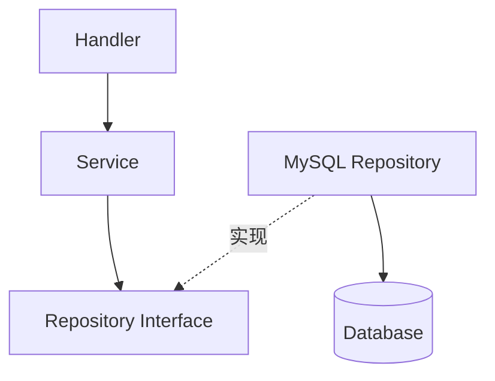

# 接口、组合与项目建模

## 这个页面解决什么

Go 的接口是隐式实现的。你不需要写 `implements`，只要方法集合满足接口即可。项目里真正重要的是定义小接口、明确包边界、用组合组织能力。

## 小接口

```go
type UserRepository interface {
    FindByID(ctx context.Context, id int64) (*User, error)
}
```

接口越小，越容易测试和替换。

## 隐式实现

```go
type MySQLUserRepository struct {
    db *sql.DB
}

func (r *MySQLUserRepository) FindByID(ctx context.Context, id int64) (*User, error) {
    return nil, nil
}
```

只要方法签名匹配，它就实现了 `UserRepository`。

## 依赖方向



Service 依赖接口，具体 MySQL 实现在组装阶段注入。

## 组合

Go 不鼓励复杂继承。通过结构体嵌入实现组合：

```go
type Logger struct{}

func (Logger) Info(msg string) {}

type UserService struct {
    Logger
    repo UserRepository
}
```

组合要谨慎使用，避免方法来源不清。业务代码里显式字段通常更易读。

## 包设计

推荐按业务域组织：

```text
internal
├─ user
│  ├─ handler.go
│  ├─ service.go
│  ├─ repository.go
│  └─ model.go
└─ order
```

不要把所有 handler 放一个包、所有 service 放一个包。按技术层横切会让业务变更跨很多目录。

## 实际项目问题

### 1. 接口定义在实现包里

如果 `mysql.UserRepository` 包里定义接口，Service 仍然依赖 MySQL 包。通常接口应定义在使用方附近。

### 2. 一个大 interface 包含几十个方法

测试时必须实现所有方法，替换困难。应拆成更小的接口。

### 3. internal 和 pkg 乱用

`pkg` 不是“公共工具垃圾桶”。只有真正希望外部项目导入的代码才放 `pkg`。

## 最佳实践

- 接口定义在使用方。
- 接口保持小。
- 按业务域组织包。
- `internal` 放应用私有实现。
- 不提前抽象，不为了抽象而抽象。

## 下一步学习

继续学习 [错误处理、日志与配置](/go/errors-logging-config)。
