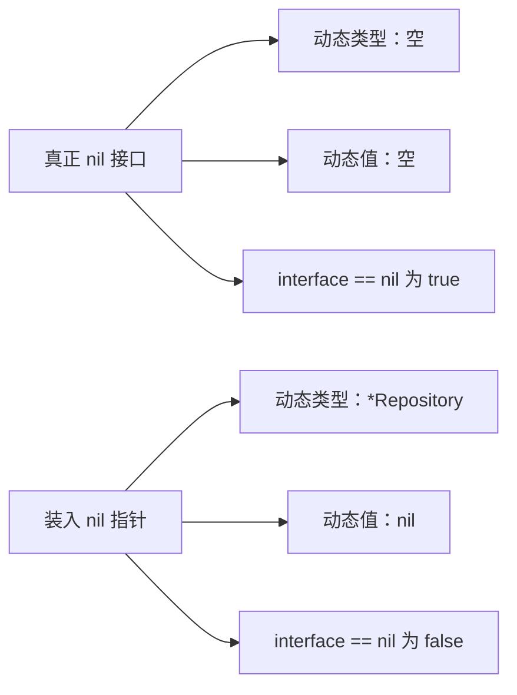
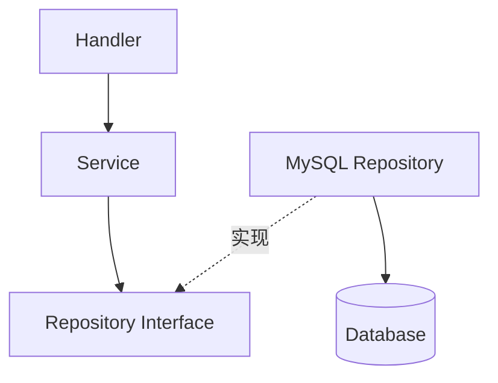

# 接口、组合与项目建模

## 适合谁看

适合会定义结构体和方法，但仍会集中创建大接口，或遇到“指针是 nil，interface 却不等于 nil”的读者。

## 先建立心智模型

接口值包含**动态类型**和**动态值**。只有两者都为空时，接口才等于 `nil`。接口也不是为实现者创建的父类，而是使用方对所需行为的最小声明。



## 从最小示例开始

### 小接口

```go
type UserRepository interface {
    FindByID(ctx context.Context, id int64) (*User, error)
}
```

接口越小，越容易测试和替换。

### 隐式实现

```go
type MySQLUserRepository struct {
    db *sql.DB
}

func (r *MySQLUserRepository) FindByID(ctx context.Context, id int64) (*User, error) {
    return nil, nil
}
```

只要方法签名匹配，它就实现了 `UserRepository`。

### 依赖方向



Service 依赖接口，具体 MySQL 实现在组装阶段注入。

### 组合

Go 不鼓励复杂继承。通过结构体嵌入实现组合：

```go
type Logger struct{}

func (Logger) Info(msg string) {}

type UserService struct {
    Logger
    repo UserRepository
}
```

组合要谨慎使用，避免方法来源不清。业务代码里显式字段通常更易读。

## 放进真实项目

Task Service 只需要读取用户时，不应依赖用户 Repository 的全部写能力：

```go
type UserReader interface {
    Get(context.Context, int64) (user.User, error)
}

type Service struct {
    tasks Repository
    users UserReader
}
```

这样测试只实现一个方法，用户数据未来改成远程服务时，任务规则也不必改变。

### typed nil 陷阱

```go
type Repository interface { Save() error }
type postgresRepository struct{}
func (*postgresRepository) Save() error { return nil }

var concrete *postgresRepository
var repo Repository = concrete
fmt.Println(repo == nil) // false
```

优先在构造阶段禁止注入 typed nil，并让实现方法在 nil receiver 上返回稳定错误。不要把反射检查散落到每个业务方法。

### 包设计

推荐按业务域组织：

```text
internal
├─ user
│  ├─ handler.go
│  ├─ service.go
│  ├─ repository.go
│  └─ model.go
└─ order
```

不要把所有 handler 放一个包、所有 service 放一个包。按技术层横切会让业务变更跨很多目录。

## 常见错误与根因

### 1. 接口定义在实现包里

如果 `mysql.UserRepository` 包里定义接口，Service 仍然依赖 MySQL 包。通常接口应定义在使用方附近。

### 2. 一个大 interface 包含几十个方法

测试时必须实现所有方法，替换困难。应拆成更小的接口。

### 3. internal 和 pkg 乱用

`pkg` 不是“公共工具垃圾桶”。只有真正希望外部项目导入的代码才放 `pkg`。

### 4. 返回 `any` 再靠类型断言

这会把编译期契约推迟到运行时。元素或响应结构已知时使用具体类型或适度泛型，只有真正异构的边界才使用 `any`。

### 5. 接口暴露实现细节

`QueryWithPGXPool` 把 PostgreSQL 决策泄漏给业务层。接口应描述 `List`、`Save`、`ChangeStatus` 等业务能力，具体 SQL 留在实现包。

## 验证清单

- [ ] 接口定义在使用方附近，方法只覆盖当前调用者需要的能力。
- [ ] 能解释接口值的动态类型与动态值，构造阶段拒绝 typed nil。
- [ ] fake 不必实现无关方法。
- [ ] 包依赖从业务规则指向抽象，不反向导入具体数据库实现。
- [ ] 结构体嵌入不会意外扩大公共 API；否则使用命名字段。
- [ ] 没有为了“以后可能替换”而提前增加无收益接口。

## 下一步学习

继续学习 [错误处理、日志与配置](/go/errors-logging-config)。
