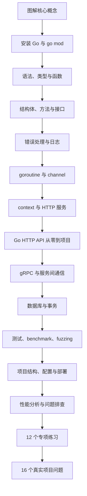
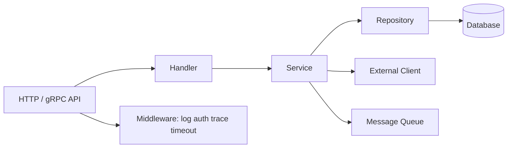

# Go 学习导览

## 适合谁看

适合准备做后端 API、云原生服务、命令行工具、微服务、网关、基础设施工具的学习者。

Go 的学习重点不是“语法有多复杂”，而是：

- 简洁语法如何支撑长期维护。
- goroutine 和 channel 如何组织并发。
- context 如何控制取消、超时和请求链路。
- 标准库如何完成 HTTP、测试、JSON、文件和命令行。
- Go Modules 如何管理依赖和多模块项目。
- 项目结构如何保持简单而可扩展。

## 你会学到什么

- Go 安装、模块、工作区和命令。
- 变量、函数、结构体、方法、接口和泛型。
- 错误处理、日志、配置和返回值设计。
- goroutine、channel、select、sync 和 context。
- HTTP API、middleware、请求超时和优雅关闭。
- 数据库访问、事务、连接池和仓储层。
- 测试、benchmark、fuzzing 和项目部署。
- 性能排查、内存、pprof 和常见线上问题。

## 学习路线

## Go 模块章节

| 章节 | 解决的问题 |
| --- | --- |
| [图解 Go 核心概念](/go/visual-guide) | 用图理解模块、包边界、分层、goroutine、channel、context、连接池和性能排查 |
| [环境、模块与工作区](/go/setup-modules) | 如何安装 Go，理解 go.mod、go.sum、workspace |
| [语法、类型与函数](/go/syntax-types) | 如何写变量、函数、结构体、方法和泛型 |
| [接口、组合与项目建模](/go/interfaces-composition) | 如何用小接口和组合表达业务边界 |
| [错误处理、日志与配置](/go/errors-logging-config) | 如何设计 error、日志、配置和返回值 |
| [并发：goroutine、channel、select](/go/concurrency) | 如何理解 Go 的并发模型 |
| [Context、HTTP 服务与中间件](/go/context-http) | 如何处理请求超时、取消、middleware 和优雅关闭 |
| [Go HTTP API 从零到项目落地](/go/http-api-project-from-zero) | 如何从 0 做一个任务 API，覆盖分包、HTTP、context、数据库、测试、构建、部署和排障 |
| [Go gRPC 与服务间通信项目](/go/grpc-service-communication) | 如何定义 Protobuf 契约、生成代码、实现 gRPC 服务端和客户端、处理超时、错误码、metadata、流式调用和联调排障 |
| [数据库、事务与仓储层](/go/database-transaction) | 如何使用 database/sql、事务和连接池 |
| [测试、Benchmark 与 Fuzzing](/go/testing) | 如何写单测、表格测试、基准测试和模糊测试 |
| [项目结构、构建与部署](/go/project-deployment) | 如何组织目录、构建二进制、容器化和上线 |
| [性能分析与线上诊断](/go/performance) | 如何使用 pprof、trace、指标和日志排查 |
| [Go 专项练习](/roadmap/go-practice) | 从模块、错误、并发、HTTP、数据库到容器交付的 12 个实验 |
| [Go 真实项目问题库](/projects/issues-go) | 用证据处理 nil、race、泄漏、连接池、事务和关闭问题 |
| [常见问题](/go/troubleshooting) | 如何排查 goroutine 泄漏、context 丢失、依赖和部署问题 |

## Go 在项目中的典型位置

## 学习建议

Go 适合项目驱动学习。推荐从一个后台 API 开始：

- 用户登录和 JWT。
- REST API。
- 数据库 CRUD。
- 分页筛选。
- 中间件。
- 请求超时。
- 单元测试和接口测试。
- Docker 部署。

Go 的代码风格强调简单直接。不要一开始就照搬 Java 的多层抽象，也不要把所有逻辑都塞进一个文件。边界清楚、接口小、错误明确，比复杂架构更重要。如果你已经理解 context 和 HTTP 服务，直接进入 [Go HTTP API 从零到项目落地](/go/http-api-project-from-zero)，做一个可运行、可测试、可部署的任务 API；如果你已经完成 HTTP API，继续进入 [Go gRPC 与服务间通信项目](/go/grpc-service-communication)，补齐 Protobuf 契约、服务间调用、超时、错误码和联调排障。

### 标准库还是框架

本站主线先使用标准库，目的是让你看见协议边界，而不是否定框架：

| 需求 | 推荐起点 | 何时升级 |
| --- | --- | --- |
| HTTP 路由、中间件、JSON | Go 1.22+ `net/http` ServeMux | 团队需要成熟路由分组时评估 Chi；已有 Gin 体系时沿用 Gin |
| SQL 与事务 | `database/sql` + pgx | 查询很多且希望生成类型安全代码时评估 sqlc |
| ORM | 先理解 SQL 与事务 | CRUD 模型复杂且团队接受 ORM 隐式行为时评估 GORM |
| 日志 | `log/slog` | 已有统一观测 SDK 时接入适配层 |
| 迁移 | 固定一种版本化迁移工具 | 不在同一项目混用多个迁移状态表 |

选择依据应是当前系统的查询复杂度、团队经验、可观测性和迁移成本，不是下载量排名。

## 当前版本选择

本站在 **2026-07-21** 核对的稳定版本为 **Go 1.26.5**，官方发布历史记录其发布于 2026-07-07，并包含安全与工具链修复。示例 `go.mod` 使用 `go 1.26.0` 作为语言和模块语义基线，测试与容器使用 `golang:1.26.5-bookworm` 补丁工具链。两者不矛盾：前者声明模块语义，后者决定实际编译器和标准库补丁。

版本会继续变化；新项目开始前应重新核对 [Go downloads](https://go.dev/dl/) 与 [Go Release History](https://go.dev/doc/devel/release)，并让本地、CI 和生产镜像一致。

## 参考资料

- [Go Documentation](https://go.dev/doc/)
- [Effective Go](https://go.dev/doc/effective_go)
- [Go 1.26 Release Notes](https://go.dev/doc/go1.26)
- [Go Release History](https://go.dev/doc/devel/release)
- [Go Fuzzing](https://go.dev/doc/security/fuzz/)

## 下一步学习

第一次进入 Go 模块，建议先看 [图解 Go 核心概念](/go/visual-guide)，再学习 [环境、模块与工作区](/go/setup-modules)。如果你已经掌握基础语法，继续进入 [Go HTTP API 从零到项目落地](/go/http-api-project-from-zero)。如果你正在做内部服务通信、微服务或网关，继续进入 [Go gRPC 与服务间通信项目](/go/grpc-service-communication)。
