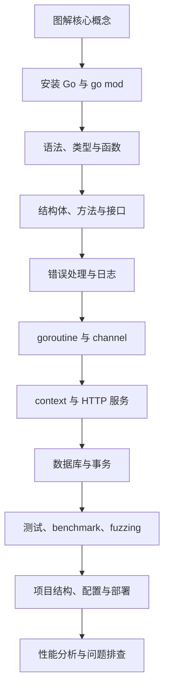
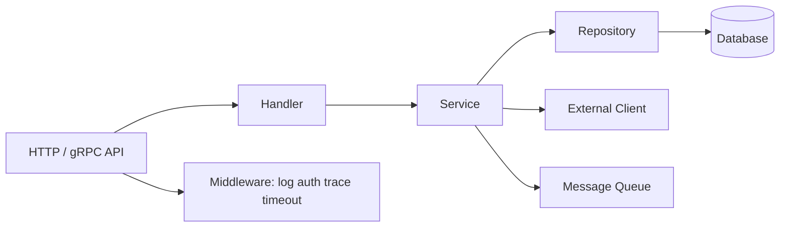

# Go 学习导览

## 适合谁看

适合准备做后端 API、云原生服务、命令行工具、微服务、网关、基础设施工具的学习者。

Go 的学习重点不是“语法有多复杂”，而是：

- 简洁语法如何支撑长期维护。
- goroutine 和 channel 如何组织并发。
- context 如何控制取消、超时和请求链路。
- 标准库如何完成 HTTP、测试、JSON、文件和命令行。
- Go Modules 如何管理依赖和多模块项目。
- 项目结构如何保持简单而可扩展。

## 你会学到什么

- Go 安装、模块、工作区和命令。
- 变量、函数、结构体、方法、接口和泛型。
- 错误处理、日志、配置和返回值设计。
- goroutine、channel、select、sync 和 context。
- HTTP API、middleware、请求超时和优雅关闭。
- 数据库访问、事务、连接池和仓储层。
- 测试、benchmark、fuzzing 和项目部署。
- 性能排查、内存、pprof 和常见线上问题。

## 学习路线

## Go 模块章节

| 章节 | 解决的问题 |
| --- | --- |
| [图解 Go 核心概念](/go/visual-guide) | 用图理解模块、包边界、分层、goroutine、channel、context、连接池和性能排查 |
| [环境、模块与工作区](/go/setup-modules) | 如何安装 Go，理解 go.mod、go.sum、workspace |
| [语法、类型与函数](/go/syntax-types) | 如何写变量、函数、结构体、方法和泛型 |
| [接口、组合与项目建模](/go/interfaces-composition) | 如何用小接口和组合表达业务边界 |
| [错误处理、日志与配置](/go/errors-logging-config) | 如何设计 error、日志、配置和返回值 |
| [并发：goroutine、channel、select](/go/concurrency) | 如何理解 Go 的并发模型 |
| [Context、HTTP 服务与中间件](/go/context-http) | 如何处理请求超时、取消、middleware 和优雅关闭 |
| [数据库、事务与仓储层](/go/database-transaction) | 如何使用 database/sql、事务和连接池 |
| [测试、Benchmark 与 Fuzzing](/go/testing) | 如何写单测、表格测试、基准测试和模糊测试 |
| [项目结构、构建与部署](/go/project-deployment) | 如何组织目录、构建二进制、容器化和上线 |
| [性能分析与线上诊断](/go/performance) | 如何使用 pprof、trace、指标和日志排查 |
| [常见问题](/go/troubleshooting) | 如何排查 goroutine 泄漏、context 丢失、依赖和部署问题 |

## Go 在项目中的典型位置

## 学习建议

Go 适合项目驱动学习。推荐从一个后台 API 开始：

- 用户登录和 JWT。
- REST API。
- 数据库 CRUD。
- 分页筛选。
- 中间件。
- 请求超时。
- 单元测试和接口测试。
- Docker 部署。

Go 的代码风格强调简单直接。不要一开始就照搬 Java 的多层抽象，也不要把所有逻辑都塞进一个文件。边界清楚、接口小、错误明确，比复杂架构更重要。

## 当前版本选择

截至 2026 年 7 月，Go 1.26 已发布，Go 1.25 仍有维护版本。Go 官方保持 Go 1 兼容承诺，但新版本会持续改进工具链、运行时和标准库。项目中要以团队 CI 和生产镜像版本为准。

## 参考资料

- [Go Documentation](https://go.dev/doc/)
- [Effective Go](https://go.dev/doc/effective_go)
- [Go 1.26 Release Notes](https://go.dev/doc/go1.26)
- [Go Release History](https://go.dev/doc/devel/release)
- [Go Fuzzing](https://go.dev/doc/security/fuzz/)

## 下一步学习

第一次进入 Go 模块，建议先看 [图解 Go 核心概念](/go/visual-guide)，再学习 [环境、模块与工作区](/go/setup-modules)。
