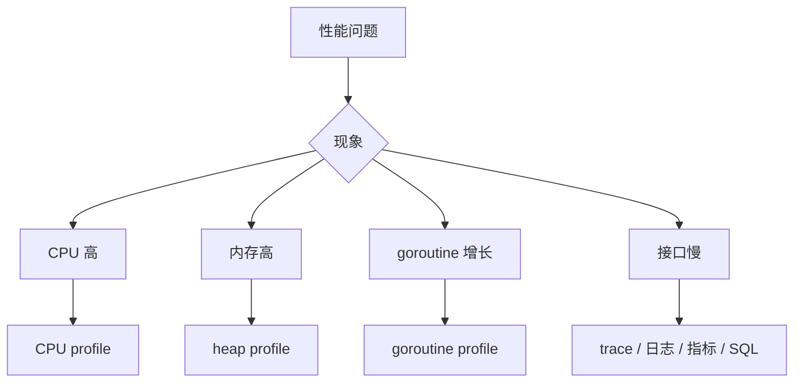

# 性能分析与线上诊断

## 适合谁看

适合面对“接口变慢、内存上涨、goroutine 增长、CPU 飙高”但不知道先收集什么证据的读者。

## 先建立心智模型

性能诊断是一条证据链：用户现象 -> 可重复负载 -> 指标定位维度 -> profile/trace/SQL 找热点 -> 单一改动 -> 同负载回归。跳过前半段直接改代码，很容易优化错对象。

## 从最小示例开始

### 诊断入口



### pprof

常见 profile：

- CPU。
- heap。
- goroutine。
- mutex。
- block。

HTTP 服务可以接入 `net/http/pprof`，但生产环境必须加访问控制，不要裸露到公网。

### 常见瓶颈

| 现象 | 可能原因 |
| --- | --- |
| CPU 高 | JSON 编解码、正则、压缩、死循环 |
| 内存高 | 大 slice、缓存无上限、响应一次性加载 |
| goroutine 多 | 泄漏、channel 阻塞、下游超时缺失 |
| 延迟高 | 慢 SQL、外部接口慢、锁竞争 |
| GC 频繁 | 短生命周期对象过多、分配过多 |

## 放进真实项目

先为一次问题记录固定窗口：版本、实例、请求量、P50/P95/P99、错误率、CPU、RSS、GC、goroutine、连接池等待和下游耗时。然后只抓与现象匹配的 profile：

```bash
go tool pprof -http=:0 http://127.0.0.1:6060/debug/pprof/profile?seconds=30
go tool pprof -http=:0 http://127.0.0.1:6060/debug/pprof/heap
curl -o goroutine.txt http://127.0.0.1:6060/debug/pprof/goroutine?debug=2
go test -bench=. -benchmem -count=5 ./internal/...
```

pprof 端口必须仅绑定管理网络并鉴权，不能和公开 API 一起暴露。数据库慢时同步检查 `pg_stat_activity`、锁等待和 `EXPLAIN (ANALYZE, BUFFERS)`；应用 CPU 低不代表 Go 代码没问题，可能都在连接池排队。

## 常见错误与根因

### 1. goroutine 数持续上涨

排查：

- 查看 goroutine profile。
- 找阻塞点。
- 检查 channel 是否无人接收。
- 检查 context 是否传递。
- 检查外部调用是否无超时。

### 2. 内存因为切片保留大数组

小切片引用大底层数组时，大数组不能释放。必要时复制出需要的部分。

### 3. 接口慢但 Go CPU 不高

很可能瓶颈在数据库、Redis、外部 API 或连接池。看链路耗时拆分，不要只看应用 CPU。

### 优化原则

1. 先测量。
2. 找最大瓶颈。
3. 小步修改。
4. 压测验证。
5. 保留监控。

不要为了理论性能牺牲明显的代码可读性，除非 profile 证明那是瓶颈。

## 验证清单

- [ ] 已记录问题版本、负载、延迟分位数、错误率与观察窗口。
- [ ] 根据现象选择 CPU、heap、goroutine、mutex、block 或 trace，而非全抓。
- [ ] Profile 与指标来自同一问题时段和实例。
- [ ] 同步检查数据库、连接池、缓存和外部 API 的耗时。
- [ ] 一次只改一个主要变量，并用同一负载比较前后结果。
- [ ] 优化没有移除超时、校验或可读性边界。
- [ ] pprof 不暴露公网，抓取后及时关闭临时入口。

## 下一步学习

继续学习 [常见问题](/go/troubleshooting)。
