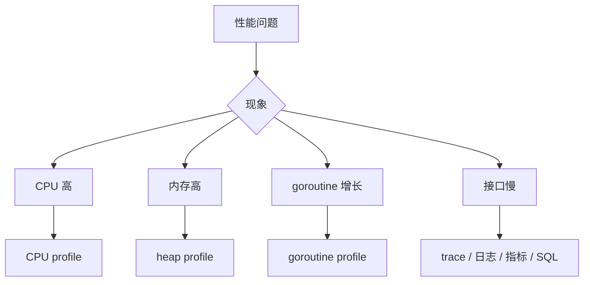

# 性能分析与线上诊断

## 这个页面解决什么

Go 程序性能问题常见在 CPU、内存、goroutine、锁竞争、GC、数据库和外部接口。要用数据定位，而不是凭感觉改代码。

## 诊断入口

## pprof

常见 profile：

- CPU。
- heap。
- goroutine。
- mutex。
- block。

HTTP 服务可以接入 `net/http/pprof`，但生产环境必须加访问控制，不要裸露到公网。

## 常见瓶颈

| 现象 | 可能原因 |
| --- | --- |
| CPU 高 | JSON 编解码、正则、压缩、死循环 |
| 内存高 | 大 slice、缓存无上限、响应一次性加载 |
| goroutine 多 | 泄漏、channel 阻塞、下游超时缺失 |
| 延迟高 | 慢 SQL、外部接口慢、锁竞争 |
| GC 频繁 | 短生命周期对象过多、分配过多 |

## 实际项目问题

### 1. goroutine 数持续上涨

排查：

- 查看 goroutine profile。
- 找阻塞点。
- 检查 channel 是否无人接收。
- 检查 context 是否传递。
- 检查外部调用是否无超时。

### 2. 内存因为切片保留大数组

小切片引用大底层数组时，大数组不能释放。必要时复制出需要的部分。

### 3. 接口慢但 Go CPU 不高

很可能瓶颈在数据库、Redis、外部 API 或连接池。看链路耗时拆分，不要只看应用 CPU。

## 优化原则

1. 先测量。
2. 找最大瓶颈。
3. 小步修改。
4. 压测验证。
5. 保留监控。

不要为了理论性能牺牲明显的代码可读性，除非 profile 证明那是瓶颈。

## 最佳实践

- 关键接口有耗时日志。
- 暴露基础指标：请求数、错误率、延迟、goroutine、内存、GC。
- 外部调用都设置超时。
- pprof 需要鉴权。
- 性能优化要有 benchmark 或压测结果。

## 下一步学习

继续学习 [常见问题](/go/troubleshooting)。
