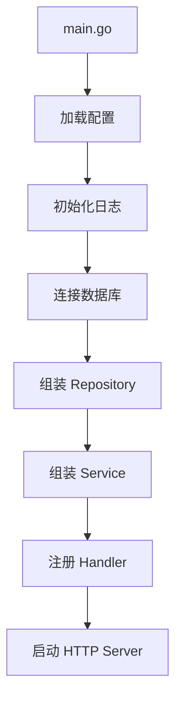

# 项目结构、构建与部署

## 适合谁看

适合已经能本地运行 API，但还没有把固定工具链、非 root 镜像、迁移依赖、探针、优雅关闭和 smoke test 串成可交付流程的读者。

## 先建立心智模型

交付不是“镜像能启动”，而是同一源码经过可重复测试与构建，迁移先成功，readiness 再接流量，停止时先摘流量再等待在途请求。

## 从最小示例开始

### 推荐结构

```text
app
├─ cmd/server/main.go
├─ internal/user
├─ internal/order
├─ internal/platform/db
├─ internal/platform/http
├─ migrations
├─ configs
├─ Dockerfile
├─ go.mod
└─ README.md
```

### 启动组装



`main.go` 应负责组装，不应写大量业务逻辑。

### 构建

```bash
go build -o bin/server ./cmd/server
```

交叉编译：

```bash
GOOS=linux GOARCH=amd64 go build -o bin/server-linux ./cmd/server
```

## 放进真实项目

### Dockerfile 示例

```dockerfile
FROM golang:1.26.5-bookworm AS build
WORKDIR /app
COPY go.mod go.sum ./
RUN go mod download
COPY . .
RUN CGO_ENABLED=0 GOOS=linux go build -o /server ./cmd/server

FROM gcr.io/distroless/static-debian12:nonroot
COPY --from=build /server /server
USER nonroot:nonroot
ENTRYPOINT ["/server"]
```

真实示例还把 `api`、`migrate`、`healthcheck` 三个静态二进制放进同一镜像。Compose 的启动顺序是 PostgreSQL healthy -> migrate 退出 0 -> API 启动 -> readiness healthy。

liveness 只说明进程能处理 HTTP；readiness 还检查数据库并在关闭开始时变 503。两个探针职责混在一起会导致数据库抖动时容器被反复重启。

### 部署检查

- Go 版本。
- 环境变量。
- 数据库迁移。
- 端口。
- 健康检查。
- 日志输出。
- 指标端点。
- 优雅关闭。

## 常见错误与根因

### 1. 本地能跑，容器里找不到配置

容器工作目录和本地不同。配置路径不要依赖相对目录，或在启动时明确打印配置来源。

### 2. 镜像过大

使用多阶段构建，只把二进制文件和必要证书放进运行镜像。

### 3. 关闭时请求被强杀

没有优雅关闭，发布时正在处理的请求中断。使用 `http.Server.Shutdown`，并给关闭过程设置超时。

### 4. API 在迁移前启动

仅用 `depends_on` 的启动顺序不等于迁移成功。应以数据库 healthcheck 和迁移容器 `service_completed_successfully` 作为 API 依赖条件。

### 5. 运行镜像里使用 root

即使二进制不主动写文件，root 仍扩大容器逃逸或依赖漏洞的影响。使用 distroless nonroot，并在 smoke 中检查 `.Config.User`。

## 验证清单

- [ ] 本地、CI 和 Dockerfile 固定同一 Go 补丁版本。
- [ ] `main` 只做配置、依赖组装、信号和运行。
- [ ] 运行镜像不含编译器和源码，并使用非 root 用户。
- [ ] 数据库 healthy 且迁移成功后 API 才启动。
- [ ] live 与 ready 分工明确，健康检查二进制只接受 2xx。
- [ ] `stop_grace_period` 大于应用 shutdown timeout。
- [ ] smoke 实际创建业务数据、验证冲突、发送终止信号并检查清理。

## 下一步学习

继续学习 [性能分析与线上诊断](/go/performance)。
