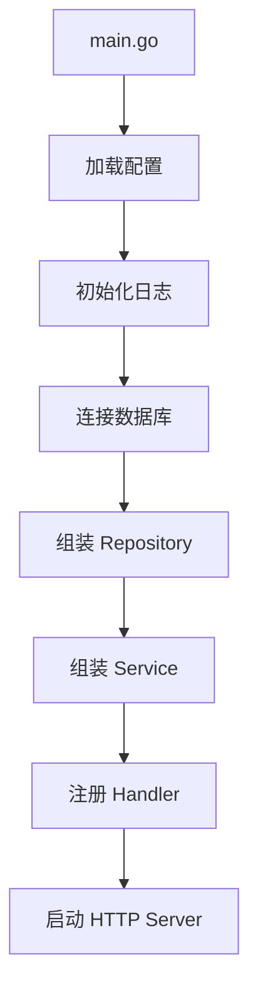

# 项目结构、构建与部署

## 这个页面解决什么

Go 项目最终会被构建成二进制文件。你需要知道目录怎么组织、配置怎么注入、如何构建镜像、如何优雅关闭和回滚。

## 推荐结构

```text
app
├─ cmd/server/main.go
├─ internal/user
├─ internal/order
├─ internal/platform/db
├─ internal/platform/http
├─ migrations
├─ configs
├─ Dockerfile
├─ go.mod
└─ README.md
```

## 启动组装



`main.go` 应负责组装，不应写大量业务逻辑。

## 构建

```bash
go build -o bin/server ./cmd/server
```

交叉编译：

```bash
GOOS=linux GOARCH=amd64 go build -o bin/server-linux ./cmd/server
```

## Dockerfile 示例

```dockerfile
FROM golang:1.26 AS build
WORKDIR /app
COPY go.mod go.sum ./
RUN go mod download
COPY . .
RUN CGO_ENABLED=0 GOOS=linux go build -o /server ./cmd/server

FROM gcr.io/distroless/static-debian12
COPY --from=build /server /server
ENTRYPOINT ["/server"]
```

## 部署检查

- Go 版本。
- 环境变量。
- 数据库迁移。
- 端口。
- 健康检查。
- 日志输出。
- 指标端点。
- 优雅关闭。

## 实际项目问题

### 1. 本地能跑，容器里找不到配置

容器工作目录和本地不同。配置路径不要依赖相对目录，或在启动时明确打印配置来源。

### 2. 镜像过大

使用多阶段构建，只把二进制文件和必要证书放进运行镜像。

### 3. 关闭时请求被强杀

没有优雅关闭，发布时正在处理的请求中断。使用 `http.Server.Shutdown`，并给关闭过程设置超时。

## 最佳实践

- main 只做组装和启动。
- 配置必须可追踪来源。
- 构建产物包含版本号和 commit。
- 镜像使用非 root 用户或最小运行镜像。
- 部署后检查健康、错误率和延迟。

## 下一步学习

继续学习 [性能分析与线上诊断](/go/performance)。
