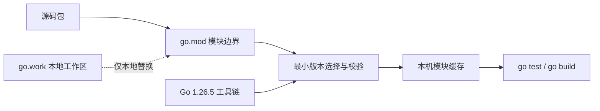
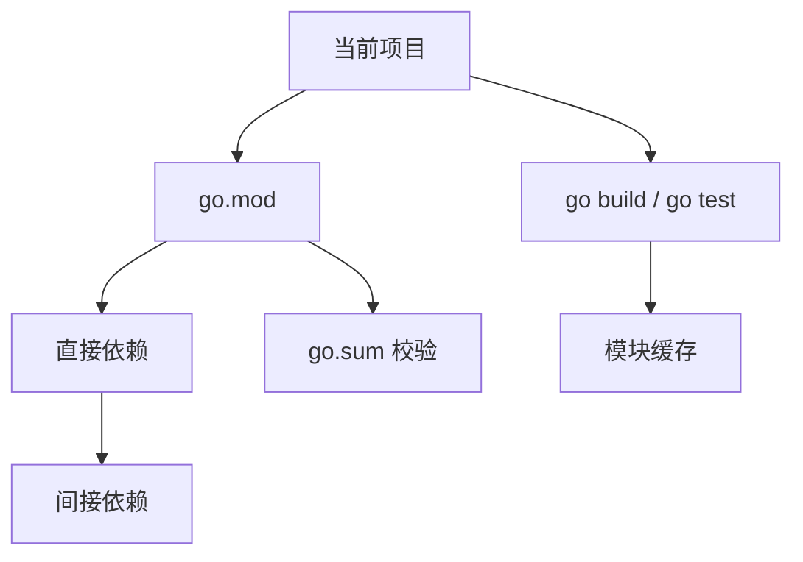

# 环境、模块与工作区

## 适合谁看

适合第一次创建 Go 项目，或经常被 `go.mod`、`go.sum`、`go work`、`replace` 和 CI 依赖差异困扰的读者。读完后你应该能解释“包、模块、工作区和工具链版本”分别解决什么问题。

## 先建立心智模型

- **包 package** 是一起编译的一组 `.go` 文件，决定标识符可见性。
- **模块 module** 是版本化和依赖解析的单位，根目录包含 `go.mod`。
- **工作区 workspace** 只帮助本地同时开发多个模块，不会替代模块版本发布。
- **工具链 toolchain** 负责格式化、测试、构建和模块解析，应在本地、CI 与容器中保持一致。

`go.mod` 中的 `go 1.26.0` 表示模块使用 Go 1.26 语言与模块语义基线，不等于必须放弃安全补丁。开发和发布仍应使用最新补丁工具链，例如本站在 2026-07-21 核对并使用的 Go 1.26.5。



## 从最小示例开始

```bash
go version
go env
go mod init example.com/app
go mod tidy
go test ./...
go run ./cmd/server
go build ./cmd/server
```

从空目录开始时，先完成 `go mod init -> fmt -> test -> run` 闭环。`go fmt` 统一格式，`go test` 编译并运行测试，`go run` 构建临时二进制并执行，`go build` 才生成可交付产物。

## go.mod 是什么

`go.mod` 描述当前模块：

```go
module example.com/app

go 1.26.0

require github.com/gin-gonic/gin v1.10.0
```

它定义模块路径、Go 版本和依赖。

`go.sum` 保存依赖校验信息，不是锁文件，但应该提交到仓库。

| 文件 | 应提交 | 作用 | 不应误解为 |
| --- | --- | --- | --- |
| `go.mod` | 是 | 模块路径、Go 语义版本、依赖要求 | 完整依赖下载清单 |
| `go.sum` | 是 | 模块内容校验和 | npm 风格的精确锁文件 |
| `go.work` | 视团队约定 | 本地多模块组合 | 发布模块的一部分 |
| `vendor/` | 视交付策略 | 仓库内依赖副本 | 默认必需目录 |

## 模块关系



## workspace

Go workspace 适合同时开发多个模块：

```bash
go work init ./app ./lib
go work use ./another-module
```

官方教程说明，workspace 可以让 Go 命令知道你正在同时开发多个模块，并在构建时使用这些本地模块。

## replace

本地调试依赖时可以用：

```go
replace example.com/lib => ../lib
```

但不要长期把临时 `replace` 留在主分支，除非这是项目约定。

## 放进真实项目

单模块应用优先从一个 `go.mod` 开始。只有子项目确实需要独立版本、独立发布或不同依赖生命周期时，才拆多个模块。可以在 `examples/go-task-api` 运行：

```bash
go env GOMOD GOVERSION GOPROXY GOPRIVATE
go mod verify
go list -deps ./... >/dev/null
go test ./...
```

### 推荐项目结构

```text
app
├─ cmd
│  └─ server
│     └─ main.go
├─ internal
│  ├─ user
│  ├─ order
│  └─ platform
├─ pkg
├─ configs
├─ migrations
├─ go.mod
└─ go.sum
```

`internal` 目录的代码不能被外部模块导入，适合放业务实现。`pkg` 只放确实要给外部复用的库。

## 常见错误与根因

### 1. 本地依赖能用，CI 失败

可能原因：

- 本地有 `replace`，CI 没有对应路径。
- 依赖没有提交 `go.sum`。
- 私有仓库权限缺失。
- Go 版本不一致。

### 2. go mod tidy 改动很多

`go mod tidy` 会根据当前源码重新计算需要的依赖。改动很多时先确认：

- 是否删除了某些包引用。
- 是否切换了分支。
- 是否生成代码缺失。
- 是否 Go 版本变化影响依赖。

### 3. 模块路径写错

模块路径通常应该和仓库地址或内部约定一致。写错后，包导入路径会混乱。

### 4. 把 `replace` 当成发布方案

`replace example.com/lib => ../lib` 依赖调用者本机目录。CI 没有相同路径就会失败。根因是把本地调试状态泄漏进发布契约。

### 5. 私有模块不断要求认证

先确认 `GOPRIVATE` 覆盖私有模块域名，再检查 Git 凭据。不要通过关闭全部校验或把令牌写进模块 URL 来绕过。

## 验证清单

- [ ] 已提交 `go.mod` 和 `go.sum`，`go mod tidy` 后没有未解释差异。
- [ ] `go mod verify` 与 `go test ./...` 成功。
- [ ] 本地、CI 与容器使用相同的 Go 补丁工具链。
- [ ] `go.work` 和临时 `replace` 不会意外影响发布构建。
- [ ] 私有模块通过 `GOPRIVATE` 与受控凭据访问。
- [ ] 模块拆分来自真实发布需求，而不是目录美化。

## 参考资料

- [Go Documentation](https://go.dev/doc/)
- [Go Release History](https://go.dev/doc/devel/release)
- [Tutorial: Getting started with multi-module workspaces](https://go.dev/doc/tutorial/workspaces)

## 下一步学习

继续学习 [语法、类型与函数](/go/syntax-types)。
