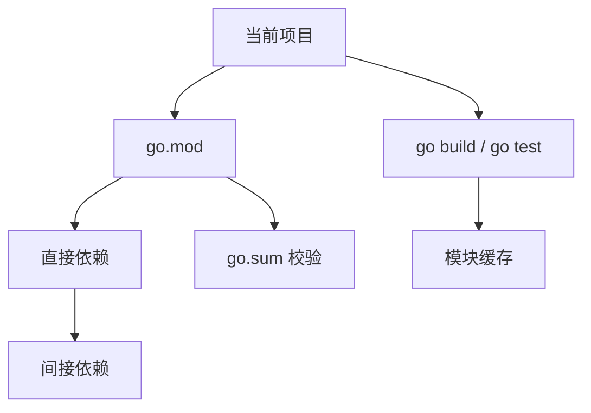

# 环境、模块与工作区

## 这个页面解决什么

Go 工具链比很多语言简单，但 `go mod`、`go.sum`、workspace、proxy、vendor、replace 仍然容易让初学者混乱。先理解模块系统，后面做工程会顺很多。

## 常用命令

```bash
go version
go env
go mod init example.com/app
go mod tidy
go test ./...
go run ./cmd/server
go build ./cmd/server
```

## go.mod 是什么

`go.mod` 描述当前模块：

```go
module example.com/app

go 1.26

require github.com/gin-gonic/gin v1.10.0
```

它定义模块路径、Go 版本和依赖。

`go.sum` 保存依赖校验信息，不是锁文件，但应该提交到仓库。

## 模块关系



## workspace

Go workspace 适合同时开发多个模块：

```bash
go work init ./app ./lib
go work use ./another-module
```

官方教程说明，workspace 可以让 Go 命令知道你正在同时开发多个模块，并在构建时使用这些本地模块。

## replace

本地调试依赖时可以用：

```go
replace example.com/lib => ../lib
```

但不要长期把临时 `replace` 留在主分支，除非这是项目约定。

## 推荐项目结构

```text
app
├─ cmd
│  └─ server
│     └─ main.go
├─ internal
│  ├─ user
│  ├─ order
│  └─ platform
├─ pkg
├─ configs
├─ migrations
├─ go.mod
└─ go.sum
```

`internal` 目录的代码不能被外部模块导入，适合放业务实现。`pkg` 只放确实要给外部复用的库。

## 实际项目问题

### 1. 本地依赖能用，CI 失败

可能原因：

- 本地有 `replace`，CI 没有对应路径。
- 依赖没有提交 `go.sum`。
- 私有仓库权限缺失。
- Go 版本不一致。

### 2. go mod tidy 改动很多

`go mod tidy` 会根据当前源码重新计算需要的依赖。改动很多时先确认：

- 是否删除了某些包引用。
- 是否切换了分支。
- 是否生成代码缺失。
- 是否 Go 版本变化影响依赖。

### 3. 模块路径写错

模块路径通常应该和仓库地址或内部约定一致。写错后，包导入路径会混乱。

## 最佳实践

- 提交 `go.mod` 和 `go.sum`。
- CI 固定 Go 版本。
- 多模块开发用 `go work`，发布前确认模块依赖。
- 少用全局 GOPATH 思维，现代 Go 以 modules 为主。
- 私有仓库要配置 GOPRIVATE。

## 参考资料

- [Go Documentation](https://go.dev/doc/)
- [Tutorial: Getting started with multi-module workspaces](https://go.dev/doc/tutorial/workspaces)

## 下一步学习

继续学习 [语法、类型与函数](/go/syntax-types)。
