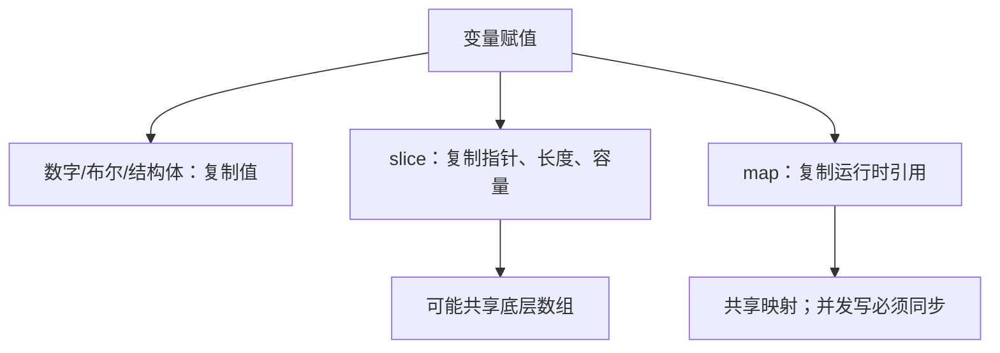
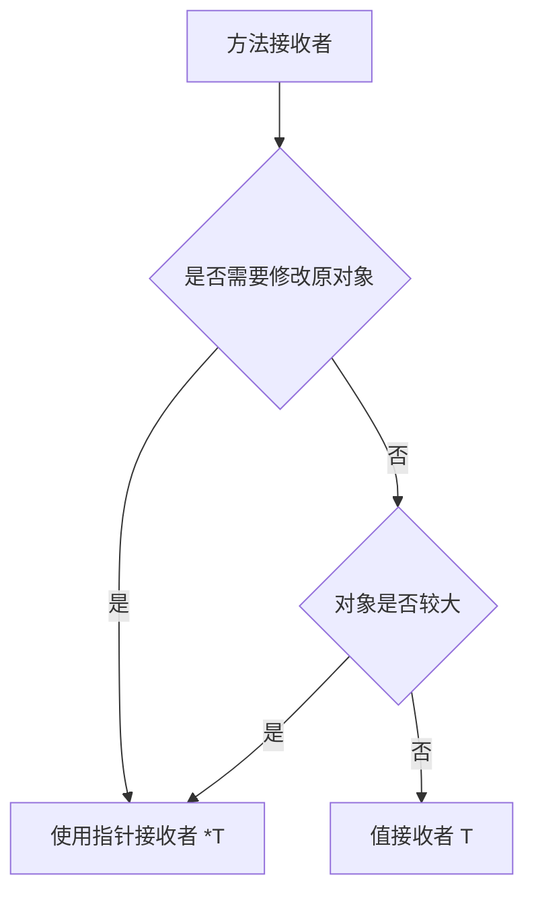

# 语法、类型与函数

## 适合谁看

适合已经能看懂基本 Go 语法，但还不确定零值、slice 共享、map 并发、方法集合和指针接收者如何影响正确性的读者。

## 先建立心智模型

数组把元素直接放在值里；slice 是“指向底层数组的描述符”；map、channel、函数和指针的零值是 `nil`。赋值语法相同，复制成本和共享关系却不同。



## 从最小示例开始

### 变量和零值

```go
var name string
var age int
var enabled bool
```

未赋值时会使用零值：

| 类型 | 零值 |
| --- | --- |
| string | `""` |
| int | `0` |
| bool | `false` |
| pointer / slice / map / channel | `nil` |

零值让很多类型开箱可用，但 `nil` slice、nil map、nil pointer 要特别注意。

### 函数

```go
func Add(a int, b int) int {
    return a + b
}
```

多个返回值常用于返回结果和错误：

```go
func FindUser(id int64) (*User, error) {
    if id <= 0 {
        return nil, errors.New("invalid id")
    }
    return &User{ID: id}, nil
}
```

### 结构体

```go
type User struct {
    ID    int64
    Name  string
    Email string
}
```

字段首字母大写表示包外可见，小写表示包内可见。

### 方法

```go
func (u User) DisplayName() string {
    if u.Name == "" {
        return "未命名用户"
    }
    return u.Name
}
```

需要修改接收者时使用指针接收者：

```go
func (u *User) Rename(name string) {
    u.Name = name
}
```

### 值接收者和指针接收者



### 泛型

Go 泛型适合写类型安全的通用函数：

```go
func First[T any](items []T) (T, bool) {
    var zero T
    if len(items) == 0 {
        return zero, false
    }
    return items[0], true
}
```

不要为了炫技滥用泛型。业务代码大多数时候清晰的结构体和接口更重要。

## 放进真实项目

### slice 扩容与共享

slice 自身只有指针、长度和容量。`append` 在容量足够时复用底层数组，容量不足时分配新数组：

```go
base := make([]int, 2, 4)
base[0], base[1] = 10, 20
view := base[:1]
view = append(view, 99)
fmt.Println(base) // [10 99]
```

跨层传递时若调用方不应观察到修改，要明确复制：

```go
snapshot := append([]int(nil), base...)
```

从大字节切片截取很小一段并长期保存，会让整个底层数组无法回收。需要长期持有时使用 `bytes.Clone` 或显式复制。

### map 并发边界

普通 map 允许多个 goroutine 并发读取，但只要存在写入，就必须同步。

| 场景 | 选择 |
| --- | --- |
| 单 goroutine 拥有，其他 goroutine 通过 channel 发命令 | 不加锁，由所有权保证 |
| 多 goroutine 读写普通业务状态 | `sync.RWMutex` + map |
| key 稳定、读多写少、值彼此独立 | 评估 `sync.Map` |
| 跨请求持久状态 | 放数据库或专用缓存 |

### 指针接收者与零值

需要修改对象、对象较大、包含 `sync.Mutex` 等不可复制字段，或希望同一类型方法一致时，使用指针接收者。`bytes.Buffer`、`sync.Mutex` 的零值可用是好设计；自定义类型若无法提供安全零值，就用构造函数校验并让方法返回稳定错误。

## 常见错误与根因

### 1. nil map 直接写入 panic

```go
var m map[string]int
m["a"] = 1
```

需要先初始化：

```go
m := make(map[string]int)
```

### 2. range 变量地址复用

老代码里常见把 range 变量地址放进 slice，导致结果异常。写代码时避免依赖循环变量地址，必要时创建局部副本。

### 3. JSON 字段没有导出

```go
type User struct {
    name string
}
```

小写字段无法被 `encoding/json` 正常导出。接口响应结构体字段通常要大写，并加 json tag。

### 4. append 后意外串数据

根因是没有约定底层数组所有权。不要依赖“这次容量刚好够”；在 API 边界明确是借用、转移还是复制。

### 5. 复制带锁结构体

结构体一旦使用过 `sync.Mutex` 就不应再复制。使用指针接收者，并通过 `go vet` 的 `copylocks` 检查发现常见错误。

## 验证清单

- [ ] 能说明每个 slice 的底层数组所有权，必要时在边界复制。
- [ ] 所有可能并发写 map 的路径都有锁或单一 goroutine 所有权。
- [ ] nil slice 与空 slice 的 JSON 语义符合接口契约。
- [ ] 带锁或较大的类型统一使用指针接收者。
- [ ] 构造函数和零值语义清楚，nil receiver 不会无提示 panic。
- [ ] 已运行 `go vet ./...`、`go test ./...` 和 `go test -race ./...`。

## 下一步学习

继续学习 [接口、组合与项目建模](/go/interfaces-composition)。
