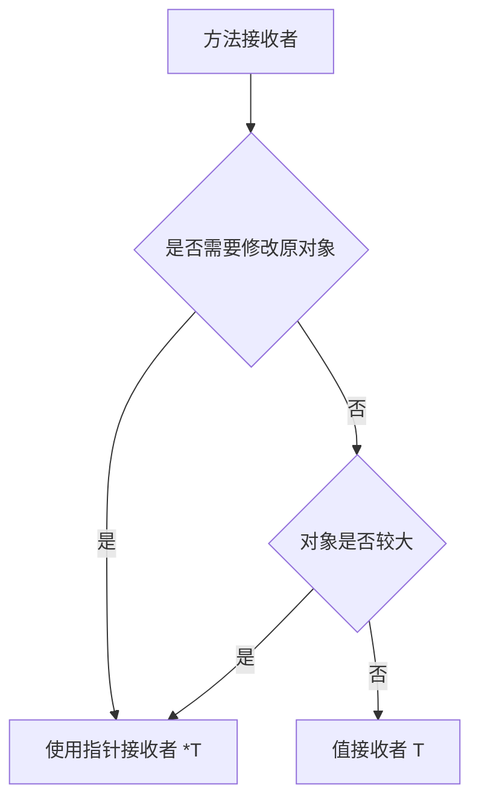

# 语法、类型与函数

## 这个页面解决什么

Go 语法简单，但简单不等于随便写。变量作用域、零值、指针、结构体、方法和泛型都会影响项目可维护性。

## 变量和零值

```go
var name string
var age int
var enabled bool
```

未赋值时会使用零值：

| 类型 | 零值 |
| --- | --- |
| string | `""` |
| int | `0` |
| bool | `false` |
| pointer / slice / map / channel | `nil` |

零值让很多类型开箱可用，但 `nil` slice、nil map、nil pointer 要特别注意。

## 函数

```go
func Add(a int, b int) int {
    return a + b
}
```

多个返回值常用于返回结果和错误：

```go
func FindUser(id int64) (*User, error) {
    if id <= 0 {
        return nil, errors.New("invalid id")
    }
    return &User{ID: id}, nil
}
```

## 结构体

```go
type User struct {
    ID    int64
    Name  string
    Email string
}
```

字段首字母大写表示包外可见，小写表示包内可见。

## 方法

```go
func (u User) DisplayName() string {
    if u.Name == "" {
        return "未命名用户"
    }
    return u.Name
}
```

需要修改接收者时使用指针接收者：

```go
func (u *User) Rename(name string) {
    u.Name = name
}
```

## 值接收者和指针接收者



## 泛型

Go 泛型适合写类型安全的通用函数：

```go
func First[T any](items []T) (T, bool) {
    var zero T
    if len(items) == 0 {
        return zero, false
    }
    return items[0], true
}
```

不要为了炫技滥用泛型。业务代码大多数时候清晰的结构体和接口更重要。

## 实际项目问题

### 1. nil map 直接写入 panic

```go
var m map[string]int
m["a"] = 1
```

需要先初始化：

```go
m := make(map[string]int)
```

### 2. range 变量地址复用

老代码里常见把 range 变量地址放进 slice，导致结果异常。写代码时避免依赖循环变量地址，必要时创建局部副本。

### 3. JSON 字段没有导出

```go
type User struct {
    name string
}
```

小写字段无法被 `encoding/json` 正常导出。接口响应结构体字段通常要大写，并加 json tag。

## 最佳实践

- 用零值简化初始化，但对 nil map、nil pointer 保持警惕。
- 错误作为返回值显式处理。
- 结构体字段可见性要服务于包边界。
- 指针接收者用于修改或避免复制大对象。
- 泛型只在能明显减少重复和保持类型安全时使用。

## 下一步学习

继续学习 [接口、组合与项目建模](/go/interfaces-composition)。
