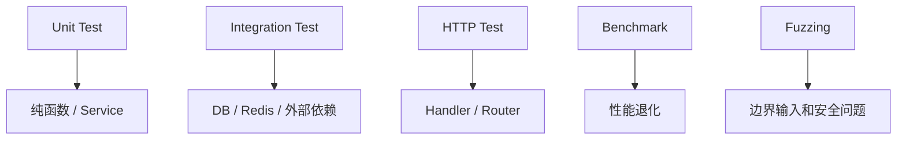

# 测试、Benchmark 与 Fuzzing

## 适合谁看

适合只会写正常路径单元测试，还没有建立 Handler、Repository、race、Fuzz 和真实数据库验证层次的读者。

## 先建立心智模型

测试不是越接近生产越好，而是每层回答不同问题：纯 Service 测规则，`httptest` 测协议，Testcontainers 测真实 SQL，race 测并发访问，Fuzz 测输入空间。

## 从最小示例开始

### 最小测试

文件名以 `_test.go` 结尾：

```go
func TestAdd(t *testing.T) {
    got := Add(1, 2)
    if got != 3 {
        t.Fatalf("expected 3, got %d", got)
    }
}
```

运行：

```bash
go test ./...
```

### 表格测试

```go
func TestDiscount(t *testing.T) {
    cases := []struct {
        name string
        price int
        rate float64
        want int
    }{
        {"normal", 100, 0.8, 80},
        {"zero", 0, 0.8, 0},
    }

    for _, tt := range cases {
        t.Run(tt.name, func(t *testing.T) {
            got := Discount(tt.price, tt.rate)
            if got != tt.want {
                t.Fatalf("want %d, got %d", tt.want, got)
            }
        })
    }
}
```

### 测试分层



### Benchmark

```go
func BenchmarkEncodeUser(b *testing.B) {
    user := User{ID: 1, Name: "Ada"}
    for i := 0; i < b.N; i++ {
        _, _ = json.Marshal(user)
    }
}
```

运行：

```bash
go test -bench=. ./...
```

### Fuzzing

Go 官方文档说明，Fuzzing 会持续改变输入来寻找 bug，尤其适合发现人工容易漏掉的边界和安全问题。

```go
func FuzzParseUserID(f *testing.F) {
    f.Add("123")
    f.Fuzz(func(t *testing.T, input string) {
        _, _ = ParseUserID(input)
    })
}
```

运行：

```bash
go test -run '^$' -fuzz '^FuzzParseUserID$' -fuzztime 10s
```

## 放进真实项目

本站示例的最小验证集：

```bash
cd examples/go-task-api
go test ./...
go test -race ./...
go vet ./...
go test -tags=integration ./... -count=1 -v
go test ./internal/platform/httpx -run '^$' \
  -fuzz '^FuzzDecodeJSON$' -fuzztime 10s
```

集成测试必须真的启动 PostgreSQL 18.4，不能在 Docker 不可用时静默 `Skip`。每个测试独立准备数据，并用 `t.Cleanup` 关闭 server、连接池和容器。

HTTP 测试至少断言状态、Content-Type、错误码、request ID、Location/Allow Header 和 204 空 body。Repository 测试不仅要测 CRUD，还要测约束映射、分页总数、取消、关闭连接池错误和两个并发写者只有一个成功。

## 常见错误与根因

### 1. 测试依赖执行顺序

每个测试应该独立准备数据，不依赖另一个测试先执行。

### 2. 测试只覆盖正常路径

错误路径更容易线上出问题。每个核心函数至少覆盖：

- 正常输入。
- 空输入。
- 非法输入。
- 边界值。
- 下游错误。

### 3. benchmark 不稳定

性能测试要固定输入、减少外部依赖，并关注趋势，不要只看一次数字。

### 4. 集成测试其实用了 mock

mock 只能证明调用方式，不能证明 SQL 占位符、约束、索引和事务行为。数据库契约必须对支持的真实数据库版本执行。

### 5. 测试偶发通过

常见根因是共享全局状态、未等待 goroutine、依赖 wall clock 或并发子测试复用同一 fake。用注入时钟、独立夹具和 `-count=30 -shuffle=on` 放大问题。

## 验证清单

- [ ] 核心规则覆盖正常、边界、失败、取消和下游错误。
- [ ] HTTP 协议断言不仅检查状态码，也检查 envelope 与 Header。
- [ ] PostgreSQL 测试实际运行且清理容器，没有用 mock 代替数据库契约。
- [ ] 并发路径通过 `-race` 和确定性竞争测试。
- [ ] 解析器、校验器或编解码器有可限时执行的 Fuzz target。
- [ ] 不稳定路径运行过 `-count=30 -shuffle=on`。
- [ ] 测试失败信息包含 got/want 与必要上下文，不泄露密钥。

## 参考资料

- [Add a test - The Go Programming Language](https://go.dev/doc/tutorial/add-a-test)
- [testing package](https://pkg.go.dev/testing)
- [Go Fuzzing](https://go.dev/doc/security/fuzz/)

## 下一步学习

继续学习 [项目结构、构建与部署](/go/project-deployment)。
