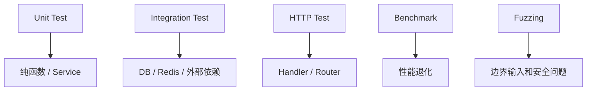

# 测试、Benchmark 与 Fuzzing

## 这个页面解决什么

Go 内置测试工具非常实用。你不需要先引入大型测试框架，就可以完成单元测试、表格测试、基准测试和模糊测试。

## 最小测试

文件名以 `_test.go` 结尾：

```go
func TestAdd(t *testing.T) {
    got := Add(1, 2)
    if got != 3 {
        t.Fatalf("expected 3, got %d", got)
    }
}
```

运行：

```bash
go test ./...
```

## 表格测试

```go
func TestDiscount(t *testing.T) {
    cases := []struct {
        name string
        price int
        rate float64
        want int
    }{
        {"normal", 100, 0.8, 80},
        {"zero", 0, 0.8, 0},
    }

    for _, tt := range cases {
        t.Run(tt.name, func(t *testing.T) {
            got := Discount(tt.price, tt.rate)
            if got != tt.want {
                t.Fatalf("want %d, got %d", tt.want, got)
            }
        })
    }
}
```

## 测试分层



## Benchmark

```go
func BenchmarkEncodeUser(b *testing.B) {
    user := User{ID: 1, Name: "Ada"}
    for i := 0; i < b.N; i++ {
        _, _ = json.Marshal(user)
    }
}
```

运行：

```bash
go test -bench=. ./...
```

## Fuzzing

Go 官方文档说明，Fuzzing 会持续改变输入来寻找 bug，尤其适合发现人工容易漏掉的边界和安全问题。

```go
func FuzzParseUserID(f *testing.F) {
    f.Add("123")
    f.Fuzz(func(t *testing.T, input string) {
        _, _ = ParseUserID(input)
    })
}
```

运行：

```bash
go test -fuzz=FuzzParseUserID
```

## 实际项目问题

### 1. 测试依赖执行顺序

每个测试应该独立准备数据，不依赖另一个测试先执行。

### 2. 测试只覆盖正常路径

错误路径更容易线上出问题。每个核心函数至少覆盖：

- 正常输入。
- 空输入。
- 非法输入。
- 边界值。
- 下游错误。

### 3. benchmark 不稳定

性能测试要固定输入、减少外部依赖，并关注趋势，不要只看一次数字。

## 最佳实践

- 使用表格测试覆盖边界。
- 对 HTTP handler 使用 `httptest`。
- 对并发代码运行 `go test -race`。
- 对解析器、校验器、编解码器使用 fuzzing。
- CI 至少执行 `go test ./...`。

## 参考资料

- [Add a test - The Go Programming Language](https://go.dev/doc/tutorial/add-a-test)
- [testing package](https://pkg.go.dev/testing)
- [Go Fuzzing](https://go.dev/doc/security/fuzz/)

## 下一步学习

继续学习 [项目结构、构建与部署](/go/project-deployment)。
