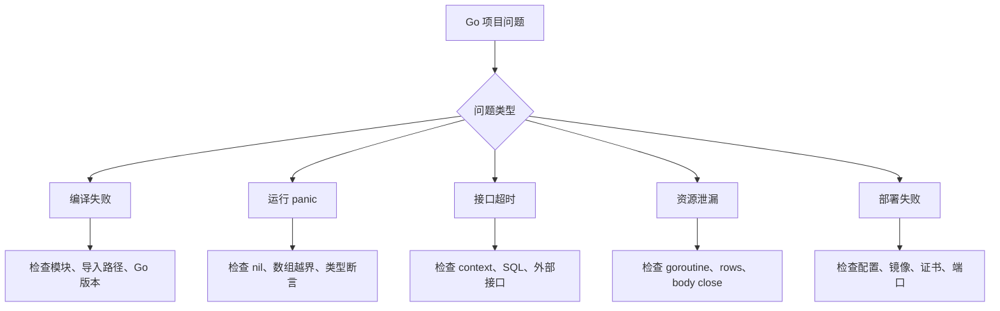

# Go 常见问题

## 适合谁看

适合已经遇到 Go 项目异常，需要从症状快速找到证据入口的读者。本页负责分流；完整复现、根因、修复和回归测试见 [Go 真实项目问题库](/projects/issues-go)，示例 API 的命令级排障见 `examples/go-task-api/TROUBLESHOOTING.md`。

## 证据优先

先记录版本、提交、时间窗口、接口、request ID、错误比例和影响范围，再提出可证伪假设。不要把“重启后好了”当根因。

| 症状 | 第一证据 | 下一入口 |
| --- | --- | --- |
| panic | 完整堆栈、panic 类型、版本 | nil、越界、并发 map |
| 延迟升高 | P50/P95/P99、下游分段耗时 | SQL、连接池、锁、外部 API |
| 内存上涨 | heap 与 alloc profile | slice 持有、缓存、响应体 |
| goroutine 上涨 | goroutine profile 与阻塞栈 | channel、无超时 I/O、后台任务 |
| 偶发错数据 | `go test -race`、并发复现 | map race、丢失更新、事务边界 |

## 快速定位图



## nil pointer panic

### 常见原因

- 依赖没有初始化。
- 指针返回值没有判空。
- map、slice、channel 误用。
- 配置加载失败后继续启动。

### 处理

- 构造函数返回错误。
- 启动阶段失败就退出。
- 对可空返回值明确处理。

## goroutine 泄漏

### 现象

- goroutine 数持续增长。
- 内存缓慢上升。
- 服务延迟变高。

### 排查

- goroutine profile。
- 查 channel 阻塞。
- 查无超时外部调用。
- 查后台任务退出条件。

## context deadline exceeded

这不是“随便把超时调大”就能解决。先看：

- SQL 是否慢。
- 外部接口是否慢。
- 连接池是否排队。
- 请求是否被上游代理提前断开。
- 超时时间是否不合理。

## response body 未关闭

HTTP client 调用后必须关闭响应体：

```go
resp, err := client.Do(req)
if err != nil {
    return err
}
defer resp.Body.Close()
```

不关闭会导致连接不能复用，最终连接耗尽。

## 数据库连接耗尽

可能原因：

- `rows.Close()` 缺失。
- 长事务。
- 慢 SQL。
- 并发无上限。
- 连接池设置不合理。

## 部署后证书错误

最小镜像可能缺 CA 证书，导致 HTTPS 请求失败。需要在镜像中加入证书或选择包含证书的基础镜像。

## 验证清单

- [ ] 已保存问题时间窗口、版本、request ID 和最小复现。
- [ ] 所有外部 I/O 都传 context，资源都有成对关闭。
- [ ] goroutine 有退出条件，channel 所有权明确。
- [ ] 启动时配置强校验，日志与响应不泄露连接串。
- [ ] 使用 race、profile、trace 或 SQL 证据证明根因。
- [ ] 修复后运行对应回归测试，并观察一个完整业务窗口。

## 下一步学习

按问题深挖 [Go 真实项目问题库](/projects/issues-go)，通过 [Go 专项练习](/roadmap/go-practice) 复现，再回到 [性能分析与线上诊断](/go/performance) 建立完整证据链。
