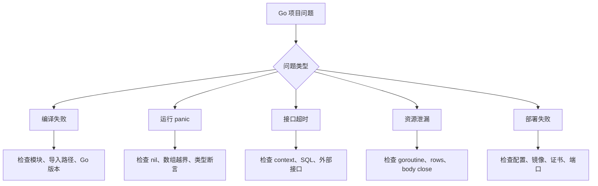

# Go 常见问题

## 这个页面解决什么

这里整理 Go 项目高频真实问题：模块依赖、nil panic、goroutine 泄漏、context 丢失、数据库连接耗尽、容器部署异常。

## 快速定位图



## nil pointer panic

### 常见原因

- 依赖没有初始化。
- 指针返回值没有判空。
- map、slice、channel 误用。
- 配置加载失败后继续启动。

### 处理

- 构造函数返回错误。
- 启动阶段失败就退出。
- 对可空返回值明确处理。

## goroutine 泄漏

### 现象

- goroutine 数持续增长。
- 内存缓慢上升。
- 服务延迟变高。

### 排查

- goroutine profile。
- 查 channel 阻塞。
- 查无超时外部调用。
- 查后台任务退出条件。

## context deadline exceeded

这不是“随便把超时调大”就能解决。先看：

- SQL 是否慢。
- 外部接口是否慢。
- 连接池是否排队。
- 请求是否被上游代理提前断开。
- 超时时间是否不合理。

## response body 未关闭

HTTP client 调用后必须关闭响应体：

```go
resp, err := client.Do(req)
if err != nil {
    return err
}
defer resp.Body.Close()
```

不关闭会导致连接不能复用，最终连接耗尽。

## 数据库连接耗尽

可能原因：

- `rows.Close()` 缺失。
- 长事务。
- 慢 SQL。
- 并发无上限。
- 连接池设置不合理。

## 部署后证书错误

最小镜像可能缺 CA 证书，导致 HTTPS 请求失败。需要在镜像中加入证书或选择包含证书的基础镜像。

## 最佳实践

- 所有外部 I/O 都传 context。
- 所有资源都明确关闭：rows、body、file。
- goroutine 要有退出条件。
- 启动时校验配置。
- 用 `go test -race` 和 pprof 辅助定位。

## 下一步学习

继续查看 [Go 速查](/cheatsheets/go)，或回到 [技术库总览](/technologies/)。
