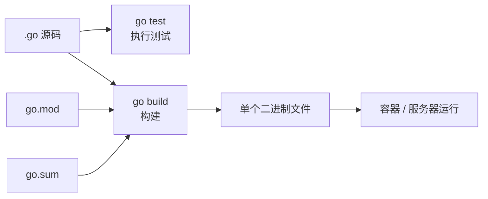
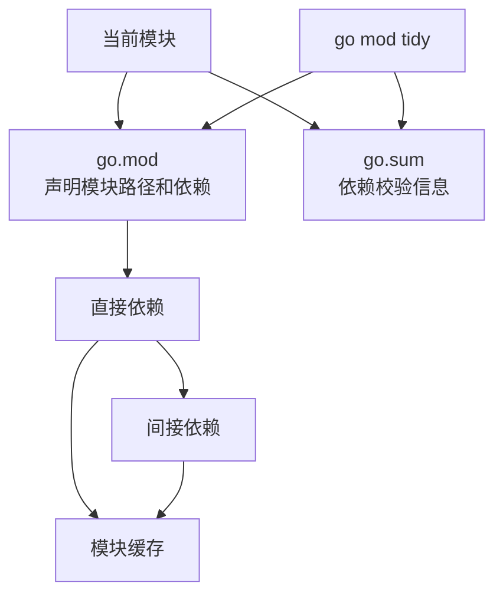
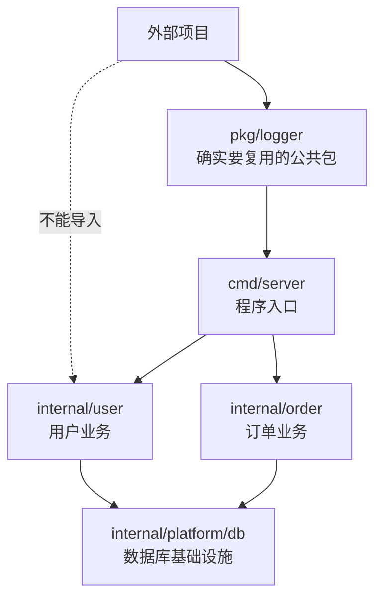
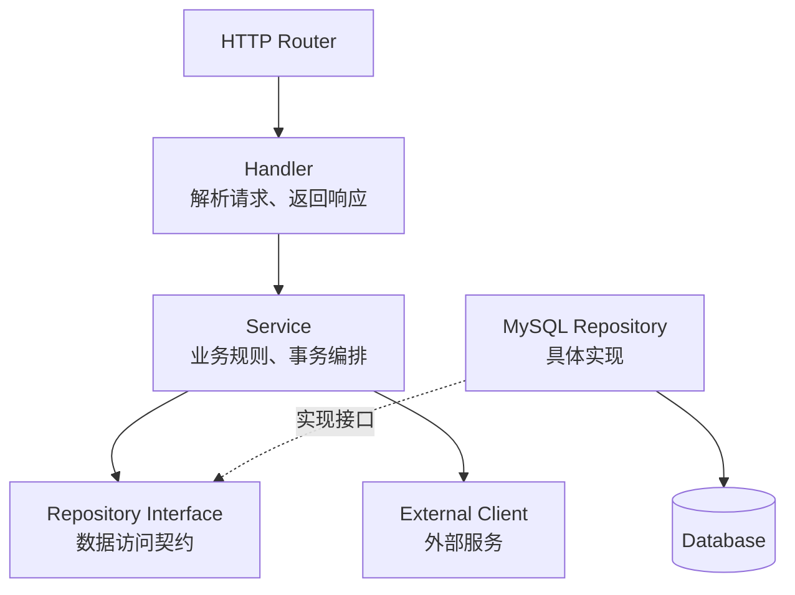
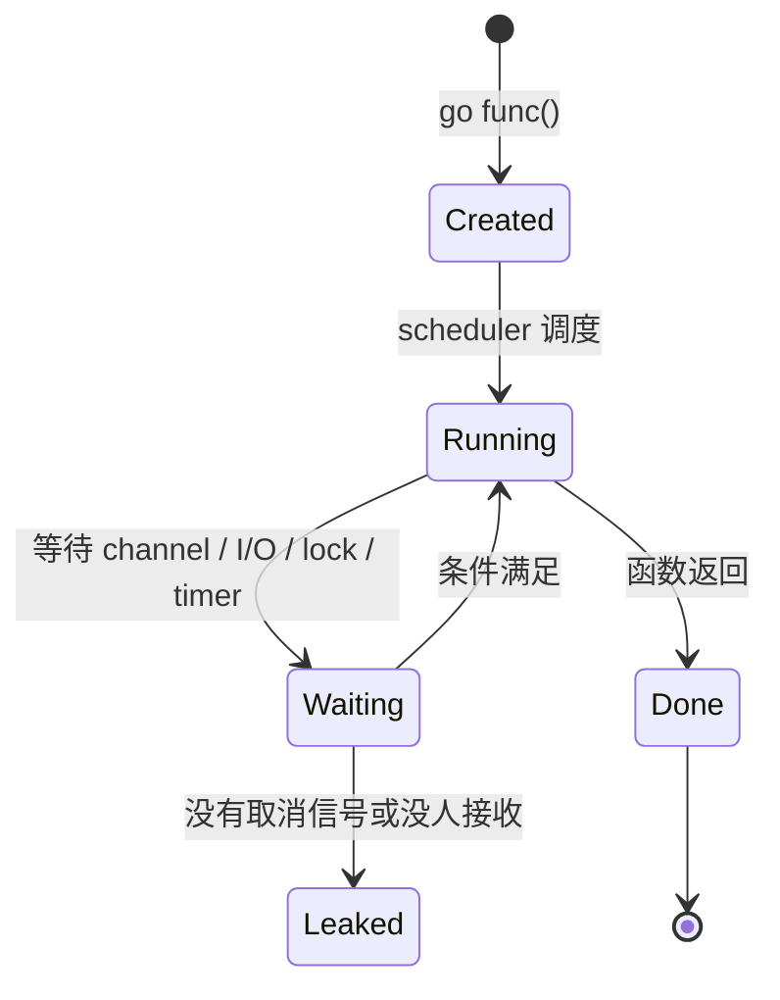
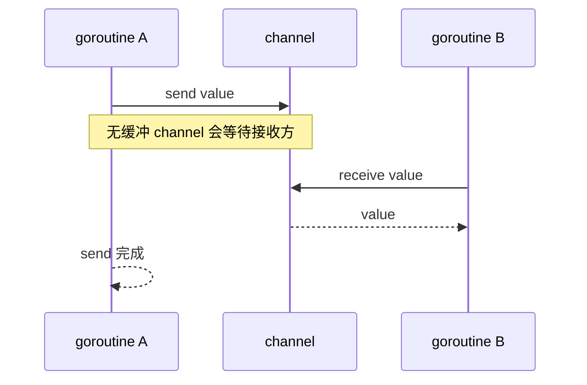
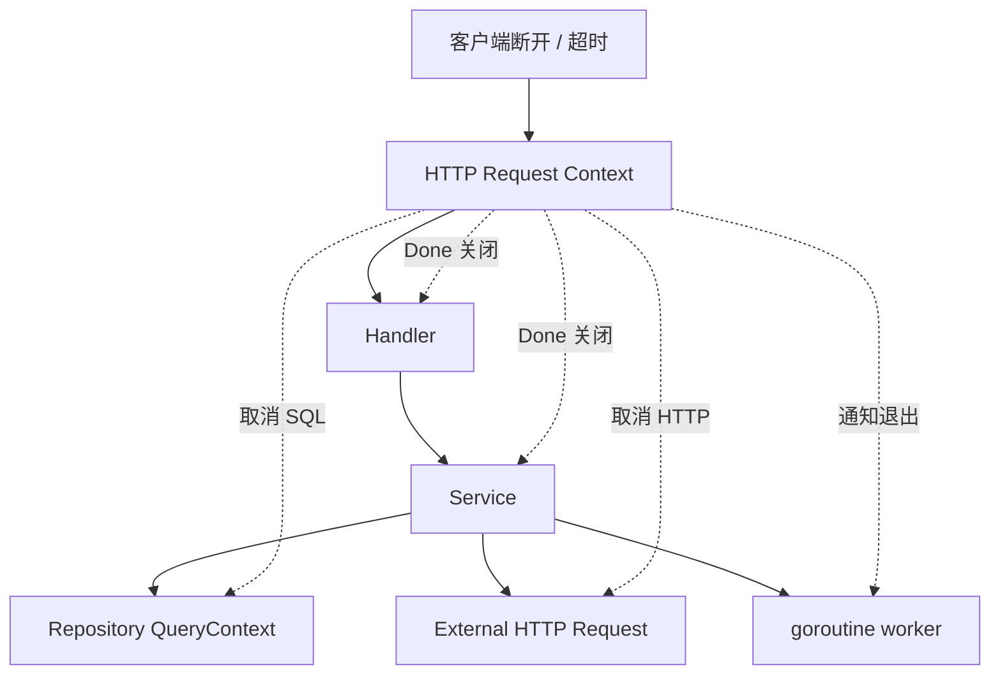
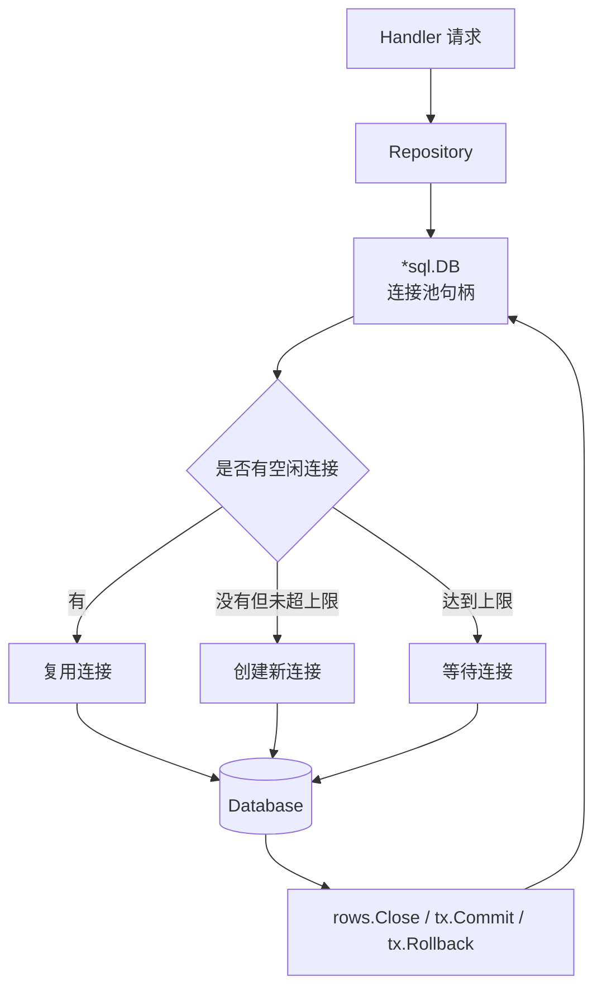
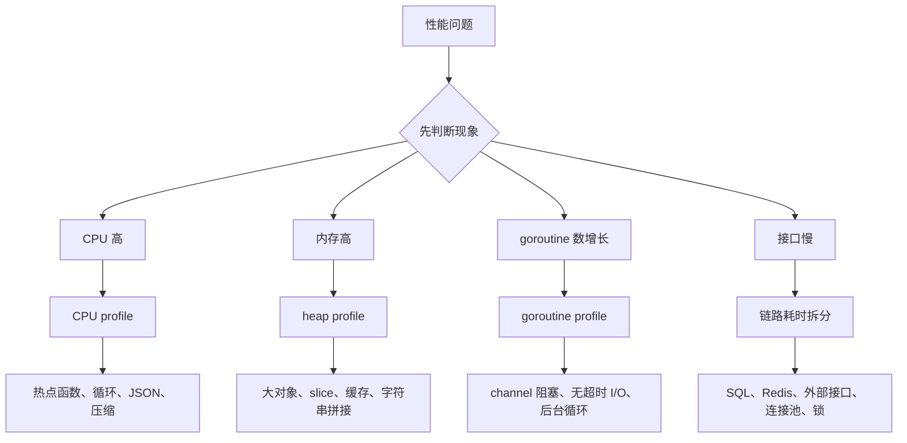

# 图解 Go 核心概念

## 这个页面解决什么

Go 语法看起来简单，但真正写后端项目时，难点通常在模块、包边界、接口、goroutine、channel、context、连接池和性能诊断。

这一页用图先建立整体理解。你可以把它当作 Go 模块的“地图页”。

## 一张图理解 Go 项目从代码到运行

Go 项目通常构建成一个二进制文件，部署时不需要像 Node.js 一样把 `node_modules` 一起带上，也不需要像 Java 一样依赖 JVM。

但这不表示部署可以随意：

- 仍要管理配置。
- 仍要有数据库迁移。
- 仍要有健康检查。
- 仍要处理证书、时区、日志和优雅关闭。

## 一张图理解 go.mod、go.sum、模块缓存

关键理解：

- `go.mod` 决定项目依赖什么。
- `go.sum` 用来校验依赖内容是否一致。
- `go mod tidy` 会根据源码重新计算依赖。
- CI 失败时，先检查 Go 版本、私有依赖权限、`go.sum` 和 `replace`。

## 一张图理解包边界和 internal

`internal` 是 Go 的真实边界机制。放在 `internal` 下的包不能被外部模块导入。

这能帮助你避免两类问题：

- 应用内部实现被其他项目依赖，后续不敢改。
- `pkg` 变成什么都放的公共垃圾桶。

## 一张图理解 Handler、Service、Repository

代码放置建议：

| 逻辑 | 位置 |
| --- | --- |
| 解析 URL、JSON、Header | Handler |
| 参数基础校验 | Handler 或 Request DTO |
| 业务规则 | Service |
| 事务编排 | Service |
| SQL | Repository |
| 外部 HTTP/gRPC 调用 | Client |

Go 不需要为了“架构感”写很多层，但基本边界要清楚。

## 一张图理解 goroutine 生命周期

每个 goroutine 都必须有退出条件。常见泄漏原因：

- channel 发送后没人接收。
- 外部 HTTP 请求没有超时。
- 后台循环没有监听 context。
- 定时任务没有停止机制。

## 一张图理解 channel 发送和接收

无缓冲 channel 的核心是同步：发送方和接收方要同时准备好。

如果你只是要保护一个共享计数器，`sync.Mutex` 可能比 channel 更直观。channel 更适合表达任务传递、结果收集、取消信号和 worker pool。

## 一张图理解 context 取消传播

context 的作用不是“传所有参数”，而是传请求生命周期。

推荐规则：

- Handler 从 `r.Context()` 获取 ctx。
- Service、Repository、Client 都接收 ctx。
- 数据库调用使用 `QueryContext`、`ExecContext`。
- 外部 HTTP 请求绑定 ctx。
- 后台 goroutine 监听 `ctx.Done()`。

## 一张图理解 database/sql 连接池

`*sql.DB` 不是单个连接，而是连接池。

常见问题：

- 忘记 `rows.Close()`，连接不能归还。
- 事务太长，连接被占用。
- 慢 SQL 导致连接池排队。
- 并发无限制，瞬间打满数据库。

## 一张图理解 Go 性能排查

不要一开始就优化代码。先用指标和 profile 确认瓶颈，再修改。

## 建议阅读顺序

如果你第一次学 Go，建议：

1. 先读本页，建立模块、包、并发、context 和连接池模型。
2. 再读 [环境、模块与工作区](/go/setup-modules)。
3. 再读 [语法、类型与函数](/go/syntax-types)。
4. 学 HTTP 服务前，回来看 “Handler、Service、Repository” 和 “context 取消传播”。
5. 排查性能时，回来看 “Go 性能排查”。

## 下一步学习

继续学习 [环境、模块与工作区](/go/setup-modules)。
