# 图解 Go 核心概念

本页用 26 张准确结构图建立 Go 工程心智模型。先看图回答“数据和控制信号怎么流动”，再阅读相邻代码；图片不是装饰，每节最后都有一个可以口述或动手验证的问题。

推荐顺序：1-7 学语言与依赖，8-11 学 HTTP 链路，12-17 学并发，18-22 学数据，23-26 学测试与交付。

## 1. 源码如何变成可运行程序

**问题：** `go run`、`go test` 和 `go build` 到底做了什么？

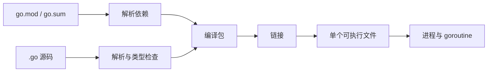

1. Go 先按包解析和类型检查源码。
2. 模块文件决定外部依赖来源与校验。
3. 每个包独立编译，最后链接为目标二进制。
4. `go test` 会为测试生成临时测试二进制；`go run` 也使用临时产物。

**项目位置：** `examples/go-task-api/Dockerfile` 构建 `api`、`migrate`、`healthcheck` 三个程序。
**常见误区：** “Go 没有运行时”；实际上二进制包含 runtime，用于调度、GC、网络轮询等。
**自测：** 为什么构建容器不应该直接作为运行容器？

## 2. go.mod、go.sum 与模块缓存

**问题：** 为什么 `go.sum` 不是锁文件，却仍必须提交？

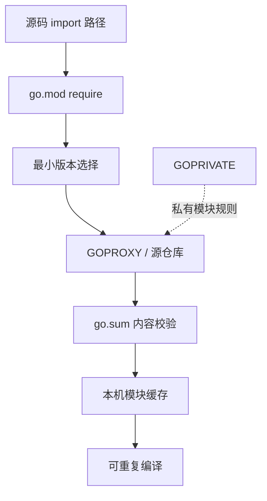

1. import 决定实际需要哪些包。
2. `go.mod` 声明模块路径、Go 语义版本和依赖要求。
3. Go 选择满足模块图的版本，下载后用 `go.sum` 校验内容。
4. 缓存只是本机加速层，删除后仍应能重新获取。

**项目位置：** `examples/go-task-api/go.mod` 与 `go.sum`。
**常见误区：** 手改 `go.sum` 解决冲突；正确做法是修复依赖图后运行 `go mod tidy`。
**自测：** CI 有缓存时通过、清缓存后失败，优先检查哪三项？

## 3. 包边界与 internal

**问题：** 为什么项目不应把所有 Handler 放一个大包？

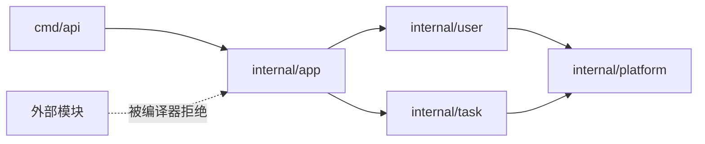

1. 包是编译和可见性边界，也是依赖图节点。
2. 按业务域组织，让一次业务修改尽量停留在同一目录。
3. `internal` 由 Go 工具链强制限制外部导入。
4. `cmd` 只负责配置、组装和启动。

**项目位置：** `examples/go-task-api/internal/user` 与 `internal/task`。
**常见误区：** 把 `pkg` 当公共工具杂物箱；放进去意味着承诺外部稳定使用。
**自测：** Task Service 为什么可以依赖用户读取接口，却不应依赖 `cmd/api`？

## 4. 零值、指针和值复制

**问题：** 哪些类型赋值后完全独立，哪些仍共享数据？

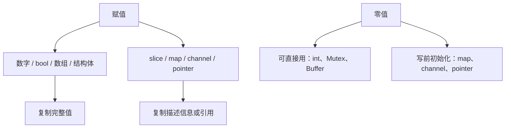

1. 结构体赋值会复制字段，包含锁的结构体不能在使用后复制。
2. slice 赋值复制三元描述符，可能共享底层数组。
3. map 和 channel 是运行时引用，副本指向同一对象。
4. 好的类型尽量让零值安全可用。

**项目位置：** 用户和任务模型使用值返回，Repository 依赖使用指针接收者。
**常见误区：** nil slice 不能 append；实际上可以 append，但 JSON 可能编码为 `null`。
**自测：** 为什么含 `sync.Mutex` 的类型通常统一使用指针接收者？

## 5. slice 的长度、容量与底层数组

**问题：** 为什么 append 有时影响原 slice，有时又不影响？

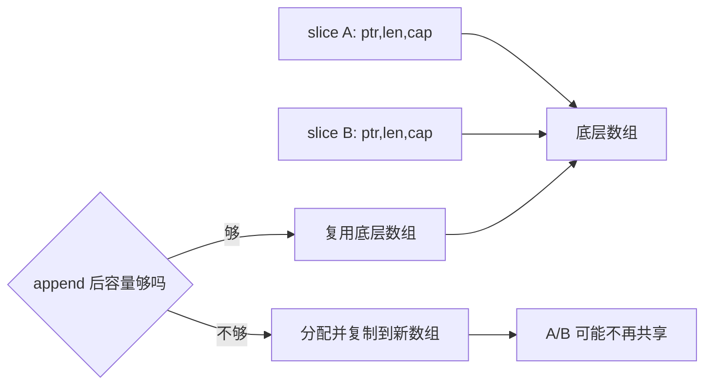

1. slice 本身不存元素，只描述一段数组。
2. 切片操作通常不复制数据。
3. append 是否分配由容量决定，不能作为业务契约。
4. 跨边界不允许修改时，应显式复制。

**项目位置：** Repository 返回列表时创建结果 slice，并只在函数内 append。
**常见误区：** 截取 1 KB 就只持有 1 KB；小 slice 可能让 100 MB 数组无法回收。
**自测：** 什么时候使用 `bytes.Clone` 或 `append([]T(nil), src...)`？

## 6. 接口的动态类型与动态值

**问题：** 为什么 typed nil 放进接口后不等于 nil？

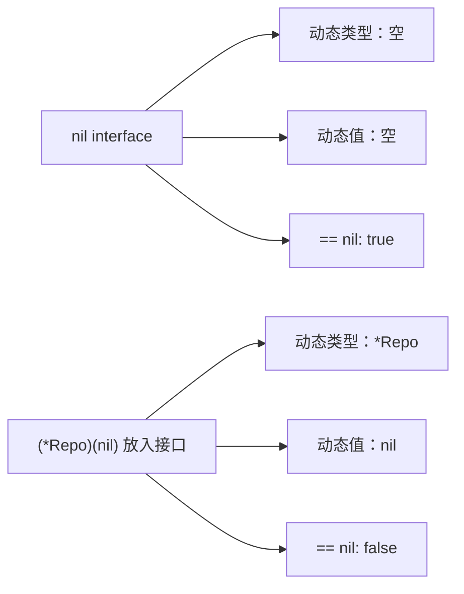

1. 接口值同时保存方法集合对应的动态类型和具体值。
2. typed nil 仍携带类型，因此接口本身非 nil。
3. 接口应定义在使用方，并保持尽可能小。
4. 构造函数应拒绝 nil 和 typed nil 依赖。

**项目位置：** Task Service 的 `UserReader` 只有 `Get` 方法。
**常见误区：** 为每个结构体都先定义接口；没有替换或测试边界时只会增加间接层。
**自测：** 你能画出 `var r Repository = (*postgresRepo)(nil)` 的两部分吗？

## 7. 错误链与公开错误

**问题：** 怎样既保留根因，又不向客户端泄露内部信息？

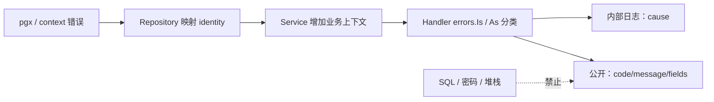

1. `%w`、`errors.Join` 保留错误链。
2. sentinel 或自定义类型提供稳定分类。
3. HTTP 边界只记录一次，并映射状态与错误码。
4. 客户端按 code 分支，不解析中文 message。

**项目位置：** `internal/platform/httpx/error.go` 与业务 Handler。
**常见误区：** 每层都 `logger.Error`；会把一次失败变成多条告警。
**自测：** `%v` 和 `%w` 在错误包装中有什么实质区别？

## 8. Handler、Service、Repository 的依赖方向

**问题：** 三层不是为了目录整齐，而是分别保护什么？

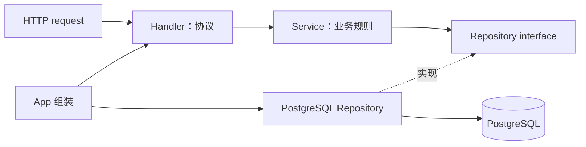

1. Handler 解析路径、查询和 JSON，写 HTTP 响应。
2. Service 校验输入、状态机和跨资源规则。
3. Repository 隔离 SQL、扫描和数据库错误。
4. `app.New` 在最外层注入具体实现。

**项目位置：** `internal/app/app.go`。
**常见误区：** Service 直接接 `http.Request`；这会把业务规则锁死在 HTTP。
**自测：** 邮箱格式校验、唯一约束冲突、409 映射分别属于哪层？

<DocFigure
  src="/images/go/go-api-request-journey.webp"
  alt="Go API 请求从客户端依次经过中间件、严格 JSON 解码、Handler、Service、Repository 和 PostgreSQL，再携带状态码、统一 JSON 与同一个 Request ID 返回客户端。"
  caption="绿色箭头表示请求进入，黄色路径表示响应返回；准确职责以相邻 Mermaid、正文和真实源码为准。"
/>

## 9. 严格 JSON 与统一 envelope

**问题：** 为什么“能解码就接受”会让客户端错误长期隐藏？

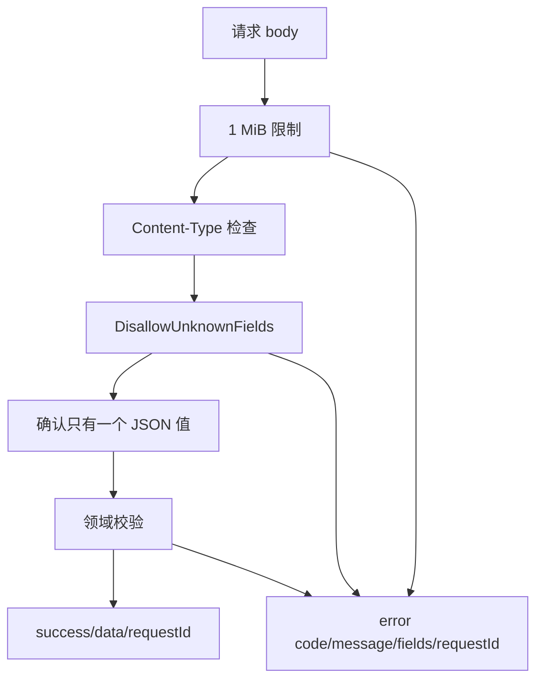

1. 中间件先处理媒体类型和总体大小。
2. Decoder 拒绝未知字段和字段类型错误。
3. 第二次 Decode 确认没有尾随 JSON 值。
4. 所有失败进入统一错误 envelope。

**项目位置：** `internal/platform/httpx/json.go`、`response.go`。
**常见误区：** 使用 `json.Decoder.Decode` 一次就结束；`{} {}` 的第二个值会被忽略。
**自测：** 未知字段应返回 400 还是 422？为什么？

## 10. 中间件顺序

**问题：** 相同中间件换顺序为什么会改变日志和错误行为？

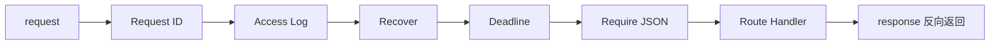

1. Request ID 最外层，所有结果都能关联。
2. Access Log 包住后续层，记录最终状态与字节数。
3. Recover 在业务层外捕获 panic，不覆盖已提交响应。
4. Deadline 与 JSON 检查靠近 Handler。

**项目位置：** `internal/app/router.go` 的 `httpx.Chain`。
**常见误区：** Recover 放在日志外层后，日志可能看不到最终 500。
**自测：** 404 和 405 为什么也必须经过 Request ID 与日志？

## 11. context 取消传播

**问题：** 客户端断开后，SQL 为什么还可能继续执行？

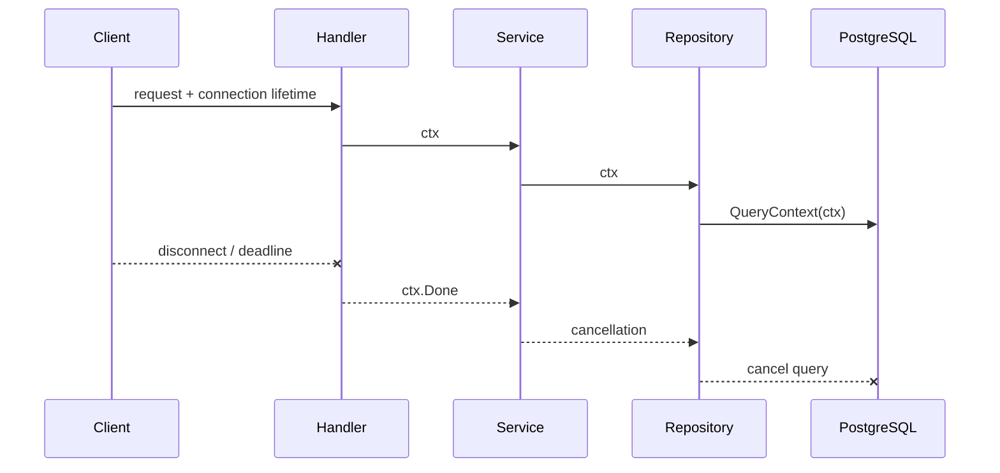

1. `r.Context()` 是请求取消树根。
2. 每层把 ctx 作为第一个参数继续传递。
3. 数据库和外部 Client 使用 Context 版本方法。
4. `context.Background()` 会切断这条链。

**项目位置：** Handler -> Service -> PostgreSQL Repository 全链路。
**常见误区：** context 存进 Service 字段；Service 跨请求复用，生命周期错误。
**自测：** 什么时候可以故意创建独立于请求的后台 context？

## 12. goroutine 生命周期

**问题：** 一行 `go` 代码还必须配套哪三件事？

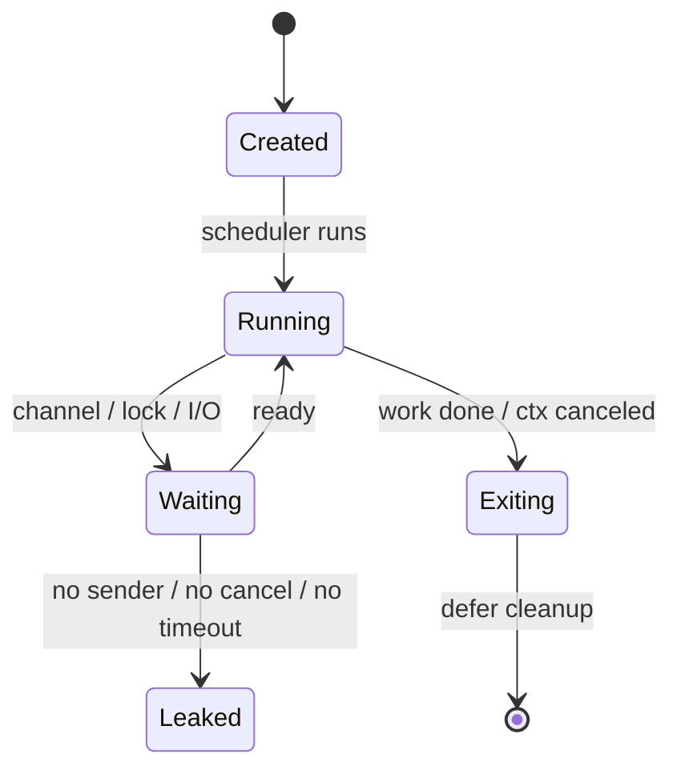

1. 创建者定义 goroutine 的工作和所有权。
2. 退出来自工作完成、channel 关闭或 context 取消。
3. WaitGroup 或结果 channel 让上层知道它已退出。
4. 永久等待就是泄漏，即使 CPU 为零。

**项目位置：** `App.Run` 启动 HTTP Server goroutine并等待结果。
**常见误区：** goroutine 很轻所以可以无限创建；堆栈、调度和下游资源都有成本。
**自测：** 看到一个 `go func()` 时，你会按什么顺序审查？

## 13. channel 所有权与关闭

**问题：** 到底应该由发送方还是接收方关闭 channel？

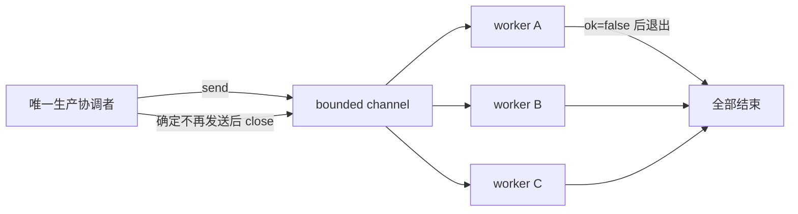

1. 能确定“不再发送”的一方拥有关闭权。
2. 接收方通过 `value, ok := <-ch` 识别关闭。
3. 关闭是广播“不会再有值”，不是销毁数据结构。
4. 不需要广播结束时可以不关闭。

**项目位置：** 可在批处理扩展中使用，HTTP 请求本身通常不需要 channel。
**常见误区：** 每个 worker 退出时都尝试 close；会重复关闭 panic。
**自测：** 多生产者时如何集中关闭权？

## 14. 有界 worker pool

**问题：** 为什么“每个任务一个 goroutine”会把数据库打满？

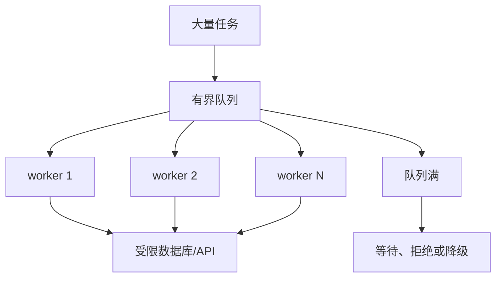

1. worker 数决定同时占用下游资源的上限。
2. 有界队列让过载可见并形成背压。
3. 队列满时必须选择等待、拒绝或降级。
4. context 让排队和工作都可取消。

**项目位置：** 当前任务 API 同步处理请求，未来批量任务应先定义并发预算。
**常见误区：** 缓冲越大越稳定；过大队列只是把失败变成高延迟和高内存。
**自测：** worker 数应只看 CPU 核数吗？还要看哪些下游限制？

<DocFigure
  src="/images/go/go-concurrency-workshop.webp"
  alt="一个协调者创建并唯一关闭容量为五的任务通道，三个 Worker 从通道取任务，并在通道关闭或 Context 取消时分别退出并报告完成。"
  caption="这是帮助理解所有权和退出条件的类比；准确的 channel、Context 与 WaitGroup 规则以相邻 Mermaid 和代码为准。"
/>

## 15. select 与取消竞争

**问题：** 结果和取消同时就绪时，代码会选择谁？

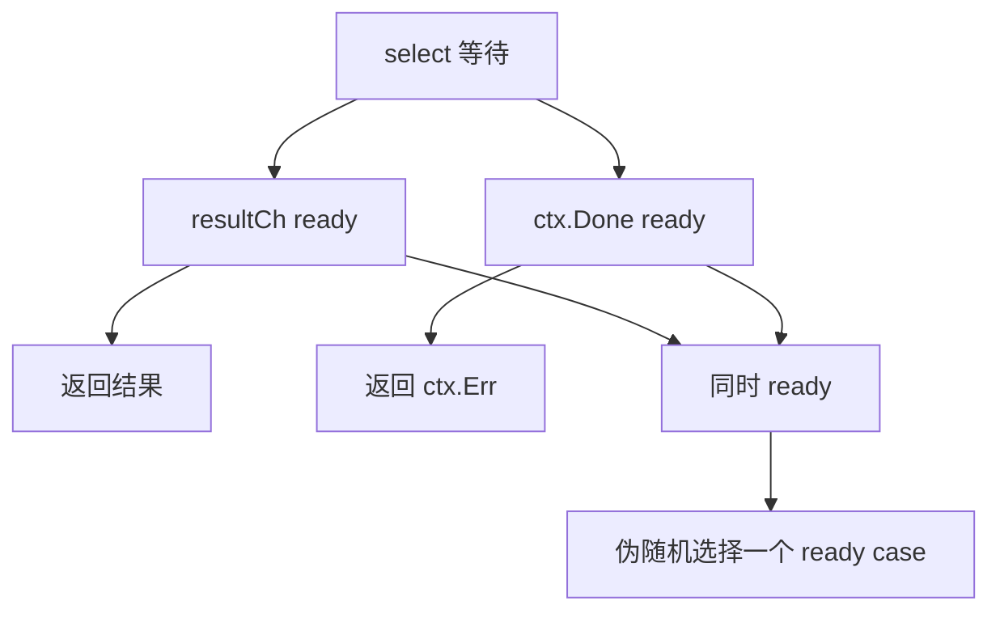

1. select 只在可执行 case 中选择。
2. 多个 case 同时 ready 时，不保证固定优先级。
3. 业务需要取消优先时，要在协议层明确二次检查。
4. nil channel 对应 case 永远不会 ready，可用于动态禁用。

**项目位置：** Server Run 在 serve 结果与 ctx 取消之间 select。
**常见误区：** case 书写在前就有优先级。
**自测：** 为什么用 `default` 的忙轮询通常是坏设计？

## 16. Mutex、RWMutex 与 atomic

**问题：** channel 不是默认答案时，如何保护共享状态？

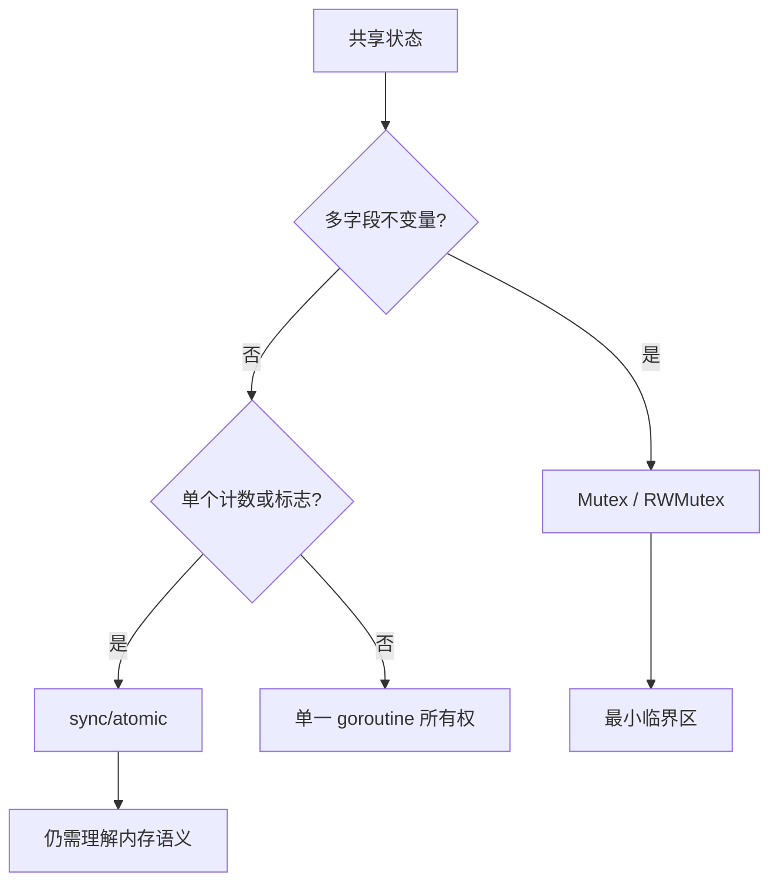

1. Mutex 保护的是不变量，不只是某个变量。
2. RWMutex 只有读多、临界区足够长时才可能有收益。
3. atomic 适合独立简单状态，不适合多字段一致性。
4. 锁内不调用慢 I/O。

**项目位置：** Migrator 用 Mutex 与 Once 保护关闭和迁移状态。
**常见误区：** 用多个 atomic 变量就能维护组合一致性。
**自测：** 为什么复制已使用的 Mutex 会破坏保护？

## 17. Race Detector 在找什么

**问题：** 业务结果看起来正确，为什么 `-race` 仍然失败？

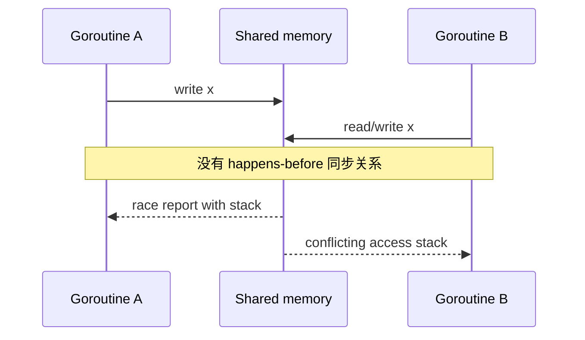

1. 数据竞争是未同步并发访问，至少一个是写。
2. Race Detector 插桩实际执行到的路径，不证明未覆盖路径安全。
3. 报告包含两个冲突访问和 goroutine 创建栈。
4. 修复根因是建立同步或消除共享，不是忽略报告。

**项目位置：** `go test -race ./...` 与 integration race。
**常见误区：** 测试跑一次没报就没有 race；需要真实并发路径与重复执行。
**自测：** Mutex、channel send/receive、WaitGroup 分别怎样建立同步关系？

## 18. database/sql 连接池

**问题：** `*sql.DB` 为什么不是数据库连接？

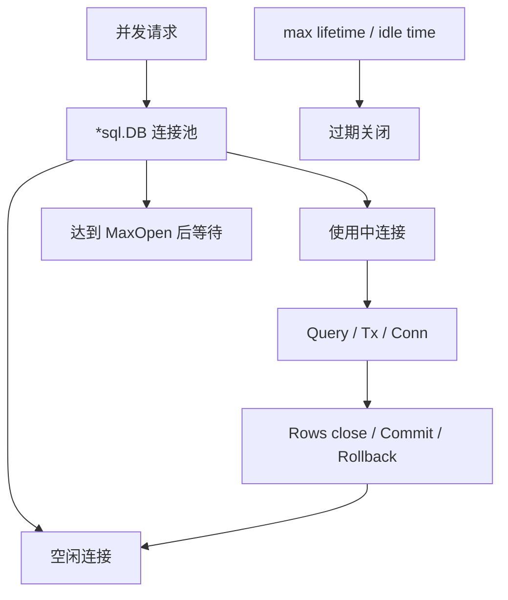

1. `sql.DB` 维护连接创建、复用、等待和过期。
2. Rows、Tx、Conn 会占用连接直到明确释放。
3. MaxOpen 太小会排队，太大会压垮数据库。
4. 每个服务副本的连接上限要一起计算。

**项目位置：** `internal/platform/database/database.go`。
**常见误区：** 每个请求 `sql.Open`；这会创建多个失控池。
**自测：** ready 偶发超时但数据库 CPU 不高时，为什么要看池等待？

## 19. 事务的单连接边界

**问题：** 为什么开始事务后不能继续用 `db.ExecContext`？

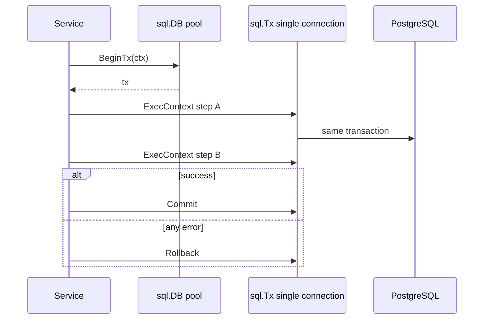

1. `BeginTx` 从池中绑定一条连接。
2. 事务内 SQL 必须通过 `tx` 执行。
3. `defer tx.Rollback()` 兜底所有提前返回。
4. 外部 HTTP 调用不放长事务中。

**项目位置：** 当前 CRUD 用单语句原子写；跨多表扩展时再引入事务边界。
**常见误区：** Commit 失败后仍返回业务成功。
**自测：** 一个事务方法应由 Repository 还是 Service 决定边界？为什么？

## 20. 数据库迁移生命周期

**问题：** 为什么建表 SQL 能执行还不等于迁移可靠？

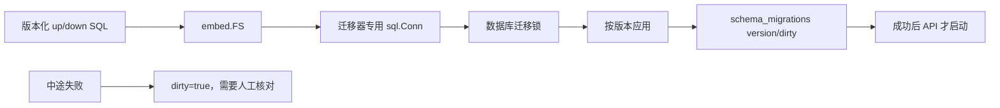

1. SQL 文件与应用二进制一起版本化。
2. 迁移器独占一条连接并在 Close 后归还。
3. 数据库记录当前版本与 dirty 状态。
4. API 依赖迁移成功，而不是只依赖容器启动。

**项目位置：** `migrations/`、`cmd/migrate` 与 Compose depends_on。
**常见误区：** 直接把 dirty 改 false；结构可能只执行了一半。
**自测：** 迁移集成测试为什么要查询 catalog 中的约束、索引和注释？

## 21. 乐观锁与版本冲突

**问题：** 两个客户端同时编辑同一任务，怎样避免后写静默覆盖先写？

```mermaid
sequenceDiagram
  participant A as Client A
  participant B as Client B
  participant DB as Task row version 0
  A->>DB: GET -> version 0
  B->>DB: GET -> version 0
  A->>DB: UPDATE where version=0
  DB-->>A: success, version 1
  B->>DB: UPDATE where version=0
  DB-->>B: 0 rows -> 409 conflict
  B->>DB: GET latest version 1
```

1. 客户端读取时拿到 version。
2. 写入条件同时匹配 id 和 expectedVersion。
3. 成功写入原子增加 version。
4. 旧版本写返回 409，由客户端重新读取和合并。

**项目位置：** Task Update、ChangeStatus、Delete。
**常见误区：** 409 后无限自动重试；会覆盖刚完成的其他修改。
**自测：** 为什么状态转换要先检查版本，再检查目标状态？

## 22. 稳定分页与索引

**问题：** 只按 created_at 排序为什么仍会跳行或重复？

```mermaid
flowchart TD
  Filter["owner/status 过滤"] --> Order["ORDER BY created_at DESC, id DESC"]
  Order --> Index["匹配过滤前缀与排序的索引"]
  Index --> Page["LIMIT / OFFSET 当前页"]
  Filter --> Total["同一语句快照 COUNT(*)"]
  Page --> Envelope["items + page + pageSize + total"]
  Total --> Envelope
```

1. created_at 可能相同，id 提供确定性 tie-breaker。
2. 过滤条件组合需要匹配的复合索引。
3. 当前页与 total 应来自同一语句快照。
4. 超出末页时 items 为空，total 仍正确。

**项目位置：** 六个分页索引与 Repository 的窗口计数查询。
**常见误区：** 分开查询 items 和 total 后认为它们天然一致。
**自测：** owner+status 过滤的索引列顺序应怎样对应查询？

## 23. 测试分层

**问题：** 为什么 Service 单测通过仍不能证明 API 可用？

```mermaid
flowchart TD
  Unit["Service 单元测试：规则"] --> Handler["httptest：HTTP 协议"]
  Handler --> Repo["Repository + PostgreSQL：SQL 契约"]
  Repo --> API["完整 API 生命周期"]
  API --> Compose["容器 smoke：交付行为"]
  Race["race"] --> Unit
  Race --> Repo
  Fuzz["fuzz 输入边界"] --> Handler
```

1. 单元测试快速覆盖业务分支。
2. Handler 测状态、Header、严格 JSON 和 envelope。
3. 真实 PostgreSQL 测 SQL、约束、索引和并发。
4. Compose smoke 测镜像、迁移、探针和信号。

**项目位置：** 包内 `_test.go` 与 `tests/` integration suite。
**常见误区：** 集成测试使用 mock 数据库；只能证明 mock 行为。
**自测：** 哪类测试最适合验证 `ON DELETE RESTRICT`？

## 24. Fuzz 如何探索输入空间

**问题：** Fuzz 与随机测试的区别是什么？

```mermaid
flowchart LR
  Seeds["人工 seed corpus"] --> Mutate["引擎变异输入"]
  Mutate --> Target["Fuzz target"]
  Target -->|正常| Coverage["覆盖反馈"]
  Coverage --> Mutate
  Target -->|panic / assertion| Minimize["自动最小化"]
  Minimize --> Corpus["保存失败输入"]
  Corpus --> Regression["加入普通回归测试"]
```

1. 从有效与边界 seed 开始。
2. 引擎根据覆盖反馈持续变异。
3. 发现失败后自动缩小输入。
4. 最小复现应进入确定性回归测试。

**项目位置：** `FuzzDecodeJSON`。
**常见误区：** 让 Fuzz target 访问不可控网络或共享状态，导致不可重复。
**自测：** 为什么 CI 中要限制 fuzztime，同时保留更长的定期任务？

## 25. 探针与优雅关闭

**问题：** 收到 SIGTERM 后，为什么 readiness 要先失败？

```mermaid
sequenceDiagram
  participant O as Orchestrator
  participant A as API
  participant R as Readiness
  participant H as In-flight handlers
  participant DB as Database pool
  O->>A: SIGTERM
  A->>R: StartShutdown -> 503
  O->>A: stop sending new traffic
  A->>H: Server.Shutdown waits
  alt completed before timeout
    H-->>A: done
  else timeout
    A->>H: Server.Close
  end
  A->>DB: Close
  A-->>O: process exits
```

1. readiness 先变 503，让负载均衡停止新流量。
2. liveness 仍能说明进程正在执行关闭。
3. Shutdown 等待在途请求，但必须有总预算。
4. 最后关闭连接池并退出。

**项目位置：** `internal/app/app.go` 与 `compose.yaml` 的 20 秒 grace。
**常见误区：** 收到信号立即 `os.Exit`，defer 和连接清理都不会执行。
**自测：** 为什么 Compose grace period 应大于应用 shutdown timeout？

## 26. 从指标到 profile 的证据链

**问题：** 接口慢时为什么不能先“优化 JSON”？

```mermaid
flowchart TD
  Symptom["用户现象与 SLO"] --> Metrics["延迟/错误/CPU/内存/池等待"]
  Metrics --> Dimension{"主要维度"}
  Dimension -->|CPU| CPU["CPU profile"]
  Dimension -->|内存| Heap["heap / allocs"]
  Dimension -->|并发| Goroutine["goroutine / mutex / block"]
  Dimension -->|下游| Trace["trace / SQL / 外部耗时"]
  CPU --> Change["单一、可解释改动"]
  Heap --> Change
  Goroutine --> Change
  Trace --> Change
  Change --> SameLoad["同负载回归与长期观察"]
```

1. 先固定版本、负载、时间窗口和延迟分位数。
2. 指标定位 CPU、内存、并发或下游维度。
3. 用匹配的 profile、trace 或 SQL 证据找热点。
4. 一次改一个主要变量，用同一负载比较。

**项目位置：** 访问日志已有 status、bytes、duration、request ID，可作为第一层证据。
**常见误区：** 看一次 benchmark 就声称线上提升；负载、数据和环境必须可比。
**自测：** Go CPU 很低但 P99 很高，下一步最该检查什么？

## 学完后怎么走

1. 进入 [环境、模块与工作区](/go/setup-modules) 和 [语法、类型与函数](/go/syntax-types) 验证前 7 图。
2. 通过 [Go HTTP API 从零到项目落地](/go/http-api-project-from-zero) 对照第 8-25 图的真实源码。
3. 完成 [Go 专项练习](/roadmap/go-practice)，再用 [Go 真实项目问题库](/projects/issues-go) 练证据化排障。
