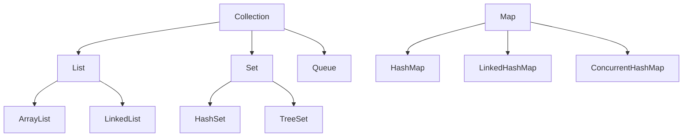

# 集合、泛型与常用类库

## 这个页面解决什么

业务系统每天都在处理列表、映射、去重、分页、分组和转换。Java 集合不是只背 `ArrayList`、`HashMap`，而是要知道每种结构适合什么场景。

## 集合选择

| 类型 | 适合场景 | 注意点 |
| --- | --- | --- |
| `ArrayList` | 有序列表、按下标读取 | 中间插入删除成本较高 |
| `LinkedList` | 队列、频繁头尾操作 | 随机访问慢，业务中较少用 |
| `HashSet` | 去重、判断是否存在 | 元素要正确实现 `equals/hashCode` |
| `TreeSet` | 排序去重 | 需要比较规则 |
| `HashMap` | key-value 查询 | key 要稳定 |
| `LinkedHashMap` | 保留插入顺序 | 适合简单 LRU 或顺序输出 |
| `ConcurrentHashMap` | 并发读写 map | 不能替代所有线程安全设计 |

## 常见集合关系



## 泛型解决什么

泛型让集合和方法在编译期知道类型：

```java
List<String> names = new ArrayList<>();
names.add("Ada");
String first = names.get(0);
```

没有泛型时，你取出来的是 `Object`，需要强制转换，运行时才可能暴露错误。

## 泛型方法

```java
public static <T> T firstOrNull(List<T> items) {
    if (items == null || items.isEmpty()) {
        return null;
    }
    return items.get(0);
}
```

`<T>` 表示这个方法可以处理多种类型，但输入和输出之间保持类型关系。

## Optional 怎么用

`Optional` 用来表达“可能没有值”：

```java
public Optional<User> findUser(Long id) {
    return repository.findById(id);
}
```

适合返回值，不适合做字段或方法参数。

推荐：

```java
String name = findUser(id)
    .map(User::name)
    .orElse("未命名");
```

不推荐：

```java
if (optional.isPresent()) {
    return optional.get();
}
```

这和空判断没有本质区别。

## equals 和 hashCode

`HashSet`、`HashMap` 依赖 `equals` 和 `hashCode` 判断元素是否相同。

如果对象作为 key，字段变化会导致找不到原来的 key：

```java
Map<User, String> map = new HashMap<>();
User user = new User(1L, "Ada");
map.put(user, "admin");
user.setId(2L);
```

这类写法很危险。Map 的 key 应使用不可变对象、字符串、数字或稳定业务 id。

## 实际项目问题

### 1. List 查找导致接口越来越慢

问题：

```java
for (Order order : orders) {
    User user = users.stream()
        .filter(item -> item.id().equals(order.userId()))
        .findFirst()
        .orElse(null);
}
```

这是嵌套查找，数据量大时会退化。

解决：

```java
Map<Long, User> userMap = users.stream()
    .collect(Collectors.toMap(User::id, item -> item));
```

再通过 `userMap.get(order.userId())` 查询。

### 2. toMap 遇到重复 key 报错

`Collectors.toMap` 默认不允许重复 key。业务上可能存在同一个用户多条记录，需要明确合并策略：

```java
Collectors.toMap(User::id, item -> item, (oldValue, newValue) -> newValue)
```

不要随便保留新值或旧值，要按业务语义决定。

### 3. null 集合导致空指针

接口返回列表时，优先返回空列表，不返回 `null`：

```java
return Collections.emptyList();
```

## 最佳实践

- 频繁按 id 查找时，先转成 `Map`。
- 列表返回值优先空集合，不返回 `null`。
- Map key 要稳定，不要用会变化的对象。
- `Optional` 用于返回值，不滥用于字段和参数。
- 并发集合不能替代完整并发设计。

## 下一步学习

继续学习 [异常、日志与编码规范](/java/exceptions-logging)。
