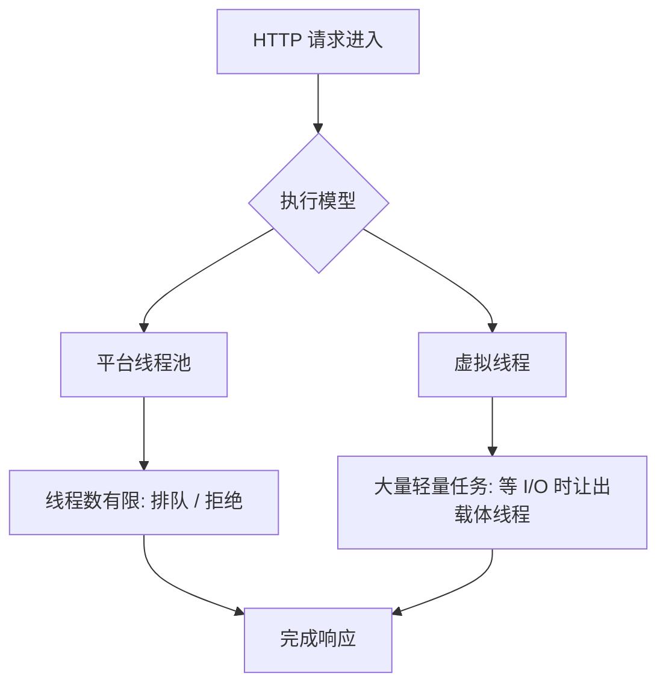

# 并发、线程池与虚拟线程

## 这个页面解决什么

后端服务要同时处理很多请求。Java 并发不是只会 `new Thread()`，而是要理解线程、线程池、锁、异步任务和虚拟线程分别解决什么问题。

## 平台线程和虚拟线程

Oracle JDK 文档将虚拟线程描述为轻量级线程，用于降低编写、维护和调试高吞吐并发应用的成本。

| 类型 | 特点 | 适合场景 |
| --- | --- | --- |
| 平台线程 | 映射到操作系统线程，资源较重 | CPU 密集任务、传统线程池 |
| 虚拟线程 | JVM 管理的轻量线程 | 大量阻塞式 I/O 请求 |

## 请求并发模型



虚拟线程不是让 CPU 变快，而是让大量阻塞等待更便宜。数据库连接数、外部接口限流、锁竞争仍然存在。

## 线程池

线程池用于复用线程、限制并发和控制队列：

```java
ExecutorService executor = Executors.newFixedThreadPool(10);
executor.submit(() -> {
    // 执行任务
});
```

生产项目不要随便使用无界队列。无界队列会把压力藏起来，直到内存升高或延迟不可控。

## CompletableFuture

适合组合多个异步任务：

```java
CompletableFuture<User> userFuture =
    CompletableFuture.supplyAsync(() -> userClient.getUser(userId));

CompletableFuture<List<Order>> ordersFuture =
    CompletableFuture.supplyAsync(() -> orderClient.getOrders(userId));

UserSummary summary = userFuture
    .thenCombine(ordersFuture, UserSummary::new)
    .join();
```

要注意超时、异常处理和线程池选择。

## synchronized、Lock 和并发集合

锁用于保护共享状态：

```java
private final Object lock = new Object();

public void increase() {
    synchronized (lock) {
        count++;
    }
}
```

在 Web 后端里，优先减少共享可变状态。跨请求共享状态通常要放到数据库、Redis 或消息系统中处理。

## 实际项目问题

### 1. 线程池耗尽

现象：

- 接口越来越慢。
- 请求排队。
- CPU 不高但响应慢。
- 线程 dump 中大量线程卡在外部 HTTP 或数据库。

处理：

- 给外部调用设置超时。
- 限制线程池队列。
- 增加熔断和降级。
- 检查数据库连接池是否不足。

### 2. 虚拟线程上线后数据库被打满

虚拟线程降低的是线程成本，不是下游资源成本。以前线程池限制了并发，现在虚拟线程放大了请求量，数据库连接池、接口限流、缓存穿透问题会更明显。

解决：

- 保留连接池和限流。
- 对外部接口设置并发信号量。
- 对热点请求加缓存。

### 3. 异步任务丢 traceId

异步线程里日志没有 traceId，排查链路断掉。需要使用日志上下文传递机制，或者显式传递 requestId。

## 最佳实践

- Web 请求必须有超时。
- 线程池要有命名、容量、队列和拒绝策略。
- 虚拟线程适合大量阻塞式 I/O，但仍要限制下游资源。
- 共享可变状态越少越好。
- 线上排查并发问题时优先看线程 dump、连接池、慢查询和外部接口耗时。

## 参考资料

- [Virtual Threads - Oracle Help Center](https://docs.oracle.com/en/java/javase/21/core/virtual-threads.html)
- [JEP 444: Virtual Threads](https://openjdk.org/jeps/444)

## 下一步学习

继续学习 [JVM 内存、GC 与诊断](/java/jvm-memory-gc)。
