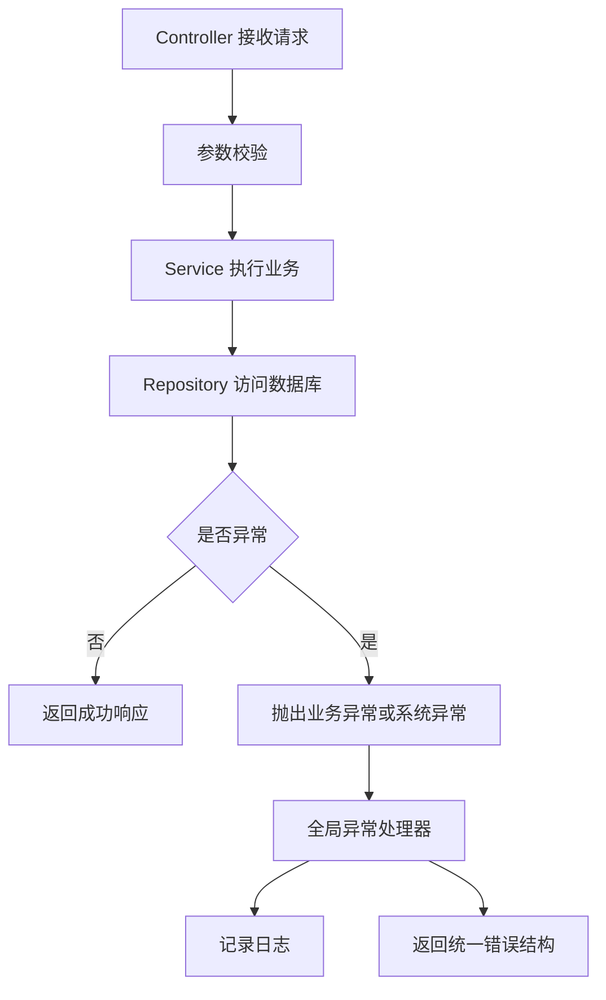

# 异常、日志与编码规范

## 这个页面解决什么

后端系统不怕出错，怕的是出错后不知道发生了什么、用户看到一堆堆栈、接口返回格式不统一。异常和日志是生产系统的基本功。

## 异常分类

| 类型 | 示例 | 处理方式 |
| --- | --- | --- |
| checked exception | `IOException` | 编译期要求处理，适合外部资源失败 |
| unchecked exception | `IllegalArgumentException` | 运行时异常，适合参数、状态、业务错误 |
| error | `OutOfMemoryError` | 严重 JVM 错误，通常不在业务层捕获 |

## 异常流转图



## 业务异常

业务异常应该表达用户可理解的问题：

```java
public class BusinessException extends RuntimeException {
    private final String code;

    public BusinessException(String code, String message) {
        super(message);
        this.code = code;
    }

    public String code() {
        return code;
    }
}
```

示例：

```java
if (stock < quantity) {
    throw new BusinessException("STOCK_NOT_ENOUGH", "库存不足");
}
```

## 统一错误响应

```java
public record ApiError(String code, String message, String traceId) {
}
```

前端可以基于 `code` 做提示、跳转或重试，而不是解析自然语言。

## 日志分级

| 级别 | 用法 |
| --- | --- |
| `debug` | 开发调试细节，生产通常关闭 |
| `info` | 关键业务动作、启动配置摘要 |
| `warn` | 可恢复异常、降级、重试 |
| `error` | 请求失败、数据异常、外部系统不可用 |

不要把所有异常都打成 `error`。用户输错密码、参数校验失败一般不是系统错误。

## 日志要包含什么

一次线上问题至少需要：

- traceId 或 requestId。
- 用户 id 或租户 id，注意脱敏。
- 业务对象 id，例如 orderId。
- 错误码。
- 外部系统响应摘要。
- 耗时。

不要记录：

- 密码。
- token。
- 身份证完整号码。
- 银行卡完整号码。
- 大体积请求体。

## 实际项目问题

### 1. catch 后吞掉异常

问题：

```java
try {
    paymentClient.pay(order);
} catch (Exception e) {
    return false;
}
```

这样线上只看到支付失败，看不到失败原因。

解决：

```java
try {
    paymentClient.pay(order);
} catch (PaymentException e) {
    log.warn("payment failed, orderId={}, code={}", order.id(), e.code(), e);
    throw new BusinessException("PAYMENT_FAILED", "支付失败");
}
```

### 2. 重复打印堆栈

Controller、Service、Repository 层都打印同一个异常，会让日志噪声很大。通常在全局异常处理器或边界层打印一次即可。

### 3. 返回堆栈给前端

生产环境不要返回 Java 堆栈。前端只需要错误码、提示文案和 traceId。

## 最佳实践

- 业务异常要有错误码。
- 参数校验失败返回明确字段。
- 外部系统异常要保留响应摘要。
- 日志中敏感信息必须脱敏。
- 全局异常处理器统一响应结构。
- 不要用异常控制正常分支流程。

## 下一步学习

继续学习 [Stream、Lambda 与数据处理](/java/streams-lambda)。
