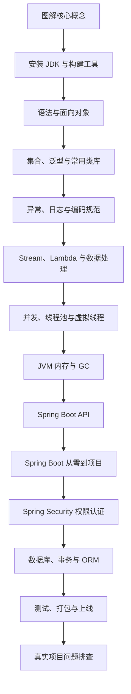
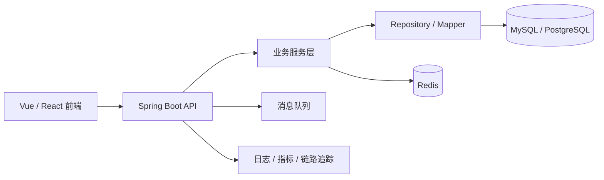

# Java 学习导览

## 适合谁看

适合准备进入后端开发、企业应用、Spring Boot、微服务、Android 或大数据生态的学习者。

如果你已经会 JavaScript、TypeScript、Vue 或 Node.js，学 Java 时不要只盯着语法差异。Java 的核心价值在于：

- 类型系统更严格，适合长期维护的大型业务系统。
- JVM 生态成熟，工具链、监控、诊断和部署方案完善。
- Spring Boot 生态覆盖接口开发、配置、数据库、缓存、消息、测试和生产治理。
- 并发模型从传统线程、线程池发展到虚拟线程，适合理解服务端吞吐和资源管理。

## 你会学到什么

- JDK、JVM、JRE、Maven、Gradle 和 IDE 的关系。
- Java 基础语法、类、接口、枚举、record、sealed class。
- 集合、泛型、Optional、Stream、Lambda 的项目用法。
- 异常处理、日志、参数校验和统一响应。
- 线程池、CompletableFuture、虚拟线程和并发边界。
- JVM 内存、GC、线程 dump、堆 dump 和线上排查。
- Spring Boot API、分层架构、配置、数据库、事务和测试。

## 学习路线

## Java 模块章节

| 章节 | 解决的问题 |
| --- | --- |
| [图解 Java 核心概念](/java/visual-guide) | 用图理解 JDK、JVM、对象引用、调用栈、请求链路、事务和排错路径 |
| [环境、JDK 与构建工具](/java/setup-tooling) | 如何安装 JDK，理解 Maven、Gradle、IDE 和项目目录 |
| [语法与面向对象](/java/syntax-oop) | 如何写类、对象、接口、继承、record 和 sealed class |
| [集合、泛型与常用类库](/java/collections-generics) | 如何选择 List、Set、Map，理解泛型和 Optional |
| [异常、日志与编码规范](/java/exceptions-logging) | 如何处理 checked/unchecked 异常、日志和统一错误 |
| [Stream、Lambda 与数据处理](/java/streams-lambda) | 如何用函数式风格处理集合和业务转换 |
| [并发、线程池与虚拟线程](/java/concurrency-virtual-threads) | 如何理解线程池、CompletableFuture 和 virtual threads |
| [JVM 内存、GC 与诊断](/java/jvm-memory-gc) | 如何理解堆、栈、类加载、GC 和常见线上诊断 |
| [Spring Boot API 开发](/java/spring-boot-api) | 如何组织 Controller、Service、Repository 和配置 |
| [Spring Boot 从零到项目落地](/java/spring-boot-project-from-zero) | 如何从 0 做一个用户角色后台 API，覆盖分层、数据库、事务、测试、配置、部署和排障 |
| [Spring Security 权限认证项目](/java/spring-security-permission) | 如何实现登录、token、角色权限、接口保护、401/403、审计日志和前后端权限联调 |
| [数据库、事务与 ORM](/java/persistence-transaction) | 如何使用 JPA/MyBatis、事务边界和连接池 |
| [测试、打包与部署](/java/testing-deployment) | 如何写单元测试、接口测试、打包和运行 |
| [常见问题](/java/troubleshooting) | 如何排查启动失败、依赖冲突、事务不生效和内存问题 |

## Java 在项目中的典型位置

## 学习建议

先写一个完整的后台 API，而不是先背所有语法。推荐最小项目：

- 用户登录。
- 角色权限。
- 部门员工 CRUD。
- 列表筛选和分页。
- 操作日志。
- 数据库事务。
- 接口测试。
- Docker 部署。

每学一章，都把知识放回这个项目里验证。Java 不是靠“看完语法”学会的，而是靠不断处理类型、异常、事务、依赖和运行时问题学会的。如果你已经能理解 Spring Boot 基础 API，直接进入 [Spring Boot 从零到项目落地](/java/spring-boot-project-from-zero)，做一个可运行、可测试、可联调的后台 API；如果你已经完成用户角色 API，继续进入 [Spring Security 权限认证项目](/java/spring-security-permission)，补齐登录、token、角色权限、接口保护和审计日志。

## 当前版本选择

截至 2026 年 7 月，Oracle Java SE 文档已经列出 JDK 26 作为当前 Java SE 版本，同时 JDK 25 和 JDK 21 仍是大量企业项目常见的长期维护基线。学习时可以用 JDK 26 了解最新平台能力，但做企业项目时要以团队运行环境为准。

## 参考资料

- [JDK 26 Documentation](https://docs.oracle.com/en/java/javase/26/)
- [OpenJDK JDK 26](https://openjdk.org/projects/jdk/26/)
- [Dev.java Learn Java](https://dev.java/learn/)
- [Java SE Specifications](https://docs.oracle.com/javase/specs/)
- [Spring Boot Documentation](https://docs.spring.io/spring-boot/documentation.html)

## 下一步学习

第一次进入 Java 模块，建议先看 [图解 Java 核心概念](/java/visual-guide)，再学习 [环境、JDK 与构建工具](/java/setup-tooling)。如果你已经掌握基础语法，继续进入 [Spring Boot 从零到项目落地](/java/spring-boot-project-from-zero)。如果你正在做后台管理系统权限模块，继续进入 [Spring Security 权限认证项目](/java/spring-security-permission)。
